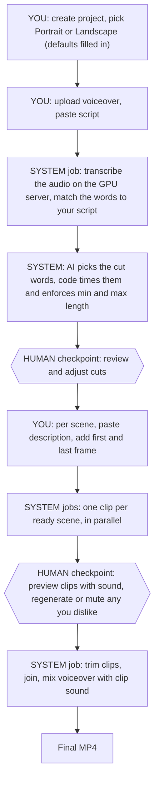
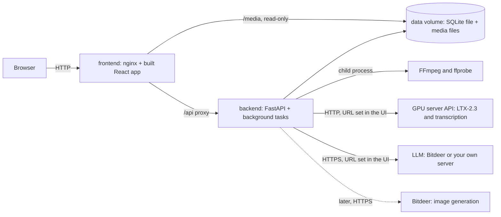
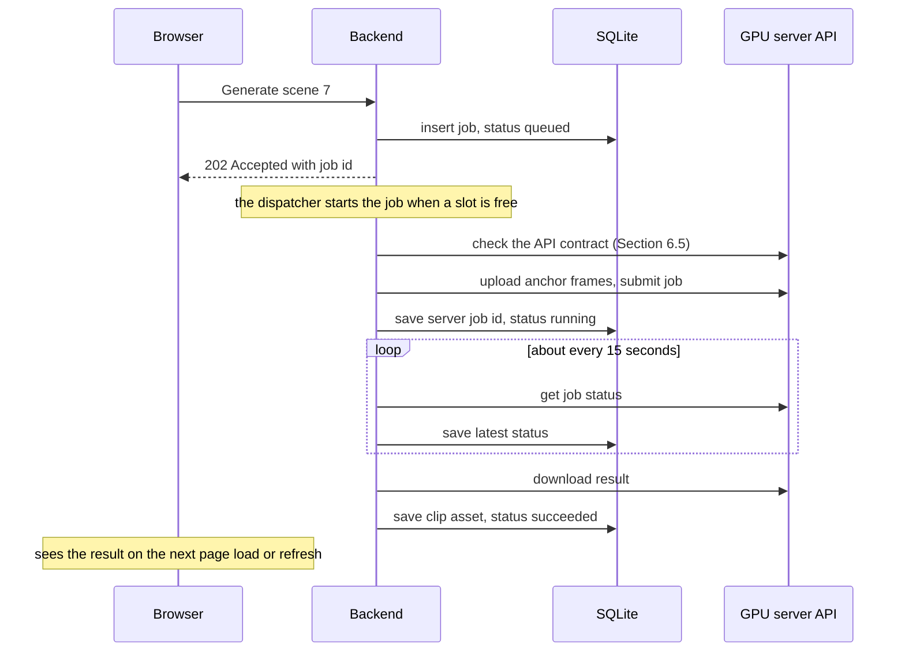

# Visio Studio: Analysis and Proposed Path Forward (Revision 4)

Status: Updated on 2026-10-05. Your GPU server now exposes the transcription endpoint (guide `api_version` moved from 0.2.0 to 0.3.0). Section 5.1 is rewritten against the live guide and OpenAPI spec instead of a planned contract. No code has been written yet.

**What changed in Revision 4**

- **The transcription endpoint exists and was verified live.** Your GPU server's guide moved from `api_version` 0.2.0 to **0.3.0** (2026-10-05): a fourth backend, Parakeet speech transcription, was added at `POST /v1/parakeet/transcribe`. Section 5.1 is rewritten against its real request, response and error shapes. It replaces an old always-on service at `:8006/transcribe` that this app never integrated with.
- **`content_hash`'s location and stability are confirmed** (Section 6.5): a top-level string field on the guide JSON (`sha256:...`), identical across two fetches 10 seconds apart even though the neighbouring `generated_at` field changed between them. The Revision 3 `[VERIFY]` on this is resolved.
- **The shared upload and job endpoints are confirmed**, not just inferred (Sections 6.1 and 6.4): `POST /v1/uploads`, `GET /v1/jobs`, `GET /v1/jobs/{job_id}`, `GET /v1/jobs/{job_id}/result`, `DELETE /v1/jobs/{job_id}` (cancel) and `DELETE /v1/jobs/{job_id}/purge`. Every backend, including the new transcription one, shares them.
- No GPU jobs were submitted and no paid calls were made to produce this revision — everything above came from read-only `GET` requests to the guide and OpenAPI documents.

**What changed since Revision 2**

- **Why the backend polls (Section 3.3).** The browser still does no polling. The backend loop is what moves work forward while you are away. One dispatcher loop now starts queued jobs, so the parallel limit can change while the app runs.
- **Transcription comes from an endpoint you are adding to the GPU server** (Section 5.1). The local CPU aligner is dropped. We match the transcript to your script, and the section lists what the endpoint must return.
- **An AI proposes the scene cuts** (Section 5.2). It names the cut words by number, and code finds the times and enforces the minimum and maximum length. This is the first paid call in iteration 1 (Section 6.2).
- **Settings live in the UI and the database**, not only in environment variables (Section 3.7). The GPU server URL is one of them, because it changes.
- **LTX sound is kept** as a quiet effects layer under the voiceover, with a volume setting and a per-scene mute (Sections 5.3, 5.4 and 5.6).
- **The GPU API is recorded and checked before every submission** (Section 6.5).
- The plan, risks and open questions are updated (Sections 5.8, 5.9, 7 and 9).

**What changed in Revision 2 (kept for history)**

- **No worker service.** Background work runs inside the backend process. CPU-heavy work (FFmpeg, alignment) runs as short-lived child processes that the backend starts. We are back to **two containers**, as in your original plan. (Section 3) *Revision 3: alignment moved to your GPU server, so only FFmpeg remains as a child process.*
- **Job state lives in the database**, not only in memory, so a restart never loses track of a 5 to 10 minute GPU job. The browser does **no polling and no WebSocket**: it reads the current state when the page loads or is refreshed. (Sections 3.3 and 3.4)
- **SQLite instead of PostgreSQL** for iteration 1. My Postgres recommendation rested on the separate worker and on using the database as a job queue. Both are gone. (Section 4.1)
- **Script text plus audio are the inputs**, so we *align* a known script to the audio instead of transcribing. (Section 5.1) *Revision 3: the word times now come from a transcription endpoint and are matched to the script.*
- **Variable-length scenes** with a hard cap of 6 s, instead of fixed 5 s slices. (Section 5.2)
- **Manual-first, AI-ready data model.** Every artifact records where it came from, and every unit of work is a visible job. (Section 4.2)
- **Project guidelines** are merged into every generation prompt to keep scenes consistent. (Section 5.4)
- **Real API facts** from your GPU API guide and the Bitdeer API replace most of the old **[VERIFY]** items. (Section 6)
- **No cost gate** for your self-hosted models. The paid Bitdeer API is not used at all in iteration 1. (Section 6) *Revision 3: it is used once, to propose scene cuts.*

**A note on confidence.** Revision 2 rested on your GPU API guide and its OpenAPI spec (version 0.2.0), the live health and partition endpoints, container networking tests and a Bitdeer model-list call. No GPU jobs were submitted and no paid calls were made. **On 2026-10-05 the GPU server did not answer**: the port forward on 8012 is still open on the Mac but nothing comes back, which fits what you said about the hosted URL changing. So Revision 3 adds design decisions, and nothing new about the server was verified. Still unverified, and marked **[VERIFY]**: how LTX-2.3 behaves in practice with two anchor frames; whether its generated sound ever contains speech; the transcription endpoint (it does not exist yet); where `content_hash` sits in the guide's JSON; how well the cheap Bitdeer models choose cut points; and the Seedream details on Bitdeer. I have no prior knowledge of LTX-2.3, GLM-5.3, Qwen3.8 or DeepSeek V4.1. Everything about them comes from the guide, the Bitdeer docs or your screenshot, not from experience.

**Revision 4 update to this note.** Later on 2026-10-05 the GPU server answered again, now reporting `api_version` 0.3.0. I re-fetched the guide twice a few seconds apart (to test `content_hash` stability) and the OpenAPI spec, with read-only `GET` requests only, and read the new Parakeet transcription section in full (Section 5.1). Still unverified, because they need either a real GPU run or a real recording, not just reading documents: how LTX-2.3 behaves in practice with two anchor frames, whether its generated sound ever contains speech, transcription accuracy on your real recordings, how well the cheap Bitdeer models choose cut points, and the Seedream details on Bitdeer.

---

## 0. Your decisions and how they shape the design

Your numbered answers 1 to 6 are rows 1 to 6.

| # | Your decision | What it means for the design |
|---|---|---|
| 1 | All manual steps are guided from the UI. You paste or upload text and images and upload the audio. Storage must stay the same when AI produces these later. The same UI should later show what AI is doing. | Manual-first, AI-ready: every artifact has a `source` field, and every unit of work is a `job` row the UI can display (Section 4.2). |
| 2 | Output format is set per project. You pick portrait or landscape first, the system fills in defaults, and you can change them. | Project settings are pre-filled from the orientation (Section 4.4). |
| 3 | You give the system the script text and the audio. | Your GPU server transcribes the audio, and the words are matched to your script, so everything downstream uses your exact words (Section 5.1). |
| 4 | Hard cuts between scenes for now. | No chained continuity. Frames are plain assets, so chaining can be added later without a schema change (Section 5.7). |
| 5 | Cut length depends on the scene, with a maximum of 5 to 6 s. | Variable-length scenes. Hard cap of 6 s, editable per project (Section 5.2). |
| 6 | Single user, on your Mac, in Docker. | No authentication, ports bound to localhost, SQLite (Sections 3 and 4). |
| - | Trailing frames at the end are fine. | Generate at or above the needed length, trim the tail (Section 5.3). |
| - | Guidelines passed to every generation for consistency. | Project guidelines merged into every prompt (Section 5.4). |
| - | Keep it simple: store running-job info in the DB or memory, no polling or WebSocket in the UI. | Section 3. The browser does not poll. The backend still polls the GPU server, and Section 3.3 explains why. |
| - | Self-hosted models are free to use. | No cost confirmation for the GPU API. Only a parallelism limit (Section 6.1), now a UI setting (Section 3.7). |
| - | Bitdeer APIs are paid, use them wisely. | Used once in iteration 1, for scene cuts, on an explicit click. Rules in Section 6.2. |

### Decisions added in Revision 3

| Your decision | What it means for the design |
|---|---|
| If the browser does not poll, why should the backend, when you cannot see it? | The backend polling is not for display. It starts the next scene, downloads finished clips, resubmits after pre-emption and keeps the DB current (Section 3.3). |
| A transcription endpoint will be added to your GPU server. | The app calls it for word times and matches them to the script. No local aligner (Section 5.1). |
| The AI gets the whole script and names the cut (the word it ends on, with a few words either side). Our system finds that word's time. Or let the AI choose the time too. | The AI names cut words by number, and the words either side act as a checksum. Code does all timing and enforces the limits. Letting the AI write times is not simpler (Section 5.2). |
| Endpoints, maximum parallel clips, minimum and maximum clip length and similar become UI settings. | A Settings page backed by the database. The environment keeps only secrets and first-run defaults (Section 3.7). |
| LTX sound can stay, as long as it adds no words. | Kept as a quiet layer under the voiceover. Volume setting, per-scene mute, and a listening check in the spike (Sections 5.3, 5.4 and 5.6). |
| Your hosted URL changes. You will set it in the UI. | A runtime setting used for every request. `localhost` addresses are mapped for Docker (Section 3.7). |
| Record all APIs the GPU server exposes and the guide API's response hash. Check them every time before use. | The API is recorded and approved once, then verified before every submission (Section 6.5). |
| The voiceover is in English. You will handle the transcription model separately. | The app depends only on the endpoint's contract (Section 5.1), not on which model sits behind it. English-only keeps the matching and the AI cuts simple. |
| Use GLM-5.3-Flash for the cuts for now, and make it configurable from the UI. | The LLM URL and model are Settings (Section 3.7), defaulting to Bitdeer `zai-org/GLM-5.3-Flash`. Switching models, or to a server of your own, needs no code change. |

---

## 1. What we are building

A system that turns a **voiceover recording plus its script** (about 1 minute for now, up to 15 minutes eventually) into a **video**:

- The visuals are generated scene by scene by LTX-2.3 on your GPU server.
- Each scene is anchored by a **first frame** and a **last frame**. You provide them now, AI will later. This keeps characters consistent.
- The voiceover is the timing backbone. Each scene lasts as long as its slice of the voiceover, up to **6 s** by default (a setting).
- Scenes are joined with **hard cuts**. There is no character dialogue in iteration 1. The sound LTX generates for each clip is kept as a quiet effects layer under the voiceover, as long as it contains no speech.

### Responsibility split for iteration 1

| Step | Who does it | Notes |
|---|---|---|
| Idea, script, record the voiceover | You | The script text and the audio file are the inputs |
| Choose orientation and output settings | You, guided in the UI | Defaults are pre-filled (Section 4.4) |
| Write project guidelines (style, camera, lighting, negative prompt) | You, guided in the UI | Applied to every scene (Section 5.4) |
| Get word times from the audio and match them to the script | **System** | Transcription endpoint on your GPU server, Section 5.1 |
| Propose scene cuts, each at most 6 s | **System** | An AI picks the cut words, code times them and enforces the limits, Section 5.2 |
| Review and adjust the cuts | You | |
| Scene description per scene | You, paste | AI later, same storage |
| First and last frame per scene | You, upload or paste | AI later, same storage |
| Generate one clip per scene | **System** | LTX-2.3 on your GPU server |
| Preview clips with their sound, regenerate or mute the ones you dislike | You | |
| Trim, join, mix the voiceover with the clips' own sound | **System** | FFmpeg |

### The key observation: one human checkpoint in the middle

You already know *what* each scene says, because you wrote the script. What you cannot know until the system has run is **where the cuts fall and how long each scene is**. So the flow has a human checkpoint in the middle, and the backend is a **resumable, stateful workflow**, not a one-shot pipeline.



Scenes are independent of each other. You do **not** have to finish all scenes before generating: start generation for each scene as soon as it is ready. Since every clip takes minutes (Section 6.1), this saves real waiting time.

---

## 2. Verdict on the tech stack

| Choice | Verdict | Comment |
|---|---|---|
| FastAPI backend | **Keep** | Also hosts the background tasks (Section 3.3). Its OpenAPI spec lets us generate the frontend client. |
| FFmpeg for editing and clipping | **Keep** | Always run as a child process, never as a library inside the API. |
| React + Vite | **Keep** (use TypeScript) | No polling or WebSocket for now. TanStack Query refetches when you return to the tab, which is not polling. Next.js is not needed. |
| Docker, frontend + backend containers | **Keep, exactly as you planned** | Two containers. The worker and database containers I proposed in Revision 1 are no longer needed. |
| One project = one video | **Keep** | |
| Database | **SQLite** (changed from PostgreSQL) | Section 4.1. |
| Background jobs | **In-process async tasks plus one dispatcher loop, state in the DB** | Section 3. |

---

## 3. Proposed architecture

### 3.1 Containers



| Container | Purpose | Notes |
|---|---|---|
| `frontend` | nginx serves the built React app, proxies `/api` to the backend, and serves `/media` straight from the data volume (read-only) | nginx handles HTTP Range requests (video seeking) reliably, and the proxy avoids CORS problems. |
| `backend` | FastAPI: REST API, background job tasks, and the FFmpeg child processes | **One** process (a single uvicorn worker). One codebase, one Dockerfile. |

The database is a SQLite file on the same `data` volume, not a container.

**Configuration has two layers**

1. **Settings you edit in the UI** (Section 3.7), stored in the database: server URLs, limits, durations. These win.
2. **Environment variables**: secrets, and first-run defaults for the settings above. A variable is read only for a setting you have never saved in the UI.

| Variable | Meaning | Default |
|---|---|---|
| `GPU_API_BASE_URL` | First-run default for the GPU server URL. Change it in the UI whenever the address changes. | `http://host.docker.internal:8012` |
| `BITDEEP_API_KEY` | Bitdeer key (already in your `.env`). A secret: never shown in the UI, and sent only to `api-inference.bitdeer.ai`. | required for AI cuts |
| `BITDEEP_BASE_URL` | First-run default for the LLM URL | `https://api-inference.bitdeer.ai/v1` |

`GPU_PARTITION`, `MAX_PARALLEL_GENERATIONS` (4), `POLL_INTERVAL_SECONDS` (15) and `MAX_PARALLEL_FFMPEG` (1) from Revision 2 are now settings on the Settings page, with the same defaults.

### 3.2 Do we need a worker? No.

Your instinct is right, and it goes one step further than your suggestion of a worker only for CPU-heavy tasks.

| Work | What it really is | Where it runs in iteration 1 |
|---|---|---|
| Submit, check and download GPU jobs; call the LLM | Waiting. Minutes of waiting, microseconds of our CPU. | An async task inside the backend, state in the DB |
| FFmpeg trim and merge | CPU-heavy, but FFmpeg is already its own program | A child process started by the backend (`asyncio.create_subprocess_exec`), 1 at a time, low priority |
| Transcript matching, scene-cut checks, image normalisation | Trivial CPU | Inline in the backend |

Why no worker is needed:

1. **The API calls are not the heavy part.** The slow work happens on the GPU server. Our side is one POST (under a second), one tiny GET every ~15 s, and one download. That is an async task that mostly sleeps. It needs someone to *remember to check*, not a separate process.
2. **CPU-heavy work already lives in another process.** A worker *container* would only wrap the same FFmpeg call the backend can make directly without blocking anything.
3. **Durability comes from the data, not from the process.** In Revision 1 I wanted a worker because FastAPI's `BackgroundTasks` is not durable. We solve that differently: every job is a row in the DB, including the GPU server's job id, and the backend picks up anything unfinished (Section 3.3). A restart or code reload loses nothing.

**Options considered**

| Option | Verdict |
|---|---|
| Separate worker container with a Postgres job queue (my Revision 1 proposal) | Dropped. An extra container and queue code with no benefit for one user. |
| Worker only for FFmpeg and merging | Not needed. FFmpeg is already a separate process. |
| In-process async tasks, job state in the DB | **Chosen** |
| Job state in memory only | Rejected. After any restart or code reload we would forget which 5 to 10 minute GPU jobs are running, and the page would show nothing after a refresh. The DB costs one table we need anyway. |
| Celery, RQ or arq with Redis, Temporal, Prefect | No. Far too heavy for this scope. |

**When to revisit** (any one of these): more than one backend process; you need deploys not to interrupt running work; CPU-bound Python work that cannot be a child process; multiple users. Job handlers will be plain functions that read and write the DB, so moving them into a worker later means changing *who calls them*, not rewriting them.

### 3.3 How a background job runs (state in the DB)



- **One row per unit of work** in the `job` table: type, status, the server's job id, the exact request sent, error, timestamps. This is where running-job information lives: **the DB**. Only the live task handles are in memory.
- **Clicking Generate returns immediately** (HTTP 202) with the job id and nudges the dispatcher so the job can start at once.
- **One dispatcher loop** runs every poll interval and does the scheduling. It never does slow work itself. Uploads, downloads and FFmpeg run as separate tasks that it starts. Each tick it: (1) asks the GPU server about every running job and saves the answer; (2) starts the download for any job that finished; (3) resubmits pre-empted jobs (Section 5.8); (4) checks the API contract, and if it is unchanged, starts queued jobs while fewer than the **maximum parallel generations** setting are running. The limit is read from the DB every tick, so you can change it while jobs run. A semaphore could not do that, because it cannot be resized.
- **Clip generation handler:** (1) the dispatcher picks the job up; (2) normalise the two anchor frames and upload them; (3) submit, and **save the server job id right away**; (4) check status every tick and save it; (5) on success, download, verify with `ffprobe`, store as a clip asset; (6) tidy up on the server (Section 5.8). If the API contract changed, the job waits with the phase "paused: GPU API changed" (Section 6.5).
- **On backend start:** the loop simply continues from the DB. Jobs that already have a server job id keep being checked, or are downloaded if the server finished meanwhile. Jobs that never reached the server are submitted fresh. The worst case after a badly timed crash is one duplicate GPU job, which is harmless on your own server.
- **A dropped connection never fails a clip.** The server is reached through a tunnel or port forward (Section 3.6) that can drop or change address. Keep checking with backoff.
- **If the URL changes while jobs are running:** every status check uses the URL currently in Settings. If the new address leads to the same server, nothing is lost. If the server answers "unknown job id", the job shows as "not found on this server" (not failed), and you choose between resubmitting and fixing the URL. The URL used at submit time is stored on the job for the record.
- **Rules that keep this safe:** exactly one uvicorn process (otherwise each process would run its own loop); never block the event loop (async HTTP client, child processes for heavy work); at most one active generation job per scene.

**Why the backend still polls when the browser does not**

The GPU API has no webhooks (the guide states `webhooks: false`), so nothing tells us a job has finished. Someone has to ask. Browser polling and backend polling do different jobs:

- **Browser polling is cosmetic.** A human would see changes a bit sooner. We skip it.
- **Backend polling is functional.** It makes the pipeline move while nobody is looking.

| What the backend does while nobody is looking | What happens if it does not |
|---|---|
| Starts the next scene as soon as a slot frees up | With 15 scenes and 4 in parallel (4 waves), scenes 5 to 15 sit idle until you refresh. A 1-minute video that could finish in roughly 20 to 40 minutes would take as long as it takes you to come back, wave after wave. |
| Downloads and verifies each clip as soon as it finishes | Clips arrive only when you look. The server deletes job outputs after 7 days, so waiting also carries a small risk. |
| Resubmits after a pre-emption (up to 3 attempts) | A pre-empted job sits dead until you notice. |
| Keeps the DB current | Loading the page would have to ask the server about every running job first. It would load slowly, and fail while the tunnel is down. |

The cost is one small request per running job every 15 s. The only real alternative is "check only when you press Refresh". It would work, but the queue would stall between refreshes, so it defeats the point of starting a batch and walking away. Webhooks would not help here either: you reach the server through a tunnel that your Mac opens, so the server probably cannot call back into the Mac **[VERIFY how the tunnel is built]**.

One limit: if the Mac sleeps, Docker and the backend pause. Jobs already on the GPU server keep running, and the backend catches up when the Mac wakes. For long runs, keep the Mac awake.

### 3.4 What the browser sees (no polling, no WebSocket)

- Actions (transcribe, propose scenes, generate, render) return 202 right away.
- The page loads everything in one read: project settings, scenes, and the **latest job per scene** with its status, a phase label ("waiting for slot", "paused: GPU API changed", "queued on cluster", "running", "downloading"), the submitted time, the server's typical run time, and any error text.
- Banners at the top say when the GPU server is unreachable, or when its API has changed and needs your approval, with the number of jobs waiting because of it.
- You see updates when you reload the page or press a Refresh button. Returning to the tab refetches too. No timers, no WebSocket, no SSE.
- Elapsed time ("running for 7 min, typically 6") is computed in the browser at render time from stored timestamps, so it is correct whenever you look.
- If you later want live updates, the backend already stores everything needed. A refetch interval or Server-Sent Events is a small frontend change.

### 3.5 File storage

- Media (voiceover, frames, clips, final video) lives on a Docker **named volume** `data`, mounted read-write in `backend` and read-only in `frontend`. The SQLite file lives on the same volume.
- The database stores only **paths and metadata**, never the bytes.
- Hide file access behind a small `Storage` interface (save, open, get_path), so a later move to S3 or MinIO changes one class.
- nginx serves `/media` directly. The Revision 1 question about Starlette's `FileResponse` and Range requests no longer matters.
- Use server-generated file names (UUIDs) and validate every path.
- Your Docker Desktop VM currently has 14 CPUs and about 17.5 GB RAM, which is plenty for FFmpeg.

### 3.6 Environment findings I verified

| Finding | Consequence |
|---|---|
| From inside a container, `localhost:8012` fails. `http://host.docker.internal:8012` works (tested on 2026-10-04 with your existing curl image, health returned OK). | The app maps `localhost` and `127.0.0.1` in any server URL to `host.docker.internal`, and shows the address it will really call (Section 3.7). |
| On your Mac, port 8012 is held by the **Cursor** process, so it looks like an IDE port forward to the cluster. **On 2026-10-05 the forward was open but the server did not answer** (connection error on the health check). | The server can be down or at a new address. "Unreachable" is a normal state: status checks keep retrying with backoff, submit shows a clear error, and the URL is a setting you can change at any time. For regular use, consider a standalone tunnel **[VERIFY how the forward is created]**. |
| Bitdeer sits behind Cloudflare. My first request using Python's standard-library HTTP client was rejected (HTTP 403, Cloudflare error 1010, "browser signature banned"). `curl` worked. | Use the official `openai` SDK, as Bitdeer's docs do, or set an explicit User-Agent, and test from inside the container the first time we use it. |
| Docker Desktop runs arm64 (Apple Silicon). | Use native arm64 images. Avoid amd64-only packages, which would run under slow emulation. |
| Your other local stacks already use ports 8010, 5190, 5544, 3501, 5501 and others. | Pick free host ports for this app. |
| `.env` holds a real API key and the folder has no `.gitignore`. | Create `.gitignore` (at least `.env` and the data directory) **before** any `git init`. |

### 3.7 Settings you edit in the UI

Everything you listed lives on a **Settings** page (global) and in **Project settings** (per video). Values are stored in the database and read at the moment they are used, so a change needs no restart.

| Setting | Scope | Default | When a change applies |
|---|---|---|---|
| GPU server URL | Global | `http://host.docker.internal:8012` | Next request. A **Test connection** button runs the health check and the contract check (Section 6.5). |
| Transcription URL | Global | Blank, meaning the same as the GPU server URL | Next request. For when the endpoint lives on another host. |
| GPU partition | Global | Blank (cluster default) | Next submission |
| LLM URL and model | Global | Bitdeer URL, `zai-org/GLM-5.3-Flash` | Next AI call. Any OpenAI-compatible server works, including one on your own GPUs. |
| Maximum parallel clip generations | Global | 4 | The next time the dispatcher looks for work. Running jobs are not stopped. |
| Poll interval (seconds) | Global | 15 | Next tick |
| Maximum parallel FFmpeg runs | Global | 1 | Next render |
| API contract sources | Global | The guide and the OpenAPI spec (Section 6.5) | Next check |
| Minimum and maximum scene length | Project | 2 s and 6 s | Next proposal and all warnings. It **never re-cuts existing scenes** by itself. |
| Orientation, frame rate, sizes | Project | From the orientation (Section 4.4) | Next generation or render |
| Guidelines (style prefix, suffix, negative prompt) | Project | Blank | Next prompt |
| Clip sound volume, and a per-scene on or off switch | Project, scene | 20 percent (a starting guess), on | Next render |
| Extra instructions for the AI cuts | Project | Blank | Next proposal |

Rules:

- **Precedence:** a value saved in the UI, then the environment variable (first-run default), then the built-in default.
- **Secrets stay out of the UI.** API keys come from `.env` only, and the page shows just "key set: yes or no". The Bitdeer key is sent only to `api-inference.bitdeer.ai`, never to another URL you type. For other LLM servers the app sends no key, because your GPU API has auth disabled. If you ever need a key for another provider, we add a write-only field then.
- **Docker address mapping:** if you type `localhost` or `127.0.0.1`, the backend calls `host.docker.internal` instead, and the page shows "will call: ...".
- **Validation:** only `http` and `https`; no user name or password inside the URL; short timeouts; a size limit on what we read back; no following of redirects to another host. Minimum length must be below maximum length, and the maximum is also checked against the largest clip the API accepts, read from the recorded OpenAPI spec **[VERIFY the limit is in the spec]**.
- **These settings decide where your frames, prompts and script are sent**, so treat the Settings API as sensitive: ports published on `127.0.0.1` only, JSON-only requests, no CORS headers (so other websites cannot change them from your browser), and requests whose `Host` header is not localhost are rejected **[VERIFY in M0]**.

---

## 4. Database and data model

### 4.1 SQLite for iteration 1 (a change from Revision 1)

Revision 1 recommended PostgreSQL mainly because the worker and the API were separate processes writing at the same time, and because the database doubled as the job queue. With one backend process and no queue table, SQLite is enough and simpler: no container, no credentials, one file to back up.

- Use SQLAlchemy 2.x and Alembic so the code stays portable. Turn on WAL mode and foreign keys.
- Keep the database file on a Docker **named volume**. SQLite file locking over macOS bind mounts can be unreliable **[VERIFY]**.
- Use JSON columns for word timings and request/response payloads.
- **Switch to PostgreSQL when:** you host it, add users, or run more than one backend process. The cost is a connection string change, running migrations on Postgres, and copying data.
- If you would rather stay on Postgres now (you already run it for other projects), it is one extra service in Compose and nothing else in this document changes.

### 4.2 Manual-first, AI-ready

Principle: **an artifact is the same thing no matter who made it.**

- A scene description is text on the scene. A first frame is an image asset linked to the scene. Whether you typed or uploaded it, or an LLM or image model produced it, only changes a `source` field.
- Every unit of work (transcribe, plan scenes, generate, render, and later: draft a description, generate a frame) is a `job` row holding its input and output, so the UI can show the activity.
- "Ready to generate" is computed from the data only. The backend never cares how an input arrived.

| Thing | Manual now | AI later | Same storage |
|---|---|---|---|
| Scene description | You paste text | An LLM drafts it | `scene.scene_description` plus `scene_description_source` |
| First and last frame | You upload or paste an image | An image model generates it | `asset` (kind `frame`) linked from the scene, with `source` and `provenance` |
| Voiceover | You upload | Not applicable | `asset` (kind `voiceover`) |
| Scene cuts | An AI proposes cut words, code times them, you adjust | Same | `scene` rows |
| Seeing what is happening | Activity list of jobs | The same list, with new job types | `job` table |

### 4.3 Draft data model (iteration 1)

Characters are not modelled yet, because those steps are manual.

```
Project
  id, name, created_at
  orientation                          -- portrait | landscape (chosen first)
  gen_width, gen_height                -- sent to LTX, multiples of 64
  out_width, out_height                -- size of the final video
  fps                                  -- default 24
  min_scene_seconds, max_scene_seconds -- defaults 2.0 and 6.0
  style_prefix, prompt_suffix, negative_prompt   -- the guidelines (Section 5.4)
  clip_sound_volume                    -- 0 = off, starting guess 0.2 (Section 5.6)
  cut_instructions                     -- optional extra text for the AI that proposes cuts
  script_text, language
  voiceover_asset_id

Asset                                  -- any file on disk, uploaded or generated
  id, project_id, kind (voiceover | frame | clip | final),
  path, mime, size_bytes, duration_s, width, height, sha256,
  source (upload | ai | derived),
  provenance (JSON: provider, model, prompt, seed, ...  -- empty for uploads),
  created_at

Transcript                             -- word times from the transcription endpoint (replaces Alignment)
  id, project_id, provider, language,
  words (JSON: [{word, start, end}])   -- exactly as the endpoint returned them
  script_words (JSON: [{index, word, start, end, matched}])  -- your script's words with times (Section 5.1)
  created_at

Scene                                  -- one cut = one clip (called Segment in Revision 1)
  id, project_id, index, start_s, end_s, text,
  cut_source (ai | rule | manual),     -- who placed the cut that ends this scene
  cut_note                             -- why it needs a look, if it does (Section 5.2)
  scene_description, scene_description_source (manual | ai),
  first_frame_asset_id, last_frame_asset_id,
  use_clip_sound                       -- default true, false mutes this scene's own sound
  selected_clip_asset_id               -- which take is used in the final video

Job                                    -- every unit of background work
  id, project_id, scene_id (nullable),
  type (transcribe | plan_scenes | generate_clip | render_final | later: AI steps),
  status (queued | running | succeeded | failed | cancelled),
  phase                                -- free text for the UI, e.g. "queued on cluster"
  provider (gpu | llm | local), provider_job_id,
  input (JSON: the exact request sent, including final prompt, seed and server URL),
  output (JSON: for LLM jobs, the raw answer and token usage),
  result_asset_id,
  attempt, error,
  created_at, started_at, finished_at, last_checked_at

Setting                                -- global settings edited in the UI (Section 3.7)
  key, value (JSON), updated_at

ApiSnapshot                            -- the recorded GPU API (Section 6.5)
  id, source, url, fetched_at, fingerprint, server_content_hash, api_version,
  body (JSON), state (approved | pending), approved_at
```

Design notes:

- There is **no separate Clip table**. A generation attempt is a job, its result is an asset, and the scene points at the chosen take. "Regenerate" and "pick another take" therefore work from day one.
- Scene readiness (description plus both frames present) is **computed**, not stored.
- Frames are assets referenced by id, so one frame can later be reused by two scenes.

### 4.4 Defaults filled in when you pick an orientation

You choose portrait or landscape first. The system fills in the rest, and every value stays editable.

| Setting | Landscape | Portrait | Why |
|---|---|---|---|
| Generation size sent to LTX | 1920 x 1088 | 1088 x 1920 | LTX's own presets. Width and height must be multiples of 64. |
| Final video size | 1920 x 1080 | 1080 x 1920 | A crop of 8 px from 1088 gives a standard size without visible loss. |
| Frames per second | 24 | 24 | LTX's default rate **[VERIFY quality at other rates]** |
| Maximum scene length | 6 s | 6 s | Your limit of 5 to 6 s |
| Minimum scene length | 2 s | 2 s | Avoids tiny clips |
| Clip sound volume | 20 percent | 20 percent | A starting guess for a quiet layer under speech. Tune by ear. |

The UI validates custom sizes (multiples of 64) and tells you which image size to create your frames at. We normalise the frames ourselves (Section 5.3).

---

## 5. Pipeline design details and risks

### 5.1 Word times: the Parakeet transcription endpoint, then matching to your script

Your GPU server now transcribes audio. The guide's `api_version` moved from 0.2.0 to **0.3.0** on 2026-10-05 with a fourth backend, **Parakeet speech transcription**, and I read its live documentation in full. The app calls it to learn **when each word is spoken**, then matches those words to your script, so everything downstream uses *your* exact spelling, punctuation and paragraph breaks.

**The real contract** (verified against the live guide and OpenAPI spec on 2026-10-05, no longer a wishlist):

- **Workflow:** upload the voiceover with the shared `POST /v1/uploads` (returns an `asset_id`); submit `POST /v1/parakeet/transcribe` with JSON body `{"audio_asset_id": "..."}` (an optional `partition` field too); poll the shared `GET /v1/jobs/{job_id}` every 10 to 15 s; download the transcript from the shared `GET /v1/jobs/{job_id}/result` once `status` is `succeeded`. This is the same submit-then-poll shape as LTX (Section 6.1), using the same shared endpoints Section 6.4's adapters already assumed.
- **No `language` field.** The model auto-detects among 25 European languages by itself. The English-only decision (Section 0) now matters only for our own matching step, not for anything we send in the request.
- **No `seed` field.** The same recording and model always produce the same transcript.
- **Accepted file types**, checked by the server before any job is even submitted (`400` if not one of these): `3gp, aac, aif, aiff, amr, avi, caf, flac, m4a, mkv, mov, mp3, mp4, ogg, opus, wav, webm, wma`. A video file is accepted too; only its first audio stream is used. Your voiceover upload (Section 3.5) will already be one of these in the common cases (WAV, MP3, M4A, AIFF), so converting with FFmpeg before sending is only needed for a format outside this list, not routinely as this section assumed before the endpoint existed.
- **Long recordings are chunked by the server, automatically.** Anything over 10 minutes of decoded audio is split into overlapping 10-minute pieces, transcribed, and stitched back together with the overlap de-duplicated. Nothing about the request or the result's shape changes either way. This covers the 15-minute goal in Section 1 without any work on our side.
- **The result** (from `GET /v1/jobs/{job_id}/result`, returned as `application/json` directly, not wrapped in anything else):

```json
{
  "transcription": "Thanks for calling. How can I help you today?",
  "processing_time": 4.12,
  "word_timestamps": [
    { "word": "Thanks", "start": 0.08, "end": 0.34 },
    { "word": "for", "start": 0.34, "end": 0.5 }
  ],
  "segment_timestamps": [
    { "text": "Thanks for calling.", "start": 0.08, "end": 0.95, "word_count": 3 }
  ],
  "metadata": { "total_segments": 1, "total_words": 2, "duration": 2.6 }
}
```

  All times are seconds, as floats. `metadata.duration` is the end time of the last spoken word, not the file's own length. `word_timestamps` and `segment_timestamps` are empty lists for a recording with no detected speech (silence, music, or an unsupported language), and `metadata.duration` is then `0.0`. `segment_timestamps` is new information this section did not originally ask for: it gives sentence-like groupings with their own start and end, which the scene-cut step (Section 5.2) could use as an extra "sentence end" signal alongside script punctuation, if the cut-proposal spike finds that useful. It is not required for the matching below, which only needs `word_timestamps`.
- **Timing:** 63 to 117 seconds end to end, measured by the server operator across a small real sample from a 10 s clip to a 35-minute chunked recording — far faster than LTX's 5 to 10 minutes (Section 6.1). `typical_run_seconds` on the job status is a live, continuously updated estimate, same as for LTX jobs.
- **Errors:** `400` (the referenced asset does not exist, or its file is not an accepted format), `401` (only if this deployment turns auth on, which it has not as of 2026-10-05, Section 6.1), `422` (the request fails schema validation), `429` (the server's optional concurrency cap, unset by default), `502` (the cluster's own scheduler rejected the job after passing this API's own checks; safe to retry). Section 5.8 already covers `502`, `429` and an unknown asset id; `422` is added there as a new row, since it signals a request we built wrongly, not a transient failure.

**Matching the transcript to your script** (no ML, plain sequence matching on normalised words):

1. Normalise both word lists (lower case, no punctuation).
2. Align the two lists. Each script word with a spoken counterpart takes that word's start and end times.
3. Script words with no counterpart (the recogniser missed them) get times interpolated between their neighbours.
4. Spoken words that are not in the script (the speaker added something) are ignored and counted. If many words do not match, the page warns "the recording differs from the script" before any cut is proposed.

The result is stored as `script_words`, which is what the cut step uses. If the speaker follows the script closely, the matching is trivial. Accuracy on your real recordings, and how many words need interpolation, is still unmeasured **[VERIFY in the transcription spike, Section 7]** — the endpoint's contract is now confirmed, but not its real-world behaviour on your voice and recording setup.

### 5.2 Scene cuts: the AI chooses where, the code decides when

Revision 2 preferred a pure algorithm, because LLMs are poor at precise timing. Your idea removes that weakness by splitting the job: the **AI decides where a scene ends in the words**, which needs an understanding of meaning, and **code turns that into a time and enforces the limits**. The algorithm stays, as the checker and the fallback.

**Flow**

1. You click **Propose scenes**. It is an explicit click because it is a paid call (Section 6.2).
2. We send the LLM your script with a number and the start time in front of every word, for example `[0|0.00] Welcome [1|0.48] to [2|0.62] the [3|0.71] show.` Blank lines in your script stay as paragraph breaks. The prompt also carries the rules (below) and your project's extra instructions.
3. It answers with strict JSON, one entry per scene: the number of the scene's **last word**, plus the **three words before** and **three words after** the cut as a checksum.

```json
{"scenes": [
  {"last_word": 57, "words_before_cut": "the lazy dog", "words_after_cut": "Then the fox"}
]}
```

4. Code checks each cut. The number must be in range, and the numbers must increase. The quoted words must match the script at that number, ignoring case and punctuation. If they match a few words away instead (a common off-by-one), the cut moves there. If they match nowhere nearby, the cut is flagged.
5. Code turns each cut into a time: the middle of the silence between the scene's last word and the next scene's first word. The first scene starts at 0.0 and the last ends at the end of the audio.
6. Code enforces the limits with the rule-based splitter (below) on any scene that is too long or too short, and marks every cut it changed.
7. Everything lands in the review step, with flags on anything the AI or the code was unsure about.

**Why numbers, and why not let the AI write the times?** A word number is something the AI copies from the prompt, which is far safer than a time it has to work out. Plain-text anchors are ambiguous, because phrases like "and then the" repeat. Your three-words-either-side idea stays as the checksum that catches a miscopied number. If the AI also wrote timestamps, we would still need code to snap each one to a real gap between words, so it is the same code plus more ways to be wrong. The AI does see the word times, as read-only labels, so it can respect the length limits. Whether that helps, or whether the labels can be dropped to save tokens, is a question for the cut-proposal spike **[VERIFY]**.

**Rules** (in the AI prompt, and enforced by the splitter)

- **Hard constraints:** each scene is at most `max_scene_seconds` (default 6 s) and at least `min_scene_seconds` (default 2 s).
- **Where to cut, best first:** a paragraph break in your script, then a sentence end, then clause punctuation, then the longest pause. Avoid cutting mid-phrase and avoid very short scenes. Keep one visual idea in one scene. There is no fixed target length.
- Scenes are contiguous and cover the whole script in order. No gaps, no overlaps.
- Tip: blank lines between paragraphs in your script act as "scene break" hints.

**Rule-based splitter** (the checker, and the fallback when no AI is used or the AI fails)

- A stretch that is too long is split at the best boundary near its middle, ranked as above. This repeats until every piece fits.
- A piece that is too short is merged into its shorter neighbour, if the result still fits.
- A sentence longer than the maximum with no pause is cut at the best available gap and flagged. A very long silence is flagged.
- If the AI call fails or returns unusable JSON twice, the splitter alone proposes the cuts, and the page says so.

**Cost and privacy.** A second click with identical inputs shows the stored answer. **Run again** asks the model again. Your script text and word list are sent to the LLM provider for this step. A 15-minute script is roughly 20k tokens with the labels **[estimate]**. If the chosen model's context window is smaller, we split at paragraph breaks. This is not needed for 1-minute scripts.

**Review step in the UI:** a list of scenes with the spoken text, time range and duration (red if outside the limits), a flag on any cut the AI or the code was unsure about, a play-this-scene button, and simple controls to **move, add or remove a cut** by clicking a gap between words. Editing cuts is free until you start filling in scene inputs. After that, an edit only touches the scenes next to the cut and asks before discarding their inputs.

This checkpoint is what makes "cut length depends on the scene" work: the system proposes, you decide.

### 5.3 Clip generation with LTX-2.3 (what the guide confirms)

**Which endpoint:** `POST /v1/ltx/videos/keyframe-interpolation`. It is built for this exact case: two or more keyframe images at given frame positions plus a prompt describing the motion between them. Put the first frame at `frame_idx` 0 and the last frame at `frame_idx` equal to the number of frames minus 1, both with `strength` 1.0. It runs the quality recipe only, which also means it always honours the negative prompt.

An alternative to test in Spike 1: `POST /v1/ltx/videos/generate` in fast mode with two entries in `images`. The guide says a `frame_idx` above 0 acts as keyframe guidance. In the guide's measurements fast mode is only about one minute quicker than quality (3m40s versus 4m43s, because about 90 percent of the time is loading the model), so I would only keep it if quality is clearly good enough.

**Frame counts.** LTX needs a frame count of the form `8k + 1`. At 24 fps the valid values are 97, 105, 113, 121, 129, 137, 145 and so on. The `duration_seconds` field rounds to the *nearest* valid count, so a clip can come out slightly **shorter** than the scene. To avoid that, we compute the count ourselves and send `num_frames`:

```
target_frames = scene length in frames on the project fps grid (Section 5.5)
num_frames    = 8 * ceil((target_frames - 1) / 8) + 1
```

| Scene length | Target frames | Request `num_frames` | Tail trimmed afterwards |
|---|---|---|---|
| 3.0 s | 72 | 73 | 1 frame |
| 4.5 s | 108 | 113 | 5 frames |
| 5.2 s | 125 | 129 | 4 frames |
| 6.0 s | 144 | 145 | 1 frame |

At most 7 frames (0.29 s at 24 fps) are trimmed from the tail. You said trailing frames are fine, so this is the whole rule: generate at or above the target, then cut the tail with FFmpeg. The only side effect is that the last-frame anchor appears up to 0.29 s before the clip ends.

**Other facts that shape the design**

- Each request is an **independent cold start**: expect **5 to 10 minutes per clip**, before any queue wait. A 1-minute video has roughly 10 to 20 scenes, so running them one after another would take roughly one to three hours. We run several in parallel (default 4, a setting). Because most of each job is loading the model, clips running side by side finish in about the same time as a single clip, so the speed-up is close to linear as long as the server has free GPUs.
- Output is an MP4 with H.264 video **and its own generated audio**. We keep that audio as a quiet effects layer (Section 5.6). Whether it ever contains speech is unverified **[VERIFY in Spike 1]**.
- Images are forced to RGB on the cluster, and grayscale or palette images can convert badly. We always convert anchors to RGB ourselves, centre-crop to the project's generation size, and show you a preview.
- Width and height must be multiples of 64. The cluster does not check this at submission, so a wrong value wastes a GPU run. We validate it ourselves.
- Per-job wall-clock limit on the cluster is 30 minutes by default.
- Job outputs are deleted 7 days after they finish, and uploaded files are never deleted. So we **download immediately**, and after the clip is stored and verified we call the cluster's purge endpoint so our uploaded frames do not pile up (best effort, failures are logged and ignored).

### 5.4 Prompt assembly and project guidelines (consistency across scenes)

Each project has **guidelines** that are merged into every generation request, so all scenes share one look.

| Field | Purpose | Example |
|---|---|---|
| `style_prefix` | Overall style, sent as LTX's `Style: ...` prefix | `cinematic-realistic` |
| `prompt_suffix` | Always-on wording for camera, lighting, colour and pacing | `static camera, soft warm light, muted palette` |
| `negative_prompt` | What to avoid (honoured by the keyframe endpoint) | `blurry, low quality, extra fingers, text, watermark, speech, talking, voices, singing` |

Final prompt: `Style: <style_prefix>.` + the scene description + `<prompt_suffix>`. The UI shows this **prompt preview** for every scene. The exact text sent is stored on the job, so any clip can be traced and reproduced (same seed and same inputs give the same video).

What belongs where, according to the LTX guide:

- **Identity comes from the anchor frames.** The guide warns that re-describing what is already visible in the images can pull the result away from them. Keep guidelines about **style, camera, lighting and pacing**, not character appearance.
- The scene description should describe the **motion that connects the two frames**: one flowing paragraph, about 200 words or fewer, present-progressive verbs. No "cut to", no timestamps, no "the video starts with".
- Do not use double quotes. LTX lip-syncs quoted speech, and there is no dialogue in iteration 1. Do not describe voices or speech either.
- **Sound comes from the prompt too [VERIFY].** The clip's own sound is kept (Section 5.6), so you may describe the sounds you want, such as "soft wind, distant traffic". The negative prompt above lists speech words; whether the audio honours it is unknown, so Spike 1 checks.
- Write "static camera" if you want none. Otherwise the model invents some camera motion.
- Keep `enhance_prompt` off. The rewritten prompt is not returned, so we could not store or reproduce it.

The UI turns these into small hints and warnings next to the text box (word count, quotes found, "cut to" found).

### 5.5 Frame accuracy across the whole video

If every scene were rounded to whole frames independently, small errors would add up over 200 scenes. Fix: convert scene boundaries to **frame indices on the project's fps grid first** (round the cumulative boundary *times*), then each scene's frame count is the difference between consecutive boundaries. Total length then matches the audio to within one frame. Since trailing frames are fine for you, the video simply ends when the audio ends.

### 5.6 Audio handling and the final render

- Use the **original voiceover as one continuous audio track**. Never cut it per scene and re-stitch it, which avoids clicks and drift.
- **Each clip's own sound is kept** as a quiet effects layer under the voiceover. It is trimmed with its clip, so sound and picture stay in step, and the clips' sound is joined in the same order. You control it with the project's **clip sound volume** (0 turns it off) and a **per-scene switch**. A muted scene gets silence of the same length, so the joined track stays continuous.
- **The condition is that it contains no words.** The app cannot guarantee that, so: you hear every clip with its sound in the preview and can mute a scene with one click; you can regenerate it with another seed; and Spike 1 measures how often speech-like sound appears. A possible later check is to run each clip's sound through the transcription endpoint. Recognisers can invent words from plain noise, so that would need thresholds **[VERIFY]**.
- Render in two simple stages:
  1. Trim each raw clip to its exact frame count, crop or scale to the output size, constant fps. Video uses a high-quality setting so the second encode costs little. The sound is trimmed to the same length, converted to one common format (48 kHz stereo, uncompressed in the intermediate file), and given a very short fade at both ends (tens of milliseconds) to avoid clicks at the cuts.
  2. Join the trimmed clips in order, lower the clips' sound to the chosen volume, mix it with the voiceover, and write one final encode (H.264, AAC, `+faststart`). Because all trimmed clips share identical parameters, joining them is safe.
- The voiceover stays at full level. If it is hard to understand in places, lower the clip sound volume or mute those scenes. Automatic lowering while someone speaks ("ducking") is possible with FFmpeg, but not in iteration 1.
- Check the real sample rate and channel layout of LTX's sound on the first clip, and check how FFmpeg's mixing behaves in the container's version, because mixing can quietly lower each input's level **[VERIFY]**.
- Call FFmpeg through `subprocess` with an **argument list** (never `shell=True`), validate paths, run it at low priority, one at a time. `ffmpeg-python` is poorly maintained, so a thin in-house wrapper is the better choice.
- If rendering becomes slow later, cache the per-clip trims or use stream copy for the join. Not now.

### 5.7 Scene-to-scene continuity (decided: hard cuts)

Each scene is generated from its own two images, so scene N's last frame does not need to match scene N+1's first frame. Because frames are assets referenced by scenes, chained continuity can be added later by pointing scene N+1's first frame at scene N's last-frame asset. No schema change.

### 5.8 Failure handling (from the guide's error table, plus the new steps)

| Signal | What we do |
|---|---|
| HTTP 502 at submit | Retry once |
| HTTP 429 at submit | Wait and retry |
| HTTP 400, unknown asset id | Re-upload the frames and resubmit |
| HTTP 422 at submit | The request we built failed the server's schema validation. Stop, show the server's message, do not retry automatically — this means our code is wrong, not that the server is busy. |
| Job failed, error mentions pre-emption, SIGTERM or exit 137 or 143 | Resubmit the identical request automatically, up to 3 attempts in total |
| Job failed for any other reason | Stop. Show the server's error text in the UI. You decide whether to retry. The guide says not to retry blindly in a loop. |
| Connection error while checking status | Keep checking with backoff. Never fail the clip for this. |
| The server answers "unknown job id" for a job we submitted | Show "not found on this server" (the URL may point at a different server, or its data was cleared). Offer Resubmit. Never mark it failed by itself. |
| HTTP 409 or 410 when downloading | Check status again. If the result expired, resubmit. |
| Job sits queued for a long time | Show elapsed versus typical time. Offer a Cancel button (calls the server's cancel). |
| The recorded GPU API changed (Section 6.5) | Stop starting new jobs. Jobs already submitted keep being checked and downloaded. Show what changed and wait for your approval. |
| The LLM call fails, times out, or returns unusable cuts | Retry once. If it is still bad, the rule-based splitter proposes the cuts and the page says so. |
| Many transcript words do not match the script | Warn before any cut is proposed: "the recording differs from the script". You can fix the script or continue. |

### 5.9 Other risks

| Risk | Impact | Mitigation |
|---|---|---|
| GPU server reached through a tunnel or IDE port forward | Generation cannot start or finish while it is down | Tolerate outages, clear error on submit, URL editable in the UI, consider a standalone tunnel |
| Transcription accuracy on your real recordings is unmeasured | Could mean more words need interpolation before a cut is proposed (M2) | The endpoint itself now exists and its contract is documented (Section 5.1). Spike 2 (Section 7) measures real accuracy before M2 is planned. |
| Server updated without us noticing | Failed or different output | The recorded API is checked before every submission (Section 6.5) |
| A recorded source changes by itself (for example it holds a timestamp) | Constant false alarms, and you stop reading them | Approval fetches each source twice and refuses an unstable one (Section 6.5) |
| Cold start of every job | Slow iteration | Parallel generation, start each scene when ready, show typical times |
| Pre-emption on the default partition | A lost run | Automatic resubmit, optional partition setting `main` |
| Quality with two anchors is unknown (morphing between very different frames, character drift) | Visible artefacts | Spike 1. Guidance: keep the two frames plausibly connected within 6 s. Regenerate with a new seed. |
| LTX sound contains speech or odd noises | Unwanted words under your voiceover | Quiet by default, preview with sound, per-scene mute, negative prompt, measured in Spike 1 |
| The AI puts cuts in the wrong place or returns bad output | Wrong or over-long scenes | Numbered words, checksum words, code enforces the limits, rule-based fallback, you review |
| Script text goes to a third party (Bitdeer) for the cut step | Your script leaves your machine | Explicit click only, or point the LLM URL at your own server |
| Frame size or aspect mismatch | Cropping or errors | Normalise anchors to the exact generation size, preview in the UI |
| Badly written prompts (re-describing the image, quotes, "cut to") | Drift or unwanted lip-sync | UI hints, prompt preview, `enhance_prompt` off |
| API keys leaking | Security | `.gitignore` first, keys only in backend environment variables, never in the UI, the frontend never calls providers, the Bitdeer key goes only to `api-inference.bitdeer.ai` |
| Settings changed by something other than you | Frames or prompts sent to the wrong server | Section 3.7 safeguards: localhost-only ports, JSON-only API, no CORS, Host check |
| Uploaded file abuse (huge files, wrong types) | Stability and security | Limit size and type, verify with `ffprobe` and Pillow, server-generated names |
| App reachable by other devices on your network, with no login | Misuse of the app and your keys | Publish ports on `127.0.0.1` only |
| Mac sleeps during a long run | Backend and Docker pause, and the tunnel may drop | Jobs on the server keep running and the backend catches up on wake. Keep the Mac awake for long runs. |
| Blocking the event loop by accident | UI freezes | Rules in Section 3.3 |
| Disk growth in the Docker volume | Disk full | A 15 minute project can reach several GB. Check Docker Desktop's disk limit. Clean old takes later. |
| Flooding the shared cluster | Slows other users | The maximum parallel generations setting |

---

## 6. Models and providers

### 6.1 Your self-hosted GPU server (verified on 2026-10-04, and re-verified on 2026-10-05: guide and OpenAPI, now version 0.3.0)

| Backend | What it does | Use in this project |
|---|---|---|
| LTX-2.3 (`/v1/ltx`) | Text, image, keyframe and audio to video, retake, text to audio | **Core.** Keyframe interpolation in iteration 1. |
| Parakeet transcription (`/v1/parakeet`) | Speech to text with word- and segment-level times, 25 languages auto-detected | **Core.** `POST /v1/parakeet/transcribe`. Section 5.1. Added in guide version 0.3.0 (2026-10-05), replacing an old always-on service at `:8006/transcribe` this app never used. |
| Wan-Animate (`/v1/wan-animate`) | Swaps the person in an existing video for a reference character. Single-person footage only. About 25 minutes for a 7 s clip. | Not used. A possible "swap character" feature much later. |
| RVC (`/v1/rvc`) | Converts a recording to one of 5 installed voices | Not used. The installed voices appear to be real artists' voices, and the guide itself warns about usage rights. |

**LTX endpoints and where they fit**

| Endpoint | Recipe | Fit |
|---|---|---|
| `/videos/keyframe-interpolation` | quality only | **Use now.** First and last frame plus motion prompt. |
| `/videos/generate` | fast or quality | Spike alternative with two `images`. Also the endpoint for single-image or text-only scenes. |
| `/videos/audio-to-video` | quality only | Later: a lip-synced presenter driven by a slice of the voiceover. |
| `/videos/retake` | fast only | Later: regenerate a time window inside an existing clip. |
| `/audio/generate` | dev checkpoint | Not needed. |

**Facts that shape our design**

- Every call is submit, then poll. No webhooks. Poll every 10 to 15 s. Job states are `queued`, `running`, `succeeded`, `failed`. A cancelled job reports `failed`.
- **The upload, submit, poll, download, cancel and cleanup mechanics are shared across every backend**, including the new transcription one, and are now confirmed rather than inferred: `POST /v1/uploads` (returns an `asset_id`), `GET /v1/jobs` (list), `GET /v1/jobs/{job_id}` (status), `GET /v1/jobs/{job_id}/result` (download, streamed with whatever content type that backend produces — `application/json` for a transcript, `video/mp4` for LTX, and so on), `DELETE /v1/jobs/{job_id}` (cancel) and `DELETE /v1/jobs/{job_id}/purge` (the cleanup call in Sections 5.3 and 6.4).
- No concurrency cap is configured on the cluster by default (the `MODEL_API_MAX_INFLIGHT` setting is unset). The default partition (`background`) is pre-emptible, and `main` is not. Pre-emption is reported as a failed job and the correct response is to resubmit unchanged.
- The status response includes `typical_run_seconds` (with a `typical_basis` field saying where that number came from) and a `progress` field that only some backends populate; every other backend always reports it `null`, which the guide says is expected, not a stuck job.
- Auth is disabled and there is no CORS, so the API is server-to-server only. Our frontend never talks to it.
- The guide is generated live from the server and exposes `content_hash` as a **top-level string field** (`sha256:...`). Confirmed on 2026-10-05: it stayed identical across two fetches a few seconds apart, even though the neighbouring `generated_at` field changed between them. The app records the guide and the OpenAPI spec and checks them before every submission (Section 6.5). Version at the time of writing: **0.3.0** (2026-10-05), up from 0.2.0 the day before — the one change between them is the addition of Parakeet transcription.

### 6.2 Bitdeer AI (paid, your `BITDEEP_API_KEY`)

**Verified on 2026-10-04:** the provider is Bitdeer AI (your variable is spelled `BITDEEP`). Its OpenAI-compatible base URL is `https://api-inference.bitdeer.ai/v1`. Your key works, and `GET /v1/models` (a free call) returned exactly the 8 models in your screenshot. Use these exact IDs in code. Two differ slightly from the screenshot labels: `deepseek-ai/DeepSeek-V4-Flash` and `seedream-5.0-lite`.

| Model ID | Type | Price (USD, from your screenshot) | Likely use |
|---|---|---|---|
| `zai-org/GLM-5.3-Flash` | Text | 0.075 input, 0.25 output per 1M tokens | First choice for proposing scene cuts (iteration 1). Later: drafting scene descriptions and frame prompts. |
| `deepseek-ai/DeepSeek-V4-Flash` | Text | 0.14 input, 0.28 output per 1M tokens | Cheap alternative |
| `deepseek-ai/DeepSeek-V4.1-Flash` | Text | 0.15 input, 1.20 output per 1M tokens | Cheap alternative, possibly better quality |
| `Qwen/Qwen3.8-27B` | Text | 0.40 input, 2.40 output per 1M tokens | Mid-tier alternative |
| `zai-org/GLM-5.3` | Text | 1.40 input, 4.40 output per 1M tokens | Only for cases the cheap models handle badly |
| `seedream-5.0-lite` | Image | 0.035 per image | First and last frame generation |
| `BAAI/bge-m3`, `BAAI/bge-reranker-v2-m3` | Embeddings, reranker | 0.01 per 1M tokens | Not needed |

These models are newer than my knowledge, so I cannot judge their quality. Test the cheap ones on a few real scripts before paying for bigger ones. Prices come from your screenshot and can change.

**Used once in iteration 1: proposing scene cuts** (Section 5.2), only when you click **Propose scenes**. Every other step stays manual, so nothing else paid is called. Rough cost of one run with a Flash model: about 2k input tokens for a 1-minute script and about 20k for a 15-minute one, plus the answer and any hidden reasoning. That is a fraction of a cent for 1 minute, and about a cent or a few cents for 15 minutes **[estimate, assuming reasoning output is capped]**. Your script text is sent to the provider for this call. You can point the LLM URL at your own server instead (Section 3.7).

**Rules for using it wisely** (the cut proposal follows them, and so will later automation)

1. **Only on an explicit click.** Never on page load, never inside an automatic retry loop.
2. **Cheapest adequate model first**, configurable. Escalate only for scenes the cheap model gets wrong.
3. **Cache by input.** Hash the request, store every result in the DB and on disk immediately, and never pay twice for the same input. Generated image links may expire quickly (some Seedream providers use 24 hours **[VERIFY on Bitdeer]**).
4. **Cap spending per call.** Set `max_tokens`. Some models spend hidden "thinking" tokens that are billed as output, so check whether thinking can be turned off **[VERIFY]**. At most 2 retries, and only for rate limits and server errors. Also check whether the endpoint supports a JSON response mode **[VERIFY]**. If not, we parse defensively.
5. **Show a count before batches.** For example: "generate 30 frames, about 1.05 USD".
6. **Record usage on the job row** (tokens or images), so you can see spend per project.

**Rough cost when image automation arrives.** Images dominate: 2 frames per scene at 0.035 USD each is about 1 USD for a 1-minute video (about 15 scenes) and about 16 USD for a 15-minute video, plus any regenerations. Drafting text with the Flash models should cost cents per video, assuming reasoning output is capped **[estimate]**.

**Unverified Seedream details** (from third-party Seedream docs, not from Bitdeer): reference-image input for character consistency, a size parameter with a minimum pixel count, a watermark option that may default to on, and a seed that may be ignored by 5.x models. Read Bitdeer's own image docs before building that step.

### 6.3 What exists nowhere yet

- Text-to-speech is not needed, because you record the voiceover. Nothing in iteration 1 needs it.

Speech-to-text used to be listed here as not existing. It now exists, on your GPU server (Parakeet, Sections 5.1 and 6.1), so nothing in iteration 1 needs it from Bitdeer either.

### 6.4 Provider interfaces

Each external dependency sits behind a small interface, so swapping a provider means writing one adapter. The video interface is split into steps instead of one blocking call, because the dispatcher stores the server's job id and resumes after a restart.

```
Transcriber.transcribe(audio_path) -> TranscriptResult          # GPU server: POST /v1/parakeet/transcribe (Section 5.1). No language or seed to pass; the server auto-detects.
ScenePlanner.propose(words, limits, instructions) -> list[Cut]  # LLM call plus checks, rule-based fallback

VideoGenerator.submit(request) -> provider_job_id               # GPU API: upload frames, submit
VideoGenerator.status(provider_job_id) -> state, error, typical_seconds
VideoGenerator.download(provider_job_id, dest_path)
VideoGenerator.cancel(provider_job_id)
VideoGenerator.cleanup(provider_job_id)                         # purge on the server

ContractGuard.check() -> ok | changed(diff) | unreachable      # Section 6.5
LLM.complete(messages, model, max_tokens) -> str                # used by ScenePlanner in iteration 1

# Added when the manual steps get automated (Bitdeer):
ImageGenerator.generate(prompt, reference_images, size) -> image_path
```

Configuration (base URLs, model names) comes from the Settings page and keys from environment variables, so the rest of the code does not know any vendor.

### 6.5 Recording and checking the GPU API (the contract)

**Goal.** Be sure the server still behaves the way we built against, and find out *before* a GPU run is wasted. Your server is about to change (you are updating it), and its address changes too.

**What is recorded.** Each *source* is a GET URL that returns JSON. The defaults:

| Source | Why |
|---|---|
| The guide, `/v1/guide?format=json` | Holds the server's own `content_hash` and version, and the usage facts we rely on |
| The OpenAPI spec, `/openapi.json` | Lists every operation with its request and response shapes. A change to any shape changes the document. |
| Any other swagger document you add in Settings | For example the transcription API, if it lives on another host. If your server hosts several APIs with their own swagger documents, add each one. |

Sources are stored as paths relative to the server URL, so a new tunnel address does not invalidate them. Live data such as health or partitions is not a source, because it changes by itself.

**Fingerprint of a source**

- If the document has a text field named `content_hash`, that is the fingerprint. It is the server's own, so it ignores things like generation timestamps. **Confirmed on the live guide (2026-10-05):** `content_hash` is a top-level string (`sha256:...`) on `GET /v1/guide?format=json`, and it stayed identical across two fetches 10 seconds apart while the neighbouring `generated_at` field changed, exactly as this rule assumes.
- Otherwise, the SHA-256 of the canonical JSON: keys sorted, no extra spacing, and the `servers` entry removed because it holds the address.

**Approve once, then verify every time**

```
approve(source):                                   # you click "Capture and approve"
    a = fetch(source); b = fetch(source)           # twice, a few seconds apart
    if fingerprint(a) != fingerprint(b):
        refuse: "this source changes by itself", show what differs
    save snapshot(state = approved, body = a, fingerprint = fingerprint(a))

before_submitting():                               # every dispatcher tick that has something to submit
    for source in contract_sources:
        now = fetch(source)                        # failure = "unreachable", retry with backoff, not a change
        if fingerprint(now) != approved(source).fingerprint:
            save snapshot(state = pending, body = now)
            return BLOCKED(diff(approved(source).body, now))
    return OK
```

That is "check it every time before we use it": one or two small GET requests per submission round, against 5 to 10 minute jobs.

**What happens when something changed**

- New submissions pause, both transcription and clip jobs, with the phase "paused: GPU API changed".
- Jobs already on the server keep being checked and downloaded, so nothing already running is stranded.
- A banner on every page shows the difference: operations added, removed or changed, and which fields changed, found by comparing the approved and the new document path by path.
- **Approve** makes the new version the baseline. Older versions stay as history.
- An unreachable server is not a change. It shows its own banner (Section 3.4).

**The API list.** Settings shows the approved API: version, fingerprints, approval time, and every operation (method, path, summary) grouped by tag, taken from the recorded spec. This is your "record of all APIs the server exposes", and it doubles as documentation.

**Limits of this check, honestly**

- It detects changes in what the server *says about itself*: operations, request and response shapes, and whatever the generated guide contains. **Checked on the live guide (2026-10-05):** each backend is identified only by a display name and path prefix (for example `LTX-2.3`, `Parakeet transcription`) — there is no pinned checkpoint hash or weights version exposed per backend. So the limitation is real, not hypothetical: an operator-side model swap that keeps the same display name and the same documented behaviour would not change the guide's `content_hash`, and would go unnoticed by this check.
- Every update you make to the server asks for one approval click. That is the point. If it becomes noise, we can later gate only on the operations the app calls.
- The guide and OpenAPI spec were re-read live on 2026-10-05 (Revision 4), resolving the two points above. Milestone M0 still performs the app's own first **approval** of these documents; this was a separate, manual, read-only check.

---

## 7. Suggested plan

### Step 0: Three spikes before real building (plain scripts, no framework)

1. **LTX spike.** With two anchor images and a prompt, run keyframe interpolation for a 5 s clip at your default resolution. Record: how closely the clip hits both anchors and whether the motion between them looks natural; consistency with and without guidelines; real wall-clock time; and what happens when 4 are submitted at once. Optionally compare the fast `generate` call with two `images`. **Listen to every clip**: does speech-like sound appear when the prompt has no quotes? Does "speech, talking, voices" in the negative prompt change the sound? Does describing sounds in the prompt help? I need 2 to 3 sample pairs of anchor frames from you. Each run uses one GPU on your server for roughly 5 to 10 minutes.
2. **Transcription spike** (once your endpoint is up). Send a real voiceover and its script. Record: whether word times come back, accuracy at word level, time taken for 1 minute and for the longest recording you expect, behaviour on your real English recordings, and how many words fail to match the script.
3. **Cut-proposal spike.** Take a real script with its word times, run the chosen LLM with the numbered-word prompt, and compare with the cuts you would make by hand. Record: how often the numbers and checksum words agree, how often code has to split or merge, the cost per run, and whether the time labels help or can be dropped.

Already checked on 2026-10-04, so no spike needed: container to GPU API connectivity, and your Bitdeer key with the model list. (The GPU server did not answer on 2026-10-05.)

### Milestones

| # | Milestone | Outcome |
|---|---|---|
| M0 | Scaffold: Compose with 2 services and the data volume, SQLite and migrations, health checks, `.gitignore`, `.env.example`. **Settings storage and page** (GPU server URL with a Test connection button). **API contract guard** (capture, approve, check), with a first look at the real guide and OpenAPI documents. | `docker compose up` works, you can point the app at your server and approve its API |
| M1 | Create project (orientation first, defaults filled in), settings and guidelines UI, voiceover upload and script paste, media serving | You can create a project and play the audio |
| M2 | Dispatcher loop (DB state, resume on restart) with the `transcribe` and `plan_scenes` jobs: transcript matching, AI cut proposal with checks and the rule-based fallback, review UI (play scene, move, add or remove cuts). The transcription endpoint now exists (Section 5.1) — the Transcription spike (Section 7, Step 0) still runs first, to measure real accuracy. | You see your script split into scenes |
| M3 | Scene inputs: description, first and last frame (upload or paste), normalisation, prompt preview, ready indicator | You can prepare all scenes |
| M4 | Clip generation: LTX adapter, parallel limit from Settings, retries, cancel, clip preview **with sound**, per-scene sound switch, regenerate, take selection | You get clips with exact frame counts |
| M5 | Render job: trim, join, mix the voiceover with the clip sound, preview and download | **A complete 1-minute video** |
| M6 | Hardening: clear error messages, logging, recovery drills (kill the backend mid-generation and confirm it resumes), a few end-to-end runs | Ready to use |

M0 and M1 never needed the transcription endpoint, so they could start regardless. M2 needs it and now has it (Section 5.1); M3 onward needs the scenes that M2 creates.

### Suggested repo layout

```
VisioStudio/
  backend/
    app/
      api/            # FastAPI routers
      core/           # config, logging, settings
      db/             # models, migrations
      jobs/           # dispatcher loop, one handler per job type
      services/       # transcript matching, scene-cut checks and splitter, prompt assembly, storage, ffmpeg wrapper
      providers/      # GPU API adapter (LTX, transcription), contract guard, LLM client; later Bitdeer image
    Dockerfile
    pyproject.toml
  frontend/
    src/
    Dockerfile
    nginx.conf
  docker-compose.yml
  .env.example
  .gitignore          # must exist before the first commit: .env and the data directory
  ANALYSIS.md
```

Supporting tooling I would suggest: `uv` for Python dependencies, TypeScript, TanStack Query for data fetching, and `openapi-typescript` to generate the API client from FastAPI's OpenAPI schema so frontend and backend types stay in sync.

---

## 8. Designing now for the future (without building it)

- **AI plugs into the same fields.** Drafting a description or generating a frame becomes a new job type that writes `scene_description` or a frame asset with `source = ai` (Section 4.2). No schema change. The cut proposal already works this way.
- **Seeing what AI is doing** means showing job rows: type, status, input, output, timing. The Activity view that lists transcribe, plan, generate and render jobs today will list more AI jobs later.
- **Versioned takes** (a generation is a job, its result an asset) make "regenerate" and "pick another take" trivial.
- **Render from a timeline description:** an ordered list of "clip X, N frames" plus the audio tracks. Iteration 1 builds that list automatically. A future timeline editor edits the same description and the same render consumes it.
- **Provider interfaces** (Section 6.4) mean the image step slots in without touching the rest, and the LLM can be swapped for one on your own GPUs.
- **Capabilities already on your GPU API:** `audio-to-video` (a lip-synced presenter driven by a slice of the voiceover), `retake` (fix part of a clip), and Wan-Animate (swap a character in existing footage).
- **When to add a real worker and queue:** the triggers in Section 3.2.

What I would explicitly **not** build in iteration 1: authentication, characters, AI drafting of descriptions and frames (only the cut proposal uses the LLM), timeline editing, music or subtitles, multi-user features, live updates (polling, WebSocket or SSE in the browser), automatic lowering of the clip sound under speech, and cost gating for the GPU API.

---

## 9. Open questions

**Answered since Revision 2**

- Alignment service: you are adding a transcription endpoint to the GPU server, and you are handling the transcription model yourself. What the endpoint must return is in Section 5.1.
- Voiceover language: English. The file format is not a question: any format FFmpeg reads is accepted.
- LLM for the cuts: Bitdeer `zai-org/GLM-5.3-Flash` for now, configurable from the UI (Section 3.7), so switching to another model or to a server of your own needs no code change.

**Answered since Revision 3**

- **The transcription endpoint exists and was read live** (Section 5.1 and 6.1): `POST /v1/parakeet/transcribe`, guide `api_version` 0.3.0. `content_hash` sits at the top level of the guide JSON and is confirmed stable (Section 6.5). The shared upload, poll, download, cancel and purge endpoints are confirmed, not just inferred (Sections 6.1 and 6.4). The guide names each backend by display name and prefix only, with no pinned checkpoint version, confirming the limitation already noted in Section 6.5.

**I still need these from you**

1. **Sample material for the LTX spike** (open since Revision 2): 2 to 3 pairs of first and last frames, each with a short scene description, in the orientation you plan to use. Or tell me you would rather run the spike yourself.
2. **A sample voiceover and its script**, for the transcription spike (Section 7, Step 0, item 2) — the endpoint's contract is confirmed, but its accuracy on your real recordings is not.

**Defaults I chose where you did not specify (tell me if any is wrong)**

- Scene length: at most 6 s, at least 2 s, both editable per project.
- 24 fps. Generation at LTX's presets (1920 x 1088 or 1088 x 1920), final video cropped to 1920 x 1080 or 1080 x 1920.
- Always the keyframe-interpolation endpoint (the only one made for two anchors).
- Up to 4 scenes generated in parallel, a UI setting.
- A Regenerate button and take selection are in iteration 1, and cuts are editable in the review step.
- SQLite (Section 4.1). Say so if you prefer Postgres.
- Any difference in a recorded API source blocks new submissions until you approve it. Jobs already on the server keep being tracked (Section 6.5).
- API keys stay in `.env` and never appear in the UI. The Bitdeer key is sent only to `api-inference.bitdeer.ai`.
- Clip sound at 20 percent, on for every scene, with fades of tens of milliseconds at the cuts.
- The AI cut proposal runs only on your click. The same inputs return the stored answer, and Run again asks the model again.
- If the AI call fails twice, the rule-based splitter proposes the cuts.
- The only paid call in iteration 1 is the cut proposal.

---

## 10. Summary

- **Your stack is sound.** FastAPI, FFmpeg, React + Vite, Docker with a frontend and a backend container, and project-per-video all stay.
- **No worker is needed.** The slow part runs on your GPU server. Our side is a dispatcher loop that submits, checks and downloads, with all job state in the DB so restarts lose nothing. FFmpeg runs as a child process.
- **The browser does no polling. The backend does, and it matters.** It starts the next scene, downloads finished clips and resubmits after pre-emption while you are away. It costs one small request per running job every 15 s.
- **SQLite replaces PostgreSQL** for iteration 1, because the reasons for Postgres (separate worker, DB as queue) are gone.
- **Manual-first, AI-ready.** Every artifact has a `source`, every unit of work is a job row, and the UI can later show what AI is doing without a schema change.
- **Transcription is a real, verified endpoint on the GPU server**: Parakeet, `POST /v1/parakeet/transcribe`, added in guide version 0.3.0. We match its word times to your script.
- **Scene cuts: the AI names the cut words by number, and code does the timing** and enforces 2 to 6 s (editable). A rule-based splitter is the fallback. This is the only paid call in iteration 1.
- **Settings are in the UI**, including the GPU server URL, the limits and the durations. Keys stay in `.env`.
- **LTX generation:** the keyframe-interpolation endpoint with first and last frame, `num_frames` computed as `8k + 1` at or above the target, tail trimmed, several scenes in parallel (5 to 10 minutes each), project guidelines merged into every prompt. Its own sound is kept quietly under the voiceover, with a volume setting and a per-scene mute.
- **The GPU API is recorded and approved once, then checked before every submission**, so a server update cannot silently change what we send.
- **Before building:** answer the open questions in Section 9, create `.gitignore`, and run the three spikes.
