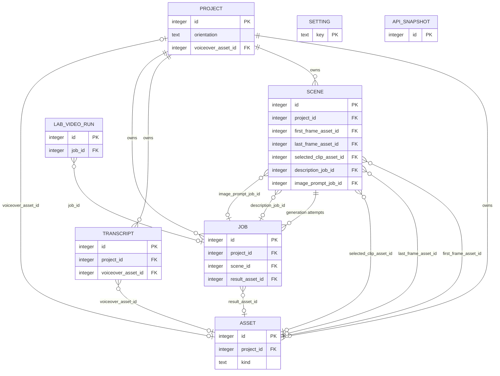

# Visio Studio: Database Structure

Status: Derived from `ANALYSIS.md` (originally Revision 3, now updated for Revision 4's transcription findings), specifically Section 4 ("Database and data model"), cross-referenced with Sections 3.7, 4.4, 5.1, 5.2 and 6.5 for field-level detail. No code or migrations exist yet — this document turns the "draft data model" in `ANALYSIS.md` Section 4.3 into a complete, implementable structure.

**Update (2026-10-05):** `ANALYSIS.md` Revision 4 confirmed the transcription endpoint's real response shape against the live GPU server. Section 4.3 (`transcript` table) and the JSON shapes in Section 5 below are updated accordingly — `transcript.words` now holds the whole verified response object, not a guessed-at array.

**Update (Phase 6, 2026-10-06):** no schema change. Section 5 now documents the `plan_scenes` job's `input` (it carries the cache key `input_hash` and what the scenes were made from) and `output` (the model's answer is kept verbatim in `output.answer`, next to the attempts, the token usage and the check counts), and Section 7 says how scenes are replaced. The cache key lives in `job.input`, not in a new column.

**Update (Phase 9, 2026-10-06):** no schema change. Section 5 now documents the real `generate_clip` `input` and `output` (the request is built once and stored, and every later attempt sends it again) and the `asset.provenance` of a clip and of a derived frame, and Section 7 says how a clip, its take and its selection are written. A *take* is a succeeded `generate_clip` job together with its clip asset: there is still no clip table.

**Update (Phase 12, 2026-10-08):** migration `0003`. A new job type, `draft_descriptions` (a paid call to the language model that writes every scene's video prompt and its first and last frame descriptions in one request). `project` gains `description_instructions`. `scene` gains `first_frame_description`, `last_frame_description`, `frame_descriptions_source` and `description_job_id` (the job that wrote the AI text). Section 5 documents the job's `input` and `output`, and Section 7 says how the drafts are written and which fields they may overwrite.

**Update (Phase 13, 2026-10-08):** migration `0004`. Two tables for the Image lab page, where Bitdeer's image API is tested by hand: `lab_run` (one call: the exact request, the raw response, timing and usage) and `lab_image` (an upload, or a result of a run). They belong to no project. Nothing existing changes. See Sections 4.8, 4.9 and 7.

**Update (Phase 15, 2026-10-08):** migration `0005`. `scene.frame_descriptions_source` (one source for the pair) is replaced by `first_frame_description_source` and `last_frame_description_source`, copied from the old column wherever the text exists. The AI drafting job no longer writes a last-frame description (a clip is made from its first frame alone): it writes the video prompt and the first-frame description, and clears an earlier AI-written last-frame description in the scenes it writes into. The prompt profile is now `ltx-2.3-first-frame`, and the `world` and `continuity` values in the job's answer changed. See Sections 4.4, 5 and 7.

**Update (Phase 16, 2026-10-08):** migration `0006`. A new job type, `write_image_prompt`: one paid call to the language model for one scene (a scene job, `scene_id` set), which turns the scene's first-frame description, video prompt, narration and the draft's `world` into a detailed prompt for the image model. `scene` gains `image_prompt`, `image_prompt_source` and `image_prompt_job_id` (the job that wrote the AI text). Whether an AI prompt is out of date is computed when it is read, from a hash of its inputs kept on that job (`job.input.inputs_sha256`): no flag is stored. A new global setting, `image_prompt_llm_model`. See Sections 3, 4.4, 4.5, 5, 6 and 7.

**Update (Phase 17, 2026-10-08):** migration `0007`. A new job type, `generate_frame`, and a new job provider, `image`: one paid image from the image model (Seedream through Bitdeer) for one scene (a scene job, `scene_id` set). Its result is an `asset` (`kind='frame'`, `source='ai'`) that becomes the scene's first frame, and the raw image the model returned is kept as a second asset. **No table or column is added**: the frame is a normal asset, `scene.first_frame_asset_id` already points at it, and the scene's earlier frames are the result frames of its succeeded `generate_frame` jobs (no list is stored). Whether an AI frame is out of date is computed when it is read, from the prompt its provenance recorded. Two new global settings, `image_model` and `max_parallel_image_generations`. See Sections 4.2, 4.5, 5, 6 and 7.

**Update (Phase 18, 2026-10-09):** no schema change. A new global setting, `default_negative_prompt` (a text for the video model: no background music, singing or speech, no on-screen text, logos or watermarks, and common video artifacts). A `generate_clip` job sends the project's own `negative_prompt` when it has one, otherwise this default, and a new project starts with this text as its own `negative_prompt`. Before this, a project with a blank `negative_prompt` sent none, and the GPU server's own default applied. See Sections 4.1, 5 and 6.

**Update (Phase 19, 2026-10-09):** migration `0008`. LTX-2.5 runs next to LTX-2.3, and the video model is chosen per app, project and scene. `project` and `scene` gain a nullable `video_model` (`ltx-2.3` or `ltx-2.5`; NULL means "inherit": the scene takes the project's, the project takes the global setting `default_video_model`). **`job.project_id` becomes nullable** and `job.type` gains `lab_video` and `write_lab_video_prompt`: the new Video lab belongs to no project, and its jobs are normal background jobs. A new table, `lab_video_run`, holds what the Video lab lists and compares (the model, the prompt, the settings, and the stored clip). A clip's job and asset record which model made it. No `negative_prompt` is sent to LTX-2.5 (it has none), so the project's and the global negative prompts are LTX-2.3 only. See Sections 3, 4.1, 4.4, 4.5, 4.10, 5, 6 and 7.

**Update (Phase 20, 2026-10-09):** migration `0009`. A new job type, `auto_pipeline`: one run of the automatic flow of a project, which makes the jobs of the manual steps one step after the other and starts a step only when every scene has finished the one before. **No table or column is added**: the run keeps its state in `job.input` and `job.output` (including the ids of the jobs it made, so a restart continues where it was), and only the `job.type` CHECK gains the new value. A run is a project job (`scene_id` is NULL, `provider='local'`) and keeps a fixed marker in `provider_job_id` so the dispatcher checks it every tick. Its jobs are ordinary jobs of the existing types, with `input.auto_run_id` naming the run. See Sections 4.5, 5 and 7.

**How to read this document:** every table and field name is taken directly from `ANALYSIS.md`. Where `ANALYSIS.md` describes behaviour in prose but doesn't spell out a concrete SQL type, default, index, or constraint, I chose a simple, standard convention and marked it. **Section 8 ("Assumptions and additions beyond ANALYSIS.md") lists every one of those choices in one place** so you can confirm or correct them before anything is built. Nothing in Sections 1–7 should surprise you if you've read `ANALYSIS.md`; it's the same model, just made concrete.

---

## Contents

1. [Engine and tooling](#1-engine-and-tooling)
2. [Design principles behind the structure](#2-design-principles-behind-the-structure)
3. [Entity-relationship overview](#3-entity-relationship-overview)
4. [Tables](#4-tables)
5. [JSON column shapes](#5-json-column-shapes)
6. [Global settings stored in `setting`](#6-global-settings-stored-in-setting)
7. [How the pipeline writes to these tables](#7-how-the-pipeline-writes-to-these-tables)
8. [Assumptions and additions beyond ANALYSIS.md](#8-assumptions-and-additions-beyond-analysismd)

---

## 1. Engine and tooling

(Source: `ANALYSIS.md` Section 4.1)

- **SQLite** for iteration 1 — one file on the Docker `data` volume, no separate database container, no credentials. PostgreSQL is dropped because the reason for it (a separate worker process, and the database doubling as a job queue) no longer applies with one backend process and no queue table.
- **SQLAlchemy 2.x** for models, **Alembic** for migrations, so the code stays portable if you move to PostgreSQL later.
- **WAL mode and foreign keys** turned on (`PRAGMA journal_mode=WAL;` and `PRAGMA foreign_keys=ON;`).
- **JSON columns** (SQLAlchemy's `JSON` type) hold word timings and the exact request/response payloads sent to providers. SQLite has no native JSON storage class — these are stored as `TEXT` and serialized/validated by SQLAlchemy at the application layer.
- **Switch to PostgreSQL when:** you host it, add users, or run more than one backend process (Section 4.1). The cost is a connection-string change, running the same Alembic migrations against Postgres, and copying data.

---

## 2. Design principles behind the structure

(Source: `ANALYSIS.md` Section 4.2, "Manual-first, AI-ready")

- **An artifact is the same thing no matter who made it.** A scene description is text on the scene whether you typed it or an LLM drafted it — only a `source` field changes. A frame is an `asset` row whether you uploaded it or a model generated it.
- **Every unit of background work is a `job` row** (transcribe, plan scenes, generate a clip, render) holding its input and output, so the UI can show activity. This is the same table for manual-era and AI-era work.
- **"Ready to generate" is computed, not stored.** A scene is ready when it has a description and a first frame (the last frame is optional since Phase 14) — the backend checks this from existing columns; there's no `is_ready` flag to keep in sync.
- **There is no separate `Clip` table.** A generation attempt is a `job`, its result is an `asset`, and the `scene` points at whichever asset is the chosen take. This is what makes "regenerate" and "pick another take" work without new tables: a retake is just another `job` row producing another `asset`, and you repoint `scene.selected_clip_asset_id`.
- **Frames are assets referenced by id**, not owned exclusively by one scene, so a frame can be reused by a later scene (this is also what lets chained continuity — Section 5.7 of `ANALYSIS.md` — be added later with zero schema change: scene N+1's first frame would just point at scene N's last-frame asset).

---

## 3. Entity-relationship overview

Ten tables, all scoped under one `project` except the five global ones (`setting`, `api_snapshot`, and, from Phase 13, `lab_run` and `lab_image`, and, from Phase 19, `lab_video_run`), which hold no `project_id` because they describe the app, the GPU server or a manual test, not one video. The Video lab's jobs are rows of `job` too, with a NULL `project_id` (Phase 19).



`SETTING` and `API_SNAPSHOT` have no edges to `PROJECT` — they are global, as described in Sections 3.7 and 6.5.

**Foreign keys, precisely** (the diagram above is a visual aid; this list is authoritative):

| From | Column | To | Nullable |
|---|---|---|---|
| `asset` | `project_id` | `project.id` | No |
| `project` | `voiceover_asset_id` | `asset.id` | Yes (until the voiceover is uploaded) |
| `transcript` | `project_id` | `project.id` | No |
| `transcript` | `voiceover_asset_id` | `asset.id` | Yes (the voiceover the transcript was made from; `SET NULL` if that asset row is ever removed). Added in Phase 5. |
| `scene` | `project_id` | `project.id` | No |
| `scene` | `first_frame_asset_id` | `asset.id` | Yes (until uploaded) |
| `scene` | `last_frame_asset_id` | `asset.id` | Yes (until uploaded) |
| `scene` | `selected_clip_asset_id` | `asset.id` | Yes (until a clip is generated) |
| `scene` | `description_job_id` | `job.id` | Yes (until an AI draft writes into the scene; `SET NULL` if that job row is ever removed). Added in Phase 12. |
| `scene` | `image_prompt_job_id` | `job.id` | Yes (until the AI writes the scene's image prompt; `SET NULL` if that job row is ever removed). Added in Phase 16. |
| `job` | `project_id` | `project.id` | Yes: NULL only for the Video lab's jobs (`lab_video`, `write_lab_video_prompt`), which belong to no project. Every other job type always has one. Phase 19 |
| `job` | `scene_id` | `scene.id` | Yes (only per-scene job types set this) |
| `job` | `result_asset_id` | `asset.id` | Yes (until the job succeeds) |
| `lab_video_run` | `job_id` | `job.id` | Yes (the `lab_video` job that makes the run's clip; `SET NULL` if that job row is ever removed). Phase 19 |

Note the one circular-looking reference: `asset.project_id` points at `project`, and `project.voiceover_asset_id` points back at `asset`. This isn't a problem in practice because of the order things happen in (Section 1 of `ANALYSIS.md`): the project row is created first with `voiceover_asset_id` left `NULL`, the voiceover file is uploaded afterwards as an `asset` row, and only then is `project.voiceover_asset_id` updated to point at it.

Phase 12 adds a second pair: `scene.description_job_id` points at `job`, and `job.scene_id` points back at `scene`. Both are nullable, and a `draft_descriptions` job is project-level (`scene_id` is NULL), so it survives the replacement of the scenes. The ORM marks `description_job_id` with `use_alter` for the same reason as the voiceover link.

Phase 16 adds a third: `scene.image_prompt_job_id` points at `job`. Unlike a draft, a `write_image_prompt` job is a scene job (`scene_id` is set, `ON DELETE CASCADE`), so merging a scene away, or replacing the scenes, deletes the jobs that wrote its prompt, and their paid answers with them. The API therefore refuses a cut edit of such a scene, and a proposal, while one of these jobs is queued or running (as it does for a clip job). `image_prompt_job_id` is `use_alter` too.

---

## 4. Tables

Each table below shows: its purpose, a column reference table, and illustrative SQL DDL (SQLite dialect). Model names below match the PascalCase names used in `ANALYSIS.md` Section 4.3; table names are the lowercase `snake_case` SQL identifiers I'm proposing for them (see Section 8).

### 4.1 `project`

One row per video. Holds output settings (pre-filled from orientation — Section 4.4), the project-scoped settings from Section 3.7 (scene length limits, guidelines, clip sound volume), and the script/voiceover inputs.

| Column | Type | Null | Default | Description |
|---|---|---|---|---|
| `id` | INTEGER | NOT NULL | auto | Primary key |
| `name` | TEXT | NOT NULL | — | The project's name |
| `created_at` | DATETIME | NOT NULL | now | |
| `orientation` | TEXT | NOT NULL | — | `portrait` \| `landscape` — chosen first (decision 2) |
| `gen_width` | INTEGER | NOT NULL | from orientation | Sent to LTX; multiple of 64 |
| `gen_height` | INTEGER | NOT NULL | from orientation | Sent to LTX; multiple of 64 |
| `out_width` | INTEGER | NOT NULL | from orientation | Final video width |
| `out_height` | INTEGER | NOT NULL | from orientation | Final video height |
| `fps` | INTEGER | NOT NULL | 24 | Frame rate |
| `min_scene_seconds` | REAL | NOT NULL | 2.0 | Shortest allowed scene |
| `max_scene_seconds` | REAL | NOT NULL | 6.0 | Longest allowed scene (your 5–6 s cap) |
| `style_prefix` | TEXT | NULL | blank | Guideline: style, sent as LTX's `Style:` prefix |
| `prompt_suffix` | TEXT | NULL | blank | Guideline: camera/lighting/colour/pacing, always appended |
| `negative_prompt` | TEXT | NULL | the `default_negative_prompt` setting's text when the project is created (blank if that setting is blank) | Guideline: what to avoid. When it is blank, a clip is made with the `default_negative_prompt` setting instead (Section 6). LTX-2.3 only: LTX-2.5 has no negative prompt and is never sent one (Phase 19) |
| `clip_sound_volume` | REAL | NOT NULL | 0.2 | 0 = off; otherwise each clip's own sound, as a share of the voiceover's level (0.2 = 14 dB under the voice, 0.05 = 26 dB). The render measures the loudness of the voiceover and of each clip, so every clip lands at the same distance under the voice |
| `cut_instructions` | TEXT | NULL | blank | Extra instructions for the AI that proposes cuts |
| `description_instructions` | TEXT | NULL | blank | Extra instructions for the AI that drafts the video prompts and first-frame descriptions: places and recurring subjects (animals, objects, people where needed), look, sound wishes (Phase 12; wording of Phase 15) |
| `script_text` | TEXT | NULL | — | Pasted in step B of the flow; `NULL` until then |
| `video_model` | TEXT | NULL | — | `ltx-2.3` \| `ltx-2.5`. The video model that makes this project's clips. NULL means "use the app's default" (the `default_video_model` setting, Section 6). A scene's own `video_model` wins over it. Phase 19 |
| `language` | TEXT | NOT NULL | `'en'` | Voiceover language (English-only decision) |
| `voiceover_asset_id` | INTEGER, FK → `asset.id` | NULL | — | Set once the voiceover is uploaded |

```sql
CREATE TABLE project (
    id                 INTEGER PRIMARY KEY,
    name               TEXT NOT NULL,
    created_at         DATETIME NOT NULL DEFAULT CURRENT_TIMESTAMP,
    orientation        TEXT NOT NULL CHECK (orientation IN ('portrait', 'landscape')),
    gen_width          INTEGER NOT NULL,
    gen_height         INTEGER NOT NULL,
    out_width          INTEGER NOT NULL,
    out_height         INTEGER NOT NULL,
    fps                INTEGER NOT NULL DEFAULT 24,
    min_scene_seconds  REAL NOT NULL DEFAULT 2.0,
    max_scene_seconds  REAL NOT NULL DEFAULT 6.0,
    style_prefix       TEXT,
    prompt_suffix      TEXT,
    negative_prompt    TEXT,
    clip_sound_volume  REAL NOT NULL DEFAULT 0.2,
    cut_instructions   TEXT,
    description_instructions TEXT,
    script_text        TEXT,
    video_model        TEXT CHECK (video_model IS NULL OR video_model IN ('ltx-2.3', 'ltx-2.5')),
    language           TEXT NOT NULL DEFAULT 'en',
    voiceover_asset_id INTEGER REFERENCES asset(id) ON DELETE SET NULL
);
```

### 4.2 `asset`

Any file on disk — uploaded or generated. Covers the voiceover, every frame, every generated clip, and the final render. (Source: Section 4.2 and 4.3.)

| Column | Type | Null | Default | Description |
|---|---|---|---|---|
| `id` | INTEGER | NOT NULL | auto | Primary key |
| `project_id` | INTEGER, FK → `project.id` | NOT NULL | — | Owning project |
| `kind` | TEXT | NOT NULL | — | `voiceover` \| `frame` \| `clip` \| `final` |
| `path` | TEXT | NOT NULL | — | Server-generated (UUID) path on the `data` volume |
| `mime` | TEXT | NOT NULL | — | MIME type |
| `size_bytes` | INTEGER | NOT NULL | — | File size |
| `duration_s` | REAL | NULL | — | Audio/video kinds only |
| `width` | INTEGER | NULL | — | Image/video kinds only. For an uploaded frame: the size as displayed, after the EXIF orientation is applied (Phase 8) |
| `height` | INTEGER | NULL | — | Image/video kinds only. Same rule as `width` |
| `sha256` | TEXT | NOT NULL | — | Content hash |
| `source` | TEXT | NOT NULL | — | `upload` \| `ai` \| `derived` |
| `provenance` | JSON | NULL | empty | provider/model/prompt/seed — empty (NULL) for uploads, including the frames uploaded in Phase 8. A frame made by the image model (`source='ai'`, Phase 17) records the prompt, the sizes, the crop and the usage, and so does the raw image behind it (Section 5) |
| `created_at` | DATETIME | NOT NULL | now | |

```sql
CREATE TABLE asset (
    id          INTEGER PRIMARY KEY,
    project_id  INTEGER NOT NULL REFERENCES project(id) ON DELETE CASCADE,
    kind        TEXT NOT NULL CHECK (kind IN ('voiceover', 'frame', 'clip', 'final')),
    path        TEXT NOT NULL,
    mime        TEXT NOT NULL,
    size_bytes  INTEGER NOT NULL,
    duration_s  REAL,
    width       INTEGER,
    height      INTEGER,
    sha256      TEXT NOT NULL,
    source      TEXT NOT NULL CHECK (source IN ('upload', 'ai', 'derived')),
    provenance  JSON,
    created_at  DATETIME NOT NULL DEFAULT CURRENT_TIMESTAMP
);
```

### 4.3 `transcript`

Word times from the transcription endpoint, plus those same times matched onto your script. Replaces what Revision 1 called "Alignment." (Source: `ANALYSIS.md` Section 4.3 and 5.1, Revision 4.)

**Update (Revision 4 of `ANALYSIS.md`):** the transcription endpoint is now live — `POST /v1/parakeet/transcribe` on your GPU server — and its real response shape is confirmed, not a draft. It returns more than a bare word list: a full transcript string, per-word *and* per-segment timestamps, and timing metadata. The `words` column below now holds that whole object verbatim (still satisfying "raw endpoint output, exactly as returned"), not just an extracted array. See Section 5 for the exact shape.

| Column | Type | Null | Default | Description |
|---|---|---|---|---|
| `id` | INTEGER | NOT NULL | auto | Primary key |
| `project_id` | INTEGER, FK → `project.id` | NOT NULL | — | Owning project |
| `provider` | TEXT | NOT NULL | — | Which transcription endpoint produced this, e.g. `"parakeet"` |
| `language` | TEXT | NOT NULL | — | The language you expect the voiceover to be in (e.g. `"en"`), used only for your own records and any future matching logic. **Not sent to the endpoint** — Parakeet auto-detects among 25 languages and has no `language` request field. |
| `words` | JSON | NOT NULL | — | The endpoint's raw response, exactly as returned: `{transcription, processing_time, word_timestamps, segment_timestamps, metadata}` — see Section 5 |
| `script_words` | JSON | NOT NULL | — | Script words with matched times, built from `words.word_timestamps`: `[{index, word, start, end, matched, paragraph}]` — see Section 5 |
| `created_at` | DATETIME | NOT NULL | now | |
| `voiceover_asset_id` | INTEGER, FK → `asset.id` | NULL | — | The voiceover asset this transcript was made from. (Phase 5, migration `0002`) |
| `script_sha256` | TEXT | NOT NULL | — | SHA-256 (hex) of the project's `script_text` exactly as stored at the moment of matching. (Phase 5, migration `0002`) |

```sql
CREATE TABLE transcript (
    id                 INTEGER PRIMARY KEY,
    project_id         INTEGER NOT NULL REFERENCES project(id) ON DELETE CASCADE,
    provider           TEXT NOT NULL,
    language           TEXT NOT NULL,
    words              JSON NOT NULL,
    script_words       JSON NOT NULL,
    created_at         DATETIME NOT NULL DEFAULT CURRENT_TIMESTAMP,
    voiceover_asset_id INTEGER REFERENCES asset(id) ON DELETE SET NULL,
    script_sha256      TEXT NOT NULL
);
```

**Out of date (Phase 5).** The ANALYSIS.md model does not say how to tell that a transcript no longer fits its inputs, so Phase 5 added the two columns above. A transcript is out of date when `voiceover_asset_id` differs from the project's current `voiceover_asset_id` (reason `voiceover_changed`), or when `script_sha256` differs from the SHA-256 of the project's current `script_text` (reason `script_changed`). An all-blank script is stored as `NULL` and hashes as the empty string. Uploading the same file again creates a new asset, so it counts as a changed voiceover. The newest transcript of a project (by `id`) is the one that counts.

### 4.4 `scene`

One cut = one clip (called "Segment" in Revision 1 of `ANALYSIS.md`). The central table: it accumulates the cut timing, the description, the first frame, an optional last frame, and the chosen take. (Source: Section 4.3, 5.2, 5.7.)

| Column | Type | Null | Default | Description |
|---|---|---|---|---|
| `id` | INTEGER | NOT NULL | auto | Primary key |
| `project_id` | INTEGER, FK → `project.id` | NOT NULL | — | Owning project |
| `index` | INTEGER | NOT NULL | — | Order within the project |
| `start_s` | REAL | NOT NULL | — | Start time in the voiceover |
| `end_s` | REAL | NOT NULL | — | End time in the voiceover |
| `text` | TEXT | NOT NULL | — | This scene's slice of the script: its words joined by single spaces. Phase 7 finds a scene's words again by matching this text against the transcript's `script_words` |
| `cut_source` | TEXT | NOT NULL | — | `ai` \| `rule` \| `manual` — who placed the cut that ends this scene |
| `cut_note` | TEXT | NULL | — | Why it needs a look, if it does |
| `scene_description` | TEXT | NULL | — | The motion prompt sent to the video model (with the project's style prefix and suffix around it) |
| `scene_description_source` | TEXT | NULL | — | `manual` \| `ai` |
| `first_frame_description` | TEXT | NULL | — | What the first frame should show, at the instant just before the motion begins: a guide for making the frame, by hand now and by an image model later (Phase 12; Phase 15 wording) |
| `last_frame_description` | TEXT | NULL | — | What a last frame the author adds by hand shows. The AI never writes it (Phase 15). When the author wrote it, it is sent to the drafting model as context so the video prompt can end on it |
| `first_frame_description_source` | TEXT | NULL | — | `manual` \| `ai`. Who wrote `first_frame_description`; NULL while it is blank (Phase 15, replaces the pair's `frame_descriptions_source`) |
| `last_frame_description_source` | TEXT | NULL | — | `manual` \| `ai`. Who wrote `last_frame_description`; NULL while it is blank. `ai` only for a text an old (Phase 12) draft wrote, which the next draft that writes into the scene clears (Phase 15) |
| `description_job_id` | INTEGER, FK → `job.id` | NULL | — | The `draft_descriptions` job that last wrote AI text into this scene (the video prompt or the first-frame description). Kept after the user edits a text, so the draft in `job.output.drafts` can be compared with what the user made of it. `ON DELETE SET NULL`. Lets a scene be traced to the exact request and answer (Phase 12) |
| `image_prompt` | TEXT | NULL | — | The detailed prompt for the image model that makes the first frame: one paragraph, written by the AI (a `write_image_prompt` job) or by hand. Phase 17 sends it to Seedream. Whether it is out of date is computed, never stored (Section 5) (Phase 16) |
| `image_prompt_source` | TEXT | NULL | — | `manual` \| `ai`. Who wrote `image_prompt`; NULL while it is blank. A prompt is the author's unless its source is `ai`, and the author's is never overwritten (Phase 16) |
| `image_prompt_job_id` | INTEGER, FK → `job.id` | NULL | — | The `write_image_prompt` job that last wrote AI text into `image_prompt`. A job that reused an earlier answer counts, and its `output.cache_hit_of_job_id` names the job that paid. Kept after the user edits the text, so the job's request and answer can be compared with what the user made of it. `ON DELETE SET NULL` (Phase 16) |
| `first_frame_asset_id` | INTEGER, FK → `asset.id` | NULL | — | The scene's first frame. Required for a clip (Phase 14: a scene is ready with a description and a first frame) |
| `last_frame_asset_id` | INTEGER, FK → `asset.id` | NULL | — | Optional (Phase 14). When set, the scene's clip is made by keyframe interpolation and ends on it. When NULL, the clip is made from the first frame alone (image-to-video). There is no separate on/off flag: the clip mode is derived from this column (`scene_inputs.clip_mode`) |
| `use_clip_sound` | BOOLEAN | NOT NULL | true | Per-scene switch; false mutes this scene's own sound |
| `selected_clip_asset_id` | INTEGER, FK → `asset.id` | NULL | — | Which generated take is used in the final render |
| `video_model` | TEXT | NULL | — | `ltx-2.3` \| `ltx-2.5`. The video model that makes this scene's clips. NULL means "use the project's" (and, when that is NULL too, the app's default). It changes the clips made from now on: a clip already made keeps the model it was made with (Phase 19) |

```sql
CREATE TABLE scene (
    id                        INTEGER PRIMARY KEY,
    project_id                INTEGER NOT NULL REFERENCES project(id) ON DELETE CASCADE,
    "index"                   INTEGER NOT NULL,
    start_s                   REAL NOT NULL,
    end_s                     REAL NOT NULL,
    text                      TEXT NOT NULL,
    cut_source                TEXT NOT NULL CHECK (cut_source IN ('ai', 'rule', 'manual')),
    cut_note                  TEXT,
    scene_description         TEXT,
    scene_description_source  TEXT CHECK (scene_description_source IN ('manual', 'ai')),
    first_frame_description   TEXT,
    last_frame_description    TEXT,
    first_frame_description_source TEXT CHECK (first_frame_description_source IN ('manual', 'ai')),
    last_frame_description_source  TEXT CHECK (last_frame_description_source IN ('manual', 'ai')),
    description_job_id        INTEGER REFERENCES job(id) ON DELETE SET NULL,
    image_prompt              TEXT,
    image_prompt_source       TEXT CHECK (image_prompt_source IN ('manual', 'ai')),
    image_prompt_job_id       INTEGER REFERENCES job(id) ON DELETE SET NULL,
    first_frame_asset_id      INTEGER REFERENCES asset(id) ON DELETE SET NULL,
    last_frame_asset_id       INTEGER REFERENCES asset(id) ON DELETE SET NULL,
    use_clip_sound            BOOLEAN NOT NULL DEFAULT 1,
    selected_clip_asset_id    INTEGER REFERENCES asset(id) ON DELETE SET NULL,
    video_model               TEXT CHECK (video_model IS NULL OR video_model IN ('ltx-2.3', 'ltx-2.5')),
    UNIQUE (project_id, "index")
);
```

Scene readiness ("a description plus a first frame present"; the last frame is optional since Phase 14, and earlier phases required both frames) is **computed** by the backend from these columns at read time — there is deliberately no `is_ready` column (Section 4.2 and 4.3's design notes). The clip mode (`first_frame` or `first_and_last`) is computed the same way, from `last_frame_asset_id`, and is fixed for a clip job when the job first starts (Section 5, `generate_clip`).

### 4.5 `job`

Every unit of background work: transcribe, plan scenes, generate a clip, render the final video. This is where running-job information lives, so a restart never loses track of a 5–10 minute GPU job. (Source: Section 3.3, 4.2, 4.3.)

| Column | Type | Null | Default | Description |
|---|---|---|---|---|
| `id` | INTEGER | NOT NULL | auto | Primary key |
| `project_id` | INTEGER, FK → `project.id` | NULL | — | Owning project. NULL only for the Video lab's jobs (`lab_video`, `write_lab_video_prompt`), which belong to no project; the Activity page shows them under "Video lab" (Phase 19) |
| `scene_id` | INTEGER, FK → `scene.id` | NULL | — | Set only for per-scene jobs (`generate_clip`, and since Phase 16 `write_image_prompt`, and since Phase 17 `generate_frame`) |
| `type` | TEXT | NOT NULL | — | `transcribe` \| `plan_scenes` \| `draft_descriptions` \| `write_image_prompt` \| `generate_frame` \| `generate_clip` \| `render_final` \| `lab_video` \| `write_lab_video_prompt` \| `auto_pipeline` (`lab_video` and `write_lab_video_prompt`: Phase 19, the Video lab; `auto_pipeline`: Phase 20, the automatic flow) |
| `status` | TEXT | NOT NULL | `'queued'` | `queued` \| `running` \| `succeeded` \| `failed` \| `cancelled` |
| `phase` | TEXT | NULL | — | Free-text UI label, e.g. "queued on cluster" |
| `provider` | TEXT | NOT NULL | — | `gpu` \| `llm` \| `image` (Phase 17: the image model, reached at the same Bitdeer address as `llm`) \| `local` |
| `provider_job_id` | TEXT | NULL | — | The external server's job id, once submitted. An `auto_pipeline` run keeps the fixed marker `auto` here instead: it is not an id on any server, it only makes the dispatcher check the run at every tick |
| `input` | JSON | NOT NULL | — | Exact request sent: prompt, seed, server URL, etc. |
| `output` | JSON | NULL | — | Raw provider answer (LLM JSON, token usage, etc.) |
| `result_asset_id` | INTEGER, FK → `asset.id` | NULL | — | Set on success |
| `attempt` | INTEGER | NOT NULL | 1 | Retry counter |
| `error` | TEXT | NULL | — | The server's error text, if failed |
| `created_at` | DATETIME | NOT NULL | now | |
| `started_at` | DATETIME | NULL | — | |
| `finished_at` | DATETIME | NULL | — | |
| `last_checked_at` | DATETIME | NULL | — | Last time the dispatcher polled this job |

```sql
CREATE TABLE job (
    id               INTEGER PRIMARY KEY,
    project_id       INTEGER REFERENCES project(id) ON DELETE CASCADE,
    scene_id         INTEGER REFERENCES scene(id) ON DELETE CASCADE,
    type             TEXT NOT NULL CHECK (type IN ('transcribe', 'plan_scenes', 'draft_descriptions', 'write_image_prompt', 'generate_frame', 'generate_clip', 'render_final', 'lab_video', 'write_lab_video_prompt', 'auto_pipeline')),
    status           TEXT NOT NULL DEFAULT 'queued'
                       CHECK (status IN ('queued', 'running', 'succeeded', 'failed', 'cancelled')),
    phase            TEXT,
    provider         TEXT NOT NULL CHECK (provider IN ('gpu', 'llm', 'image', 'local')),
    provider_job_id  TEXT,
    input            JSON NOT NULL,
    output           JSON,
    result_asset_id  INTEGER REFERENCES asset(id) ON DELETE SET NULL,
    attempt          INTEGER NOT NULL DEFAULT 1,
    error            TEXT,
    created_at       DATETIME NOT NULL DEFAULT CURRENT_TIMESTAMP,
    started_at       DATETIME,
    finished_at      DATETIME,
    last_checked_at  DATETIME
);
```

The dispatcher loop (Section 3.3) is the main reader/writer of this table: each tick it checks every `running` job, starts downloads for finished ones, resubmits pre-empted ones, and starts `queued` jobs while fewer than the parallel-generation setting are `running`. Since Phase 19 a handler can name a *concurrency group*: `generate_clip` and `lab_video` share one pool of slots (`max_parallel_generations`), because both use the GPU server, so the Video lab cannot starve scene clips (or the other way round) beyond that limit. Since Phase 20 an `auto_pipeline` job is a `running` job that does no work itself: its handler's `poll` is the whole run (it reads this table, creates the next jobs, and moves on), so a run is checked every tick like a job on the GPU server and survives a restart (`restart_rule='resume'`). At most 5 runs are `running` at once (a constant).

### 4.6 `setting`

Global settings edited in the UI (Section 3.7) — a simple key/value table. **Project-scoped** settings (scene length limits, guidelines, clip sound volume) are **not** stored here; they live as columns directly on `project` (Section 4.1 above) and `scene.use_clip_sound`. See Section 6 below for exactly which keys live in this table.

| Column | Type | Null | Default | Description |
|---|---|---|---|---|
| `key` | TEXT | NOT NULL (PK) | — | e.g. `gpu_api_base_url` |
| `value` | JSON | NOT NULL | — | The setting's value |
| `updated_at` | DATETIME | NOT NULL | now | |

```sql
CREATE TABLE setting (
    key        TEXT PRIMARY KEY,
    value      JSON NOT NULL,
    updated_at DATETIME NOT NULL DEFAULT CURRENT_TIMESTAMP
);
```

### 4.7 `api_snapshot`

The recorded GPU API contract (Section 6.5) — the guide, the OpenAPI spec, and any other swagger document you add. Checked before every submission so a server update can't silently change what gets sent.

| Column | Type | Null | Default | Description |
|---|---|---|---|---|
| `id` | INTEGER | NOT NULL | auto | Primary key |
| `source` | TEXT | NOT NULL | — | `guide` \| `openapi` \| a custom name you add |
| `url` | TEXT | NOT NULL | — | The source's path, relative to the server URL its `base` names (so a new tunnel address doesn't invalidate it). Includes any query string, for example `/v1/guide?format=json`. (Phase 4) |
| `fetched_at` | DATETIME | NOT NULL | now | |
| `fingerprint` | TEXT | NOT NULL | — | The document's `content_hash` if present, else SHA-256 of the canonical JSON |
| `server_content_hash` | TEXT | NULL | — | The server's own hash field, if the document has one |
| `api_version` | TEXT | NULL | — | Version string from the guide, if present |
| `body` | JSON | NOT NULL | — | The fetched document |
| `state` | TEXT | NOT NULL | `'pending'` | `approved` \| `pending` |
| `approved_at` | DATETIME | NULL | — | Set when you click Approve |

```sql
CREATE TABLE api_snapshot (
    id                  INTEGER PRIMARY KEY,
    source              TEXT NOT NULL,
    url                 TEXT NOT NULL,
    fetched_at          DATETIME NOT NULL DEFAULT CURRENT_TIMESTAMP,
    fingerprint         TEXT NOT NULL,
    server_content_hash TEXT,
    api_version         TEXT,
    body                JSON NOT NULL,
    state               TEXT NOT NULL DEFAULT 'pending' CHECK (state IN ('approved', 'pending')),
    approved_at         DATETIME
);
```

Older snapshots are kept as history (Section 6.5: "Older versions stay as history") — rows are never overwritten, only inserted. To find the current baseline for a source, read the most recently **approved** row with that `source` **and** `url`, ordered by `fetched_at` and then `id`. Matching on `url` as well means a source whose path changes has no baseline and is "not approved", instead of showing a huge difference against a different document. (Phase 4.)

A changed source is stored once as a `pending` row per version: the guard inserts a pending row only if none with the same `fingerprint`, `source` and `url` exists that is newer than the latest approved row. A pending row is never converted to approved. Approving inserts a new `approved` row, so a simulated or real change always leaves the earlier approved, pending and approved rows behind as history.

### 4.8 `lab_run`

One manual test of the image API from the Image lab page (Phase 13). A run is one synchronous call and **not** a `job`: the lab is not tied to a project, and `job.project_id` is required. It keeps what is needed to compare runs later: the exact request, the raw response, the timing and the usage. Runs are never deleted in iteration 1.

| Column | Type | Null | Default | Description |
|---|---|---|---|---|
| `id` | INTEGER | NOT NULL | auto | Primary key |
| `created_at` | DATETIME | NOT NULL | now | |
| `mode` | TEXT | NOT NULL | — | `text_to_image` \| `image_to_image` (the `image` field on `/images/generations`) \| `edit` (`POST /images/edits`, multipart) |
| `endpoint` | TEXT | NOT NULL | — | The path called, for example `/images/generations` |
| `model` | TEXT | NOT NULL | — | The model sent, for example `seedream-5.0-lite` |
| `prompt` | TEXT | NOT NULL | — | |
| `params` | JSON | NOT NULL | — | What the form held besides the prompt: `size`, `watermark` (true, false or null for "not sent"), `seed`, `sequential_max_images`, `image_field_as`, `edit_field_name`, `extra` |
| `reference_images` | JSON | NOT NULL | — | `[{"source": "lab" \| "asset", "id": 7}]`, in the order they were sent. Not named `references`, which is an SQL keyword |
| `status` | TEXT | NOT NULL | — | `succeeded` \| `failed` |
| `http_status` | INTEGER | NULL | — | Absent when there was no answer at all (a timeout or a refused connection) |
| `error` | TEXT | NULL | — | A readable message, including the Cloudflare and Bitdeer cases |
| `seconds` | REAL | NULL | — | How long the call took |
| `request_bytes` | INTEGER | NULL | — | The size of the body that was sent |
| `usage` | JSON | NULL | — | The `usage` block of the answer, as returned |
| `request` | JSON | NOT NULL | — | The request as sent, with every image replaced by `<image: N bytes>` |
| `response` | JSON | NULL | — | The answer, with every `b64_json` replaced by `<image: N bytes>` |

```sql
CREATE TABLE lab_run (
    id               INTEGER PRIMARY KEY,
    created_at       DATETIME NOT NULL DEFAULT CURRENT_TIMESTAMP,
    mode             TEXT NOT NULL CHECK (mode IN ('text_to_image', 'image_to_image', 'edit')),
    endpoint         TEXT NOT NULL,
    model            TEXT NOT NULL,
    prompt           TEXT NOT NULL,
    params           JSON NOT NULL,
    reference_images JSON NOT NULL,
    status           TEXT NOT NULL CHECK (status IN ('succeeded', 'failed')),
    http_status      INTEGER,
    error            TEXT,
    seconds          REAL,
    request_bytes    INTEGER,
    usage            JSON,
    request          JSON NOT NULL,
    response         JSON
);
```

### 4.9 `lab_image`

An image the lab holds: one the user uploaded, or one a run produced. Files live under `media/lab/` and are served at `/media/lab/...`. A project's frames are **not** copied here: a run refers to them by their `asset` id in `lab_run.reference_images`.

| Column | Type | Null | Default | Description |
|---|---|---|---|---|
| `id` | INTEGER | NOT NULL | auto | Primary key |
| `created_at` | DATETIME | NOT NULL | now | |
| `origin` | TEXT | NOT NULL | — | `upload` \| `result` |
| `run_id` | INTEGER, FK → `lab_run.id` | NULL | — | The run that produced a result. NULL for an upload. `ON DELETE SET NULL` |
| `output_index` | INTEGER | NULL | — | The position among the run's results, from 0 |
| `path` | TEXT | NOT NULL | — | Relative to the media folder, for example `lab/3f9c....jpg` |
| `mime` | TEXT | NOT NULL | — | |
| `width`, `height` | INTEGER | NOT NULL | — | As displayed |
| `size_bytes` | INTEGER | NOT NULL | — | |
| `sha256` | TEXT | NOT NULL | — | |

```sql
CREATE TABLE lab_image (
    id           INTEGER PRIMARY KEY,
    created_at   DATETIME NOT NULL DEFAULT CURRENT_TIMESTAMP,
    origin       TEXT NOT NULL CHECK (origin IN ('upload', 'result')),
    run_id       INTEGER REFERENCES lab_run(id) ON DELETE SET NULL,
    output_index INTEGER,
    path         TEXT NOT NULL,
    mime         TEXT NOT NULL,
    width        INTEGER NOT NULL,
    height       INTEGER NOT NULL,
    size_bytes   INTEGER NOT NULL,
    sha256       TEXT NOT NULL
);
```

### 4.10 `lab_video_run`

One video the Video lab made, or is making (Phase 19). The lab belongs to no project, so its work runs as `lab_video` jobs with a NULL `project_id`. The job holds the status, the phase, the exact request and the server's answers (so a run resumes after a restart or a pre-emption like a scene's clip); this row holds what the page lists and compares. The runs that one "run on both models" click starts share a `group_key`, and have the same prompt, first frame, size, length, recipe and seed, so the clips differ only by the model. Nothing is deleted in this iteration. Files live under `media/lab/` and are served at `/media/lab/...`.

| Column | Type | Null | Default | Description |
|---|---|---|---|---|
| `id` | INTEGER | NOT NULL | auto | Primary key |
| `created_at` | DATETIME | NOT NULL | now | |
| `job_id` | INTEGER, FK → `job.id` | NULL | — | The `lab_video` job. `ON DELETE SET NULL` |
| `group_key` | TEXT | NULL | — | Shared by the runs one click started (a random hex string) |
| `video_model` | TEXT | NOT NULL | — | `ltx-2.3` \| `ltx-2.5` |
| `endpoint` | TEXT | NOT NULL | — | The GPU server path the request goes to, for example `/v1/ltx25/videos/generate` |
| `prompt` | TEXT | NOT NULL | — | The prompt as sent (trimmed) |
| `params` | JSON | NOT NULL | — | What the form held and what was sent: `mode`, `orientation`, `width`, `height`, `fps`, `duration_s`, `num_frames`, `seed` and `negative_prompt` (only an LTX-2.3 run has one) |
| `first_frame` | JSON | NULL | — | `{"source": "lab" \| "asset", "id": n}`: an Image lab image, or a project's frame asset. NULL for text-to-video. Never copied: the run refers to it |
| `path` | TEXT | NULL | — | The stored clip, relative to the media folder (`lab/<32 hex>.mp4`). NULL until the job has finished |
| `size_bytes` | INTEGER | NULL | — | |
| `sha256` | TEXT | NULL | — | |
| `width`, `height` | INTEGER | NULL | — | As ffprobe reads the clip |
| `frame_count` | INTEGER | NULL | — | Counted from the file |
| `duration_s` | REAL | NULL | — | |
| `audio` | JSON | NULL | — | `{codec, sample_rate, channels}`, NULL when the clip has no sound |

```sql
CREATE TABLE lab_video_run (
    id           INTEGER PRIMARY KEY,
    created_at   DATETIME NOT NULL DEFAULT CURRENT_TIMESTAMP,
    job_id       INTEGER REFERENCES job(id) ON DELETE SET NULL,
    group_key    TEXT,
    video_model  TEXT NOT NULL CHECK (video_model IN ('ltx-2.3', 'ltx-2.5')),
    endpoint     TEXT NOT NULL,
    prompt       TEXT NOT NULL,
    params       JSON NOT NULL,
    first_frame  JSON,
    path         TEXT,
    size_bytes   INTEGER,
    sha256       TEXT,
    width        INTEGER,
    height       INTEGER,
    frame_count  INTEGER,
    duration_s   REAL,
    audio        JSON
);
```

### Recommended indexes

Not specified explicitly in `ANALYSIS.md`, but implied by the access patterns it describes (the dispatcher repeatedly scanning jobs by status/type — Section 3.3; scenes read in order — Section 4.3):

```sql
CREATE INDEX idx_asset_project       ON asset (project_id);
CREATE INDEX idx_transcript_project  ON transcript (project_id);
CREATE INDEX idx_scene_project       ON scene (project_id);
CREATE INDEX idx_job_project         ON job (project_id);
CREATE INDEX idx_job_scene           ON job (scene_id);
CREATE INDEX idx_job_status          ON job (status);
CREATE INDEX idx_job_type_status     ON job (type, status);
CREATE INDEX idx_api_snapshot_source ON api_snapshot (source, fetched_at);
CREATE INDEX idx_lab_run_created     ON lab_run (created_at);
CREATE INDEX idx_lab_image_run       ON lab_image (run_id);
CREATE INDEX idx_lab_image_created   ON lab_image (created_at);
CREATE INDEX idx_lab_video_run_created ON lab_video_run (created_at);
CREATE INDEX idx_lab_video_run_group   ON lab_video_run (group_key);
CREATE INDEX idx_lab_video_run_job     ON lab_video_run (job_id);
```

---

## 5. JSON column shapes

### `transcript.words` — exactly as the transcription endpoint returns it (`ANALYSIS.md` Section 5.1, confirmed live against the real `POST /v1/parakeet/transcribe` response on 2026-10-05)

```json
{
  "transcription": "Welcome to the show.",
  "processing_time": 4.12,
  "word_timestamps": [
    { "word": "Welcome", "start": 0.00, "end": 0.48 },
    { "word": "to",      "start": 0.48, "end": 0.62 }
  ],
  "segment_timestamps": [
    { "text": "Welcome to the show.", "start": 0.00, "end": 1.20, "word_count": 4 }
  ],
  "metadata": { "total_segments": 1, "total_words": 4, "duration": 1.20 }
}
```

This is the whole object the endpoint returns, stored as-is. `word_timestamps` is what the matching step (below) reads; `segment_timestamps`, `transcription` and `metadata` are kept too, in case the scene-cut step (`ANALYSIS.md` Section 5.2) finds the segment boundaries useful as an extra signal, or for debugging a mismatch against the script.

### `transcript.script_words` — your script's words after matching (Section 5.1)

```json
[
  { "index": 0, "word": "Welcome", "start": 0.00, "end": 0.48, "matched": true,  "paragraph": 0 },
  { "index": 1, "word": "to",      "start": 0.48, "end": 0.62, "matched": true,  "paragraph": 0 }
]
```

`word` is the script's own token, with its punctuation, exactly as written. `matched` is `false` when the recogniser did not hear the word: its `start` and `end` are then interpolated between the neighbouring matched words. `paragraph` (0-based, added in Phase 5) is the number of the blank-line-separated paragraph the word is in, so later phases get the paragraph breaks (scene-break hints, `ANALYSIS.md` Section 5.2) without parsing the script again. Times are not guaranteed to be strictly increasing: the recogniser itself sometimes returns a zero-length word or a word that starts before the previous one ended.

### `job.input` and `job.output` for a `transcribe` job (Phase 5)

At creation, `input` is `{"voiceover_asset_id": 14}`. The handler replaces it as it learns more, so after the submission it holds the exact request:

```json
{
  "voiceover_asset_id": 14,
  "server_url": "http://host.docker.internal:8012",
  "upload": { "filename": "voiceover-14.m4a", "size_bytes": 496020, "remote_asset_id": "3f2a9c1e4b7d4a6c9e8f1a2b3c4d5e6f" },
  "endpoint": "/v1/parakeet/transcribe",
  "body": { "audio_asset_id": "3f2a9c1e4b7d4a6c9e8f1a2b3c4d5e6f", "partition": "main" }
}
```

`partition` is in `body` only when the GPU partition setting is not blank. `provider_job_id` holds the server's job id. When the job succeeds, `output` is a summary, and the full transcript lives in the `transcript` row it points to:

```json
{
  "transcript_id": 1,
  "processing_time": 59.53,
  "script_words": 137,
  "matched": 130,
  "interpolated": 7,
  "spoken_words": 134,
  "extra_spoken": 4,
  "warnings": []
}
```

### `job.input` and `job.output` for a `plan_scenes` job (Phase 6)

A `plan_scenes` job is a paid call to the language model (`ANALYSIS.md` Section 5.2 and 6.2). It has no `provider_job_id` (there is no remote job to check), and a restart never re-runs it.

At creation, `input` records what the user confirmed and what the proposal is made from:

```json
{
  "transcript_id": 1,
  "voiceover_asset_id": 14,
  "script_sha256": "9b7e...",
  "run_again": false,
  "accept_mismatch": false,
  "discard_scenes_with_inputs": false
}
```

`voiceover_asset_id` and `script_sha256` are what the scenes are made from: the scenes of the newest succeeded `plan_scenes` job are **out of date** when either differs from the project's current value (reasons `voiceover_changed` and `script_changed`, the same rule as the transcript in Section 4.3). The handler then adds the exact request, before the call is made:

```json
{
  "server_url": "https://api-inference.bitdeer.ai/v1",
  "endpoint": "/chat/completions",
  "request": { "model": "zai-org/GLM-5.3-Flash", "messages": ["..."], "max_tokens": 32000,
               "stream": true, "stream_options": { "include_usage": true },
               "response_format": { "type": "json_object" }, "reasoning_effort": "high" },
  "input_hash": "sha256:430e4650..."
}
```

`input_hash` is the cache key (`ANALYSIS.md` Section 6.2, rule 3): the SHA-256 of the canonical JSON of the address that is called and the request body. The same hash means the same inputs, so the earlier answer is reused without a call, unless the user chose Run again. It lives in `job.input` rather than in a column (Phase 6 decision), and the lookup reads the project's newest 100 `plan_scenes` jobs.

`output` is written after every attempt (so a paid answer is never lost) and replaced by the final value when the job succeeds:

```json
{
  "source": "ai",
  "cache_hit_of_job_id": null,
  "fallback_reason": null,
  "answer": { "scenes": [
    { "last_word": 57, "words_before_cut": "the lazy dog", "words_after_cut": "Then the fox" }
  ] },
  "answer_usable": true,
  "content": null,
  "attempts": [
    { "outcome": "answered", "http_status": 200, "message": null, "finish_reason": "stop",
      "response_id": "726d3d94...", "elapsed_s": 12.8,
      "usage": { "prompt_tokens": 1492, "completion_tokens": 2242, "reasoning_tokens": 1792 } }
  ],
  "usage": { "prompt_tokens": 1492, "completion_tokens": 2242, "reasoning_tokens": 1792 },
  "checks": { "entries": 16, "exact": 16, "moved": 0, "flagged": 0, "dropped": 0 },
  "splitter": { "cuts_added": 0, "cuts_removed": 0 },
  "scene_count": 16,
  "flagged_scenes": 0
}
```

- `source` is `ai`, or `rule` when the model could not be used (two failed attempts, or a refusal such as HTTP 400) and the rule-based splitter proposed the cuts alone. Then `fallback_reason` says why, and `answer` is `null`.
- `answer` is the model's list of scenes exactly as it answered (verbatim, from `ANALYSIS.md` Section 5.2). It is set only on the job that paid for it. A job that reused an earlier answer holds `answer: null` and `cache_hit_of_job_id`, which names the job that did pay, and `usage` is `null`. `answer_usable` is true when `answer` can be used again.
- `content` is the model's raw text, kept only when it could not be used (at most 20,000 characters). The model's reasoning text is not stored.
- `attempts[].outcome` is `answered`, `unusable` (an answer that could not be read, or that was cut off), or the kind of failure: `unreachable`, `rate_limited`, `server_error`, `refused`, `bad_answer`.
- `usage.reasoning_tokens` are hidden thinking tokens. They are part of `completion_tokens` and billed as output. Bitdeer reports them at the top level of `usage`.
- `checks` counts the model's entries: `exact` (number and checksum words agree), `moved` (a nearby word fit the checksum words), `flagged` (they fit nowhere nearby), `dropped` (unusable). `splitter` counts the cuts the rule-based splitter added and removed to keep scenes within the project's limits.

### `job.input` and `job.output` for a `draft_descriptions` job (Phase 12, reworked in Phase 15)

A `draft_descriptions` job is a paid call to the language model (`ANALYSIS.md` Section 6.2). It writes, for every scene of a project in **one request**, the video prompt (into `scene.scene_description`) and the first-frame description (into `scene.first_frame_description`). Since Phase 15 it never writes a last-frame description: a clip is made from its first frame alone, and a last frame is something the author adds by hand. Jobs from Phase 12 to 14 (profile `ltx-2.3-keyframe`) have the older shapes: `world.characters`, a `last_frame` in the answer and in `drafts`, `continues_shot`, and no `cleared`. Like `plan_scenes` it has no `provider_job_id`, and a restart never re-runs it. It is a project-level job: `scene_id` is NULL, so replacing the scenes does not delete it.

At creation, `input` records only the click:

```json
{ "requested": "draft", "run_again": false }
```

The handler adds the exact request, before the call is made:

```json
{
  "profile": { "id": "ltx-2.3-first-frame", "version": 2 },
  "instructions_sha256": "sha256:9d1c...",
  "scenes_sent": [
    { "scene_id": 30, "index": 0, "start_s": 0.0, "end_s": 3.2, "text": "In the beginning...",
      "fixed": { "video_prompt": false, "first_frame": false, "last_frame": false } }
  ],
  "server_url": "https://api-inference.bitdeer.ai/v1",
  "endpoint": "/chat/completions",
  "request": { "model": "zai-org/GLM-5.3", "messages": ["..."], "max_tokens": 32000,
               "stream": true, "stream_options": { "include_usage": true },
               "response_format": { "type": "json_object" }, "reasoning_effort": "high" },
  "input_hash": "sha256:7ac2..."
}
```

- `profile` names the **prompt profile** that wrote the instructions (`services/description_profiles.py`): everything that depends on the video model (its prompt rules, its worked example, its text checks). `version` is raised by hand whenever the profile's text changes, and `instructions_sha256` is the SHA-256 of the full system message, so runs can be grouped by instruction set even if a version bump is forgotten.
- `scenes_sent` is the snapshot the request was built from. The save writes only scenes whose `scene_id`, times and `text` still equal it. `fixed` marks the fields the user wrote: they are sent to the model as context, and never overwritten. `fixed.last_frame` is context only: it is `true` when the author wrote a last-frame description, which goes into the user message as a `FIXED last_frame (...)` line so the video prompt can end on it. The model is never asked for a last frame, and the system message and the answer shape do not mention one. An AI-written last-frame description from an old draft is not sent.
- `request` is the whole body (system and user messages included), so any draft can be read back exactly as it was asked for.
- `input_hash` is the cache key, built like `plan_scenes`' (the address and the request body). The same hash reuses the stored answer unless the user chose Run again.

`output` is written after every attempt, and replaced by the final value when the job succeeds:

```json
{
  "answer": {
    "world": { "subjects": [ { "name": "the paper boat", "description": "..." } ],
               "places": [ { "name": "the cobbled lane", "description": "..." } ] },
    "scenes": [ { "scene": 1, "continuity": "new_place", "first_frame": "...",
                  "video_prompt": "..." } ]
  },
  "answer_usable": true,
  "content": null,
  "attempts": [ { "outcome": "answered", "http_status": 200, "message": null, "finish_reason": "stop",
                  "response_id": "…", "elapsed_s": 41.2,
                  "usage": { "prompt_tokens": 3100, "completion_tokens": 9800, "reasoning_tokens": 6100 } } ],
  "usage": { "prompt_tokens": 3100, "completion_tokens": 9800, "reasoning_tokens": 6100 },
  "cache_hit_of_job_id": null,
  "drafts": [ { "scene_id": 30, "index": 0, "continuity": "new_place",
                "video_prompt": "...", "first_frame": "...",
                "warnings": [], "written": ["video_prompt", "first_frame"],
                "cleared": ["last_frame"] } ],
  "skipped": { "all_fixed": 2, "changed_while_drafting": 0, "missing_in_answer": 0 },
  "dropped_entries": 0,
  "seconds": 41.9
}
```

- `answer` is the model's JSON verbatim, set only on the job that paid for it. A job that reused an earlier answer holds `answer: null` and `cache_hit_of_job_id`. `world` (the subjects and places the model fixed once and reused: animals, objects and people where the script needs them) and `continuity` (`new_place`, `same_place_new_angle` or `continues_action`: the same place, subject and framing as the previous scene, with the first frame showing where the previous scene's motion ended) are kept for analysis, and for the image step that will use them later. They are not shown in the UI. A last frame the model writes anyway is ignored (only `video_prompt` and `first_frame` are read).
- `drafts` is what the checks made of each scene's draft (empty fields and fields over 4,000 characters are dropped). `warnings` are the profile's text rules and word limit that the text breaks. They never block saving. `written` lists the fields that really reached the scene, and `cleared` lists `last_frame` when the save removed an AI-written last-frame description from the scene (only in a scene the draft wrote into; the author's is never touched).
- `skipped.all_fixed` counts scenes with nothing the AI may write, `changed_while_drafting` the scenes whose id, times or text changed after the request was built, and `missing_in_answer` the scenes the model did not return. `dropped_entries` counts answer entries that named a scene that does not exist, or one already answered, or were not objects.
- A text the author wrote (`source = 'manual'`) is sent to the model as `FIXED` and the model answers `null` for it; any text the model returns for a fixed field is ignored. Only the fixed fields are answered `null`: the instructions say so explicitly since profile version 2. With version 1 the model also left out the first-frame description of a scene whose video prompt the author had written (draft job 84), so version 2 adds "every other field of that scene must still be written".
- `scene.description_job_id` points at this job for every scene that received at least one AI field.

### `job.input` and `job.output` for a `write_image_prompt` job (Phase 16)

A `write_image_prompt` job is a paid call to the language model (`ANALYSIS.md` Section 6.2), made for **one scene** (`job.scene_id` is set, so it is deleted with its scene). It turns the scene's first-frame description, video prompt and narration, the project's frame shape, style and instructions, and the draft's `world` and `continuity`, into one detailed prompt for the image model, and writes it into `scene.image_prompt` (source `ai`). Like the other language model jobs it has no `provider_job_id`, a restart never re-runs it, and it makes at most 2 attempts.

At creation, `input` records only the click:

```json
{ "requested": "write", "run_again": false }
```

`requested` is `write` (one scene) or `write_all` (the "Write image prompts" button, one job for each scene that needed one). The handler adds the exact request, before the call is made:

```json
{
  "profile": { "id": "seedream-5.0-lite", "version": 1 },
  "instructions_sha256": "sha256:0d74...",
  "scene_sent": { "scene_id": 29, "index": 0, "start_s": 0.0, "end_s": 5.84, "text": "What if I told you..." },
  "source_draft_job_id": 86,
  "world_from_job_id": 85,
  "inputs_sha256": "sha256:9adc...",
  "server_url": "https://api-inference.bitdeer.ai/v1",
  "endpoint": "/chat/completions",
  "request": { "model": "zai-org/GLM-5.3-Flash", "messages": ["..."], "max_tokens": 8000,
               "stream": true, "stream_options": { "include_usage": true },
               "response_format": { "type": "json_object" }, "reasoning_effort": "high" },
  "input_hash": "sha256:a3f2..."
}
```

- `profile` names the **image prompt profile** (`services/image_prompt_profiles.py`): the rules the prompt must follow, one worked example and the text checks. The whole system message counts as profile text, so `version` is raised by hand on any change to it or to the generic instructions in `services/image_prompt_writer.py`. `instructions_sha256` is the SHA-256 of the system message, as for drafts.
- `inputs_sha256` is the SHA-256 of what the model was told about the scene: orientation, generation width and height, style prefix, description instructions, `world`, the narration, `continuity`, the first-frame description and the video prompt. **A prompt is out of date when the scene's inputs now hash differently** from this value on the job `scene.image_prompt_job_id` points at (or when that job is gone). The model and the profile are not part of it, so a new profile does not mark prompts out of date by itself: they are written again with "Write again".
- `source_draft_job_id` is the draft job the `world` and `continuity` were read from: the scene's own (`scene.description_job_id`), or, for a scene whose texts were all written by hand, the project's newest successful draft, or null. `world_from_job_id` is the job that paid for that `world`: a draft that reused an answer holds `answer: null`, so it is the job named by its `cache_hit_of_job_id` (for example 85 behind 86). Drafts from before Phase 15 call the subjects `characters`; both are read.
- `scene_sent` is the snapshot the request was built from. The save writes only when the scene's id, times and text still equal it.
- `input_hash` is the cache key (the address and the request body, built like the other jobs'). It is looked up among this scene's earlier jobs only. The same hash reuses the stored answer unless the user chose Write again.

`output` is written after every attempt, and replaced by the final value when the job succeeds:

```json
{
  "answer": { "image_prompt": "A calm open sea stretches out..." },
  "answer_usable": true,
  "content": null,
  "attempts": [ { "outcome": "answered", "http_status": 200, "message": null, "finish_reason": "stop",
                  "response_id": "…", "elapsed_s": 2.7,
                  "usage": { "prompt_tokens": 1789, "completion_tokens": 324, "reasoning_tokens": 57 } } ],
  "usage": { "prompt_tokens": 1789, "completion_tokens": 324, "reasoning_tokens": 57 },
  "cache_hit_of_job_id": null,
  "image_prompt": "A calm open sea stretches out...",
  "word_count": 214,
  "warnings": [],
  "seconds": 2.8
}
```

- `answer` is the model's JSON verbatim, set only on the job that paid for it. A job that reused an earlier answer holds `answer: null`, `answer_usable: false` and `cache_hit_of_job_id`. `image_prompt` is what was saved: the answer's text made into one line.
- `warnings` are the profile's word range (120 to 220) and wording rules (words about text, captions, logos or watermarks, and quality tags such as 8k). They never block saving.
- A job fails, and writes nothing, when the scene's cut changed while it ran ("The scene's cut changed while the image prompt was being written..."), or when the author wrote a prompt meanwhile ("You wrote this image prompt while the AI was writing one, so yours was kept."). A paid answer already received stays in `output`, and the cache can reuse it.

### `job.input` and `job.output` for a `generate_frame` job (Phase 17)

A `generate_frame` job is one paid image from the image model (`ANALYSIS.md` Section 6.2), made for **one scene** (`job.scene_id` is set, so it is deleted with its scene; a cut edit, a proposal and the proposal's save refuse while one is active). `provider='image'`. There is no `provider_job_id`, and a restart never re-runs it. **It makes exactly one call, which is never retried, and nothing is cached**: every image costs money and comes out different (the Phase 13 rule), so there is no `input_hash` and no `attempts`.

At creation, `input` records only the click:

```json
{ "requested": "generate", "replace_upload": false, "first_frame_at_click": null }
```

`requested` is `generate` (one scene) or `generate_all` (the "Generate first frames" button). `replace_upload` is true only when the click confirmed replacing a first frame the user uploaded, and `first_frame_at_click` is the asset id the scene's first frame was at the click (null for an empty slot). When the job starts, a first frame that is not the AI's is replaced only if `replace_upload` is true **and** it is still the asset in `first_frame_at_click`; otherwise the job fails, free, before any call. The handler adds the exact request, before the call is made:

```json
{
  "scene_sent": { "scene_id": 29, "index": 0, "start_s": 0.0, "end_s": 5.84, "text": "What if I told you..." },
  "image_prompt": "A calm open sea stretches out...",
  "image_prompt_source": "ai",
  "image_prompt_job_id": 109,
  "replacing_asset_id": null,
  "geometry": { "rule": "1.5x", "version": 1, "gen_width": 1088, "gen_height": 1920,
                "request_width": 1632, "request_height": 3072, "crop_bottom": 192 },
  "server_url": "https://api-inference.bitdeer.ai/v1",
  "endpoint": "/images/generations",
  "request": { "model": "seedream-5.0-lite", "prompt": "A calm open sea stretches out...",
               "size": "1632x3072", "response_format": "b64_json" }
}
```

- `geometry` is what `services/frame_geometry.frame_geometry` worked out from the project's generation size: the image is asked for at 1.5 times the generation size plus a band, `crop_bottom` pixels are cut off the bottom (where Bitdeer stamps its label, even with `watermark: false`), and the rest is shrunk by 2/3 to exactly `gen_width` x `gen_height`. The band is the smallest multiple of 16 that clears the label's top edge (0.0965 of the image's short side, measured) by 32 px: 192 for 1088x1920, 224 for 1920x1088, 208 for 1536x1024. `version` is raised if the rule or its constants change.
- `request` has no `watermark` and no `seed` (Bitdeer ignores both) and holds no image data. `replacing_asset_id` is the scene's first frame when the job started (null for an empty slot): the frame is attached only if the scene still has that frame at the save.

`output` is written right after the call (so a paid answer is never lost), updated after the raw image is stored, and replaced by the final value when the job succeeds:

```json
{
  "http_status": 200,
  "seconds": 26.5,
  "usage": { "generated_images": 1, "output_tokens": 19584, "total_tokens": 19584 },
  "response": { "created": 1791460376, "data": [ { "b64_json": "<image: 404,915 bytes>" } ],
                "usage": { "generated_images": 1, "output_tokens": 19584, "total_tokens": 19584 } },
  "error": null,
  "raw_asset_id": 202,
  "returned_size": { "width": 1632, "height": 3072 },
  "frame_asset_id": 203,
  "attached": true,
  "not_attached_reason": null,
  "replaced_asset_id": null,
  "crop_bottom": 192,
  "total_seconds": 26.9
}
```

- `response` is the answer with every image replaced by its size (`image_api.sanitise`). `usage.output_tokens` is the image's pixels divided by 256, so the larger request costs a little more if Bitdeer bills by token (1632x3072 is 19,584 tokens, 2880x1856 is 20,880, against Bitdeer's price of about $0.035 per image). `error` is the readable text of a failed call (`image_api.describe_failure`), and the job fails with it plus "It was not retried automatically."
- `raw_asset_id` is the image exactly as the model returned it, stored before anything else is done to it. **If `returned_size` is not the size asked for, the job fails and keeps the raw image**: the crop is measured at the size asked for, so it is never applied to another size.
- `frame_asset_id` (also `job.result_asset_id`) is the finished frame. `attached` says whether it became the scene's first frame. When the scene's cut or its first frame changed while the image was made, the frame is kept, `attached` is false, `not_attached_reason` says why, and **the job still succeeds**: the image is paid for and usable, and it is listed among the scene's earlier frames. `replaced_asset_id` is the frame the scene had, set only when the new frame was attached. The earlier frames of a scene are computed from these: the `result_asset_id` of its succeeded `generate_frame` jobs, plus each job's `replaced_asset_id`.
- A failed job keeps what it has: after a failed call `output` holds the status and the error and `raw_asset_id` is null, and after a refused size or a failed crop `raw_asset_id` names the stored image.

### `asset.provenance` — empty for uploads (Section 4.3)

An uploaded asset (the voiceover, a frame) has no provenance. Two shapes are built and checked against the real server (Phase 9), and a third, for the final video, is under the `render_final` job below (Phase 10). Two more, for the images the image model makes, are below (Phase 17).

**An AI first frame** (`kind='frame'`, `source='ai'`, `mime='image/png'`, `width` and `height` the project's generation size at that time):

```json
{
  "role": "first_frame",
  "provider": "bitdeer",
  "model": "seedream-5.0-lite",
  "endpoint": "/images/generations",
  "server_url": "https://api-inference.bitdeer.ai/v1",
  "job_id": 120,
  "scene_id": 29,
  "scene_start_s": 0.0,
  "scene_end_s": 5.84,
  "prompt": "A calm open sea stretches out...",
  "image_prompt_source": "ai",
  "image_prompt_job_id": 109,
  "requested_size": { "width": 1632, "height": 3072 },
  "returned_size": { "width": 1632, "height": 3072 },
  "crop_bottom": 192,
  "geometry": { "rule": "1.5x", "version": 1, "box_top_per_10000": 965, "margin_px": 32 },
  "resized_to": { "width": 1088, "height": 1920 },
  "raw_asset_id": 202,
  "usage": { "generated_images": 1, "output_tokens": 19584, "total_tokens": 19584 },
  "seconds": 26.5
}
```

`prompt` is the image prompt the frame was made from. **A frame is out of date when this differs from the scene's `image_prompt` now** (both trimmed; a cleared prompt counts as changed; a frame with no `prompt` counts as out of date). It is computed when the scenes are read and is never stored. An uploaded frame is never out of date.

**The raw image** (`kind='frame'`, `source='ai'`, `mime='image/jpeg'`, the size the model returned, for example 1632x3072): the file exactly as Bitdeer sent it, with the label still in its corner. It is never attached to a scene. It allows cutting again with another band if the label ever moves.

```json
{ "role": "seedream_raw", "provider": "bitdeer", "model": "seedream-5.0-lite", "job_id": 120, "scene_id": 29,
  "prompt": "A calm open sea stretches out...", "requested_size": { "width": 1632, "height": 3072 },
  "usage": { "generated_images": 1, "output_tokens": 19584, "total_tokens": 19584 }, "seconds": 26.5 }
```

The clip job treats an AI frame like any other first frame: `derived_frames.frame_to_send` makes its derived PNG at the generation size (the same pixels, when the sizes match).

**A clip** (`kind='clip'`, `source='ai'`, `mime='video/mp4'`; `duration_s`, `width` and `height` are the clip's own, read by ffprobe):

```json
{
  "provider": "gpu",
  "pipeline": "ltx:keyframe-interpolation",
  "endpoint": "/v1/ltx/videos/keyframe-interpolation",
  "mode": null,
  "clip_mode": "first_and_last",
  "server_url": "http://host.docker.internal:8012",
  "provider_job_id": "e3b5bc1ba0044303a976b6c4b6fd0885",
  "job_id": 25,
  "scene_id": 33,
  "scene_start_s": 18.96,
  "scene_end_s": 22.28,
  "prompt": "The sun rises slowly above a calm sea ...",
  "negative_prompt": null,
  "seed": 1527961933,
  "fps": 24.0,
  "num_frames": 81,
  "target_frames": 80,
  "frame_count": 81,
  "first_frame_asset_id": 60,
  "last_frame_asset_id": 61,
  "audio": { "codec": "aac", "sample_rate": 48000, "channels": 2 }
}
```

`scene_start_s` and `scene_end_s` are the range the clip was made for: a *take* is out of date when the scene's range differs from them by more than 0.0005 s (a cut was edited). `frame_count` is counted from the file's packets by ffprobe, and a clip is only stored when it has at least `target_frames`. `target_frames` is what the scene lasts on the project's fps grid, `num_frames` what LTX was asked for (the smallest 8k + 1 at or above it). `first_frame_asset_id` and `last_frame_asset_id` are the derived PNGs that were sent. `audio` is null for a clip without sound.

Since Phase 14 the shape above is the keyframe clip (`clip_mode` `first_and_last`). `mode` is the LTX mode the request named (`"quality"` for image-to-video, null for keyframe interpolation, which has no such field) and `clip_mode` says which frames the clip was made from (`first_frame` or `first_and_last`, derived from `endpoint`). A clip made from the first frame alone has `"endpoint": "/v1/ltx/videos/generate"`, `"pipeline": "ltx:text-to-video"` (the server's name for the whole `/generate` endpoint, which also does image-to-video; it says nothing about the mode), `"mode": "quality"`, `"clip_mode": "first_frame"` and `"last_frame_asset_id": null`. Clips made before Phase 14 have no `mode` or `clip_mode`: the page reads their mode from `endpoint` (`video_generator.clip_mode_for`).

Since Phase 19 a clip also records which video model made it: `video_model` (`ltx-2.3` or `ltx-2.5`), `video_model_requested` (the model that was asked for), `video_model_source` (`regenerate`, `scene`, `project` or `global`: the level that chose it) and `model_note` (why the two differ, otherwise null). They differ in one case: LTX-2.5 has no first-and-last-frame endpoint yet, so a scene with a last frame is made by LTX-2.3 and says so. A clip made by LTX-2.5 has `"endpoint": "/v1/ltx25/videos/generate"`, `"pipeline": "ltx25:text-to-video"`, `"mode": "quality"` (the DFR recipe) and `"negative_prompt": null`, because that endpoint has no such field. A clip from before Phase 19 has none of the four new keys: the page tells its model from `endpoint` (`video_generator.model_for`: every older clip is LTX-2.3).

**A derived frame** (`kind='frame'`, `source='derived'`, `mime='image/png'`, `width` and `height` the generation size): the uploaded frame as it is sent to the video model, made by `frame_images.normalise_frame` at the project's generation size at submission.

```json
{ "derived_from_asset_id": 56, "width": 1088, "height": 1920, "normalise_version": 1 }
```

An existing derived asset with identical provenance, whose file is still there, is reused instead of making another one. The original upload is never changed.

### `job.input` and `job.output` for a `generate_clip` job (Phase 9, first-frame clips added in Phase 14)

A `generate_clip` job belongs to a scene (`scene_id`). It is a remote job: `provider='gpu'`, and `provider_job_id` is the server's job id once the submit has answered. A resubmission (pre-emption, an expired result, Resubmit after "not found on this server") reuses the row with `attempt + 1`.

**The request is built once**, the first time the job starts, and is stored before anything is uploaded. Every later attempt sends that stored request again to the same stored endpoint (same seed, same files, uploaded again), because the server's guide says to resubmit a pre-empted job unchanged. A new seed comes only with a new job (Generate or Regenerate).

**The clip mode is chosen at that first start** (Phase 14), from the scene's frames as they are then: a scene with a last frame uses keyframe interpolation (`clip_mode` `first_and_last`), a scene without one uses image-to-video from its first frame (`clip_mode` `first_frame`). The mode, the endpoint and the frames are stored in `input`, so a frame added or removed after the click changes nothing for a job already prepared. A job stored before Phase 14 has both frames and the keyframe `endpoint` but no `clip_mode`: it resumes as a keyframe job.

**The video model is chosen at the same moment** (Phase 19): the model in `input.video_model` (set at creation by Regenerate's picker, for that one take), else the scene's `video_model`, else the project's, else the `default_video_model` setting (`video_models.resolve`). The endpoint follows from the model and the clip mode (`video_generator.endpoint_for`). The first start stores `video_model` (the model that makes the clip), `video_model_requested`, `video_model_source` and `model_note` next to the endpoint. Like the mode, the model is fixed once the job has started: changing a scene's or a project's model afterwards changes nothing for a job already prepared, and a Resubmit sends the same request to the same model.

At creation, `input` is `{"requested": "generate"}` (or `"generate_all"`), with `"video_model": "ltx-2.3" | "ltx-2.5"` added when Regenerate picked a model for this take. The first start adds what the request is made from and the request itself, and each submission adds the server address, the uploads and the exact body sent. The two-frame shape (keyframe interpolation):

```json
{
  "requested": "generate",
  "scene": { "index": 4, "start_s": 18.96, "end_s": 22.28 },
  "fps": 24,
  "target_frames": 80,
  "clip_mode": "first_and_last",
  "first_frame": { "original_asset_id": 56, "sent_asset_id": 60 },
  "last_frame":  { "original_asset_id": 57, "sent_asset_id": 61 },
  "endpoint": "/v1/ltx/videos/keyframe-interpolation",
  "request": {
    "prompt": "Style: cinematic-realistic. A lighthouse beam sweeps ... static camera, soft warm light",
    "width": 1088, "height": 1920, "num_frames": 81, "frame_rate": 24.0, "seed": 1527961933
  },
  "server_url": "http://host.docker.internal:8012",
  "uploads": [
    { "asset_id": 60, "filename": "frame-60.png", "size_bytes": 62331, "remote_asset_id": "b8454c2be9594d408c8e4cb9c3157f76" },
    { "asset_id": 61, "filename": "frame-61.png", "size_bytes": 149663, "remote_asset_id": "06a782eb169040b7829df707f225f5df" }
  ],
  "body": {
    "prompt": "...", "width": 1088, "height": 1920, "num_frames": 81, "frame_rate": 24.0, "seed": 1527961933,
    "keyframes": [
      { "asset_id": "b8454c2be9594d408c8e4cb9c3157f76", "frame_idx": 0,  "strength": 1.0 },
      { "asset_id": "06a782eb169040b7829df707f225f5df", "frame_idx": 80, "strength": 1.0 }
    ]
  }
}
```

`request` is the body without its frames, which need the server's asset ids. `negative_prompt` is in it only when there is one to send: the project's own, or else the `default_negative_prompt` setting (it replaces the server's built-in default, so it is left out, and that default kept, only when both are blank), and `partition` only when the setting is not blank. There is no `enhance_prompt` on the keyframe endpoint, and `crf` is not sent. `sent_asset_id` is the derived PNG (see `asset.provenance`), `original_asset_id` the uploaded frame it came from.

The one-frame shape (image-to-video, `POST /v1/ltx/videos/generate`) differs in four places: `clip_mode`, `last_frame` (null), `endpoint`, and a `request` that names the mode and carries no keyframes. There is one upload, and the body attaches the frame as the literal first frame:

```json
{
  "requested": "generate",
  "scene": { "index": 0, "start_s": 0.0, "end_s": 5.76 },
  "fps": 24,
  "target_frames": 138,
  "clip_mode": "first_frame",
  "first_frame": { "original_asset_id": 76, "sent_asset_id": 82 },
  "last_frame": null,
  "endpoint": "/v1/ltx/videos/generate",
  "request": {
    "prompt": "Style: ... The sun rises slowly above a calm sea ...",
    "width": 1088, "height": 1920, "num_frames": 145, "frame_rate": 24.0, "seed": 253772241,
    "mode": "quality", "enhance_prompt": false
  },
  "server_url": "http://host.docker.internal:8012",
  "uploads": [
    { "asset_id": 82, "filename": "frame-82.png", "size_bytes": 62331, "remote_asset_id": "6b7b6a4451d74269bc91fdbff9f522aa" }
  ],
  "body": {
    "prompt": "...", "width": 1088, "height": 1920, "num_frames": 145, "frame_rate": 24.0, "seed": 253772241,
    "mode": "quality", "enhance_prompt": false,
    "images": [{ "asset_id": "6b7b6a4451d74269bc91fdbff9f522aa", "frame_idx": 0, "strength": 1.0 }]
  }
}
```

`mode` and `enhance_prompt` are always sent, so neither relies on a server default (`fast` would silently ignore the negative prompt, and a prompt rewrite is not returned). `negative_prompt` and `partition` are added only as described above. `orientation`, `duration_seconds` and `crf` are never sent.

An LTX-2.5 clip (Phase 19) has the same one-frame shape with `"endpoint": "/v1/ltx25/videos/generate"`, `"video_model": "ltx-2.5"` and a `request` that carries `mode: "quality"` (the DFR recipe) and `enhance_prompt: false` but **never a `negative_prompt`**: the endpoint has no such field, so neither the project's nor the default negative prompt is sent. `auto_duration` is never sent either: the voiceover sets the length. The same stored `request` and the same body shape (`images` with the frame at `frame_idx` 0) go to either model.

While the job runs, `output` holds the server's last answer: `{"remote": {"status", "pipeline", "partition", "typical_run_seconds", "typical_basis", "created_at", "started_at", "finished_at"}}`. When the clip is stored the job succeeds in the same transaction as the asset and the scene's selected take, and `output` becomes:

```json
{
  "clip": {
    "frame_count": 81, "target_frames": 80, "num_frames": 81,
    "width": 1088, "height": 1920, "fps": 24.0, "duration_s": 3.375, "size_bytes": 1119521,
    "audio": { "codec": "aac", "sample_rate": 48000, "channels": 2 }
  },
  "remote": { "status": "succeeded", "pipeline": "ltx:keyframe-interpolation", "typical_run_seconds": 577.4, "...": "..." },
  "purge": { "removed_asset_ids": ["06a7...", "b845..."], "kept_asset_ids": [] }
}
```

`purge` is what the server answered when the finished job was deleted there (best effort: `{"error": "..."}` when it could not be, which never fails the clip). A job that fails on the server, or whose clip cannot be used, is purged too and keeps `output.purge`. A cancelled job holds `output.cancel`, the server's answer to the cancel (`{"cancelled": true, "reason": null}`, or `{"cancelled": false, "error": "..."}` when the server did not know the job), and is not purged.

### `job.input` and `job.output` for a `lab_video` job (Phase 19)

A `lab_video` job belongs to no project (`project_id` and `scene_id` are NULL) and makes one clip on one model for the Video lab. It is a remote job exactly like `generate_clip` (`provider='gpu'`, the same polling, pre-emption, download retry, cleanup and cancel) and shares its slots (`max_parallel_generations`). Unlike a scene's clip, its request is built and checked **when the run is created** (`services/video_lab.create_runs`, against the approved GPU API's limits, so a wrong request is refused before it costs a GPU run) and stored in `input` from the start. A resubmission sends that same request, with the same seed. Each click is a paid run of its own: none is merged into an earlier one.

```json
{
  "requested": "lab_video",
  "run_id": 2,
  "video_model": "ltx-2.5",
  "endpoint": "/v1/ltx25/videos/generate",
  "request": {
    "prompt": "A wide shot establishes ... A hard cut transitions to ...",
    "width": 1088, "height": 1920, "num_frames": 121, "frame_rate": 24.0, "seed": 42,
    "mode": "quality", "enhance_prompt": false
  },
  "first_frame": { "source": "lab", "id": 24 },
  "server_url": "http://host.docker.internal:8012",
  "uploads": [{ "filename": "lab-frame-lab-24.png", "remote_asset_id": "b8454c2be9594d408c8e4cb9c3157f76" }],
  "body": { "...": "request, plus images: [{asset_id, frame_idx: 0, strength: 1.0}] when there is a first frame" }
}
```

`first_frame` is null for text-to-video (no upload, and no `images` in the body). Each attempt fits the image to the run's size (centred, as a scene's frame is) and uploads it again. An LTX-2.3 run has `negative_prompt` in `request` when the form gave one; an LTX-2.5 run never does. On success, in one transaction: `UPDATE lab_video_run` (`path`, `size_bytes`, `sha256`, `width`, `height`, `frame_count`, `duration_s`, `audio`), `UPDATE job` (`status='succeeded'`, `output`), and the clip is already in `media/lab/`:

```json
{
  "run_id": 2,
  "clip": { "frame_count": 121, "num_frames": 121, "width": 1088, "height": 1920, "fps": 24.0, "duration_s": 5.04,
            "size_bytes": 4119521, "audio": { "codec": "aac", "sample_rate": 48000, "channels": 2 } },
  "remote": { "status": "succeeded", "pipeline": "ltx25:text-to-video", "...": "..." },
  "purge": { "removed_asset_ids": [], "kept_asset_ids": [] }
}
```

The clip is not an `asset` (an asset belongs to a project): `lab_video_run.path` points at the file. There is no check of the frame count against a scene's length, because a lab run has no scene.

### `job.input` and `job.output` for a `write_lab_video_prompt` job (Phase 19)

One paid call to the language model that turns a short idea into a multi-shot prompt for LTX-2.5, for the Video lab. It belongs to no project, writes nothing to any table but its own `job` row, and is a local-style job (everything happens in `start`, no provider job id). It follows the other language model jobs: it starts only from a click, saves the exact request before the call and every answer the moment it arrives, tries at most twice (the second only for a rate limit, a server error, no answer or an unusable answer; a refusal is never retried), is never cached, and is never re-run by a restart (`never_rerun`). It uses `llm_base_url` and the `description_llm_model` setting.

```json
{
  "requested": "lab_video_prompt",
  "inputs": { "idea": "An old fisherman mends his net ...", "shots": 3, "duration_s": 9.0, "first_frame": "a grey harbour at dawn" },
  "profile": { "id": "ltx-2.5-multi-shot", "version": 1 },
  "instructions_sha256": "sha256:...",
  "server_url": "https://api-inference.bitdeer.ai/v1",
  "endpoint": "/chat/completions",
  "request": { "model": "zai-org/GLM-5.3", "messages": ["..."], "stream": true, "...": "..." }
}
```

`output` holds the attempts and token usage like the other model jobs, plus `answer` (the model's JSON, verbatim), and, on success, `prompt` (one line of text), `word_count`, `cuts` (how many cuts the prompt names), `warnings` (a list of text: the number of cuts differs from the shots asked for, a shot list, quoted words the idea did not give, a time, a word count outside 40 to 200) and `seconds`. The page puts `prompt` in the form only when the user chooses to.

### `job.input`, `job.output` and the `final` asset for a `render_final` job (Phase 10)

A `render_final` job belongs to the project (`scene_id` is NULL). It is a local job: `provider='local'`, no `provider_job_id`, and everything happens in FFmpeg child processes on this machine. Only one is active per project at a time (a second click returns the active job). A restart queues a running render again with the same attempt number, and it renders the same stored timeline from the start.

**The timeline** is the description of Section 8 of `ANALYSIS.md` ("Render from a timeline description"). It is built by the click, under the write lock, from the scenes as they are at that moment, and stored in `job.input`; the handler reads nothing else. What changes afterwards (a take, a cut, the volume, a clip sound switch) does not affect that render.

```json
{
  "requested": "render",
  "timeline": {
    "version": 1,
    "fps": 24,
    "width": 1080,
    "height": 1920,
    "clip_sound_volume": 0.2,
    "voiceover": { "asset_id": 75, "duration_s": 15.04 },
    "total_frames": 361,
    "clips": [
      { "scene_id": 44, "scene_index": 0, "start_s": 0.0,  "end_s": 5.76, "start_frame": 0,   "frames": 138, "asset_id": 87, "clip_sound": true },
      { "scene_id": 45, "scene_index": 1, "start_s": 5.76, "end_s": 9.48, "start_frame": 138, "frames": 90,  "asset_id": 86, "clip_sound": false }
    ]
  }
}
```

`frames` is `frame_counts.target_frames(start_s, end_s, fps)` of the scene (Phase 9's function), so the frames add up to `total_frames`, the frame index of the last boundary, and the video is as long as the voiceover to within one frame. `start_frame` is the scene's first frame in the video. `asset_id` is the scene's selected clip. `clip_sound` is the scene's `use_clip_sound`. A scene shorter than one frame at the project's fps takes no time and is left out. `width` and `height` are the project's output size.

On success, in one transaction: `INSERT asset` (`kind='final'`, `source='derived'`, `mime='video/mp4'`, `duration_s`, `width`, `height` of the file, and the provenance below) and `UPDATE job` (`status='succeeded'`, `result_asset_id`, `output`). Earlier renders stay.

```json
{
  "final": {
    "frame_count": 361, "fps": 24.0, "width": 1080, "height": 1920, "duration_s": 15.041667, "size_bytes": 6504578,
    "audio": { "codec": "aac", "sample_rate": 48000, "channels": 2, "duration_s": 15.04 }
  },
  "voiceover_loudness_lufs": -35.9,
  "clips": [
    { "scene_index": 0, "sound": "clip", "loudness_lufs": -11.3, "gain_db": -38.6 },
    { "scene_index": 1, "sound": "muted", "loudness_lufs": null, "gain_db": null }
  ],
  "seconds": { "trim": 1.2, "join": 2.6 }
}
```

`clips[].sound` says where a scene's sound came from: `"clip"` (the clip's own sound), `"muted"` (the scene's switch is off: silence of the same length), `"off (volume 0)"` (the project's clip sound volume is 0: silence) or `"none in the clip"` (the clip has no sound: silence). `voiceover_loudness_lufs` is the voiceover's integrated loudness and `clips[].loudness_lufs` is that of the part of the clip the scene uses (EBU R128, in LUFS, both measured as 48 kHz stereo, as the mix hears them: a mono voiceover on two channels is 3 dB louder than the file alone); `clips[].gain_db` is the gain the render gave the clip's sound (0 or less). A level is `null` when nothing was measured: a muted or silent scene, a volume of 0, or a clip that is silent or too short to measure (its gain is then the plain volume in dB). `seconds` is the time of the two stages.

```json
{
  "job_id": 40, "timeline_version": 1, "voiceover_asset_id": 75, "clip_asset_ids": [87, 86, 90],
  "clip_sound_volume": 0.2, "clip_sound_level": "share of the voiceover's measured loudness",
  "voiceover_loudness_lufs": -35.9, "muted_scene_indexes": [], "fps": 24, "frame_count": 361,
  "ffmpeg_version": "7.1.5-0+deb13u1",
  "video": "libx264 crf 18 preset medium yuv420p", "audio": "aac 192k 48000 Hz stereo"
}
```

That is the provenance of the `final` asset. `muted_scene_indexes` lists the scenes (0-based) whose switch was off.

**How the file is made.** Stage 1, per clip: the picture is cut to exactly `frames` frames at the project's fps, scaled to cover the output size and centre-cropped to it (a 1088 wide clip for a 1080 wide video only loses 4 pixels on each side); the sound is converted to 48 kHz stereo, lowered by the clip's gain (`volume=<gain>dB`, from the measured loudness of the voiceover and of the clip: `min(0, voice + 20 * log10(clip_sound_volume) - clip)`, in LUFS and dB), cut to the same length, faded for 20 ms at both ends (the fade-out sits where the clip's own sound ends, since LTX sound is 17 to 45 ms shorter than its video), and padded with silence to exactly `round(frames * 48000 / fps)` samples; a muted scene or a clip without sound gets that much silence. The result is a MOV with `libx264 -crf 12 -preset veryfast -bf 0` and PCM 16-bit sound. Stage 2: the MOVs are joined with the concat demuxer, and the clips' sound, already at its level, is mixed under the voiceover with `amix=inputs=2:duration=first:dropout_transition=0:normalize=0` (the voiceover first; `normalize=0` keeps it at its own level, where the default would lower it by 6 dB); a mono voiceover is made stereo with `pan`, because the automatic conversion lowers it by 3 dB. The result is encoded with `libx264 -crf 18 -preset medium -profile:v high -pix_fmt yuv420p -r <fps> -fps_mode cfr`, AAC 192 kb/s and `-movflags +faststart`.

### `job.input` and `job.output` for an `auto_pipeline` job (Phase 20)

One run of the automatic flow of a project. It belongs to the project (`scene_id` is NULL), is a local job (`provider='local'`) and does no work itself: it makes the jobs of the manual steps, one step after the other, and moves on only when every scene has finished the step it is at. Only one is active per project at a time (a second start returns the active one), and a run starts only when no other job of the project is waiting or running. It is **resumable** (`restart_rule='resume'`): `start` saves the marker `auto` in `provider_job_id`, so the dispatcher calls the handler's `poll` at every tick, and all of the run's state is in the row, so a restart continues where it was.

The seven steps, in order, with what the run makes in each and when a target (a scene, or the project) counts as done. Each reuses the rule of the manual step, so a run never makes what its button would refuse:

| Step (`key`) | Job it makes | One job per | Done when |
|---|---|---|---|
| `transcribe` | `transcribe` | project | there is a transcript that is not out of date |
| `scenes` | `plan_scenes` | project | there are scenes that are not out of date, and no proposal is active |
| `descriptions` | `draft_descriptions` | project | every scene has a `scene_description`, and no draft is active |
| `image_prompts` | `write_image_prompt` | scene | the scene has an image prompt that is not out of date, or its first frame was uploaded (no prompt is needed) |
| `first_frames` | `generate_frame` | scene | the scene has a first frame that is not an out-of-date AI frame (an upload is never replaced) |
| `clips` | `generate_clip` | scene | the scene has a selected clip, or is shorter than one frame |
| `render` | `render_final` | project | a render this run made has succeeded |

`input` is what the user confirmed when starting, the two questions the manual "Propose scenes" asks:

```json
{ "accept_mismatch": false, "discard_scenes_with_inputs": false }
```

`output` is the whole state of the run. A new object is written on every change (the JSON rule). `jobs` names every job the run made, by step and target (a scene's id as text, or `project`), oldest first: the number of tries of a target is the length of its list, so it survives a restart.

```json
{
  "step": "first_frames",
  "steps": {
    "transcribe":    { "status": "skipped", "done": 1,  "total": 1 },
    "scenes":        { "status": "done",    "done": 1,  "total": 1 },
    "descriptions":  { "status": "done",    "done": 1,  "total": 1 },
    "image_prompts": { "status": "done",    "done": 12, "total": 12 },
    "first_frames":  { "status": "running", "done": 9,  "total": 12 },
    "clips":         { "status": "pending", "done": 0,  "total": 0 },
    "render":        { "status": "pending", "done": 0,  "total": 0 }
  },
  "jobs": {
    "scenes": { "project": [101] },
    "image_prompts": { "44": [105, 118], "45": [106] },
    "first_frames": { "44": [130], "45": [131, 140] }
  },
  "problems": [
    { "step": "first_frames", "scene_id": 47, "scene_number": 4, "tries": 3,
      "message": "Tried 3 times without success. The last try: HTTP 429 ..." }
  ]
}
```

`steps[].status` is `pending`, `running`, `done`, `skipped` (the step was already complete when the run got to it, so it made no job for it) or `failed` (the step the run stopped at). The page also shows `stopped` for the step a cancelled run was at; it is never stored. `done` and `total` count the step's targets (1 and 1 for a project step), and are 0 until the run reaches the step. `phase` reads "step 5 of 7: make first frames (9 of 12 done)". `problems` is what cannot go on: a scene (or the project) that had its tries, or that no job can be made for (a block with the reason: a scene longer than the project's maximum, out-of-date scenes, a mismatch not confirmed). It is replaced on every tick.

**Each tick** (`poll`), in one read and at most one transaction: the run reads the database, passes every step that is complete (in the same tick), and stops at the first that is not. For each of that step's targets that is not done, it waits when a job of the step is queued or running for it (whoever started it); reports it when no job can be made or it has had **3 jobs from this run in this step** (`MAX_TRIES`); and otherwise makes the next job. A retry of a step that asks the language model sends `input.run_again = true`, so it does not reuse the stored answer of the failed try. Every job it makes has `input.auto_run_id` (the run's id), next to the input the manual button gives it. When the run is about to make jobs it takes the write lock first (`lock_scenes`) and reads again under it, like the buttons do, then `INSERT job` for each (`commit=False`) and `UPDATE job` of the run (`phase`, `output`, `last_checked_at`) are committed **together**: a crash leaves both or neither, and a job is never made twice. If the run was cancelled meanwhile, the transaction is rolled back.

**When it stops.** A run fails (`status='failed'`, `error` names the step and the problems, and `output.steps[...].status='failed'`) only when it has at least one problem and nothing is left that could still succeed (no job of the step is queued or running, and none was just made), so the other scenes of the step finish first. A manual change that blocks the run (the scenes became out of date, a proposal was started) is a problem too: the run stops with that reason instead of guessing. Starting again makes a new run, which skips what is already done. It succeeds (`output` as above, every step `done` or `skipped`) once the render it made has succeeded.

**Cancel** works on a queued or a running run (`POST /api/jobs/{id}/cancel`). It also cancels the jobs the run made that have not started; a job that is already running finishes on its own, and its result stays. Nothing is sent to the GPU server for the run itself (the marker is not an id there).

**Paid calls are retried by the run, on purpose.** Every other paid job runs only from a click and is never retried. A run is one click, which the page asks for first and which says that a failed scene is tried up to 3 times in a step, and each try can be paid. A paid job that a restart interrupted is still failed by the dispatcher (`never_rerun` is its own handler's rule), and the run then counts it as one try. The clip step follows "Generate all ready scenes": a scene that already has a selected clip is not made again, even if its first frame changed since.

---

## 6. Global settings stored in `setting`

(Source: Section 3.7.) Only the **globally** scoped rows from that section's table belong here. The **project**-scoped ones are columns on `project` (Section 4.1) or `scene` (Section 4.4), not rows here.

| `key` | Example `value` | Default |
|---|---|---|
| `gpu_api_base_url` | `"http://host.docker.internal:8012"` | first-run default from `GPU_API_BASE_URL` env var |
| `transcription_url` | `""` | blank = same as `gpu_api_base_url` |
| `gpu_partition` | `""` | blank = cluster default |
| `llm_base_url` | `"https://api-inference.bitdeer.ai/v1"` | from `BITDEEP_BASE_URL` env var |
| `llm_model` | `"zai-org/GLM-5.3-Flash"` | the model that proposes the scene cuts |
| `description_llm_model` | `"zai-org/GLM-5.3"` | the model that drafts scene descriptions (Phase 12); uses `llm_base_url` |
| `image_prompt_llm_model` | `"zai-org/GLM-5.3-Flash"` | the model that writes each scene's image prompt, one call per scene (Phase 16); uses `llm_base_url` |
| `image_model` | `"seedream-5.0-lite"` | the image model that makes each scene's first frame, one paid image per scene (Phase 17); uses `llm_base_url` (the Image lab keeps its own model box) |
| `default_video_model` | `"ltx-2.5"` | the video model that makes clips when neither the scene nor its project chooses one (Phase 19); one of `ltx-2.3` or `ltx-2.5` (a fixed set of choices: the page shows a choice list and any other value is refused). A project's `video_model` wins over it, and a scene's over the project's; Regenerate can pick a model for one take |
| `default_negative_prompt` | `"background music, music, soundtrack, ... jump cut, scene change"` | the negative prompt sent to **LTX-2.3** when a project's own is blank, and the text a new project starts with (Phase 18); LTX-2.5 has no negative prompt and is never sent one (Phase 19); the built-in text is a comma-separated list of what to keep out (music, singing, speech, on-screen text, logos, common video artifacts); blank allowed (then the GPU server's own default applies) |
| `max_parallel_generations` | `4` | no range enforced. Since Phase 19 it also limits the Video lab's clips: scene clips and lab clips share these slots |
| `max_parallel_image_generations` | `2` | how many first frames are made at once (Phase 17); no range enforced |
| `poll_interval_seconds` | `15` | |
| `max_parallel_ffmpeg` | `1` | no range enforced |
| `api_contract_sources` | `[{"name": "guide", "base": "gpu", "path": "/v1/guide?format=json"}, {"name": "openapi", "base": "gpu", "path": "/openapi.json"}]` | the two sources shown, no environment variable (Phase 4) |

`api_contract_sources` is a list, not a text or number, so it has its own endpoints (`PUT` and `DELETE /api/gpu/contract/sources`) and the generic settings API answers 404 for it. Each entry has a `name` (`[a-z0-9][a-z0-9_-]{0,39}`, unique, and it is what `api_snapshot.source` holds), a `base` (`gpu` means the GPU server URL, `transcription` means the transcription URL, which falls back to the GPU server URL when blank) and a `path` (starts with one `/`, at most 500 characters, no whitespace and no `#`; a query string is allowed). One to five entries, and no two with the same `base` and `path`. This replaces the earlier example `["guide", "openapi"]`, which could not say which server a source lives on.

Precedence, per Section 3.7: a value saved here wins; if no row exists for a key, the backend falls back to the matching environment variable (first-run default); if neither exists, a built-in default. Secrets (`BITDEEP_API_KEY`) are **never** stored in this table — they stay in `.env` only, per Section 3.7's rule that secrets stay out of the UI entirely.

**Internal rows (added in Phase 2).** The table also holds rows the app writes for itself. They are not settings: the settings API never lists, saves or resets them, and they are not in the table above. They live in the same table so that remembered state needs no new table or migration. The code lists them in `INTERNAL_KEYS` (`backend/app/core/settings.py`), and a new one must be added there.

| `key` | `value` | Written by |
|---|---|---|
| `gpu_connection_last_test` | `{reachable, called_url, elapsed_ms, http_status, default_partition, error, checked_at}` — the last GPU server connection test. `called_url` is the address after Docker mapping. The result counts only while it matches the address that would be called now, so a test of an old URL never stands in for the current one. | The Test connection button (Phase 2), through `app/services/gpu_status.py`. Phase 4's banner reads it, and later phases (the contract guard, the dispatcher) may write it through the same module (ANALYSIS.md Section 3.3, "Keeps the DB current"). |
| `gpu_contract_last_check` | `{status, checked_at, sources: [{name, called_url, status, message, approved_fingerprint, current_fingerprint}]}` — the last check of the recorded GPU API. `status` is `ok`, `changed`, `not_approved` or `unreachable` (per source also `unreadable`). It counts only while its sources and `called_url`s equal the ones that would be used now. "Not approved" is never read from here: it is computed from `api_snapshot` on every read. | `contract_guard.check()` and `approve()` (Phase 4), read through `gpu_status.system_status()` for the banner on every page. |

---

## 7. How the pipeline writes to these tables

Mapping the flow in `ANALYSIS.md` Section 1 onto table writes, so the structure's fit with the actual workflow is traceable step by step:

| Step (Section 1 flow) | Tables touched |
|---|---|
| Create project, pick orientation | `INSERT project` (orientation + size/fps/scene-length/volume defaults filled in per Section 4.4) |
| Upload voiceover, paste script | `INSERT asset` (`kind='voiceover'`) → `UPDATE project.voiceover_asset_id`, `UPDATE project.script_text` |
| Transcribe audio, match to script | `INSERT job` (`type='transcribe'`) → on success, `INSERT transcript` (`words`, `script_words`, `voiceover_asset_id`, `script_sha256`) and `UPDATE job` (`status='succeeded'`, `output`) in one transaction |
| AI picks cut words, code times them | `INSERT job` (`type='plan_scenes'`, `provider='llm'`; the exact request and its `input_hash` are saved to `job.input`, and the LLM's answer to `job.output` the moment it arrives) → on success, in **one transaction**: `UPDATE job` (`status='succeeded'`, `output`), `DELETE` all of the project's `scene` rows and `INSERT` the new ones, one per cut (`index` 0 to n-1, `cut_source`/`cut_note` set). Deleting a scene also deletes the `job` rows that point at it (`scene_id` is `ON DELETE CASCADE`: there are none before `generate_clip` exists), and `asset` files are never touched. When scenes with inputs exist, the replacement only happens if the click confirmed it. |
| Review and adjust cuts (human checkpoint) | One edit, one transaction, and no `job` row (Phase 7). The transaction takes the write lock first (a no-op `UPDATE` of the project's scenes), then reads the scenes and rebuilds only the scenes next to the cut. A scene that continues keeps its `id`: `UPDATE` of `start_s`, `end_s`, `text`, `cut_source`, `cut_note`. **Add** a cut: the left part keeps the id, the right part is a new `INSERT`. **Remove** a cut: the earlier scene keeps its id, and the later one is `DELETE`d (its `job` rows go with it, `ON DELETE CASCADE`). **Move** a cut: both scenes keep their ids. A cut you add or move sets `cut_source='manual'`; the cut at the other end of a rebuilt scene keeps its source. A rebuilt scene's `cut_note` is cleared. The scenes after the edit are renumbered through temporary negative `index` values, because `UNIQUE (project_id, index)` is checked row by row (`index` stays 0 to n-1 with no gaps). When a rebuilt scene has inputs, the edit is refused (HTTP 409) until it is confirmed. Confirming sets `scene_description`, `scene_description_source`, `first_frame_description`, `last_frame_description`, `first_frame_description_source`, `last_frame_description_source`, `description_job_id`, `image_prompt`, `image_prompt_source`, `image_prompt_job_id`, `first_frame_asset_id`, `last_frame_asset_id` and `selected_clip_asset_id` to NULL on the rebuilt scenes only (`use_clip_sound` stays). Files and `asset` rows are never touched. |
| AI drafts the scene descriptions | **Draft** (Phase 12, reworked in Phase 15): `INSERT job` (`type='draft_descriptions'`, `provider='llm'`, `input={"requested": "draft", "run_again": ...}`), only from a click and only when scenes exist, are not out of date, no proposal is running, and at most one job of this type is active. The handler builds the request from the active prompt profile, saves it to `job.input` before the call, saves the model's answer to `job.output` the moment it arrives, then writes the drafts in **one transaction**: it takes the write lock first (`lock_scenes`), and for each scene whose id, times and text still equal `input.scenes_sent` it `UPDATE`s `scene_description` + `scene_description_source='ai'` when the description is blank or was written by AI, and `first_frame_description` + `first_frame_description_source='ai'` when it is blank or was written by AI (each text is judged by its own source), and sets `description_job_id`; when the scene was written into and its `last_frame_description` was written by AI (an old draft), that text and its source are set to NULL, because the AI no longer writes last frames and the old text would not fit the new ones; then `UPDATE job` (`status='succeeded'`, `output`). A text the user wrote (`source='manual'`) is never overwritten. Editing a drafted text in the UI sets only that text's source to `manual` (a cleared text has no source), so an author's last-frame description never locks the first-frame description. An author's last-frame description is sent to the model as context (`FIXED last_frame`) and is never overwritten or cleared. |
| AI writes the image prompts | **Write** (Phase 16): `INSERT job` (`type='write_image_prompt'`, `provider='llm'`, `scene_id=<scene>`, `input={"requested": "write" \| "write_all", "run_again": ...}`), only from a click. The endpoints take the write lock first (`lock_scenes`) and refuse (422) when there are no scenes, a proposal or a draft is running, the scenes are out of date, the scene has neither a first-frame description nor a video prompt, or its prompt was written by the user. "Write image prompts" creates one job for each scene that has text to work from, no job running, and no prompt or an AI prompt that is out of date, all in one transaction (`commit=False`); a scene's own button creates one, or returns the job already active for it. **Start**: the handler repeats the refusals, reads the scene's `world` and `continuity` from the draft job that wrote it (`description_job_id`, following a reused answer to the job that paid) or the project's newest successful draft, builds the request from the active image prompt profile, and `UPDATE job.input` with the request and both hashes before the call. It then looks for an earlier job of this scene with the same `input_hash` and a usable answer, unless the click was Write again, and otherwise asks the model (at most 2 attempts, `UPDATE job.output` after each). **Save**, in one transaction that takes the write lock first: when the scene's id, times and text still equal `input.scene_sent` and its prompt is blank or was written by AI, `UPDATE scene` sets `image_prompt`, `image_prompt_source='ai'` and `image_prompt_job_id`, and `UPDATE job` (`status='succeeded'`, `output`); otherwise nothing is written and the job fails with the reason. Editing the prompt in the UI sets `image_prompt_source='manual'` (a cleared prompt has no source), and the job id stays. **Out of date** is computed on every read (`services/image_prompts.prompt_states`): the hash of the scene's inputs now against `inputs_sha256` on the job `image_prompt_job_id` points at. A scene that has a job queued or running cannot have its cut changed, and the scenes cannot be proposed again, because deleting the scene would delete the job and its paid answer. |
| AI makes the first frames | **Generate** (Phase 17): `INSERT job` (`type='generate_frame'`, `provider='image'`, `scene_id=<scene>`, `input={"requested": "generate" \| "generate_all", "replace_upload": ..., "first_frame_at_click": <asset id or null>}`), only from a click. The endpoints take the write lock first (`lock_scenes`) and refuse (422) for the project-level reasons of the image prompts (no scenes, a proposal or a draft running, out-of-date scenes) and, per scene, when the scene has no image prompt, its prompt is being written, or its AI prompt is out of date. "Generate first frames" creates one job for each scene with a current prompt, no job running, and no first frame or an AI first frame that is out of date, all in one transaction (`commit=False`); **an uploaded first frame is skipped**. A scene's own button creates one, or returns the job already active for it, and answers **409** when the scene's first frame is an upload and the request did not set `replace_upload`. At most `max_parallel_image_generations` jobs run at once. **Start**: the handler repeats the refusals and the manual-first rule (a free failure, before any call), works out the geometry, saves the exact request to `job.input`, makes **one** call (no transaction open, never retried, never cached) and saves the answer to `job.output` at once. Then: `INSERT asset` for the raw image (`kind='frame'`, `source='ai'`, exactly as returned), a size check (the returned size must equal the size asked for, else the job fails and keeps the raw asset), the bottom band cut and the rest resized by 2/3 to the generation size (a PNG), and, in **one transaction** that holds the write lock: `INSERT asset` for the frame (`source='ai'`, provenance in Section 5), `UPDATE scene.first_frame_asset_id` **only when** the scene's id, times and text still equal `input.scene_sent` and its first frame is still `input.replacing_asset_id`, and `UPDATE job` (`status='succeeded'`, `result_asset_id`, `output`). When the scene changed meanwhile the frame is kept but not attached (`output.attached=false`, with the reason) and the job still succeeds. A restart fails a running job (`never_rerun`) and a raw image already stored stays. Merging a scene away or replacing the scenes would delete its jobs and their paid answers, so `edit_cut`, `propose_scenes` and the proposal's save refuse while a frame job is active. |
| Go back to an earlier first frame | **Use this** (Phase 17): `UPDATE scene.first_frame_asset_id`, only to an asset that is one of the scene's earlier frames: the `result_asset_id` of one of its succeeded `generate_frame` jobs, or the `output.replaced_asset_id` of one (an upload that a frame was made over). Nothing is inserted or deleted, and the frame in use stays in the list. A frame uploaded and then replaced by hand (not by a frame job) is not listed: its file stays on disk. |
| Per scene: description, first frame, optional last frame | **Description** (Phase 8): `UPDATE scene` sets `scene_description` (trimmed, at most 4,000 characters) and `scene_description_source='manual'`; a blank description sets both to NULL. **Frame**: `INSERT asset` (`kind='frame'`, `source='upload'`, the original file exactly as uploaded, `width` and `height` as displayed), then `UPDATE scene.first_frame_asset_id` or `last_frame_asset_id`, in one transaction. Remove sets the column to NULL, and the `asset` row and the file stay. Replacing a frame inserts a new asset and repoints the column. **Normalised frames are not stored in this phase**: the preview is rendered on request at the project's current generation size, because that size can change after an upload. Phase 9 normalises again at submission with the same function (`services/frame_images.normalise_frame`) and stores the exact file it sends as a `derived` frame asset. Readiness is computed (`services/scene_inputs.missing_inputs`: a description and a first frame, since Phase 14 the last frame is optional) and never stored, and so is the clip mode (`scene_inputs.clip_mode`: a last frame attached means keyframe interpolation, none means image-to-video). |
| Generate one clip per scene | **Generate** (Phase 9): `INSERT job` (`type='generate_clip'`, `provider='gpu'`, `scene_id=<scene>`), only for a ready scene (a description and a first frame) that is not longer than the project's maximum and has no active clip job; "Generate all ready scenes" inserts one per scene that is ready and has no selected take, all in one transaction. The dispatcher starts the job while fewer than `max_parallel_generations` clip jobs are `running` (read every tick). **Start**: the first time, the clip mode is read from the scene (a last frame attached: keyframe interpolation, otherwise image-to-video from the first frame), then `INSERT asset` for each frame as sent (`kind='frame'`, `source='derived'`, a PNG at the generation size, unless an identical one exists; one frame, or two for keyframe interpolation) and `UPDATE job.input` with the `clip_mode`, the `endpoint` and the request, before anything is uploaded; then the frame or frames are uploaded, the job is submitted to the stored endpoint, and `UPDATE job` sets `provider_job_id` and the exact body (nothing in between). **Each tick** `UPDATE job` sets `phase`, `last_checked_at` and `output.remote`. **On success**, in one transaction: `INSERT asset` (`kind='clip'`, `source='ai'`, `provenance` as in Section 5), `UPDATE job` (`status='succeeded'`, `result_asset_id`, `output`) and `UPDATE scene.selected_clip_asset_id` (the new take is the selected one); then the server's job is purged and `job.output.purge` is merged in. A pre-emption is `UPDATE job SET status='queued', attempt=attempt+1, provider_job_id=NULL` (up to 3 attempts). A proposal replaces the scenes, which deletes their jobs (`ON DELETE CASCADE`), so it is refused while a clip job is active; a cut edit is refused for the scenes it would change while they have one. |
| Preview clips, regenerate or mute (human checkpoint) | **Regenerate**: another `job` (new random seed) and `asset` row, which becomes the selected take. **Select take**: `UPDATE scene.selected_clip_asset_id`, only to the clip of a succeeded `generate_clip` job of that scene. **Clip sound**: `UPDATE scene.use_clip_sound`. **Cancel**: for a queued job, `status='cancelled'`; for a running one the server is asked first (`DELETE /v1/jobs/{id}`), and when it does not answer nothing changes; the server's answer is merged into `output.cancel`. Takes are never deleted. A take whose `provenance.scene_start_s` and `scene_end_s` no longer equal the scene's is shown as out of date. |
| Trim, join, mix, render final video | **Render** (Phase 10): in one transaction that holds the write lock (`lock_scenes`, so a cut edit cannot change a scene halfway), the endpoint reads the scenes and the selected takes, refuses with 422 when `renders.render_block` gives a reason (no voiceover or scenes, a proposal active, the scenes out of date, a scene with no selected clip, or a selected clip with fewer frames than the scene now needs), builds the timeline and `INSERT job` (`type='render_final'`, `provider='local'`, `input={"requested": "render", "timeline": ...}`). A render that is already queued or running is returned instead. The dispatcher starts it while fewer than `max_parallel_ffmpeg` renders are `running`. **Each step** `UPDATE job.phase` (checking the clips, trimming clip i of n, joining the clips and mixing the sound, checking the video, saving the video). The temporary files live in `/data/tmp` and are removed afterwards. **On success**, in one transaction: `INSERT asset` (`kind='final'`, `source='derived'`, provenance as in Section 5) and `UPDATE job` (`status='succeeded'`, `result_asset_id`, `output`). A render never changes a `scene` row and never deletes anything; every earlier render stays as a succeeded job with its `final` asset. Only a queued render can be cancelled. A restart queues a running render again, and it renders the same timeline from the start. |
| Test the image API by hand (Image lab) | **Run** (Phase 13): one synchronous call, not a `job` (a call of 25 to 40 s that the page waits for; the Video lab below, whose runs take minutes, does use jobs). The endpoint validates the form, reads each reference (a `lab_image` or a `kind='frame'` `asset`, as an upright RGB JPEG at quality 90, scaled down above 36 megapixels), and ends its read transaction before the call. The call runs in a task of its own, so a browser that goes away does not lose it. **After the call**, in one transaction: `INSERT lab_run` (the form, the request and the answer with every image replaced by its size, `http_status`, `seconds`, `usage`, `error`) and one `INSERT lab_image` (`origin='result'`) for each returned image, whose file was first checked with Pillow and moved to `media/lab/`. A call that failed, was refused or was ignored is a `lab_run` too (`status='failed'`, with `error`). **Upload**: `INSERT lab_image` (`origin='upload'`), the same checks as a scene's frame. Nothing is retried, cached or deleted, and no `scene`, `asset` or `job` row is read for writing: a project's frame is only read, by its `asset` id. |
| Choose the video model (app, project, scene, one take) | **Phase 19.** `UPDATE setting` for `default_video_model`; `UPDATE project.video_model` (through the project's settings, NULL means the app's default); `UPDATE scene.video_model` (its own endpoint, NULL means the project's); and **Regenerate**'s model, which is only `job.input.video_model` of the new job and is never saved on the scene. The model is resolved when a clip job first starts (Section 5, `generate_clip`), so none of these changes a job already prepared or a clip already made. A scene that has a last frame is made by LTX-2.3 whatever is chosen, until LTX-2.5 has a first-and-last-frame endpoint; the clip's provenance says so. |
| Try prompts on both models, with cuts (Video lab) | **Run** (Phase 19): `INSERT lab_video_run` and `INSERT job` (`type='lab_video'`, `provider='gpu'`, `project_id` NULL) for each chosen model, in **one transaction**, only from a click. Every request is built and checked first, against the limits of the approved GPU API (a model the approved API has no endpoint for refuses the whole click), with the same seed, size, length, recipe, prompt and first frame for both, and `lab_video_run.job_id` is set. The dispatcher starts the jobs while fewer than `max_parallel_generations` clip jobs and lab jobs together are `running`. **Start**: the first frame (if any) is fitted to the run's size and uploaded, and the job is submitted to the stored endpoint, `UPDATE job` setting `provider_job_id` and the exact body. **On success**, in one transaction: the file moves to `media/lab/`, `UPDATE lab_video_run` (the file and what ffprobe read) and `UPDATE job` (`status='succeeded'`, `output`); then the server's job is purged. Nothing is retried beyond what a scene's clip is (pre-emption, an expired result), cached, merged or deleted, and no `scene` or `asset` row is written. **Write a multi-shot prompt**: `INSERT job` (`type='write_lab_video_prompt'`, `provider='llm'`, `project_id` NULL) with the idea in `input.inputs`; its answer is `job.output.prompt`, and nothing else is written. The Activity page lists both under "Video lab". |
| Run every step automatically | **Start** (Phase 20): `INSERT job` (`type='auto_pipeline'`, `provider='local'`, `scene_id` NULL, `input={"accept_mismatch": ..., "discard_scenes_with_inputs": ...}`), only from a click, and only when the project has a voiceover and a script and no other job waiting or running (422 otherwise); 409 until the recording-differs-from-the-script warning and the replacement of scenes that have inputs are confirmed, the same two questions as "Propose scenes" (and only when the run will propose scenes). A run that is already active is returned instead. **Start of the job**: `UPDATE job` sets `provider_job_id='auto'` (the marker) and the first `phase` and `output`. **Each tick** (`poll`): read-only when nothing needs making; otherwise one transaction that holds the write lock (`lock_scenes`) with `INSERT job` for each job the step needs (the same `type`, `provider`, `scene_id` and `input` as the manual button, plus `input.auto_run_id`, and `input.run_again=true` on a retry that asks the language model) and `UPDATE job` of the run (`phase`, `output`, `last_checked_at`). Each of those jobs then runs under its own handler's rules. **On success** (`finish`): `UPDATE job` (`status='succeeded'`, `output`). **On failure**: `UPDATE job` (`status='failed'`, `error`). **Cancel**: `status='cancelled'` for the run, and for each job it made that is still `queued`. The run changes no `scene`, `asset` or `transcript` row itself: every write to those is its jobs'. |

Throughout, the **GPU API contract guard** (Section 6.5) reads/writes `api_snapshot` independently of any one project, and the **Settings page** (Section 3.7) reads/writes `setting` independently of any one project.

---

## 8. Assumptions and additions beyond ANALYSIS.md

`ANALYSIS.md` Section 4.3 gives field names and a one-line purpose for each; it does not specify SQL-level detail. Everything below is my addition to make the model concrete, listed here instead of buried silently in the tables above, so you can tell what's sourced versus what's a convention I picked:

1. **Primary keys:** plain `INTEGER PRIMARY KEY` (SQLite rowid) on every table except `setting` (keyed by `key`). This is the simplest option for a single-file SQLite database. `ANALYSIS.md` only mentions UUIDs for on-disk **file names** (Section 3.5), not database primary keys.
2. **Table names:** lowercase `snake_case`, singular (`project`, `asset`, `scene`, `job`, `transcript`, `setting`, `api_snapshot`), mapped from the PascalCase model names in `ANALYSIS.md`.
3. **Cascade rules:** `ON DELETE CASCADE` from `project` to its owned rows (`asset`, `transcript`, `scene`, `job`), and `ON DELETE SET NULL` for the optional asset references on `scene` and `job` (so deleting one asset doesn't delete a whole scene). `ANALYSIS.md` doesn't state delete behaviour anywhere; this is a reasonable default, not a documented rule.
4. **Indexes** beyond the primary/foreign keys (Section 4, "Recommended indexes") are my suggestions based on the dispatcher's described access patterns (Section 3.3), not a list given in `ANALYSIS.md`.
5. **`job.input` / `job.output` JSON shapes.** The `transcribe`, `plan_scenes`, `draft_descriptions`, `write_image_prompt`, `generate_clip` and `render_final` shapes were built and checked against the real servers (and, for the render, the image's FFmpeg) in Phases 5, 6, 9, 10, 12 and 16 (the `lab_video` and `write_lab_video_prompt` shapes of Phase 19 were checked against mock servers that answer like the real ones, not yet against the real GPU server; the `auto_pipeline` shape of Phase 20 was walked through on a scratch database with the child jobs' results set by hand, not yet against the real servers), and the `transcript.words` shape (as of 2026-10-05) and the model's `answer` inside `plan_scenes` output are verbatim from a real response (`ANALYSIS.md` Section 5.1 and 5.2); the rest are my reasonable fill-ins consistent with the prose description and should be treated as a starting point, not a spec.
6. **`scene.index`** is assumed zero-based and contiguous per project; `ANALYSIS.md` doesn't state the numbering convention explicitly.
7. **`project.language` default `'en'`** reflects the English-only decision (Revision 3 decisions table) but isn't given as a literal column default in `ANALYSIS.md`.
8. **Timestamp population** (`DEFAULT CURRENT_TIMESTAMP`) is a SQLite/SQLAlchemy convention I chose; `ANALYSIS.md` doesn't describe how timestamp columns get their values.
9. **`CHECK` constraints** for the enum-like fields (`kind`, `source`, `status`, `type`, `provider`, `cut_source`, `scene_description_source`, `state`) enforce exactly the allowed values listed in `ANALYSIS.md` Section 4.3 — these values are sourced, the `CHECK` mechanism itself is my addition for data integrity at the database level (SQLite has no native enum type).

None of the above requires a different design — they're implementation choices within the model `ANALYSIS.md` already settled on. If you'd prefer different choices (e.g., UUID primary keys, plural table names, no `CHECK` constraints), they're easy to change before any migration is written, since no code exists yet.
