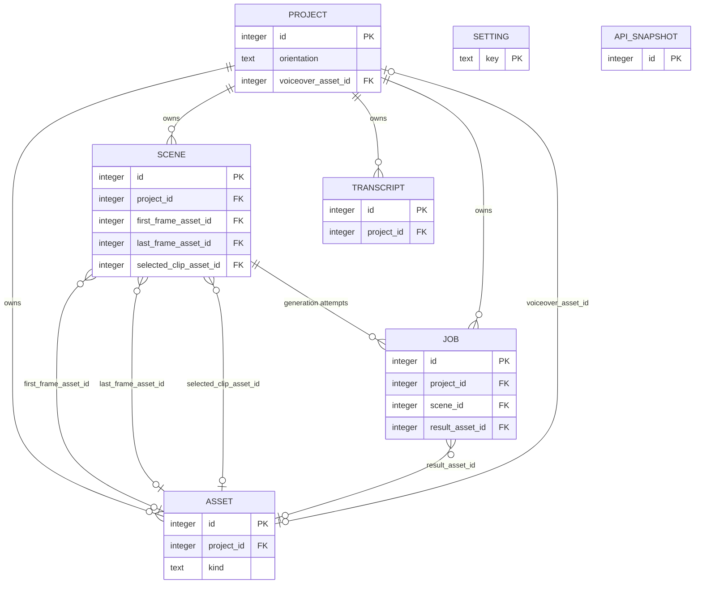

# Visio Studio: Database Structure

Status: Derived from `ANALYSIS.md` (originally Revision 3, now updated for Revision 4's transcription findings), specifically Section 4 ("Database and data model"), cross-referenced with Sections 3.7, 4.4, 5.1, 5.2 and 6.5 for field-level detail. No code or migrations exist yet — this document turns the "draft data model" in `ANALYSIS.md` Section 4.3 into a complete, implementable structure.

**Update (2026-10-05):** `ANALYSIS.md` Revision 4 confirmed the transcription endpoint's real response shape against the live GPU server. Section 4.3 (`transcript` table) and the JSON shapes in Section 5 below are updated accordingly — `transcript.words` now holds the whole verified response object, not a guessed-at array.

**How to read this document:** every table and field name is taken directly from `ANALYSIS.md`. Where `ANALYSIS.md` describes behaviour in prose but doesn't spell out a concrete SQL type, default, index, or constraint, I chose a simple, standard convention and marked it. **Section 8 ("Assumptions and additions beyond ANALYSIS.md") lists every one of those choices in one place** so you can confirm or correct them before anything is built. Nothing in Sections 1–7 should surprise you if you've read `ANALYSIS.md`; it's the same model, just made concrete.

---

## Contents

1. [Engine and tooling](#1-engine-and-tooling)
2. [Design principles behind the structure](#2-design-principles-behind-the-structure)
3. [Entity-relationship overview](#3-entity-relationship-overview)
4. [Tables](#4-tables)
5. [JSON column shapes](#5-json-column-shapes)
6. [Global settings stored in `setting`](#6-global-settings-stored-in-setting)
7. [How the pipeline writes to these tables](#7-how-the-pipeline-writes-to-these-tables)
8. [Assumptions and additions beyond ANALYSIS.md](#8-assumptions-and-additions-beyond-analysismd)

---

## 1. Engine and tooling

(Source: `ANALYSIS.md` Section 4.1)

- **SQLite** for iteration 1 — one file on the Docker `data` volume, no separate database container, no credentials. PostgreSQL is dropped because the reason for it (a separate worker process, and the database doubling as a job queue) no longer applies with one backend process and no queue table.
- **SQLAlchemy 2.x** for models, **Alembic** for migrations, so the code stays portable if you move to PostgreSQL later.
- **WAL mode and foreign keys** turned on (`PRAGMA journal_mode=WAL;` and `PRAGMA foreign_keys=ON;`).
- **JSON columns** (SQLAlchemy's `JSON` type) hold word timings and the exact request/response payloads sent to providers. SQLite has no native JSON storage class — these are stored as `TEXT` and serialized/validated by SQLAlchemy at the application layer.
- **Switch to PostgreSQL when:** you host it, add users, or run more than one backend process (Section 4.1). The cost is a connection-string change, running the same Alembic migrations against Postgres, and copying data.

---

## 2. Design principles behind the structure

(Source: `ANALYSIS.md` Section 4.2, "Manual-first, AI-ready")

- **An artifact is the same thing no matter who made it.** A scene description is text on the scene whether you typed it or an LLM drafted it — only a `source` field changes. A frame is an `asset` row whether you uploaded it or a model generated it.
- **Every unit of background work is a `job` row** (transcribe, plan scenes, generate a clip, render) holding its input and output, so the UI can show activity. This is the same table for manual-era and AI-era work.
- **"Ready to generate" is computed, not stored.** A scene is ready when it has a description and both frames — the backend checks this from existing columns; there's no `is_ready` flag to keep in sync.
- **There is no separate `Clip` table.** A generation attempt is a `job`, its result is an `asset`, and the `scene` points at whichever asset is the chosen take. This is what makes "regenerate" and "pick another take" work without new tables: a retake is just another `job` row producing another `asset`, and you repoint `scene.selected_clip_asset_id`.
- **Frames are assets referenced by id**, not owned exclusively by one scene, so a frame can be reused by a later scene (this is also what lets chained continuity — Section 5.7 of `ANALYSIS.md` — be added later with zero schema change: scene N+1's first frame would just point at scene N's last-frame asset).

---

## 3. Entity-relationship overview

Seven tables, all scoped under one `project` except the two global/infrastructure tables (`setting`, `api_snapshot`), which hold no `project_id` because they describe the app and the GPU server, not one video.



`SETTING` and `API_SNAPSHOT` have no edges to `PROJECT` — they are global, as described in Sections 3.7 and 6.5.

**Foreign keys, precisely** (the diagram above is a visual aid; this list is authoritative):

| From | Column | To | Nullable |
|---|---|---|---|
| `asset` | `project_id` | `project.id` | No |
| `project` | `voiceover_asset_id` | `asset.id` | Yes (until the voiceover is uploaded) |
| `transcript` | `project_id` | `project.id` | No |
| `scene` | `project_id` | `project.id` | No |
| `scene` | `first_frame_asset_id` | `asset.id` | Yes (until uploaded) |
| `scene` | `last_frame_asset_id` | `asset.id` | Yes (until uploaded) |
| `scene` | `selected_clip_asset_id` | `asset.id` | Yes (until a clip is generated) |
| `job` | `project_id` | `project.id` | No |
| `job` | `scene_id` | `scene.id` | Yes (only per-scene job types set this) |
| `job` | `result_asset_id` | `asset.id` | Yes (until the job succeeds) |

Note the one circular-looking reference: `asset.project_id` points at `project`, and `project.voiceover_asset_id` points back at `asset`. This isn't a problem in practice because of the order things happen in (Section 1 of `ANALYSIS.md`): the project row is created first with `voiceover_asset_id` left `NULL`, the voiceover file is uploaded afterwards as an `asset` row, and only then is `project.voiceover_asset_id` updated to point at it.

---

## 4. Tables

Each table below shows: its purpose, a column reference table, and illustrative SQL DDL (SQLite dialect). Model names below match the PascalCase names used in `ANALYSIS.md` Section 4.3; table names are the lowercase `snake_case` SQL identifiers I'm proposing for them (see Section 8).

### 4.1 `project`

One row per video. Holds output settings (pre-filled from orientation — Section 4.4), the project-scoped settings from Section 3.7 (scene length limits, guidelines, clip sound volume), and the script/voiceover inputs.

| Column | Type | Null | Default | Description |
|---|---|---|---|---|
| `id` | INTEGER | NOT NULL | auto | Primary key |
| `name` | TEXT | NOT NULL | — | The project's name |
| `created_at` | DATETIME | NOT NULL | now | |
| `orientation` | TEXT | NOT NULL | — | `portrait` \| `landscape` — chosen first (decision 2) |
| `gen_width` | INTEGER | NOT NULL | from orientation | Sent to LTX; multiple of 64 |
| `gen_height` | INTEGER | NOT NULL | from orientation | Sent to LTX; multiple of 64 |
| `out_width` | INTEGER | NOT NULL | from orientation | Final video width |
| `out_height` | INTEGER | NOT NULL | from orientation | Final video height |
| `fps` | INTEGER | NOT NULL | 24 | Frame rate |
| `min_scene_seconds` | REAL | NOT NULL | 2.0 | Shortest allowed scene |
| `max_scene_seconds` | REAL | NOT NULL | 6.0 | Longest allowed scene (your 5–6 s cap) |
| `style_prefix` | TEXT | NULL | blank | Guideline: style, sent as LTX's `Style:` prefix |
| `prompt_suffix` | TEXT | NULL | blank | Guideline: camera/lighting/colour/pacing, always appended |
| `negative_prompt` | TEXT | NULL | blank | Guideline: what to avoid |
| `clip_sound_volume` | REAL | NOT NULL | 0.2 | 0 = off; volume of each clip's own sound under the voiceover |
| `cut_instructions` | TEXT | NULL | blank | Extra instructions for the AI that proposes cuts |
| `script_text` | TEXT | NULL | — | Pasted in step B of the flow; `NULL` until then |
| `language` | TEXT | NOT NULL | `'en'` | Voiceover language (English-only decision) |
| `voiceover_asset_id` | INTEGER, FK → `asset.id` | NULL | — | Set once the voiceover is uploaded |

```sql
CREATE TABLE project (
    id                 INTEGER PRIMARY KEY,
    name               TEXT NOT NULL,
    created_at         DATETIME NOT NULL DEFAULT CURRENT_TIMESTAMP,
    orientation        TEXT NOT NULL CHECK (orientation IN ('portrait', 'landscape')),
    gen_width          INTEGER NOT NULL,
    gen_height         INTEGER NOT NULL,
    out_width          INTEGER NOT NULL,
    out_height         INTEGER NOT NULL,
    fps                INTEGER NOT NULL DEFAULT 24,
    min_scene_seconds  REAL NOT NULL DEFAULT 2.0,
    max_scene_seconds  REAL NOT NULL DEFAULT 6.0,
    style_prefix       TEXT,
    prompt_suffix      TEXT,
    negative_prompt    TEXT,
    clip_sound_volume  REAL NOT NULL DEFAULT 0.2,
    cut_instructions   TEXT,
    script_text        TEXT,
    language           TEXT NOT NULL DEFAULT 'en',
    voiceover_asset_id INTEGER REFERENCES asset(id) ON DELETE SET NULL
);
```

### 4.2 `asset`

Any file on disk — uploaded or generated. Covers the voiceover, every frame, every generated clip, and the final render. (Source: Section 4.2 and 4.3.)

| Column | Type | Null | Default | Description |
|---|---|---|---|---|
| `id` | INTEGER | NOT NULL | auto | Primary key |
| `project_id` | INTEGER, FK → `project.id` | NOT NULL | — | Owning project |
| `kind` | TEXT | NOT NULL | — | `voiceover` \| `frame` \| `clip` \| `final` |
| `path` | TEXT | NOT NULL | — | Server-generated (UUID) path on the `data` volume |
| `mime` | TEXT | NOT NULL | — | MIME type |
| `size_bytes` | INTEGER | NOT NULL | — | File size |
| `duration_s` | REAL | NULL | — | Audio/video kinds only |
| `width` | INTEGER | NULL | — | Image/video kinds only |
| `height` | INTEGER | NULL | — | Image/video kinds only |
| `sha256` | TEXT | NOT NULL | — | Content hash |
| `source` | TEXT | NOT NULL | — | `upload` \| `ai` \| `derived` |
| `provenance` | JSON | NULL | empty | provider/model/prompt/seed — empty for uploads |
| `created_at` | DATETIME | NOT NULL | now | |

```sql
CREATE TABLE asset (
    id          INTEGER PRIMARY KEY,
    project_id  INTEGER NOT NULL REFERENCES project(id) ON DELETE CASCADE,
    kind        TEXT NOT NULL CHECK (kind IN ('voiceover', 'frame', 'clip', 'final')),
    path        TEXT NOT NULL,
    mime        TEXT NOT NULL,
    size_bytes  INTEGER NOT NULL,
    duration_s  REAL,
    width       INTEGER,
    height      INTEGER,
    sha256      TEXT NOT NULL,
    source      TEXT NOT NULL CHECK (source IN ('upload', 'ai', 'derived')),
    provenance  JSON,
    created_at  DATETIME NOT NULL DEFAULT CURRENT_TIMESTAMP
);
```

### 4.3 `transcript`

Word times from the transcription endpoint, plus those same times matched onto your script. Replaces what Revision 1 called "Alignment." (Source: `ANALYSIS.md` Section 4.3 and 5.1, Revision 4.)

**Update (Revision 4 of `ANALYSIS.md`):** the transcription endpoint is now live — `POST /v1/parakeet/transcribe` on your GPU server — and its real response shape is confirmed, not a draft. It returns more than a bare word list: a full transcript string, per-word *and* per-segment timestamps, and timing metadata. The `words` column below now holds that whole object verbatim (still satisfying "raw endpoint output, exactly as returned"), not just an extracted array. See Section 5 for the exact shape.

| Column | Type | Null | Default | Description |
|---|---|---|---|---|
| `id` | INTEGER | NOT NULL | auto | Primary key |
| `project_id` | INTEGER, FK → `project.id` | NOT NULL | — | Owning project |
| `provider` | TEXT | NOT NULL | — | Which transcription endpoint produced this, e.g. `"parakeet"` |
| `language` | TEXT | NOT NULL | — | The language you expect the voiceover to be in (e.g. `"en"`), used only for your own records and any future matching logic. **Not sent to the endpoint** — Parakeet auto-detects among 25 languages and has no `language` request field. |
| `words` | JSON | NOT NULL | — | The endpoint's raw response, exactly as returned: `{transcription, processing_time, word_timestamps, segment_timestamps, metadata}` — see Section 5 |
| `script_words` | JSON | NOT NULL | — | Script words with matched times, built from `words.word_timestamps`: `[{index, word, start, end, matched}]` |
| `created_at` | DATETIME | NOT NULL | now | |

```sql
CREATE TABLE transcript (
    id           INTEGER PRIMARY KEY,
    project_id   INTEGER NOT NULL REFERENCES project(id) ON DELETE CASCADE,
    provider     TEXT NOT NULL,
    language     TEXT NOT NULL,
    words        JSON NOT NULL,
    script_words JSON NOT NULL,
    created_at   DATETIME NOT NULL DEFAULT CURRENT_TIMESTAMP
);
```

### 4.4 `scene`

One cut = one clip (called "Segment" in Revision 1 of `ANALYSIS.md`). The central table: it accumulates the cut timing, the description, both anchor frames, and the chosen take. (Source: Section 4.3, 5.2, 5.7.)

| Column | Type | Null | Default | Description |
|---|---|---|---|---|
| `id` | INTEGER | NOT NULL | auto | Primary key |
| `project_id` | INTEGER, FK → `project.id` | NOT NULL | — | Owning project |
| `index` | INTEGER | NOT NULL | — | Order within the project |
| `start_s` | REAL | NOT NULL | — | Start time in the voiceover |
| `end_s` | REAL | NOT NULL | — | End time in the voiceover |
| `text` | TEXT | NOT NULL | — | This scene's slice of the script |
| `cut_source` | TEXT | NOT NULL | — | `ai` \| `rule` \| `manual` — who placed the cut that ends this scene |
| `cut_note` | TEXT | NULL | — | Why it needs a look, if it does |
| `scene_description` | TEXT | NULL | — | What happens in the scene |
| `scene_description_source` | TEXT | NULL | — | `manual` \| `ai` |
| `first_frame_asset_id` | INTEGER, FK → `asset.id` | NULL | — | |
| `last_frame_asset_id` | INTEGER, FK → `asset.id` | NULL | — | |
| `use_clip_sound` | BOOLEAN | NOT NULL | true | Per-scene switch; false mutes this scene's own sound |
| `selected_clip_asset_id` | INTEGER, FK → `asset.id` | NULL | — | Which generated take is used in the final render |

```sql
CREATE TABLE scene (
    id                        INTEGER PRIMARY KEY,
    project_id                INTEGER NOT NULL REFERENCES project(id) ON DELETE CASCADE,
    "index"                   INTEGER NOT NULL,
    start_s                   REAL NOT NULL,
    end_s                     REAL NOT NULL,
    text                      TEXT NOT NULL,
    cut_source                TEXT NOT NULL CHECK (cut_source IN ('ai', 'rule', 'manual')),
    cut_note                  TEXT,
    scene_description         TEXT,
    scene_description_source  TEXT CHECK (scene_description_source IN ('manual', 'ai')),
    first_frame_asset_id      INTEGER REFERENCES asset(id) ON DELETE SET NULL,
    last_frame_asset_id       INTEGER REFERENCES asset(id) ON DELETE SET NULL,
    use_clip_sound            BOOLEAN NOT NULL DEFAULT 1,
    selected_clip_asset_id    INTEGER REFERENCES asset(id) ON DELETE SET NULL,
    UNIQUE (project_id, "index")
);
```

Scene readiness ("description plus both frames present") is **computed** by the backend from these columns at read time — there is deliberately no `is_ready` column (Section 4.2 and 4.3's design notes).

### 4.5 `job`

Every unit of background work: transcribe, plan scenes, generate a clip, render the final video. This is where running-job information lives, so a restart never loses track of a 5–10 minute GPU job. (Source: Section 3.3, 4.2, 4.3.)

| Column | Type | Null | Default | Description |
|---|---|---|---|---|
| `id` | INTEGER | NOT NULL | auto | Primary key |
| `project_id` | INTEGER, FK → `project.id` | NOT NULL | — | Owning project |
| `scene_id` | INTEGER, FK → `scene.id` | NULL | — | Set only for per-scene jobs (`generate_clip`) |
| `type` | TEXT | NOT NULL | — | `transcribe` \| `plan_scenes` \| `generate_clip` \| `render_final` |
| `status` | TEXT | NOT NULL | `'queued'` | `queued` \| `running` \| `succeeded` \| `failed` \| `cancelled` |
| `phase` | TEXT | NULL | — | Free-text UI label, e.g. "queued on cluster" |
| `provider` | TEXT | NOT NULL | — | `gpu` \| `llm` \| `local` |
| `provider_job_id` | TEXT | NULL | — | The external server's job id, once submitted |
| `input` | JSON | NOT NULL | — | Exact request sent: prompt, seed, server URL, etc. |
| `output` | JSON | NULL | — | Raw provider answer (LLM JSON, token usage, etc.) |
| `result_asset_id` | INTEGER, FK → `asset.id` | NULL | — | Set on success |
| `attempt` | INTEGER | NOT NULL | 1 | Retry counter |
| `error` | TEXT | NULL | — | The server's error text, if failed |
| `created_at` | DATETIME | NOT NULL | now | |
| `started_at` | DATETIME | NULL | — | |
| `finished_at` | DATETIME | NULL | — | |
| `last_checked_at` | DATETIME | NULL | — | Last time the dispatcher polled this job |

```sql
CREATE TABLE job (
    id               INTEGER PRIMARY KEY,
    project_id       INTEGER NOT NULL REFERENCES project(id) ON DELETE CASCADE,
    scene_id         INTEGER REFERENCES scene(id) ON DELETE CASCADE,
    type             TEXT NOT NULL CHECK (type IN ('transcribe', 'plan_scenes', 'generate_clip', 'render_final')),
    status           TEXT NOT NULL DEFAULT 'queued'
                       CHECK (status IN ('queued', 'running', 'succeeded', 'failed', 'cancelled')),
    phase            TEXT,
    provider         TEXT NOT NULL CHECK (provider IN ('gpu', 'llm', 'local')),
    provider_job_id  TEXT,
    input            JSON NOT NULL,
    output           JSON,
    result_asset_id  INTEGER REFERENCES asset(id) ON DELETE SET NULL,
    attempt          INTEGER NOT NULL DEFAULT 1,
    error            TEXT,
    created_at       DATETIME NOT NULL DEFAULT CURRENT_TIMESTAMP,
    started_at       DATETIME,
    finished_at      DATETIME,
    last_checked_at  DATETIME
);
```

The dispatcher loop (Section 3.3) is the main reader/writer of this table: each tick it checks every `running` job, starts downloads for finished ones, resubmits pre-empted ones, and starts `queued` jobs while fewer than the parallel-generation setting are `running`.

### 4.6 `setting`

Global settings edited in the UI (Section 3.7) — a simple key/value table. **Project-scoped** settings (scene length limits, guidelines, clip sound volume) are **not** stored here; they live as columns directly on `project` (Section 4.1 above) and `scene.use_clip_sound`. See Section 6 below for exactly which keys live in this table.

| Column | Type | Null | Default | Description |
|---|---|---|---|---|
| `key` | TEXT | NOT NULL (PK) | — | e.g. `gpu_api_base_url` |
| `value` | JSON | NOT NULL | — | The setting's value |
| `updated_at` | DATETIME | NOT NULL | now | |

```sql
CREATE TABLE setting (
    key        TEXT PRIMARY KEY,
    value      JSON NOT NULL,
    updated_at DATETIME NOT NULL DEFAULT CURRENT_TIMESTAMP
);
```

### 4.7 `api_snapshot`

The recorded GPU API contract (Section 6.5) — the guide, the OpenAPI spec, and any other swagger document you add. Checked before every submission so a server update can't silently change what gets sent.

| Column | Type | Null | Default | Description |
|---|---|---|---|---|
| `id` | INTEGER | NOT NULL | auto | Primary key |
| `source` | TEXT | NOT NULL | — | `guide` \| `openapi` \| a custom name you add |
| `url` | TEXT | NOT NULL | — | Path relative to the server URL (so a new tunnel address doesn't invalidate it) |
| `fetched_at` | DATETIME | NOT NULL | now | |
| `fingerprint` | TEXT | NOT NULL | — | The document's `content_hash` if present, else SHA-256 of the canonical JSON |
| `server_content_hash` | TEXT | NULL | — | The server's own hash field, if the document has one |
| `api_version` | TEXT | NULL | — | Version string from the guide, if present |
| `body` | JSON | NOT NULL | — | The fetched document |
| `state` | TEXT | NOT NULL | `'pending'` | `approved` \| `pending` |
| `approved_at` | DATETIME | NULL | — | Set when you click Approve |

```sql
CREATE TABLE api_snapshot (
    id                  INTEGER PRIMARY KEY,
    source              TEXT NOT NULL,
    url                 TEXT NOT NULL,
    fetched_at          DATETIME NOT NULL DEFAULT CURRENT_TIMESTAMP,
    fingerprint         TEXT NOT NULL,
    server_content_hash TEXT,
    api_version         TEXT,
    body                JSON NOT NULL,
    state               TEXT NOT NULL DEFAULT 'pending' CHECK (state IN ('approved', 'pending')),
    approved_at         DATETIME
);
```

Older snapshots are kept as history (Section 6.5: "Older versions stay as history") — rows are never overwritten, only inserted. To find the current baseline for a source, read the most recently **approved** row for that `source`, ordered by `fetched_at`.

### Recommended indexes

Not specified explicitly in `ANALYSIS.md`, but implied by the access patterns it describes (the dispatcher repeatedly scanning jobs by status/type — Section 3.3; scenes read in order — Section 4.3):

```sql
CREATE INDEX idx_asset_project       ON asset (project_id);
CREATE INDEX idx_transcript_project  ON transcript (project_id);
CREATE INDEX idx_scene_project       ON scene (project_id);
CREATE INDEX idx_job_project         ON job (project_id);
CREATE INDEX idx_job_scene           ON job (scene_id);
CREATE INDEX idx_job_status          ON job (status);
CREATE INDEX idx_job_type_status     ON job (type, status);
CREATE INDEX idx_api_snapshot_source ON api_snapshot (source, fetched_at);
```

---

## 5. JSON column shapes

### `transcript.words` — exactly as the transcription endpoint returns it (`ANALYSIS.md` Section 5.1, confirmed live against the real `POST /v1/parakeet/transcribe` response on 2026-10-05)

```json
{
  "transcription": "Welcome to the show.",
  "processing_time": 4.12,
  "word_timestamps": [
    { "word": "Welcome", "start": 0.00, "end": 0.48 },
    { "word": "to",      "start": 0.48, "end": 0.62 }
  ],
  "segment_timestamps": [
    { "text": "Welcome to the show.", "start": 0.00, "end": 1.20, "word_count": 4 }
  ],
  "metadata": { "total_segments": 1, "total_words": 4, "duration": 1.20 }
}
```

This is the whole object the endpoint returns, stored as-is. `word_timestamps` is what the matching step (below) reads; `segment_timestamps`, `transcription` and `metadata` are kept too, in case the scene-cut step (`ANALYSIS.md` Section 5.2) finds the segment boundaries useful as an extra signal, or for debugging a mismatch against the script.

### `transcript.script_words` — your script's words after matching (Section 5.1)

```json
[
  { "index": 0, "word": "Welcome", "start": 0.00, "end": 0.48, "matched": true },
  { "index": 1, "word": "to",      "start": 0.48, "end": 0.62, "matched": true }
]
```

### `job.output` for a `plan_scenes` job — the LLM's raw answer (Section 5.2, verbatim)

```json
{
  "scenes": [
    { "last_word": 57, "words_before_cut": "the lazy dog", "words_after_cut": "Then the fox" }
  ]
}
```

### `asset.provenance` — for AI-derived assets only; empty for uploads (Section 4.3)

```json
{
  "provider": "bitdeer",
  "model": "seedream-5.0-lite",
  "prompt": "a lighthouse at sunset, cinematic-realistic style",
  "seed": 12345
}
```

### `job.input` for a `generate_clip` job — illustrative only

`ANALYSIS.md` Section 5.3–5.4 describes the contents in prose ("the exact request sent, including final prompt, seed and server URL") but doesn't give a literal JSON shape. A reasonable shape:

```json
{
  "server_url": "http://host.docker.internal:8012",
  "endpoint": "/v1/ltx/videos/keyframe-interpolation",
  "first_frame_asset_id": 41,
  "last_frame_asset_id": 42,
  "prompt": "Style: cinematic-realistic. A lighthouse beam sweeps slowly across a calm night sea, static camera, soft warm light, muted palette",
  "negative_prompt": "blurry, low quality, extra fingers, text, watermark, speech, talking, voices, singing",
  "num_frames": 129,
  "fps": 24,
  "width": 1920,
  "height": 1088,
  "seed": 987654
}
```

---

## 6. Global settings stored in `setting`

(Source: Section 3.7.) Only the **globally** scoped rows from that section's table belong here. The **project**-scoped ones are columns on `project` (Section 4.1) or `scene` (Section 4.4), not rows here.

| `key` | Example `value` | Default |
|---|---|---|
| `gpu_api_base_url` | `"http://host.docker.internal:8012"` | first-run default from `GPU_API_BASE_URL` env var |
| `transcription_url` | `""` | blank = same as `gpu_api_base_url` |
| `gpu_partition` | `""` | blank = cluster default |
| `llm_base_url` | `"https://api-inference.bitdeer.ai/v1"` | from `BITDEEP_BASE_URL` env var |
| `llm_model` | `"zai-org/GLM-5.3-Flash"` | |
| `max_parallel_generations` | `4` | |
| `poll_interval_seconds` | `15` | |
| `max_parallel_ffmpeg` | `1` | |
| `api_contract_sources` | `["guide", "openapi"]` | |

Precedence, per Section 3.7: a value saved here wins; if no row exists for a key, the backend falls back to the matching environment variable (first-run default); if neither exists, a built-in default. Secrets (`BITDEEP_API_KEY`) are **never** stored in this table — they stay in `.env` only, per Section 3.7's rule that secrets stay out of the UI entirely.

**Internal rows (added in Phase 2).** The table also holds rows the app writes for itself. They are not settings: the settings API never lists, saves or resets them, and they are not in the table above. They live in the same table so that remembered state needs no new table or migration. The code lists them in `INTERNAL_KEYS` (`backend/app/core/settings.py`), and a new one must be added there.

| `key` | `value` | Written by |
|---|---|---|
| `gpu_connection_last_test` | `{reachable, called_url, elapsed_ms, http_status, default_partition, error, checked_at}` — the last GPU server connection test. `called_url` is the address after Docker mapping. The result counts only while it matches the address that would be called now, so a test of an old URL never stands in for the current one. | The Test connection button (Phase 2), through `app/services/gpu_status.py`. Phase 4's banner reads it, and later phases (the contract guard, the dispatcher) may write it through the same module (ANALYSIS.md Section 3.3, "Keeps the DB current"). |

---

## 7. How the pipeline writes to these tables

Mapping the flow in `ANALYSIS.md` Section 1 onto table writes, so the structure's fit with the actual workflow is traceable step by step:

| Step (Section 1 flow) | Tables touched |
|---|---|
| Create project, pick orientation | `INSERT project` (orientation + size/fps/scene-length/volume defaults filled in per Section 4.4) |
| Upload voiceover, paste script | `INSERT asset` (`kind='voiceover'`) → `UPDATE project.voiceover_asset_id`, `UPDATE project.script_text` |
| Transcribe audio, match to script | `INSERT job` (`type='transcribe'`) → on success, `INSERT transcript` (`words`, `script_words`) |
| AI picks cut words, code times them | `INSERT job` (`type='plan_scenes'`, raw LLM answer saved to `job.output`) → on success, `INSERT scene` rows, one per cut (`cut_source`/`cut_note` set) |
| Review and adjust cuts (human checkpoint) | Direct `UPDATE` / `INSERT` / `DELETE` on `scene` rows; an edit you make sets `cut_source='manual'` |
| Per scene: description, first/last frame | `UPDATE scene.scene_description` (+ `scene_description_source`); `INSERT asset` (`kind='frame'`) then `UPDATE scene.first_frame_asset_id` / `last_frame_asset_id` |
| Generate one clip per scene | `INSERT job` (`type='generate_clip'`, `scene_id=<scene>`) → dispatcher updates `status`/`phase`/`provider_job_id` over time → on success, `INSERT asset` (`kind='clip'`), `UPDATE job.result_asset_id`, `UPDATE scene.selected_clip_asset_id` |
| Preview clips, regenerate or mute (human checkpoint) | Regenerate: another `job` + `asset` row, `scene.selected_clip_asset_id` repointed. Mute: `UPDATE scene.use_clip_sound = false` |
| Trim, join, mix, render final video | `INSERT job` (`type='render_final'`) → on success, `INSERT asset` (`kind='final'`) |

Throughout, the **GPU API contract guard** (Section 6.5) reads/writes `api_snapshot` independently of any one project, and the **Settings page** (Section 3.7) reads/writes `setting` independently of any one project.

---

## 8. Assumptions and additions beyond ANALYSIS.md

`ANALYSIS.md` Section 4.3 gives field names and a one-line purpose for each; it does not specify SQL-level detail. Everything below is my addition to make the model concrete, listed here instead of buried silently in the tables above, so you can tell what's sourced versus what's a convention I picked:

1. **Primary keys:** plain `INTEGER PRIMARY KEY` (SQLite rowid) on every table except `setting` (keyed by `key`). This is the simplest option for a single-file SQLite database. `ANALYSIS.md` only mentions UUIDs for on-disk **file names** (Section 3.5), not database primary keys.
2. **Table names:** lowercase `snake_case`, singular (`project`, `asset`, `scene`, `job`, `transcript`, `setting`, `api_snapshot`), mapped from the PascalCase model names in `ANALYSIS.md`.
3. **Cascade rules:** `ON DELETE CASCADE` from `project` to its owned rows (`asset`, `transcript`, `scene`, `job`), and `ON DELETE SET NULL` for the optional asset references on `scene` and `job` (so deleting one asset doesn't delete a whole scene). `ANALYSIS.md` doesn't state delete behaviour anywhere; this is a reasonable default, not a documented rule.
4. **Indexes** beyond the primary/foreign keys (Section 4, "Recommended indexes") are my suggestions based on the dispatcher's described access patterns (Section 3.3), not a list given in `ANALYSIS.md`.
5. **`job.input` / `job.output` JSON shapes** for job types other than `plan_scenes` are illustrative sketches (Section 5 above). Only the `plan_scenes` output shape and, as of 2026-10-05, the `transcript.words` shape are verbatim-verified against a real server response (`ANALYSIS.md` Section 5.2 and 5.1 respectively); the rest are my reasonable fill-ins consistent with the prose description and should be treated as a starting point, not a spec.
6. **`scene.index`** is assumed zero-based and contiguous per project; `ANALYSIS.md` doesn't state the numbering convention explicitly.
7. **`project.language` default `'en'`** reflects the English-only decision (Revision 3 decisions table) but isn't given as a literal column default in `ANALYSIS.md`.
8. **Timestamp population** (`DEFAULT CURRENT_TIMESTAMP`) is a SQLite/SQLAlchemy convention I chose; `ANALYSIS.md` doesn't describe how timestamp columns get their values.
9. **`CHECK` constraints** for the enum-like fields (`kind`, `source`, `status`, `type`, `provider`, `cut_source`, `scene_description_source`, `state`) enforce exactly the allowed values listed in `ANALYSIS.md` Section 4.3 — these values are sourced, the `CHECK` mechanism itself is my addition for data integrity at the database level (SQLite has no native enum type).

None of the above requires a different design — they're implementation choices within the model `ANALYSIS.md` already settled on. If you'd prefer different choices (e.g., UUID primary keys, plural table names, no `CHECK` constraints), they're easy to change before any migration is written, since no code exists yet.
