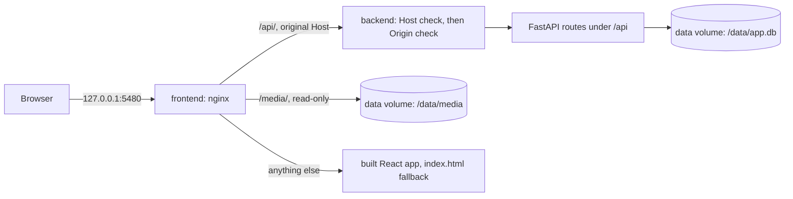

# Phase 1: Foundation (Visio Studio, iteration 1)

## 1. Goal and outcome

One command (`docker compose up --build -d`) starts two healthy containers: `frontend` (nginx serving the built React app) and `backend` (FastAPI, one uvicorn worker). They share the named volume `data`. When done:

- `http://127.0.0.1:5480` shows the app shell: placeholder Projects, Activity and Settings pages, a Refresh button, and a backend status read from `GET /api/health`.
- SQLite on the volume holds all seven tables, the CHECK constraints and the indexes from DB Section 4. One Alembic migration creates them, and it runs at backend start. Every connection sets WAL, foreign keys and a busy timeout.
- The security baseline is active: the Host check, the Origin check, no CORS, and JSON-only bodies.
- The conventions later phases follow are fixed here and recorded in the phase log. There are no features.



## 2. Findings (read-only checks, 2026-10-05)

**Workspace and machine**
- The folder holds only the three documents and `.env`. There is no git repository, no code and no `plans/` folder.
- `.env` defines only `BITDEEP_API_KEY`. Only the names were read, never the values.
- Port 5480 has no listener and no container on it. Port 8000 on the Mac belongs to Cursor, so a check must never curl `127.0.0.1:8000`.
- Docker 28.1.1 runs on linux/arm64 with Compose 2.35.1. No `visionpsy*` volume exists yet.
- Tools on the Mac: Node 24.1.0, npm 11.4.1, uv 0.12.5, Python 3.13.7. The phase log is empty.

**Base images** (all have native linux/arm64 builds)
- `python:3.13-slim` is `3.13-slim-trixie` (Debian 13) with Python 3.13.16. Trixie's FFmpeg is 7.1.5, so the app runs FFmpeg 7.1.x (the Mac has 8.0).
- Also current: `nginx:1.30-alpine` (stable 1.30.5), `node:24-slim` (24.21.0) and `ghcr.io/astral-sh/uv:0.12.23`.

**Current stable versions**
- Backend: fastapi 0.142.2 (on Starlette 1.7.0), uvicorn 0.54.0, sqlalchemy 2.1.3, alembic 1.20.0, aiosqlite 0.22.1, ruff 0.16.10.
- Frontend runtime: react and react-dom 19.3.0, vite 8.3.2, @vitejs/plugin-react 6.1.2, react-router 8.4.0, @tanstack/react-query 5.104.1, openapi-fetch 0.17.0, @mantine/core and @mantine/hooks 9.7.0.
- Frontend tooling: openapi-typescript 7.13.0, eslint 10.12.0, @eslint/js 10.0.1, typescript-eslint 8.71.0, eslint-plugin-react-hooks 7.1.1, eslint-plugin-react-refresh 0.5.7, globals 17.13.0, postcss 8.5.29, postcss-preset-mantine 1.18.0, postcss-simple-vars 7.0.1.
- TypeScript: the latest release is 7.0.2, and 5.9.3 is the newest 5.x. openapi-typescript 7.13 only accepts `typescript ^5.x`, and typescript-eslint only accepts versions below 6.1.0.

**How these versions behave**
- **FastAPI 0.142 defaults to `strict_content_type=True`.** For an endpoint with a JSON body, FastAPI parses the body only when the Content-Type is `application/json` or ends in `+json`. Any other type, or no Content-Type at all, fails validation with 422. That already gives "JSON endpoints accept only JSON".
- **Starlette 1.7 still ships `TrustedHostMiddleware`.** It strips the port before comparing, and a bad Host gets 400 "Invalid host header".
- **SQLAlchemy 2.1 no longer installs `greenlet`.** Use the `sqlalchemy[aiosqlite]` extra. The docs recommend `await engine.dispose()` on shutdown.
- **React Router 8 removed `react-router-dom`.** Import `RouterProvider` from `react-router/dom` and everything else from `react-router`. It is ESM-only and needs Node 22.22 or newer and React 19.2.7 or newer.
- **The current Vite template (create-vite 9.2.1) does not fit Section 4.3 as it is.** Its react-ts template ships TypeScript 6.0 and oxlint instead of ESLint, and its tsconfig has no `strict`. The last template with ESLint, create-vite 9.0.7, used ESLint 10 with the flat config reused below.
- **Mantine 9 on Vite needs a little setup.** Install `@mantine/core` and `@mantine/hooks`, add a `postcss.config.cjs` with `postcss-preset-mantine` and `postcss-simple-vars`, import `@mantine/core/styles.css`, and wrap the app in `MantineProvider`.

**[VERIFY] items**
- **Host and Origin checks through nginx:** acceptance check 4 covers them, with control requests that must pass.
- **WAL and foreign keys:** `/api/health` reads them through the app's engine (check 5).
- **arm64:** every base image has an arm64 build. Check 9 inspects the built images.

## 3. Decisions (items marked YOUR APPROVAL need your OK)

**Data and storage**
- **Database access:** async SQLAlchemy 2.1 with aiosqlite in the app, because the Phase 5 dispatcher lives in the event loop. Alembic uses the plain `sqlite://` driver.
- **Volume layout:** the database is `/data/app.db` (plus its `-wal` and `-shm` files), and media goes to `/data/media/<project_id>/<uuid>.<ext>`. nginx serves only `/data/media/`, so the database file is never reachable over HTTP.
- **Circular foreign key:** both foreign keys are written inside `CREATE TABLE`. The one on `project.voiceover_asset_id` gets `use_alter=True` and a name, which tells SQLAlchemy the cycle is intended. SQLite has no ALTER for constraints, so SQLAlchemy still writes it inline. The migration creates `project` before `asset`; SQLite allows that forward reference and only enforces foreign keys on writes.
- **Non-root backend:** the backend runs as user `app` (uid and gid 10001). The image creates `/data` owned by `app`, so the new named volume takes that ownership. Files are 0644 and folders 0755, so nginx can read media through its read-only mount.
- **Migrations at start:** an entrypoint script runs `alembic upgrade head`, then `exec uvicorn app.main:app --host 0.0.0.0 --port 8000 --workers 1`.
- **Alembic connection:** it keeps `foreign_keys` off, which is SQLite's default. Later batch migrations drop and recreate tables, and with foreign keys on, that could fire `ON DELETE CASCADE`. `env.py` sets `render_as_batch=True`.
- **Per-connection settings:** a `connect` event on the app's engine runs `PRAGMA foreign_keys=ON`, `busy_timeout=5000` and `journal_mode=WAL` on every connection.
- **Times:** a `UTCDateTime` column type stores naive UTC and returns timezone-aware UTC, with a `utcnow()` helper. Each column with a database default also gets the same Python-side `default=`, so the value is known right after a flush; under async, a lazy reload would fail.
- **YOUR APPROVAL – constraint names:** the metadata gets a naming convention for `pk_`, `fk_`, `uq_`, `ck_` and `ix_` names, so later SQLite batch migrations can refer to constraints by name. The structure stays exactly as in DB Section 4, and the 8 `idx_*` index names are kept.
- **Nullable JSON columns** (`asset.provenance`, `job.output`) use `JSON(none_as_null=True)`. Without it, `None` is stored as the JSON text `null` instead of SQL NULL.
- **No ORM `relationship()` yet:** the models have foreign key columns only. A later phase that adds one uses `lazy="raise"` and loads it explicitly.

**Security**
- **Middleware:** `TrustedHostMiddleware(allowed_hosts=["localhost", "127.0.0.1"], www_redirect=False)` runs outermost. Inside it, a small `OriginCheckMiddleware` handles every method except GET, HEAD and OPTIONS: if an `Origin` header is present and its host and port differ from the `Host` header, it answers 403 with a `detail` message.
- **JSON only:** this comes from FastAPI's default `strict_content_type=True`, which is never turned off. There is no CORS middleware.
- **YOUR APPROVAL – Host check scope:** the check applies to `/api` only, because it lives in the backend. nginx serves the static bundle and `/media/` for any Host. That is acceptable because the bundle is public, media files have random UUID names that only the API reveals, and nginx lists no directories.

**Containers and nginx**
- **Backend address:** nginx looks up `backend` per request through Docker's DNS (`resolver 127.0.0.11` with a variable in `proxy_pass`). A recreated backend container can get a new IP address, and this keeps the proxy working.
- **Redirects:** `absolute_redirect off`, because nginx listens on port 80 but is published on 5480. Absolute redirects would point at the wrong port.
- **YOUR APPROVAL – upload limit:** `client_max_body_size 512m` on `/api/` only. A 15-minute 48 kHz stereo WAV is about 170 MB at 16-bit and about 350 MB at 32-bit float. Phase 3 sets the app's own limit at or below this.
- **YOUR APPROVAL – project name:** Compose pins `name: visio-studio`, so the volume is always `visio-studio_data`, even if the folder is renamed.
- **YOUR APPROVAL – port:** published as `127.0.0.1:${APP_PORT:-5480}:80`. `APP_PORT` is added to `.env.example` (Added here); the other three names come from Section 3.1.
- **Secrets:** they reach only the backend, through `env_file: .env`. Phase 1 reads none of them. Phase 2's settings registry will, and must treat a blank value as unset.
- **Healthchecks:** the backend uses Python's `urllib` (the slim image has no curl) against `http://127.0.0.1:8000/api/health`. The frontend uses busybox `wget` against `http://127.0.0.1/`, not `localhost`, which can resolve to IPv6 where nginx does not listen.
- **Restart and order:** both services restart `unless-stopped`, and the frontend waits for the backend to be healthy.
- **`GET /api/health`:** returns 200 when the database, FFmpeg and ffprobe are all OK, and otherwise 503 with the same body; both are documented in OpenAPI. The FFmpeg and ffprobe versions are read once at startup, in `app/services/ffmpeg.py`, which Phase 3 grows into the full wrapper.

**Frontend**
- **UI library:** Mantine 9 (your choice). Only `@mantine/core` and `@mantine/hooks` now; later phases add form, notifications, modals and dropzone when they need them.
- **Route map:** `/` redirects to `/projects`. `/projects`, `/settings` and `/activity` are placeholders, and any other path shows Not found. `/projects/:id` and `/projects/:id/settings` are reserved for Phase 3.
- **YOUR APPROVAL – TypeScript `~5.9.3`,** not 7.0 or the template's 6.0, because openapi-typescript and typescript-eslint do not accept newer versions yet.
- **ESLint 10** with a flat config, replacing the template's oxlint, as Section 4.3 requires. The frontend files are written by hand from the template contents; `npm create vite` would prompt, and would add demo files and oxlint.
- **Data fetching:** TanStack Query with `retry: 1` and `refetchOnWindowFocus: true`, so returning to the tab refreshes. `refetchInterval` is never set. The Refresh button calls `queryClient.invalidateQueries()` and uses `useIsFetching()` for its spinner.

## 4. Changes

### Database
One migration, `backend/app/db/migrations/versions/0001_initial_schema.py`, creates the seven tables exactly as DB Section 4 describes:
- the column types (INTEGER, TEXT, REAL, BOOLEAN, DATETIME, JSON), NOT NULL and the defaults;
- 10 CHECK constraints, `UNIQUE (project_id, "index")` and 10 foreign keys with the ON DELETE rules from DB Section 8, item 3;
- the 8 `idx_*` indexes, plain `INTEGER PRIMARY KEY` without AUTOINCREMENT, and `setting.key TEXT PRIMARY KEY`.

The executor generates it with autogenerate, then reviews it by hand:
- Every foreign key and CHECK must be inside `op.create_table`, because SQLite cannot run `op.create_foreign_key`.
- `UTCDateTime` columns are written as `sa.DateTime()`, so migrations never import app code.

### Backend (`backend/`, Section 7 layout)
- **Project files:** `pyproject.toml` managed by uv, `.python-version` set to 3.13, and `uv.lock`. Ruff config: `select = ["E", "F", "W", "I", "UP", "B"]`, line length 100, target py313.
- **`app/main.py`:** `create_app() -> FastAPI` and `app = create_app()`.
  - Docs at `/api/docs` and OpenAPI at `/api/openapi.json`, with `redoc_url=None` and `swagger_ui_oauth2_redirect_url=None`.
  - `middleware=[TrustedHost, OriginCheck]`; the first entry is the outermost.
  - Lifespan: create `/data/media`, read the tool versions into `app.state`, and dispose the engine on shutdown.
- **API package:** `app/api/__init__.py` holds `api_router = APIRouter(prefix="/api")`, and `app/api/health.py` holds its `router` and `HealthResponse`.
- **`app/core/config.py`:** a frozen dataclass `AppConfig` and `get_config()`.
  - Reads `DATA_DIR` (default `/data`) and `LOG_LEVEL` (default `INFO`); a blank value counts as unset.
  - Properties `db_path`, `media_dir`, `async_database_url` and `sync_database_url`.
- **`app/core/logging.py`:** `configure_logging(level: str) -> None`, logging to stdout. **`app/core/security.py`:** `OriginCheckMiddleware`, a plain ASGI middleware.
- **Database package:**
  - `app/db/base.py`: `Base`, with the naming convention and `type_annotation_map = {str: Text, float: REAL, datetime: UTCDateTime}`.
  - `app/db/types.py` (`UTCDateTime`, `utcnow`) and `app/db/models.py` (the seven models).
  - `app/db/session.py`: `engine`, the PRAGMA listener, `SessionLocal = async_sessionmaker(engine, expire_on_commit=False)`, `get_session()` and `SessionDep`. `models.py` never imports `session.py`, so running Alembic never creates the async engine.
- **Migrations:** `app/db/migrations/` and `alembic.ini`, with `script_location` set to `app/db/migrations` and no URL in the file; `env.py` takes it from `get_config().sync_database_url`.
- **`app/services/ffmpeg.py`:** `async def tool_version(tool: Literal["ffmpeg", "ffprobe"]) -> str | None`. It runs `asyncio.create_subprocess_exec` with an argument list and a 10-second timeout, and parses `ffmpeg version X ...`.
- **Empty packages** `app/jobs/` and `app/providers/`.
- **Container files:** `Dockerfile`, `docker-entrypoint.sh` and `.dockerignore`, which excludes `.env`, `.env.*`, `.venv`, `__pycache__`, `.ruff_cache` and `*.db*`.
- **Dockerfile:**
  - Start from `python:3.13-slim` and copy `/uv` from `ghcr.io/astral-sh/uv:0.12.23`.
  - Install `ffmpeg` with `apt-get install --no-install-recommends`.
  - Add the `app` user and create `/data` owned by it.
  - Set `UV_PYTHON_DOWNLOADS=never`, then `uv sync --locked --no-dev --no-install-project`.
  - End with `USER app` and `CMD ["sh", "docker-entrypoint.sh"]`.

```python
# app/db/session.py
engine = create_async_engine(get_config().async_database_url)

@event.listens_for(engine.sync_engine, "connect")
def _set_sqlite_pragmas(dbapi_connection, _record) -> None:
    cursor = dbapi_connection.cursor()
    cursor.execute("PRAGMA foreign_keys=ON")
    cursor.execute("PRAGMA busy_timeout=5000")
    cursor.execute("PRAGMA journal_mode=WAL")
    cursor.close()
```

```python
# app/db/models.py, the one cyclic foreign key
voiceover_asset_id: Mapped[int | None] = mapped_column(
    ForeignKey("asset.id", ondelete="SET NULL", use_alter=True)
)
```

```python
# app/db/types.py
class UTCDateTime(TypeDecorator[datetime]):
    impl = DateTime
    cache_ok = True

    def process_bind_param(self, value, dialect):
        if value is None:
            return None
        if value.tzinfo is None:
            raise ValueError("Naive datetime; use utcnow()")
        return value.astimezone(UTC).replace(tzinfo=None)

    def process_result_value(self, value, dialect):
        return None if value is None else value.replace(tzinfo=UTC)
```

### API
`GET /api/health` returns 200, or 503 with the same body:

```json
{"status": "ok",
 "database": {"ok": true, "journal_mode": "wal", "foreign_keys": 1, "revision": "0001"},
 "ffmpeg": {"ok": true, "version": "7.1.5-0+deb13u1"},
 "ffprobe": {"ok": true, "version": "7.1.5-0+deb13u1"}}
```

The `database` part runs `SELECT 1`, `PRAGMA journal_mode` and `PRAGMA foreign_keys`, and reads `alembic_version`, all through `SessionDep`. Other responses:
- 400 for a bad Host, as plain text from Starlette;
- 403 for a cross-origin request that changes state;
- 405 for any method other than GET.

There are no background jobs in this phase.

### Frontend (`frontend/`)
- **`package.json`** with `"type": "module"`. Scripts:
  - `build`: `tsc -b && vite build`
  - `typecheck`: `tsc -b`
  - `lint`: `eslint .`
  - `gen:api`: `openapi-typescript http://127.0.0.1:5480/api/openapi.json -o src/api/schema.d.ts`

  There is no `dev` script.
- **Config files:**
  - `tsconfig.json`, `tsconfig.app.json`, `tsconfig.node.json`, `vite.config.ts` and `index.html` from the create-vite 9.2.1 react-ts template, with `"strict": true` added to both tsconfigs and `"DOM.Iterable"` added to the app's `lib`.
  - `eslint.config.js`: the create-vite 9.0.7 config (`js`, `tseslint`, `reactHooks.configs.flat.recommended`, `reactRefresh.configs.vite`), ignoring `dist` and `src/api/schema.d.ts`.
  - `postcss.config.cjs`, as in Mantine's Vite guide.
- **App setup:** `src/main.tsx` wraps the app in `MantineProvider`, then `QueryClientProvider`, then `RouterProvider` (from `react-router/dom`), and imports `@mantine/core/styles.css`. `src/router.tsx` builds the routes with `createBrowserRouter`, a layout route and an `errorElement`; `src/queryClient.ts` holds the client.
- **API access:**
  - `src/api/client.ts`: `createClient<paths>({ baseUrl: window.location.origin })`.
  - `src/api/schema.d.ts`: generated, and committed.
  - `src/api/health.ts`: `useHealth()`. Responses 200 and 503 count as data; any other status, or a network error, is an error.
  - `src/hooks/useRefreshAll.ts`: returns `{ refresh, isRefreshing }`.
- **Components:**
  - `src/components/AppLayout.tsx`: a Mantine `AppShell` with a header (app name, `BackendStatus`, Refresh), a navbar (Projects, Activity, Settings) and `<Outlet />`.
  - `src/components/BackendStatus.tsx`: shows "Checking backend…" while loading, "Backend unreachable" on error, which part failed when degraded, and "Backend OK · FFmpeg x" when healthy.
  - `src/components/RouteError.tsx`.
- **Pages:** `ProjectsPage`, `SettingsPage` and `ActivityPage` show empty states naming the phase that fills them (3, 2 and 5); `NotFoundPage` handles any other path.
- **Container files:** `nginx.conf`, `.dockerignore` (`.env`, `.env.*`, `node_modules`, `dist`) and a two-stage `Dockerfile`. The first stage, `node:24-slim`, runs `npm ci` and `npm run build`. The second, `nginx:1.30-alpine`, serves `dist`.

```nginx
server {
    listen 80;
    server_name _;
    absolute_redirect off;
    root /usr/share/nginx/html;
    resolver 127.0.0.11 valid=10s ipv6=off;

    location /api/ {
        set $backend_upstream http://backend:8000;   # no trailing slash, so the original URI is kept
        proxy_pass $backend_upstream;
        proxy_set_header Host $http_host;
        proxy_set_header X-Forwarded-For $proxy_add_x_forwarded_for;
        client_max_body_size 512m;
    }
    location /media/ {
        alias /data/media/;
        add_header X-Content-Type-Options nosniff always;
    }
    location = /index.html {
        add_header Cache-Control "no-cache";
    }
    location / {
        try_files $uri /index.html;
    }
}
```

### Configuration (repo root)
- **`.gitignore`:** `.env`, `.env.*`, `!.env.example`, `data/`, `.venv/`, `__pycache__/`, `.ruff_cache/`, `node_modules/`, `dist/`, `*.db`, `*.db-wal`, `*.db-shm`, `spikes/**/input/`, `spikes/**/output/` and `.DS_Store`.
- **`.env.example`:** `GPU_API_BASE_URL=`, `BITDEEP_API_KEY=`, `BITDEEP_BASE_URL=` and `APP_PORT=`, each with a one-line comment and no value.
- **`docker-compose.yml`:**

```yaml
name: visio-studio
services:
  backend:
    build: ./backend
    env_file: .env
    volumes: [data:/data]
    restart: unless-stopped
    healthcheck:
      test: ["CMD", "python", "-c", "import urllib.request; urllib.request.urlopen('http://127.0.0.1:8000/api/health', timeout=5)"]
      interval: 30s
      timeout: 10s
      retries: 3
      start_period: 30s
      start_interval: 2s
  frontend:
    build: ./frontend
    ports: ["127.0.0.1:${APP_PORT:-5480}:80"]
    volumes: [data:/data:ro]
    depends_on:
      backend: {condition: service_healthy}
    restart: unless-stopped
    healthcheck:
      test: ["CMD", "wget", "-q", "--spider", "http://127.0.0.1/"]
      interval: 30s
      timeout: 5s
      retries: 3
volumes:
  data:
```

- **`README.md`** covers:
  - start: `cp .env.example .env`, fill it in, then `docker compose up --build -d`;
  - stop with `docker compose down`, rebuild, and read the logs;
  - regenerate the API types, and run the linters;
  - where the data lives: volume `visio-studio_data`, with `/data/app.db` and `/data/media/`;
  - a warning never to run `docker compose down -v`;
  - a note that `docker compose config` and `docker inspect` print environment values, including the key.

## 5. Reading list for the executor

- **ITERATION_1_PHASES.md:** Section 4 (all of it), the Phase 1 section, and Section 7 (the phase log format).
- **ANALYSIS.md:** 3.1 (containers, the two configuration layers, the variable table), 3.5, 3.6, 3.7 (the rules after the table), 4.1, and "Suggested repo layout" in Section 7.
- **DATABASE_STRUCTURE.md:** Section 3 (the foreign key table), all of Section 4 including "Recommended indexes", and Section 8.

## 6. Steps in order

1. **Repo hygiene.**
   - Write `.gitignore`, then run `git init`, then `git check-ignore -v .env`, which must print the rule.
   - Write `.env.example`, and save this plan as `plans/phase-01-foundation.md`.
   - Never print `.env`.
   - Check: `git status --porcelain` lists `.env.example` and not `.env`.
2. **Backend project.**
   - Run `uv init --bare --python 3.13 backend`, then `cd backend && uv python pin 3.13`.
   - Add dependencies with `uv add fastapi uvicorn "sqlalchemy[aiosqlite]" alembic` and `uv add --dev ruff`, then add the ruff config.
   - Check: `uv run python -c "import fastapi, sqlalchemy, aiosqlite, alembic, greenlet"`.
3. **Backend skeleton.**
   - Write config, logging, the Origin middleware, the FFmpeg version helper, the health route, the app factory and the empty packages.
   - Check: `uv run ruff check . && uv run ruff format --check . && uv run python -c "import app.main"`.
4. **Database layer and migration.**
   - Write base, types, the models and session, then run `uv run alembic init -t generic app/db/migrations` and edit `alembic.ini` and `env.py`.
   - With `export DATA_DIR=$(mktemp -d)`, run `uv run alembic revision --autogenerate --rev-id 0001 -m "initial schema"`.
   - Review the migration by hand, run `uv run alembic upgrade head`, and run `uv run alembic check`, which must say "No new upgrade operations detected".
   - Dump `sqlite_master` from `$DATA_DIR/app.db` and compare every table with DB Section 4.
   - Check: the DDL matches, and `PRAGMA foreign_key_list(project)` shows `asset` with SET NULL.
5. **Backend container.**
   - Write the Dockerfile, the entrypoint, `.dockerignore`, and the compose file with the backend service and the volume, then run `docker compose up --build -d backend`.
   - Check: `docker compose ps` shows the backend healthy, and the logs show the migration.
   - Check: `docker compose exec backend python -c "import urllib.request; print(urllib.request.urlopen('http://127.0.0.1:8000/api/health').read().decode())"` shows status ok and FFmpeg 7.1.x.
6. **Frontend shell.**
   - Write the files, then install:
     - `npm install react react-dom react-router @tanstack/react-query openapi-fetch @mantine/core @mantine/hooks`
     - `npm install -D typescript@~5.9.3 vite @vitejs/plugin-react @types/react @types/react-dom @types/node@^24 eslint @eslint/js typescript-eslint eslint-plugin-react-hooks eslint-plugin-react-refresh globals openapi-typescript postcss postcss-preset-mantine postcss-simple-vars`
   - Build the layout, router and placeholder pages, with no API call yet. Then write `nginx.conf`, the Dockerfile and the frontend service.
   - Check: `npm run typecheck && npm run lint && npm run build` pass on the Mac, and `docker compose up --build -d` brings both services to healthy.
   - Check: `/settings` survives a reload, and `curl -s http://127.0.0.1:5480/api/health` answers through the proxy.
7. **API types.**
   - Run `npm run gen:api`, then add the client, `useHealth`, `BackendStatus`, `useRefreshAll` and the Refresh button, and rebuild with `docker compose up --build -d`.
   - Check: the header shows "Backend OK · FFmpeg 7.1.x", and Refresh sends exactly one `GET /api/health`.
8. **README.**
9. **Acceptance and phase log.**
   - Run every acceptance check below.
   - In Section 7 of ITERATION_1_PHASES.md, replace "No phase has started yet." with the Phase 1 entry. It includes: the FFmpeg version in the image, the [VERIFY] results, the approved decisions, and the conventions below.
   - Do not commit; you commit after checking.

**Conventions for the phase log ("Decisions later phases must follow")**
- **Routers:** each area is `app/api/<area>.py` with its own `router`, included in `api_router`. Pydantic models live in that module, or in `app/api/schemas/` when large, and responses never return ORM objects. Dependencies use the `Annotated[..., Depends(...)]` form.
- **Sessions:** requests use `SessionDep`. Each background task opens its own `async with SessionLocal() as session`. Keep transactions short, and never rely on lazy loading.
- **Times and JSON:** times use `UTCDateTime` and `utcnow()`, and the API returns timezone-aware UTC. To change a JSON column, assign a new object. Nullable JSON columns use `none_as_null=True`.
- **Migrations:**
  - Change the models, then on the Mac set `DATA_DIR=$(mktemp -d)`, run `uv run alembic upgrade head`, then `uv run alembic revision --autogenerate --rev-id 000N -m "..."`.
  - Review the result: ALTERs use batch operations and constraints are named. Update DATABASE_STRUCTURE.md in the same phase.
  - The backend applies new migrations at start.
- **Security:** never add CORS middleware or `strict_content_type=False`, and keep the Host and Origin middleware outermost.
- **Uploads:** nginx allows 512 MB on `/api/`, and app-level limits stay at or below it.
- **Frontend:** all server data goes through TanStack Query and the `api` client, and `refetchInterval` is never set. Run `npm run gen:api` after every API change and commit `schema.d.ts`. TypeScript stays on 5.9 until openapi-typescript and typescript-eslint support 6.x.

## 7. Acceptance checks

1. **Startup:** `docker compose up --build -d`, then `docker compose ps`.
   - Both services are healthy.
   - Only the frontend has a host port (`127.0.0.1:5480->80/tcp`).
   - `docker compose port backend 8000` reports no published port.
2. **Health:** `curl -s http://127.0.0.1:5480/api/health | python3 -m json.tool` shows `"status": "ok"`, `database.ok` true, and FFmpeg and ffprobe versions like `7.1.5-...`.
3. **App shell in the browser:**
   - `http://127.0.0.1:5480` redirects to `/projects`. The navigation shows Projects, Activity and Settings, and the header shows the backend as OK with the FFmpeg version.
   - Reloading on Settings shows the Settings placeholder.
   - `/no-such-page` shows Not found, and `/api/docs` shows Swagger UI.
4. **Host and Origin checks** (expected status in brackets):
   - `curl -s -o /dev/null -w '%{http_code}\n' -H 'Host: evil.example' http://127.0.0.1:5480/api/health` (400)
   - `curl -s -o /dev/null -w '%{http_code}\n' -X POST -H 'Origin: https://evil.example' http://127.0.0.1:5480/api/health` (403)
   - Control: `curl -s -o /dev/null -w '%{http_code}\n' -X POST -H 'Origin: http://127.0.0.1:5480' http://127.0.0.1:5480/api/health` (405). This same-origin request passes both checks and reaches the router.
   - Control: `curl -s -o /dev/null -w '%{http_code}\n' -H 'Host: localhost:5480' http://127.0.0.1:5480/api/health` (200)
5. **Tables and indexes:** run `docker compose exec backend python -c "import sqlite3; c = sqlite3.connect('file:/data/app.db?mode=ro', uri=True); print(*c.execute(\"SELECT type, name FROM sqlite_master WHERE type IN ('table', 'index') ORDER BY type, name\"), sep='\n')"`.
   - Tables: `alembic_version`, `api_snapshot`, `asset`, `job`, `project`, `scene`, `setting`, `transcript`.
   - Indexes: the 8 `idx_*` indexes, plus SQLite's automatic indexes for the UNIQUE on `scene` and the key of `setting`.
   - The health output from check 2 shows `"journal_mode": "wal"` and `"foreign_keys": 1`.
6. **Persistence:**
   - Note the inode from `docker compose exec backend ls -li /data/app.db`.
   - Run `docker compose down` (never with `-v`), then `docker compose up -d`.
   - The inode is the same, health shows the same `revision`, and `docker compose logs backend | grep "Running upgrade"` prints nothing.
7. **Secrets:** `git check-ignore .env` prints `.env`. These two commands print nothing:
   - `docker compose exec -u 0 backend sh -c "find / -xdev -name '.env*' 2>/dev/null"`
   - `docker compose exec frontend sh -c "find / -xdev -name '.env*' 2>/dev/null"`
8. **Linters:** `cd backend && uv run ruff check . && uv run ruff format --check .` and `cd frontend && npm run lint && npm run typecheck` are both clean.
9. **arm64:** `docker image inspect --format '{{.Os}}/{{.Architecture}}' visio-studio-backend visio-studio-frontend` prints `linux/arm64` twice.
10. **Non-root:** `docker compose exec backend id -u` prints 10001, and `docker compose exec backend stat -c '%u %a %n' /data /data/media /data/app.db` shows uid 10001 owning all three.
11. **Generated types:** in `frontend/`, running `npm run gen:api` twice gives the same `shasum src/api/schema.d.ts`, and the file contains `"/api/health"`.
12. **No polling:** with the page open and idle for a minute, the browser's network panel shows no new requests. Switching to another tab and back sends one `GET /api/health`, and Refresh sends one.

## 8. Out of scope

- **Features and data:** settings (Phase 2), projects and uploads (3), the contract guard (4), and jobs and the dispatcher (5). No table writes beyond the migration.
- **Later infrastructure:** the settings registry, the outbound HTTP helper and reading the `GPU_API_BASE_URL` and `BITDEEP_*` variables (Phase 2). `Storage`, and the FFmpeg wrapper beyond the version lookup (Phase 3).
- **Frontend extras:** a dev server or hot reload (`npm run dev`); Mantine packages beyond core and hooks; icons.
- **Code extras:** ORM relationships, CORS middleware and automated tests.
- **Repository:** commits and pushes.

## 9. Risks

**Stop and ask**
- **npm reports a peer-dependency conflict.** Never use `--force` or `--legacy-peer-deps`.
- **TypeScript 5.9 fails to type-check a dependency's files.** For example, React Router 8 builds its types with TypeScript 6. The fallback is TypeScript 6.0 with an npm `overrides` entry for openapi-typescript's peer, which needs your approval.
- **`/data` is not owned by `app` inside the container.** The fix would touch the volume, which falls under the data-deletion rule.
- **A command would print environment values** (`docker compose config`, `docker inspect`, or `env` inside a container). Do not run it, or never show its output.

**Adjust and carry on**
- **The frontend image build fails on a missing Rolldown native binding** (from a lockfile made on macOS). Delete only `frontend/node_modules` and `frontend/package-lock.json`, run `npm install` again, and rebuild. If it still fails, stop and ask.
- **Autogenerate emits `op.create_foreign_key`, or drops a CHECK or default.** Hand-edit the migration until the DDL matches DB Section 4.
- **The image's FFmpeg is not 7.1.x.** Record the real version.
- **The healthcheck flaps on first start** while migrations run. Raise `start_period`.
