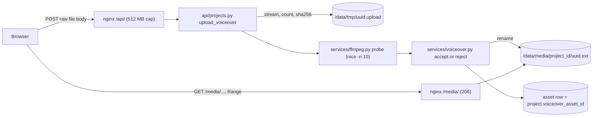

# Phase 3: Projects, voiceover and script

The executor's first step is to save this plan as `plans/phase-03-projects.md`, following the template in Section 4.6 of `ITERATION_1_PHASES.md`.

## 1. Goal and outcome

When this phase is done, you can:

- open `/projects`, click **New project**, pick Landscape or Portrait first, name the project, and land on its page with the Section 4.4 defaults filled in;
- edit the project's settings and guidelines at `/projects/:id/settings` (sizes, fps, scene length, clip sound volume, style prefix, prompt suffix, negative prompt, cut instructions). Invalid values get a readable message, and the page states the size to create frames at;
- upload a WAV, MP3, M4A or FLAC voiceover of up to 400 MB. It is checked by ffprobe, stored under a generated name, recorded as an `asset` row, and played with seeking from `/media`;
- paste the script and get it back exactly as pasted, blank lines included.

It also provides `Storage`, the FFmpeg and ffprobe wrapper, the asset helper, the orientation defaults and the project validation for later phases.



## 2. Findings (read-only checks, 2026-10-06)

- **Code state.** Phases 1 and 2 are committed (`b94d86c Initial Structure`), and the working tree is clean. Both containers are up and healthy. `ProjectsPage` is a placeholder. `/projects/:id` and `/projects/:id/settings` were reserved in Phase 1 and are not routed yet. `app/services/ffmpeg.py` holds only `tool_version()`. The ORM models for `project` and `asset` already match DB Sections 4.1 and 4.2, so **no migration is needed**.
- **Phase log rules in force:** one `app/api/<area>.py` per area; `SessionDep`; `UTCDateTime`/`utcnow()`; never hold a transaction across slow work (Phase 2 calls `await session.commit()` to end a read first); `{"detail": "<message>"}` errors; TanStack Query only, no `refetchInterval`; `npm run gen:api` after API changes; nginx allows 512 MB on `/api/`, and app limits stay below it; the backend runs as uid 10001; files are 0644 and folders 0755.
- **[VERIFY] Range through nginx:** a Range request for a static file returns `206 Partial Content` with `Content-Range`. `/media/` uses the same static file handler, and there is no media file yet to test it on. The executor confirms it on a real voiceover in acceptance check 3.
- **nginx MIME types:** the image's `mime.types` maps `mp3` to `audio/mpeg` and `m4a` to `audio/x-m4a`, but has **no entry for `wav` or `flac`**. `/media/` sends `X-Content-Type-Options: nosniff`, so WAV and FLAC would be served as `application/octet-stream`. Fix: an explicit `types` block in `location /media/`.
- **Backend image:** `/usr/bin/nice` exists and the umask is `0022`, so files created with a normal `open()` are 0644. `tempfile.mkstemp` would create 0600 files that nginx (another user) cannot read.
- **Disk:** `/data` and the container's `/tmp` are different filesystems, so temp files go in `/data/tmp` to allow an atomic rename into `/data/media`.
- **GPU spec limits (read-only GET, API 0.3.0):** `KeyframeInterpolationRequest` declares width and height only as integers above 0 ("must be a multiple of 64" in the text), `frame_rate` above 0, and `num_frames` at least 9. **There is no maximum for size, fps or frame count**, so Phase 3 uses fixed sanity ranges. This also answers part of Phase 9's [VERIFY]: the maximum frame count is not in the spec.
- **Multipart:** `python-multipart` is not installed. The upload below reads the raw request body instead, so no new dependency is needed.

## 3. Decisions

- **Orientation (APPROVED):** fixed after creation. The sizes stay editable, but both the generation size and the output size must match the orientation: wider than tall for landscape, taller than wide for portrait. `orientation` is not in the update model.
- **Upload limit (APPROVED):** 400 MB (400 x 1024 x 1024 bytes), below nginx's 512 MB.
- **Formats (APPROVED):** WAV, MP3, M4A and FLAC, detected from the file's content by ffprobe and never from its name or Content-Type. All four are on Parakeet's list (Section 5.1), so Phase 5 never needs to convert them.
- **YOUR APPROVAL: value ranges**, each with a readable message:
  - name: 1 to 200 characters, trimmed;
  - generation width and height: 256 to 3840, multiples of 64;
  - output width and height: 256 to 3840, even;
  - fps: a whole number from 12 to 60;
  - minimum and maximum scene length: 0.5 to 20 s, with the minimum below the maximum. Phase 9 checks the real API limit;
  - clip sound volume: 0 to 1 in the API, shown as 0 to 100 % in the UI;
  - `style_prefix`, `prompt_suffix`, `negative_prompt` and `cut_instructions`: up to 2,000 characters each, trimmed, and saved as NULL when blank;
  - script: up to 100,000 characters.
- **Script stored byte for byte.** No trimming and no line-ending changes. Only a script that is entirely whitespace becomes NULL.
- **Upload as a raw request body, not multipart.** The browser sends the file itself as the body (`fetch(url, { method: "POST", body: file })`). The backend streams it to a temp file and counts bytes as they arrive, so the size limit applies while receiving. This needs no new library. Same-origin uploads pass the Origin check. Cross-site pages cannot send a non-form Content-Type without a CORS preflight, and that preflight fails.
- **Upload order:** check that the project exists and end the read transaction; stream the body to `/data/tmp/<uuid>.upload` while computing SHA-256; run ffprobe; classify; rename into `/data/media/<project_id>/<uuid>.<ext>`; then one short transaction inserts the `asset` (`kind=voiceover`, `source=upload`, `provenance` NULL) and sets `project.voiceover_asset_id`. The temp file is removed on any failure. A new upload creates a new asset, and the old file and row stay.
- **Classification rules:**
  - ffprobe fails: "This file could not be read as audio."
  - Allowed `format_name` values: `wav`, `mp3`, `flac`, or a list that contains `m4a` (ffprobe reports `mov,mp4,m4a,3gp,3g2,mj2`). Anything else: "Upload a WAV, MP3, M4A or FLAC file. This file is <format_long_name>."
  - Any video stream that is not cover art (`disposition.attached_pic`): "This file contains video. Upload an audio file."
  - No audio stream: "This file has no audio."
  - No positive duration (from `format.duration`, or else the longest audio stream): "Could not read the length of this audio."
  - Size: "The file is larger than 400 MB." (413, checked against `Content-Length` first, then while streaming). An empty body: "The file is empty." (422).
- **Stored extension and MIME type** come from the detected format: `wav` audio/wav, `mp3` audio/mpeg, `m4a` audio/mp4, `flac` audio/flac. The same four go in nginx's `/media/` `types` block. A `types` block in a location replaces the inherited map there, so later phases must add each new stored extension to it.
- **Media convention:** `asset.path` holds `<project_id>/<32 hex>.<ext>`, relative to `/data/media`, and the URL is `/media/` + path. `Storage.get_path` accepts only that pattern and checks that the resolved path stays inside the media folder.
- **Temp files** live in `/data/tmp` (same volume, not served by nginx). Its contents are deleted at startup, which Section 4.2 of the phases document allows for temporary working files. Stored media is never deleted.
- **FFmpeg wrapper:** every run is `["nice", "-n", "10", tool, *args]` through `asyncio.create_subprocess_exec`, never `shell=True`, with a timeout that kills the process. Inputs are passed as `file:<absolute path>`, so FFmpeg never reads a path as a protocol or an option.
- **API shape:** `PATCH` for every project edit (settings, guidelines and script), validated on the merged result, so one function holds all the rules. Validation messages come from the service, not from Pydantic constraints, so 422s carry a readable string (the Phase 2 pattern).
- **Upload progress:** none. A local upload of a few hundred MB takes seconds, and the button shows "Uploading and checking...".

## 4. Changes

### Database
- No migration. The existing `project` and `asset` tables are used as they are, and DATABASE_STRUCTURE.md does not change.

### Backend
- **[backend/app/core/config.py](backend/app/core/config.py):** add the `tmp_dir` property (`data_dir / "tmp"`).
- **[backend/app/main.py](backend/app/main.py):** the lifespan creates `tmp_dir` and empties it in a thread (`Storage.clear_tmp()`).
- **[backend/app/services/ffmpeg.py](backend/app/services/ffmpeg.py)** grows into the wrapper. `tool_version()` stays.

```python
class ToolError(Exception): ...            # could not start, or timed out

@dataclass(frozen=True)
class ToolResult:
    returncode: int
    stdout: bytes
    stderr: bytes

def file_input(path: Path) -> str: ...     # "file:" + absolute path

async def run_tool(tool: Literal["ffmpeg", "ffprobe"], args: Sequence[str],
                   *, timeout_s: float) -> ToolResult: ...

@dataclass(frozen=True)
class AudioStream:
    codec_name: str | None
    sample_rate: int | None
    channels: int | None
    duration_s: float | None

@dataclass(frozen=True)
class ProbeResult:
    format_name: str
    format_long_name: str | None
    duration_s: float | None
    audio_streams: list[AudioStream]
    video_stream_count: int                # not counting attached pictures (cover art)

async def probe(path: Path, *, timeout_s: float = 30.0) -> ProbeResult | None: ...
```

  `probe` runs `ffprobe -v error -print_format json -show_format -show_streams file:<path>` and returns None when ffprobe exits non-zero or prints unusable JSON. Logs carry the tool, the exit code and at most 500 characters of stderr.
- **New [backend/app/services/storage.py](backend/app/services/storage.py):**

```python
class StorageError(Exception): ...
class TooLargeError(StorageError): ...

@dataclass(frozen=True)
class TempFile:
    path: Path
    size_bytes: int
    sha256: str

@dataclass(frozen=True)
class StoredFile:
    relative_path: str                     # "<project_id>/<uuid hex>.<ext>"
    path: Path
    url: str                               # "/media/<relative_path>"

class Storage:
    def __init__(self, media_dir: Path, tmp_dir: Path) -> None: ...
    async def receive(self, chunks: AsyncIterable[bytes], *, max_bytes: int) -> TempFile: ...
    async def save(self, temp: TempFile, project_id: int, ext: str) -> StoredFile: ...
    def get_path(self, relative_path: str) -> Path: ...
    def open(self, relative_path: str) -> BinaryIO: ...   # sync, for use in a thread (Phase 5)
    def discard(self, temp: TempFile | Path) -> None: ...
    def clear_tmp(self) -> None: ...

def media_url(relative_path: str) -> str: ...
def get_storage() -> Storage: ...          # built from get_config()
```

  `receive` creates the temp file with mode `"xb"` (never `mkstemp`, see Findings), writes through `anyio.open_file` (anyio already ships with Starlette), hashes each chunk, and raises `TooLargeError` and removes the file once `max_bytes` is passed. `save` validates `ext` (`[a-z0-9]{1,5}`), creates the project folder, and renames in a thread.
- **New [backend/app/services/assets.py](backend/app/services/assets.py):** `async def add_asset(session, *, project_id, kind, stored: StoredFile, mime, size_bytes, sha256, source, duration_s=None, width=None, height=None, provenance=None) -> Asset`. It adds and flushes, and the caller commits.
- **New [backend/app/services/projects.py](backend/app/services/projects.py):**
  - `ORIENTATION_DEFAULTS`: landscape generation 1920x1088 and output 1920x1080, portrait swapped. fps 24, scene length 2.0 to 6.0 and volume 0.2 come from the model defaults.
  - `class ProjectValidationError(ValueError)`, whose message is shown to the user.
  - `def validate_project(project: Project) -> None`: every rule in Decisions, run on the merged values.
  - `async def create_project(session, name: str, orientation: str) -> Project`
  - `async def get_project(session, project_id: int) -> Project | None`
  - `async def update_project(session, project: Project, changes: dict[str, object]) -> Project`: applies the changes, normalises the text fields (but not the script), validates, and commits. On failure it rolls back, so the row is unchanged.
  - `async def list_projects(session) -> list[tuple[Project, Asset | None]]`, newest first, with an outer join to the voiceover asset.
- **New [backend/app/services/voiceover.py](backend/app/services/voiceover.py):**
  - `VOICEOVER_MAX_BYTES = 400 * 1024 * 1024`
  - `class VoiceoverRejected(Exception)`, carrying `status_code` (413 or 422) and a message
  - `def classify(probe: ProbeResult | None) -> AcceptedAudio`, returning `ext`, `mime` and `duration_s`
  - `async def upload_voiceover(session, project_id: int, chunks: AsyncIterable[bytes], content_length: int | None) -> Asset`, which follows "Upload order" above.

### API: new [backend/app/api/projects.py](backend/app/api/projects.py), tag `projects`, included in [backend/app/api/__init__.py](backend/app/api/__init__.py)
- Models:
  - `ProjectCreate { name: StrictStr, orientation: Literal["landscape", "portrait"] }` with `extra="forbid"`.
  - `ProjectUpdate`: every editable field optional, with `extra="forbid"` and no `orientation`. The fields are `name`, `gen_width`, `gen_height`, `out_width`, `out_height`, `fps` (StrictInt), `min_scene_seconds`, `max_scene_seconds`, `clip_sound_volume` (float), `style_prefix`, `prompt_suffix`, `negative_prompt`, `cut_instructions` and `script_text` (str or null). The service applies `model_dump(exclude_unset=True)` and rejects null for a non-nullable field ("Generation width cannot be empty.").
  - `VoiceoverOut { asset_id, url, mime, size_bytes, duration_s, sha256, created_at }`.
  - `ProjectSummary { id, name, orientation, created_at, voiceover_duration_s: float | None, has_script: bool }`.
  - `ProjectDetail`: every `project` column except `voiceover_asset_id` and `language`, plus `voiceover: VoiceoverOut | None`.
- `GET /api/projects` returns `list[ProjectSummary]`.
- `POST /api/projects` returns 201 with `ProjectDetail`, or 422.
- `GET /api/projects/{project_id}` returns `ProjectDetail`, or 404 `"Project <id> does not exist."`.
- `PATCH /api/projects/{project_id}` returns `ProjectDetail`, or 404 or 422.
- `POST /api/projects/{project_id}/voiceover` takes `request: Request` and no body parameter. It reads `request.stream()` and the `Content-Length` header. `openapi_extra` documents an `application/octet-stream` binary body. It returns 201 with `ProjectDetail`, or 404, 413 or 422.

### Frontend
- **New [frontend/src/api/projects.ts](frontend/src/api/projects.ts):**
  - Hooks `useProjects()` (key `["projects"]`), `useProject(id)` (key `["projects", id]`), `useCreateProject()` and `useUpdateProject(id)`.
  - `useUploadVoiceover(id)` uses plain `fetch` with the file as the body and `Content-Type: file.type || "application/octet-stream"`. Its error message is the JSON `detail` when there is one. A 413 without JSON (nginx's own page) shows "The file is larger than 512 MB, the most the server accepts."
  - Every mutation invalidates `["projects"]`.
- **[frontend/src/router.tsx](frontend/src/router.tsx):** add `projects/:projectId` (ProjectPage) and `projects/:projectId/settings` (ProjectSettingsPage).
- **[frontend/src/pages/ProjectsPage.tsx](frontend/src/pages/ProjectsPage.tsx):** a New project button and a table with the name (as a link), orientation, created date (local time), voiceover length or "—", and "Script: yes or no".
  - Empty state: "No projects yet."
  - While loading, a `Loader`. On error, a red `Alert` with "Press Refresh to try again".
- **New `frontend/src/components/projects/CreateProjectModal.tsx`:** orientation first, as two choices showing "Landscape 1920 x 1080" and "Portrait 1080 x 1920", then the name. Create navigates to the new project. Errors appear inside the modal.
- **New `frontend/src/pages/ProjectPage.tsx`:** a header with the name, an orientation badge and a link to Project settings; the line "Create your frames at W x H" (the generation size); then the sections below. An unknown id shows "This project does not exist." with a link back to the list.
- **New `frontend/src/components/projects/VoiceoverSection.tsx`:**
  - Without a voiceover: an Upload voiceover `FileButton` (`accept=".wav,.mp3,.m4a,.flac,audio/*"`) and the hint "WAV, MP3, M4A or FLAC, up to 400 MB".
  - With one: `<audio controls preload="metadata" src={url}>`, the format, length, size and upload time, and a Replace voiceover button with the note "The previous file is kept".
  - While uploading, "Uploading and checking...". Errors appear in a red `Alert`.
- **New `frontend/src/components/projects/ScriptSection.tsx`:** an autosizing `Textarea` with a Save button that is disabled while nothing changed, word and paragraph counts, and the hint "Blank lines between paragraphs are scene-break hints." The draft resets through `key` after a save, the Phase 2 pattern without `useEffect`.
- **New `frontend/src/pages/ProjectSettingsPage.tsx`** and **`frontend/src/components/projects/ProjectSettingsForm.tsx`:**
  - Groups:
    - Name;
    - Video size: the orientation as a read-only badge, generation W x H (step 64) with "Create your frames at W x H", output W x H (step 2), and fps;
    - Scene length: minimum and maximum, in seconds;
    - Clip sound volume, in %;
    - Guidelines: style prefix, prompt suffix and negative prompt;
    - AI cut instructions.
  - One Save button sends only the changed fields. A 422 message shows in an `Alert` beside Save, and "Saved" shows until the next edit.
- **[frontend/src/api/schema.d.ts](frontend/src/api/schema.d.ts):** regenerate with `npm run gen:api`.

### Configuration
- **[frontend/nginx.conf](frontend/nginx.conf)**, inside `location /media/`:

```nginx
types {
    audio/wav  wav;
    audio/mpeg mp3;
    audio/mp4  m4a;
    audio/flac flac;
}
default_type application/octet-stream;
```

- No compose, `.env` or dependency changes.

## 5. Reading list for the executor

- ITERATION_1_PHASES.md: Section 4 (all), the Phase 3 section, and the Phase 1 and Phase 2 log entries.
- ANALYSIS.md: Section 0 (rows 1, 2, 3 and 6), Section 1 (the first two steps of the flow), 3.5, 4.2, 4.4, 5.1 (the accepted file types bullet only), 5.4 (the guideline fields table), 5.6 (the FFmpeg-as-child-process bullet) and 5.9 (the upload abuse row).
- DATABASE_STRUCTURE.md: Sections 4.1, 4.2 and 7.

## 6. Steps in order

1. **Preconditions.**
   - Save this plan as `plans/phase-03-projects.md`.
   - Confirm `git status` is clean and `docker compose ps` shows both services healthy.
   - Ask the user for the paths of the sample voiceover and script (kept outside the repo).
   - Generate test files on the Mac in `T=$(mktemp -d)` with the Mac's FFmpeg:
     - `tone.wav`, `tone.mp3`, `tone.m4a` (AAC) and `tone.flac`, each a 5 s 48 kHz stereo sine (`-f lavfi -i sine=frequency=440:duration=5 -ac 2 -ar 48000`);
     - `tone.aiff`;
     - `video.mp4` (testsrc plus sine);
     - `fake.mp3` (`echo hello`);
     - `empty.wav` (0 bytes);
     - `big.wav` (`mkfile -n 401m`).
2. **Backend foundations.**
   - Write `tmp_dir`, the FFmpeg wrapper, `Storage`, `add_asset` and the lifespan change.
   - Check: `uv run ruff check . && uv run ruff format --check .`.
   - After `docker compose up --build -d backend`, a `docker compose exec backend python -c` snippet probes `tone.wav` (generated inside the container with `ffmpeg -f lavfi ...` into `/data/tmp`) and prints a format of `wav`, a duration of 5.0 and 1 audio stream. A restart then leaves `/data/tmp` empty.
3. **Projects service and API.**
   - Write `services/projects.py` and the create, list, get and patch routes, then rebuild.
   - Check: acceptance checks 1 and 2 with curl.
4. **Voiceover upload and nginx.**
   - Write `services/voiceover.py`, the upload route and the nginx `types` block, then rebuild both images.
   - Check: acceptance checks 3 and 4 with curl.
5. **Frontend.**
   - Run `npm run gen:api`, then write the hooks, routes, pages and components, and rebuild.
   - Check: `npm run typecheck && npm run lint && npm run build`, then the flow in the browser.
6. **Acceptance and phase log.**
   - Run every check below and write the Phase 3 entry in Section 7 of ITERATION_1_PHASES.md.
   - Under "Decisions later phases must follow", list:
     - the media path and URL convention;
     - files only through `Storage`; temp files in `/data/tmp`, created with `"xb"`, never `mkstemp`;
     - FFmpeg only through `run_tool` and `probe`, with `file_input()`;
     - uploads use a raw request body;
     - every new stored extension goes in the `/media/` `types` block;
     - `add_asset` does not commit;
     - project validation is in `validate_project`.
   - Do not commit.

## 7. Acceptance checks

Run from the repo root with `B=http://127.0.0.1:5480/api`, `J='Content-Type: application/json'`, and `T` holding the test files.

1. **Defaults.**
   - `curl -s -w ' HTTP %{http_code}\n' -X POST -H "$J" -d '{"name":"Land","orientation":"landscape"}' $B/projects` returns 201 with `gen_width` 1920, `gen_height` 1088, `out_width` 1920, `out_height` 1080, `fps` 24, `min_scene_seconds` 2.0, `max_scene_seconds` 6.0, `clip_sound_volume` 0.2 and `voiceover` null.
   - The same with `portrait` gives 1088 x 1920 and 1080 x 1920.
   - In the UI, the modal asks for the orientation before the name, and the project page says "Create your frames at 1920 x 1088".
2. **Rejections.** `curl -s -w ' HTTP %{http_code}\n' -X PATCH -H "$J" -d '<body>' $B/projects/$ID` on the landscape project with:
   - `{"gen_width":1900}`: 422 "Generation width must be a multiple of 64.";
   - `{"min_scene_seconds":6}`: 422 "Minimum scene length must be below the maximum.";
   - `{"out_width":1081}`: 422, even numbers only;
   - `{"gen_width":1088,"gen_height":1920}`: 422, landscape sizes must be wider than tall;
   - `{"fps":null}`: 422, cannot be empty;
   - `{"orientation":"portrait"}`: 422.
   - Afterwards, GET shows nothing changed. In the UI, a width of 1900 shows the message next to Save.
3. **Uploads and seeking.**
   - For each of the sample voiceover, `tone.mp3`, `tone.m4a` and `tone.flac`: `curl -s -w ' HTTP %{http_code}\n' -X POST -H 'Content-Type: application/octet-stream' --data-binary @<file> $B/projects/$ID/voiceover` returns 201. `voiceover.duration_s` is within 0.1 s of `ffprobe -v error -show_entries format=duration -of csv=p=0 <file>` on the Mac, and `sha256` equals `shasum -a 256 <file>`.
   - [VERIFY] `curl -s -o /dev/null -D - -H 'Range: bytes=0-99' http://127.0.0.1:5480<voiceover.url>` shows `206 Partial Content`, a `Content-Range` header, and `Content-Type` `audio/wav` (or `audio/mpeg`, `audio/mp4` or `audio/flac` for the others).
   - In the browser, the player plays, and clicking halfway along its timeline continues from there.
4. **Bad files.** Each gets its status and message:
   - `fake.mp3`: 422 "could not be read as audio";
   - `tone.aiff`: 422 "Upload a WAV, MP3, M4A or FLAC file...";
   - `video.mp4`: 422 "contains video";
   - `empty.wav`: 422 "The file is empty.";
   - `big.wav`: 413 "The file is larger than 400 MB.", returned at once.
   - Afterwards, `docker compose exec backend ls -A /data/tmp` prints nothing, and the project still points at the last good voiceover. In the UI, a bad file shows its message in red.
5. **Script exactly as pasted.**
   - PATCH `script_text` with a value that has leading spaces, a tab, two blank lines between paragraphs, curly quotes, an em dash and a trailing newline, built with `python3 -c 'import json; print(json.dumps({"script_text": ...}))'`. Then GET and compare in Python: `==` is True.
   - In the UI, paste a three-paragraph script, Save and reload: the blank lines are still there.
6. **Restart and files.**
   - `docker compose restart backend`, then wait for healthy. The projects, settings, script and voiceover are unchanged, and the player still seeks.
   - `docker compose exec backend find /data/media -type f` lists only `<id>/<32 hex>.<wav|mp3|m4a|flac>` names.
   - `stat -c '%a %U'` on one of them prints `644 app`.
   - After the uploads in check 3, `/data/media/<id>/` holds 4 files, and `asset` has 4 voiceover rows for the project, with the project pointing at the newest.
7. **Security and regressions.**
   - An upload with `-H 'Origin: https://evil.example'` gets 403, and `-H 'Host: evil.example'` gets 400.
   - A PATCH with `Content-Type: text/plain` gets 422.
   - The Settings page and Test connection still work, and `GET /api/health` is OK.
   - With the project page open and idle for a minute, the network panel shows no repeated requests.
   - Running `npm run gen:api` twice gives the same `shasum`.
   - ruff, `tsc` and ESLint are clean.

## 8. Out of scope

- Transcription, scenes, frames, jobs and the Activity page (Phase 5 on).
- Deleting projects, assets or files. Changing the orientation. Editing `language`.
- Drag and drop or paste for the voiceover, an upload progress bar, storing the original file name, a waveform.
- Checking the scene length against the API's frame limit (Phase 9).
- Converting audio (Phase 5, only if ever needed).
- New dependencies, automated tests and mock servers.

## 9. Risks

**Stop and ask**
- ffprobe does not detect a valid MP3, M4A or FLAC from the content alone (the temp file has no audio extension).
- The `/media/` `types` block does not change the `Content-Type`, or a Range request on a media file returns 200 instead of 206.
- A stored file is not 0644, or nginx answers 403 for it.
- The sample voiceover is in a format outside the four. Ask before widening the list.

**Adjust and carry on**
- VBR MP3s without a header give an estimated duration. Accept small differences on the real sample, and note them in the log.
- If `openapi_extra` makes the generated upload type awkward, keep plain `fetch` (already planned) and leave the backend as it is.
- If an M4A with ALAC audio does not play in your browser, note it in the phase log. AAC M4A is the common case.
- Safari may prefer `audio/x-m4a` to `audio/mp4`. Either is acceptable if playback works.
