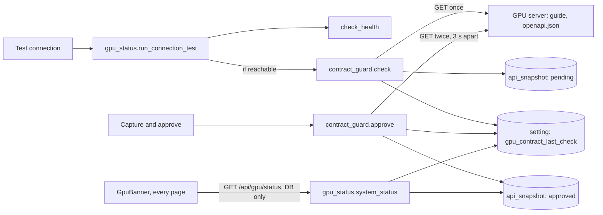

# Phase 4: GPU API contract guard

The executor's first step is to save this plan as `plans/phase-04-contract-guard.md`, following the template in Section 4.6 of `ITERATION_1_PHASES.md`.

## 1. Goal and outcome

When this phase is done, you can:

- open Settings, click **Capture and approve**, and see the GPU server's approved API: version 0.3.0, the fingerprint of each source, the approval time, and the 19 operations grouped by their 8 tags;
- edit the list of contract sources (name, base, path), with readable validation messages;
- press **Test connection**, which now runs the health check and then the contract check;
- see a banner on every page when the API is not approved yet, when it changed (with what changed shown in Settings, and the number of waiting jobs, 0 until Phase 5), or when the server is unreachable. Banners read stored state only.

It provides `contract_guard.check()` and `contract_guard.approve()` (Section 6.4's `ContractGuard`), and `gpu_status.system_status()`, which the banner reads and Phase 5 extends with the waiting-job count.



## 2. Findings (read-only checks, 2026-10-06)

- **Code state.** Phase 3 is committed (`ed6c48a`), and the tree is clean. Both containers are healthy. `api_snapshot` is empty, `job` is empty, and the only `setting` row is `gpu_connection_last_test`. The `ApiSnapshot` model matches DB Section 4.7, so **no migration is needed**. `app/jobs/` is empty (no dispatcher yet).
- **Phase log rules in force.** All outbound HTTP goes through `outbound.request()`. Call exact paths, because a trailing slash gets a 307. Settings are read with `get_str`/`get_int`. A new internal row goes in `INTERNAL_KEYS`. Reachability goes through `gpu_status`, and a stored result counts only for the address that would be called now. Never hold a transaction across a network call. Errors are `{"detail": "<message>"}`, with messages coming from the service. On the frontend, TanStack Query only and no `refetchInterval`; the draft lives in an inner component keyed by saved state, and pure helpers go in their own `.ts` module. Run `npm run gen:api` after API changes.
- **Live guide** (`GET /v1/guide?format=json`, 85,864 bytes). Top-level keys: `api_version` `"0.3.0"`, `generated_at`, `content_hash` (`sha256:00197efe...`), `facts` and `markdown`. `content_hash` was identical across fetches 3 s apart. It was also identical across four different `Host` headers, while `facts.base_url` and the markdown changed with the Host. So the fingerprint survives a change of address, but the stored body records the address it was fetched through. `/v1/guide` without `?format=json` returns `text/markdown`.
- **Live OpenAPI** (`GET /openapi.json`, 115,024 bytes). OpenAPI 3.1.0, `info.version` `"0.3.0"`, **no `servers` key**, no `content_hash`. It has 8 tags (Integration guide, System, Uploads, Video generation, Audio generation, Voice conversion, Transcription, Jobs), 19 operations and 27 schemas. The canonical SHA-256 (keys sorted, compact separators, `ensure_ascii=False`, `servers` removed) was identical across fetches and Hosts: `sha256:5bb87b1fc180e871...`.
- **Which live endpoints change by themselves.** `/v1/health`, `/v1/partitions` and `/v1/rvc/voices` gave the same hash twice, 3 s apart. `/v1/jobs` differed, because it carries `server_time`. The phase's example (`/v1/health`) would therefore be **accepted**, not refused, so acceptance check 2 uses `/v1/jobs`.
- **Timing.** nginx's default `proxy_read_timeout` is 60 s. Approve takes about 3 s plus two rounds of concurrent fetches, at most about 23 s with 10 s timeouts.
- **SQLite in the container** is 3.46.1, and `json_remove` works (used to simulate a change in acceptance check 3).
- **[VERIFY] content_hash stability through the app's own `approve()` and `check()`:** the executor confirms it in acceptance checks 1 and 3.

## 3. Decisions

- **Source base (APPROVED, your answer).** Each source has `base`: `"gpu"` (the GPU server URL) or `"transcription"` (the transcription URL, which already falls back to the GPU URL when blank). Paths stay relative.
- **"Not approved" banner (APPROVED, your answer).** It appears on every page, with a link to Settings.
- **YOUR APPROVAL: shape of `api_contract_sources`.** `[{"name","base","path"}]`, with 1 to 5 sources. Defaults: `guide` on `gpu` at `/v1/guide?format=json`, and `openapi` on `gpu` at `/openapi.json`. Precedence is saved, then built-in (no environment variable), and an invalid saved value falls back with a note. DB Section 6's example (`["guide","openapi"]`) is updated to this shape (no schema change). The list has its own endpoints; the generic `/api/settings/{key}` keeps answering 404 for this key.
- **YOUR APPROVAL: Approve is all or nothing.** Every configured source must be captured cleanly, or nothing is stored. "The API is approved" then always means all of it.
- **YOUR APPROVAL: what counts as a change.** A connection error, a timeout or HTTP 5xx means **unreachable**. HTTP 4xx, a redirect, an answer that is too large, or an answer that is not a JSON object means **changed** (the documented source no longer answers as recorded). Changed blocks submissions and shows in the "changed" banner with the reason.
- **Approve confirms what you reviewed.** The UI sends the fingerprints of the pending changes it displayed. If the server now serves something else, that source is refused as "changed again" and its new version is stored as pending.
- **No duplicate pending rows.** `check()` inserts a pending snapshot only if no pending row with the same fingerprint exists for that source and path that is newer than its latest approved row.
- **Baseline.** The latest approved row (by `fetched_at`, then `id`) with the same `source` name **and** `url` (path). A source whose path changes is "not approved", rather than showing a huge diff.
- **When checks run in Phase 4.** Only on Test connection (after a reachable health check) and on Approve. There are no checks on page load, at startup or on a timer.
- **The banner reads stored state only.**
  - Stored state means three things: the last health test, a new internal row `gpu_contract_last_check`, and the approved snapshots.
  - Each stored result counts only while its called URLs equal the ones that would be called now.
  - "Not approved" is computed from the database on every read.
  - Every banner states when its result was recorded.
  - At most two banners show: a server one (unreachable) and a contract one (changed or not approved).
- **Fingerprint.** The top-level `content_hash` when it is a non-empty string (it is also stored as `server_content_hash`). Otherwise `"sha256:" +` the hex SHA-256 of the canonical JSON without top-level `servers`. `api_version` is the top-level `api_version` string, or else `info.version`.
- **Diff.** Changed paths written as `paths["/v1/jobs"].get`, each added, removed or changed, with before and after values cut to 300 characters. Top-level `servers` is ignored. At most 200 entries.
  - Two small additions beyond the phase text, to make a change readable:
    - multi-line strings (the guide's `markdown`) get a line diff of up to 40 lines (stdlib `difflib`);
    - the OpenAPI summary also lists the schemas added, removed and changed, because operations use `$ref`, so a schema change would otherwise show as "0 operations changed".
  - Diffs are computed when read, not stored.
- **Concurrency.** A module-level `asyncio.Lock` serialises `check()` and `approve()`. This holds because there is one process (Section 4.2).
- **Fetching.** Concurrent `outbound.request("GET", ...)` with a 10 s limit and the 5 MB JSON limit. Approve waits 3 s between its two rounds.
- **Naming.** Module functions in `app/providers/contract_guard.py`, called as `contract_guard.check(session)`: the Phase 2 style, standing in for Section 6.4's `ContractGuard.check()`.

## 4. Changes

### Database
- No migration. It uses `api_snapshot` (DB Section 4.7) and `setting`.
- New internal row `gpu_contract_last_check`: `{status, checked_at, sources: [{name, called_url, status, message, approved_fingerprint, current_fingerprint}]}`.
- **[DATABASE_STRUCTURE.md](DATABASE_STRUCTURE.md):**
  - Section 6: the new value shape of `api_contract_sources`, and the new internal row.
  - Section 4.7: `url` is the path relative to the source's base, and the baseline is matched by `source` and `url`.

### Backend
- **[backend/app/core/settings.py](backend/app/core/settings.py)** (update the module docstring):

```python
CONTRACT_SOURCES_KEY = "api_contract_sources"
GPU_CONTRACT_LAST_CHECK = "gpu_contract_last_check"
INTERNAL_KEYS = frozenset({GPU_CONNECTION_LAST_TEST, GPU_CONTRACT_LAST_CHECK})
MAX_CONTRACT_SOURCES = 5
ContractBase = Literal["gpu", "transcription"]
BASE_SETTING: dict[ContractBase, str] = {"gpu": "gpu_api_base_url", "transcription": "transcription_url"}

@dataclass(frozen=True)
class ContractSource:
    name: str
    base: ContractBase
    path: str

DEFAULT_CONTRACT_SOURCES: tuple[ContractSource, ...]   # guide, openapi

@dataclass(frozen=True)
class EffectiveContractSources:
    sources: tuple[ContractSource, ...]
    source: Literal["saved", "built_in"]
    updated_at: datetime | None
    note: str | None

def validate_contract_sources(raw: object) -> tuple[ContractSource, ...]: ...  # SettingValueError
async def read_contract_sources(session) -> EffectiveContractSources: ...
async def save_contract_sources(session, raw: object) -> EffectiveContractSources: ...   # commits
async def reset_contract_sources(session) -> EffectiveContractSources: ...               # commits
```

  The rules, each with a readable message. Names and paths are trimmed.
  - A list of 1 to 5 objects, each with exactly the string keys `name`, `base` and `path`.
  - `name` matches `[a-z0-9][a-z0-9_-]{0,39}` and is unique.
  - `base` is `gpu` or `transcription`.
  - `path` starts with one `/` (not `//`), has at most 500 characters, and contains no whitespace, no control characters and no `#`. A query string is allowed.
  - No `(base, path)` pair appears twice.
- **New [backend/app/services/api_contract.py](backend/app/services/api_contract.py)** (pure functions, no I/O):

```python
def canonical_json(body: dict[str, Any]) -> bytes: ...
def fingerprint(body: dict[str, Any]) -> tuple[str, str | None]: ...  # (fingerprint, server_content_hash)
def api_version(body: dict[str, Any]) -> str | None: ...
def is_openapi(body: dict[str, Any]) -> bool: ...        # dict "paths" and an "openapi" or "swagger" string
@dataclass(frozen=True)
class Operation: method: str; path: str; summary: str | None
@dataclass(frozen=True)
class TagGroup: tag: str; operations: tuple[Operation, ...]
def operations_by_tag(spec: dict[str, Any]) -> list[TagGroup]: ...  # spec's tag order, then others, "Other" last
@dataclass(frozen=True)
class DiffEntry: path: str; kind: Literal["added", "removed", "changed"]; before: str | None; after: str | None; text_diff: tuple[str, ...] | None
@dataclass(frozen=True)
class OpenApiChanges: operations_added: tuple[str, ...]; operations_removed: ...; operations_changed: ...; schemas_added: ...; schemas_removed: ...; schemas_changed: ...
@dataclass(frozen=True)
class ContractDiff: entries: tuple[DiffEntry, ...]; truncated: bool; openapi: OpenApiChanges | None
def diff_documents(old: dict[str, Any], new: dict[str, Any]) -> ContractDiff: ...
```

  Operations are written as `"POST /v1/ltx/videos/generate"`. Lists are compared by index.
- **New [backend/app/providers/contract_guard.py](backend/app/providers/contract_guard.py):**

```python
CAPTURE_GAP_S = 3.0
FETCH_TIMEOUT_S = 10.0
SourceStatus = Literal["ok", "changed", "not_approved", "unreachable", "unreadable"]
CheckStatus = Literal["ok", "changed", "not_approved", "unreachable"]
ApproveOutcome = Literal["approved", "unchanged", "unstable", "changed_again", "unreachable", "unreadable"]

@dataclass(frozen=True)
class SourceCheck: name; called_url; status: SourceStatus; message; approved_fingerprint; current_fingerprint
@dataclass(frozen=True)
class CheckResult:
    status: CheckStatus; checked_at: datetime; sources: tuple[SourceCheck, ...]
    @property
    def is_ok(self) -> bool: ...
    def to_json(self) -> dict[str, Any]: ...
    @classmethod
    def from_json(cls, data: object) -> CheckResult | None: ...
@dataclass(frozen=True)
class SourceApproval: name; called_url; outcome: ApproveOutcome; message; fingerprint; diff: ContractDiff | None
@dataclass(frozen=True)
class ApproveResult: approved: bool; sources: tuple[SourceApproval, ...]

async def check(session: AsyncSession) -> CheckResult: ...
async def approve(session: AsyncSession, expected: Mapping[str, str]) -> ApproveResult: ...
async def last_check(session: AsyncSession) -> CheckResult | None: ...   # None if missing, malformed or for other URLs
async def missing_baselines(session: AsyncSession) -> list[str]: ...
async def overview(session: AsyncSession) -> ContractOverview: ...       # for GET /api/gpu/contract
```

  - **`check`**, under the lock:
    1. Read the sources, their called URLs (`docker_mapped(join_url(base, path))`) and the baseline fingerprints, then `commit()` to end the read.
    2. Fetch all sources once.
    3. Give each source a status: a failed fetch is `unreachable` or `unreadable`; no baseline is `not_approved`; an equal fingerprint is `ok`; otherwise `changed`.
    4. The overall status is `changed` if any source is changed (or unreadable with a baseline). Otherwise it is `not_approved` if any baseline is missing, `unreachable` if any source is unreachable, and `ok` if none of these apply.
    5. One short write: the pending snapshots (deduplicated) and `gpu_contract_last_check`.
  - **`approve`**, under the lock:
    1. Run the same read, then two fetch rounds 3 s apart.
    2. Give each source an outcome, checked in this order:
       - a failed fetch is `unreachable` or `unreadable`;
       - different fingerprints between the two rounds is `unstable`, with the diff of round 1 against round 2 and the message "This source changes by itself...";
       - the same fingerprint as the baseline is `unchanged`;
       - a source in `expected` whose fingerprint differs from it is `changed_again`, and its version is stored as pending;
       - anything else is `approved`.
    3. If every source is `approved` or `unchanged`, insert the approved rows (body from round 1, `approved_at` now) and write `gpu_contract_last_check` as `ok`. Otherwise store nothing else.
  - Logs carry the source names, statuses and fingerprints, never bodies.
  - `overview` returns, per source: the approved snapshot summary; the pending change, which is the latest pending row whose fingerprint equals the applicable last check's `current_fingerprint`, diffed against the baseline; that source's last check; and the operations by tag for approved OpenAPI sources. It also returns the effective sources setting and the last check.
- **[backend/app/services/gpu_status.py](backend/app/services/gpu_status.py):**
  - `run_connection_test(session) -> ConnectionTestOutcome(health: HealthResult, contract: CheckResult | None)`. The contract check is skipped (None) when health is unreachable.
  - `system_status(session) -> SystemStatus` holds:
    - `server: ServerStatus(state reachable|unreachable|unknown, checked_at, called_url, error)`, from the last health test;
    - `contract: ContractStatus(state ok|changed|not_approved|unreachable|unknown, checked_at, sources, message)`. `not_approved` comes from `missing_baselines` and overrides the last check; otherwise the state comes from the applicable last check, and `unknown` when there is none;
    - `waiting_jobs: int`, always 0 in Phase 4.
- Update the docstrings in [backend/app/providers/gpu_server.py](backend/app/providers/gpu_server.py) and [backend/app/api/gpu.py](backend/app/api/gpu.py).

### API (all in [backend/app/api/gpu.py](backend/app/api/gpu.py), tag `gpu`)
- `GET /api/gpu/status` returns `GpuStatus { server, contract, waiting_jobs }`. It reads the database only.
- `GET /api/gpu/contract` returns `ContractOverview { sources_setting, last_check, sources[] }`. It reads the database only, and never returns bodies.
- `POST /api/gpu/contract/approve` takes `ApproveRequest { expected: dict[str, StrictStr] = {} }` (`extra="forbid"`) and returns `ApproveResponse { approved, sources[{name, called_url, outcome, message, fingerprint, diff}] }`. It is always 200 (an outcome, not an error), or 422 for a malformed body.
- `PUT /api/gpu/contract/sources` takes `{ sources: [{name: StrictStr, base: StrictStr, path: StrictStr}] }` and returns `ContractSourcesOut { sources[{name, base, path, called_url}], source, updated_at, note }`, or a 422 with a readable string.
- `DELETE /api/gpu/contract/sources` resets to the built-in list and returns `ContractSourcesOut`.
- `POST /api/gpu/connection/test` now returns `ConnectionTestResult { health: ConnectionTest, contract: ContractCheck | null }`.
- `GET /api/gpu/connection` is unchanged.

### Frontend
- **[frontend/src/api/gpu.ts](frontend/src/api/gpu.ts):** `useGpuStatus()` (`["gpu","status"]`), `useContract()` (`["gpu","contract"]`), `useApproveContract()`, `useSaveContractSources()` and `useResetContractSources()`. Every GPU mutation, including Test connection, invalidates the `["gpu"]` prefix.
- **[frontend/src/api/settings.ts](frontend/src/api/settings.ts):** `useRefreshAfterChange` invalidates `["settings"]` and the `["gpu"]` prefix, because a URL change affects both status and contract.
- **New `frontend/src/components/GpuBanner.tsx`,** rendered in [frontend/src/components/AppLayout.tsx](frontend/src/components/AppLayout.tsx) above `<Outlet />`. It renders nothing while loading or on error (`BackendStatus` already covers a backend that is down).
  - Server unreachable, in red: "GPU server unreachable. Last checked <time> at <url>: <error>. Jobs that need it wait until it answers."
  - Contract unreachable, also in the server slot: "The GPU API could not be checked: <message>".
  - Changed, in yellow: "GPU API changed: <sources> differ from the approved version (found <time>). New GPU jobs wait until you review and approve the change. Jobs waiting: N." with a link to "Review in Settings".
  - Not approved, in blue: "The GPU API has not been approved yet. GPU jobs cannot start until you approve it in Settings."
- **[frontend/src/components/settings/GpuConnectionTest.tsx](frontend/src/components/settings/GpuConnectionTest.tsx):**
  - The description says the test also checks the API.
  - After a test, one line gives the contract result ("API unchanged", "API changed: ...", "API not approved yet", or "API check skipped: the server is unreachable").
- **New `frontend/src/components/settings/ContractSection.tsx`,** placed after the connection card in [frontend/src/pages/SettingsPage.tsx](frontend/src/pages/SettingsPage.tsx):
  - Per source: the name, the called URL, the version, the short fingerprint, the approval time and the last check line.
  - **Capture and approve** appears when anything is not approved, and **Approve this change** appears when a pending change exists (it sends `expected` from the displayed pending fingerprints). Either button notes "takes a few seconds".
  - Below the button, the outcome of each source, with the diff for `unstable`.
  - States: a `Loader` while loading, a red `Alert` with "Press Refresh" on error, and "Nothing approved yet." when empty.
- **New `ContractDiff.tsx`:** the OpenAPI lists, then the entries (path in `Code`, a kind badge, before and after, and `text_diff` in a code block), plus "N more not shown" when truncated. When only the fingerprint differs: "The fingerprint changed, but no field in the document differs."
- **New `ApiOperations.tsx`:** a Mantine `Accordion` per tag, with a method `Badge`, the path and the summary.
- **New `ContractSourcesEditor.tsx`:** rows of name, base `Select` ("GPU server URL" or "Transcription URL") and path, with Remove. It has Add source (disabled at 5), Save (disabled when unchanged), and Reset to defaults (when saved). A 422 shows in an `Alert`, and the saved rows show "Will call: ...". Its draft logic goes in `contractDraft.ts`.
- **[frontend/src/format.ts](frontend/src/format.ts):** `shortFingerprint()`.
- **[frontend/src/api/schema.d.ts](frontend/src/api/schema.d.ts):** regenerate.

### Configuration
- None. No compose, nginx, `.env` or dependency changes.

## 5. Reading list for the executor

- ITERATION_1_PHASES.md: Section 4 (all), the Phase 4 section, and the Phase 1 to 3 log entries.
- ANALYSIS.md: 3.3 ("Keeps the DB current"), 3.4 (banners), 3.7 (the API contract sources row and the URL rules), 5.8 (the "recorded GPU API changed" row), 6.1 (the last bullet), 6.4 (`ContractGuard`) and 6.5 (all).
- DATABASE_STRUCTURE.md: Sections 4.6, 4.7 and 6.

## 6. Steps in order

1. **Preconditions.**
   - Save this plan.
   - `git status` is clean, both services are healthy, and `curl -s http://127.0.0.1:8012/v1/health` answers `ok`. If it does not, see Risks.
   - `api_snapshot` has 0 rows.
2. **Sources setting.**
   - Write the `core/settings.py` additions.
   - Check: ruff is clean, and a `uv run python -c` snippet shows the defaults pass and each invalid case from acceptance check 5 raises with its message.
3. **Pure module.**
   - Write `services/api_contract.py`.
   - Check: a `docker compose exec backend python -c` snippet fetches both live documents through `outbound` and prints:
     - the guide fingerprint, equal to its `content_hash`;
     - the openapi fingerprint, equal to the Mac's value in acceptance check 1;
     - 8 tags and 19 operations;
     - for openapi against a copy without `/v1/partitions`: 1 added path and `GET /v1/partitions` under `operations_added`.
4. **Guard, status and API.**
   - Write `providers/contract_guard.py`, the `gpu_status` changes and the routes, then run `docker compose up --build -d backend`.
   - Check: acceptance checks 1 and 2 with curl.
5. **Frontend.**
   - Run `npm run gen:api`, then write the hooks, the banner and the Settings components, and rebuild.
   - Check: `npm run typecheck && npm run lint && npm run build`, then the flow in the browser.
6. **Docs.** Update DATABASE_STRUCTURE.md Sections 4.7 and 6.
7. **Acceptance and phase log.**
   - Run every check below, and write the Phase 4 entry.
   - Under "Decisions later phases must follow", list:
     - call `contract_guard.check(session)` before any submission, and submit only when `is_ok`; both `changed` and `not_approved` block;
     - Phase 5 fills in `SystemStatus.waiting_jobs`;
     - the change simulation from acceptance check 3;
     - a source's base field.
   - Record the `api_contract_sources` shape as an approved deviation from DB Section 6's example.
   - Do not commit.

## 7. Acceptance checks

Run from the repo root with `B=http://127.0.0.1:5480/api`, `J='Content-Type: application/json'` and `RO="import sqlite3; c=sqlite3.connect('file:/data/app.db?mode=ro', uri=True)"`. List the snapshots with `docker compose exec -T backend python -c "$RO; [print(r) for r in c.execute('select id, source, url, state, substr(fingerprint,1,20), api_version, approved_at is not null from api_snapshot order by id')]"`.

1. **Capture and approve the defaults.**
   - Before: `GET $B/gpu/status` gives `contract.state` `not_approved`, and every page shows the blue banner.
   - `curl -s -X POST -H "$J" -d '{}' $B/gpu/contract/approve` answers in about 3 to 5 s with `approved: true`, and both sources `approved`.
   - The guide fingerprint equals `curl -s 'http://127.0.0.1:8012/v1/guide?format=json' | python3 -c 'import json,sys; print(json.load(sys.stdin)["content_hash"])'`.
   - The openapi fingerprint equals `curl -s http://127.0.0.1:8012/openapi.json | python3 -c 'import hashlib,json,sys; d=json.load(sys.stdin); d.pop("servers",None); print("sha256:"+hashlib.sha256(json.dumps(d,sort_keys=True,separators=(",",":"),ensure_ascii=False).encode()).hexdigest())'`.
   - The table has 2 approved rows: `api_version` 0.3.0 on both, and `server_content_hash` on the guide only.
   - A second approve gives both `unchanged`, and there are still 2 rows.
   - `POST $B/gpu/connection/test` gives health reachable and contract `ok`. Status `ok`, and no banner.
   - In the UI, Settings shows 0.3.0, the fingerprints, the approval time and 19 operations under 8 tags (for example `POST /v1/parakeet/transcribe` under Transcription).
2. **A source that changes by itself.**
   - PUT the sources with a third entry, `{"name":"jobs","base":"gpu","path":"/v1/jobs"}`. The not-approved banner returns.
   - Approve gives `approved: false`: `jobs` is `unstable`, with a diff that names `server_time`, and guide and openapi are `unchanged`. No new rows.
   - `DELETE $B/gpu/contract/sources` restores the defaults, and the status is `ok` again (the last check applies again).
3. **Simulated change, approve, history.**
   - Insert a simulated approved row: run `docker compose exec -T backend python -c` with a writable `sqlite3` connection and commit. The SQL is `INSERT INTO api_snapshot (source,url,fetched_at,fingerprint,server_content_hash,api_version,body,state,approved_at) SELECT source,url,datetime('now'),'sha256:simulated-phase4',server_content_hash,api_version,json_remove(body,'$.paths."/v1/partitions"'),'approved',datetime('now') FROM api_snapshot WHERE source='openapi' AND state='approved' ORDER BY id DESC LIMIT 1`. Confirm `json_type(body,'$.paths."/v1/partitions"')` is NULL on the new row.
   - This row is inserted, not edited, so history stays insert-only.
   - `GET $B/gpu/status` is still `ok`, because nothing has checked yet.
   - Test connection gives contract `changed` (openapi). The yellow banner shows on Projects, Activity and Settings, with "Jobs waiting: 0". Settings shows `GET /v1/partitions` under operations added, the path `paths["/v1/partitions"]` as added, and `sha256:simulated-phase4` against the real fingerprint.
   - There is 1 new pending row. A second Test connection adds none.
   - `POST $B/gpu/contract/approve` with `{"expected":{"openapi":"sha256:wrong"}}` gives `approved: false`, and openapi `changed_again`. There is still exactly 1 pending row.
   - **Approve this change** in the UI gives `approved: true`, and the banner is gone. The simulated and pending rows remain: openapi now has approved, approved (simulated), pending and approved rows.
4. **Server down.**
   - With `lsof -nP -iTCP:8099 -sTCP:LISTEN` empty, save `gpu_api_base_url` = `http://localhost:8099` and run Test connection. Health is unreachable and `contract` is null. The red banner shows that address on every page.
   - `curl -s -o /dev/null -w '%{time_total}\n'` stays under 0.2 s for `$B/projects`, `$B/settings`, `$B/gpu/status` and `$B/gpu/contract`.
   - Reset the setting and run Test connection: reachable, `ok`, no banner.
5. **Sources editor and base.**
   - PUT each of these and get a 422 with a readable string:
     - `[]`;
     - a name `Guide!`;
     - base `other`;
     - path `openapi.json`;
     - path `//evil.example/x`;
     - two sources with the same name;
     - six sources.
   - GET shows nothing changed, and the UI shows the message.
   - `PUT $B/settings/api_contract_sources` is still 404, and `GET $B/settings` still lists 8 settings.
   - Base: set `transcription_url` = `http://localhost:8099` and add `{"name":"openapi-tx","base":"transcription","path":"/openapi.json"}`.
     - The overview shows `called_url` `http://host.docker.internal:8099/openapi.json`.
     - Approve gives that source `unreachable` and `approved: false`.
     - Set `transcription_url` to blank: Approve now approves `openapi-tx` against the GPU URL.
     - Reset the sources and `transcription_url`, then run Test connection: `ok`.
6. **Restart.** After `docker compose restart backend`, `GET $B/gpu/status` and `GET $B/gpu/contract` are unchanged.
7. **No polling, no GPU calls on page load, no secrets.**
   - With any page open and idle for a minute, no repeated requests appear.
   - After loading Projects, Activity and Settings and pressing Refresh, `docker compose logs --since 1m backend | grep outbound` is empty.
   - The Phase 2 key check gives a count of 0 for `$B/gpu/status`, `$B/gpu/contract`, the approve response and the backend logs.
8. **Security and regressions.**
   - An approve with `-H 'Origin: https://evil.example'` gets 403, and a sources PUT with `Content-Type: text/plain` gets 422.
   - The project page, voiceover playback and Settings still work, and `GET $B/health` is OK.
   - Running `npm run gen:api` twice gives the same `shasum`.
   - ruff, `tsc` and ESLint are clean.

## 8. Out of scope

- The dispatcher, pausing jobs, and the real waiting-job count (Phase 5).
- Gating only on the operations the app calls.
- A snapshot history view, and deleting snapshots.
- Checks on page load, at startup or on a timer.
- Absolute URLs as sources, and a separate "Check now" button.
- New dependencies, a migration, automated tests and mock servers.

## 9. Risks

**Stop and ask**
- The guide's `content_hash`, or the OpenAPI canonical hash, differs between the two fetches inside `approve()`. A default source cannot then be approved.
- The server reports a version other than 0.3.0 during the build. That is a real change; ask before approving it.
- The GPU server is down. Build everything and run checks 4 and 5's unreachable parts, then ask you to bring it up.
- The Approve request hits nginx's 60 s timeout.

**Adjust and carry on**
- `json_remove` with a quoted path fails. Build the modified body in Python and insert it with parameters instead.
- The guide's diff lists `generated_at`, and the address inside `markdown` when the URL changed. This is expected noise; note it in the log.
- `dict[str, str]` or the nested models generate awkward TypeScript types. Keep the backend as planned, and adapt in `gpu.ts`.
