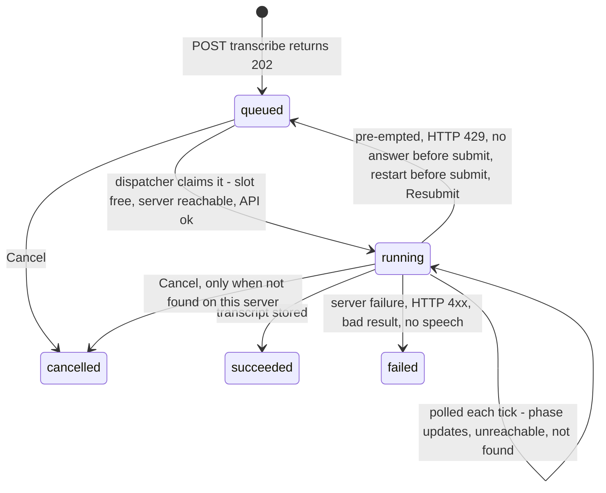

# Phase 5: Background jobs and transcription

The executor's first step is to save this plan as `plans/phase-05-jobs-transcription.md`, following the template in Section 4.6 of `ITERATION_1_PHASES.md`.

## 1. Goal and outcome

When this phase is done, you can:

- click **Transcribe** on a project page and get back, after about 2 minutes and a Refresh, every script word with its time. Words the recogniser missed are marked and timed by interpolation, and extra spoken words are counted. A warning appears when the recording differs a lot from the script;
- see the transcript marked **out of date** after you change the script or replace the voiceover;
- open **Activity** and see every job: type, project, status, phase, times, elapsed time, error, and a detail drawer with the input and output JSON. You can cancel a waiting job;
- restart the backend, lose the tunnel, or have the API change in the middle of a job, and the job waits or continues instead of failing.

It provides:

- the dispatcher and handler registration;
- the job helpers;
- the "latest job per scene" query;
- `Transcriber`;
- the matching function;
- the UI parts for job status and elapsed time.

Phases 6, 9 and 10 add handlers without touching the loop.



## 2. Findings (read-only checks, 2026-10-06)

- **Code.** Phase 4 is committed (`20beab0`) and the tree is clean. Both containers are healthy, and uvicorn runs with `--workers 1`. [backend/app/jobs/__init__.py](backend/app/jobs/__init__.py) is empty. The migration head is `0001`.
- **Database.**
  - Project 5, "The First Light" (portrait), is the real sample: an M4A voiceover (asset 14, 60.2 s, 496 KB) and a 137-word script in 12 paragraphs.
  - The script has curly apostrophes (`couldn’t`, `we’re`) and the numbers `13.8` and `380,000`.
  - `job` and `transcript` are empty.
- **Live server (now up).** `/v1/health` answers 200. The guide (`sha256:00197efe...`) and the OpenAPI spec (`sha256:5bb87b1f...`) equal the approved baselines (rows 1 and 5), so **no re-approval is needed**. The container reaches it at `host.docker.internal:8012`.
- **Contract, from the approved spec.**
  - `POST /v1/uploads` is **multipart/form-data** with one field, `file`. It answers `{asset_id, filename, size_bytes}`. The 2048 MB limit is far above ours.
  - `POST /v1/parakeet/transcribe` takes `{audio_asset_id, partition?}` and answers `{job_id, status: "queued"}`. Its errors are 400 (unknown asset, or an unsupported extension; the server judges the **filename's extension**), 401, 422, 429 and 502.
  - `GET /v1/jobs/{id}` answers `{job_id, pipeline, status (queued|running|succeeded|failed), partition, created_at, started_at, finished_at, error, result_ready, typical_run_seconds, typical_basis, progress}`. An unknown id gets **404 `{"detail":"Unknown job_id."}`**.
  - `GET /v1/jobs/{id}/result` returns the transcript as `application/json`. It answers 409 while not finished and 410 once expired.
- **Real Parakeet history on your server.** There are 9 succeeded runs, taking 61 to 168 s end to end (`typical_run_seconds` 106, the median of 9), with `processing_time` from 53 to 109 s. One run failed with "Exit code: 1 ... Could not decode input file", a real failure and not pre-emption. The guide's pre-emption wording is "error mentions pre-emption / SIGTERM / exit 137/143".
- **Real word format** (4,104 words from 4 results):
  - punctuation is attached to the word (`this.`, `Apparently,`, `need?`);
  - apostrophes are ASCII (`wasn't`) and hyphens are kept (`well-being,`);
  - numbers come both ways (`20`, `99%`, but also `six`, `One,`), and there are fillers like `uh`;
  - 1 word had zero length and 2 overlapped the previous word, so the matcher must not assume strictly increasing times.
- **Formats.** Phase 3 accepts only WAV, MP3, M4A and FLAC, and all four are on Parakeet's list. So **no FFmpeg conversion is needed**. The handler only checks the extension, as a defence.
- **Spike 2** was not run during planning, because it uploads a file and submits a GPU job. It becomes acceptance check 1 (see Decisions).
- **Phase log rules in force.**
  - Outbound HTTP only through `outbound.request()`. Phase 5 adds uploads there.
  - Call exact paths, because a trailing slash gets a 307.
  - Read settings with `get_str` and `get_int` at the moment of use. `transcription_url` falls back to the GPU URL.
  - Contract: call `contract_guard.check(session)` before any submission and submit only when `is_ok`. Fill in `waiting_jobs`, and invalidate `["gpu"]` after job actions.
  - Background tasks open their own `SessionLocal()`, with short transactions and no transaction across a network call.
  - To change a JSON column, assign a new object.
  - Times use `utcnow()` and `UTCDateTime`.
  - Errors are `{"detail": "<message>"}`.
  - Migrations: autogenerate on a temp `DATA_DIR`, batch mode.
  - Frontend: TanStack Query only, never `refetchInterval`. Pure helpers go in `.ts` files. Run `npm run gen:api` after API changes.

## 3. Decisions

- **Spike 2 inside the build (your answer: the server is up).** Acceptance check 1 is the first live transcription of project 5. The executor records in the phase log: matched words as a percentage of script words (word-level accuracy against the script), interpolated words, extra spoken words, the end-to-end time and `processing_time`.
- **YOUR APPROVAL: GPU runs during the checks.** About 8 transcription jobs, one at a time, each about 1 to 2 minutes, on the default partition. No more than 2 are ever in flight.
- **YOUR APPROVAL: staleness (the Gap).** Migration `0002` adds two columns to `transcript`:
  - `voiceover_asset_id`: nullable, a foreign key to `asset.id`, `ON DELETE SET NULL`;
  - `script_sha256`: TEXT NOT NULL, the SHA-256 of `script_text` as stored, at the moment of matching.

  The transcript is out of date when either value differs from the project's current one. The reasons are `script_changed` and `voiceover_changed`.
- **YOUR APPROVAL: a `paragraph` key on each `script_words` entry** (0-based), so the UI can show paragraphs, and Phase 6 gets the paragraph breaks without re-parsing. This updates the JSON shape in DB Section 5, with no schema change.
- **YOUR APPROVAL: "not found on this server".** When polling gets a 404, the job stays `running` with the phase `not found on this server`, and is checked again each tick at the current URL. If the URL is fixed, it is found again. It is never failed by itself. Two actions:
  - **Resubmit**: back to `queued`, `attempt + 1`, a fresh upload and submit;
  - **Cancel**: `cancelled` locally, because the server does not know the job. This extends "cancel a queued job" to this one case.
- **YOUR APPROVAL: the transcription limit is 2 running jobs**, a constant in the handler, not a UI setting.
- **YOUR APPROVAL: mismatch warning, provisional.** It warns when more than 10% of script words were not heard (interpolated), or when the extra spoken words exceed 10% of the script's word count. The executor may tune this after the Spike 2 numbers, and records it.
- **Restart rule** (declared per handler):
  - `resume` (remote jobs): with a provider job id the job keeps being polled. Without one, it goes back to `queued` with the phase `restarted: submitting again`.
  - `start_again` (local jobs): back to `queued`.
  - `never_rerun` (paid LLM jobs): `failed` with "Interrupted by a restart. Paid calls never re-run by themselves; start it again."

  A crash between the server accepting a submit and saving the id gives the one allowed duplicate (Section 3.3).
- **One active job per type and project (or scene).** `create_job` runs under a module `asyncio.Lock` (one process, as in Phase 4). It returns the existing active job instead of creating a second one, so a second click gets 202 with the same job.
- **The dispatcher keeps the banner current.** On any tick with GPU work, it first runs the health check of the GPU server URL and stores it through `gpu_status`. When unreachable, it skips GPU work and backs off: the wait doubles up to 120 s, or the poll interval if that is longer. A reachable answer or a nudge resets it.
- **Nudges wake the loop:** creating a job, Cancel and Resubmit, a finished task, contract Approve, Test connection, and saving or resetting a setting.
- **Always upload again on each submission.** The voiceover is small, and this also covers a URL change. The filename sent is `voiceover-<asset_id>.<ext>`, because the server checks the extension.
- **No purge after transcription in Phase 5** (it is not in the phase scope). The server keeps the uploaded voiceover; finished jobs expire after 7 days. Phase 9 adds purge.
- **Matching rules** (Section 5.1):
  - **Tokenisation:** whitespace-separated; paragraphs split on blank lines; a token with no letter or digit is joined to the previous word, or to the next one at the very start.
  - **Normalisation:** NFKC, casefold, keep only letters and digits. So `couldn’t` and `couldn't` both become `couldnt`, and `13.8` becomes `138`.
  - **Alignment:** `difflib.SequenceMatcher(None, script, spoken, autojunk=False)`. Only `equal` blocks count as matched. The rest of the script is interpolated evenly between the neighbouring anchors: from the previous match's end (or 0.0) to the next match's start (or the voiceover's duration), clamped so times never go backwards.
  - **Counts:** extra spoken words = spoken words minus matched words. Spoken tokens that normalise to nothing are ignored.
  - Matching runs in `asyncio.to_thread`.
- **Results that cannot be used fail the job, with a readable message:** a transcript with no words ("No speech was found in the voiceover."), a result that is not the documented shape, or a script that is now empty.
- **No typical-time display in Phase 5.** Elapsed time only; Phase 9 adds "versus typical".

## 4. Changes

### Database

- New migration `0002_transcript_source` (autogenerated, batch mode). It adds `transcript.voiceover_asset_id` (FK `fk_transcript_voiceover_asset_id_asset`, SET NULL) and `transcript.script_sha256` (NOT NULL; the table is empty).
- [backend/app/db/models.py](backend/app/db/models.py): the two columns on `Transcript`.
- [DATABASE_STRUCTURE.md](DATABASE_STRUCTURE.md):
  - Section 3: the new FK row and ERD edge.
  - Section 4.3: the columns, DDL and the staleness rule.
  - Section 5: `script_words` gains `paragraph`, plus the `transcribe` `job.input` and `job.output` shapes below.
  - Section 7: the transcribe row.

### Backend

- [backend/app/core/outbound.py](backend/app/core/outbound.py): move the shared body of `request()` into a private `_send(...)` that keeps every check, and add:

```python
async def upload(url: str, *, filename: str, content: bytes, mime: str,
                 timeout_s: float, max_bytes: int = JSON_MAX_BYTES) -> OutboundResponse
    # multipart field "file" (httpx files=), same mapping/limits/no-redirect/logging as request()
```

- [backend/app/providers/gpu_server.py](backend/app/providers/gpu_server.py): the shared GPU job calls, which Phase 9 reuses. Ids are validated as `[A-Za-z0-9_-]{1,100}` before they go into a path.

```python
@dataclass(frozen=True)
class RemoteStatus: status: Literal["queued","running","succeeded","failed"]; error: str | None; result_ready: bool
class GpuCallError(Exception): kind: Literal["unreachable","not_found","busy","rejected","server_error","bad_answer"]; status_code: int | None; message: str
async def upload_file(base_url: str, path: Path, filename: str, mime: str) -> str            # remote asset_id; reads bytes in a thread; 600 s limit
async def job_status(base_url: str, job_id: str) -> RemoteStatus                              # 10 s
async def job_result_json(base_url: str, job_id: str) -> dict[str, Any]                       # 30 s, JSON limit; 409/410/404 -> GpuCallError
def server_message(response: OutboundResponse) -> str                                         # "detail" string or joined list msgs, max 2000 chars
```

- New [backend/app/providers/transcriber.py](backend/app/providers/transcriber.py) (Section 6.4 `Transcriber`, split into steps):

```python
PARAKEET_EXTENSIONS: frozenset[str]   # the 18 accepted extensions
TRANSCRIBE_PATH = "/v1/parakeet/transcribe"
async def submit(base_url: str, remote_asset_id: str, partition: str) -> str   # provider job id; partition only if not blank
@dataclass(frozen=True)
class SpokenWord: word: str; start: float; end: float
def parse_result(body: object) -> list[SpokenWord]   # validates the documented shape; raises ValueError with a readable message
```

- New [backend/app/services/transcript_matching.py](backend/app/services/transcript_matching.py) (pure):

```python
@dataclass(frozen=True)
class ScriptToken: index: int; text: str; paragraph: int
def tokenise_script(script: str) -> list[ScriptToken]
def normalise(word: str) -> str
@dataclass(frozen=True)
class MatchCounts: script_words: int; matched: int; interpolated: int; spoken_words: int; extra_spoken: int
@dataclass(frozen=True)
class MatchResult: script_words: list[dict[str, Any]]; counts: MatchCounts   # entries {index, word, start, end, matched, paragraph}
def match_transcript(script: str, spoken: Sequence[SpokenWord], audio_end_s: float) -> MatchResult
def mismatch_warnings(counts: MatchCounts) -> list[str]
def script_sha256(script: str) -> str
```

- New [backend/app/jobs/phases.py](backend/app/jobs/phases.py): the phase labels as constants.
  - Queued: `waiting to start`, `waiting for a free slot`, `paused: GPU API changed`, `paused: GPU API not approved`, `waiting: GPU API could not be checked`, `waiting: GPU server unreachable`, `waiting: server busy (HTTP 429)`, `restarted: submitting again`, `pre-empted: submitting again (attempt n of 3)`, `expired on the server: submitting again`.
  - Running: `uploading the voiceover`, `submitting`, `queued on cluster`, `running on cluster`, `downloading the transcript`, `matching to the script`, `GPU server unreachable, checking again`, `not found on this server`.
  - Terminal: `done`, `failed`, `cancelled`.
- New [backend/app/jobs/store.py](backend/app/jobs/store.py): job helpers. Each changes a row with a conditional UPDATE on its expected status, so a race with Cancel cannot overwrite it. Each commits, except `finish_job`.

```python
async def create_job(session, *, project_id: int, type: str, provider: str, input: dict, scene_id: int | None = None) -> tuple[Job, bool]  # (job, created)
async def claim(session, job_id) -> bool                       # queued -> running, started_at if unset
async def set_phase(session, job_id, phase, *, status: str) -> None   # writes only if it differs
async def mark_submitted(session, job_id, provider_job_id, input: dict) -> None
async def record_poll(session, job_id, phase) -> None          # also last_checked_at
async def requeue(session, job_id, phase, *, next_attempt: bool) -> None   # provider_job_id -> NULL
async def finish_job(session, job_id, output: dict, result_asset_id: int | None = None) -> bool  # flushes; caller commits with its result rows
async def fail_job(session, job_id, error: str) -> None        # error cut to 4000 chars
async def cancel_job(session, job_id) -> Job                   # JobActionError(409) unless queued or not-found
async def resubmit_job(session, job_id) -> Job                 # only not-found
async def latest_job(session, project_id, type) -> Job | None
async def latest_jobs_by_scene(session, project_id, type) -> dict[int, Job]
async def waiting_job_count(session) -> int                    # queued, provider gpu, phase is a "paused:" phase
async def list_jobs(session, *, project_id: int | None, limit: int) -> list[JobRow]  # with project name, scene index
```

- New [backend/app/jobs/handlers.py](backend/app/jobs/handlers.py): the handler interface and registry.

```python
RestartRule = Literal["resume", "start_again", "never_rerun"]
class JobHandler(ABC):
    job_type: ClassVar[str]; provider: ClassVar[Literal["gpu","llm","local"]]; restart_rule: ClassVar[RestartRule]
    async def concurrency_limit(self, session) -> int: ...
    @abstractmethod
    async def start(self, job_id: int) -> None: ...   # own task. Remote: upload + submit, ends after mark_submitted. Local/LLM: all the work
    async def poll(self, job_id: int) -> bool: return False   # remote only, called in the tick; True = ready to finish
    async def finish(self, job_id: int) -> None: ...  # remote only, own task
def register(handler: JobHandler) -> None
def get_handler(job_type: str) -> JobHandler | None
```

- New [backend/app/jobs/dispatcher.py](backend/app/jobs/dispatcher.py): `async start()`, `async stop()` and `nudge()`. It holds only the loop task and a dict from job id to live task. `start()` registers the handlers, applies each handler's restart rule to `running` jobs, then starts the loop. Each tick:
  1. Read the poll interval and the jobs: `running` jobs without a live task, and `queued` jobs, oldest first. End the read.
  2. If any of them is a GPU job: `gpu_status.record_health(session)`. If unreachable, set the unreachable phases, skip GPU work and back off.
  3. Call `poll()` concurrently for running jobs with a provider job id. Start `finish()` as a task for each that returned True.
  4. Per type, the free slots are the limit minus the running jobs of that type. Queued jobs over the limit get `waiting for a free slot`. If any GPU job could start, run `contract_guard.check()` **once**:
     - `changed`: `paused: GPU API changed`;
     - `not_approved`: `paused: GPU API not approved`;
     - `unreachable`: `waiting: GPU API could not be checked`;
     - ok: `claim()` and start `start()` as a task.

     LLM and local jobs skip the check.
  5. Wait for the interval, the backoff, or a nudge (an `asyncio.Event`).

  Any exception in a tick is logged and the loop continues. An unexpected `Exception` in a task fails the job with "Unexpected error ..." and is logged with its traceback. `CancelledError` is never caught as an error. A task nudges the loop when it ends.
- New [backend/app/jobs/transcribe.py](backend/app/jobs/transcribe.py): `TranscribeHandler` (`transcribe`, `gpu`, `resume`, limit 2).
  - **`start`:**
    1. Load the job, its voiceover asset and the `transcription_url`.
    2. Check the extension.
    3. Phase `uploading the voiceover`: `upload_file`.
    4. Phase `submitting`: `submit`.
    5. `mark_submitted` with the full input.
    6. Section 5.8 rules:
       - 502 or other 5xx: retry once after 5 s, then fail with the message;
       - 429: `requeue(waiting: server busy)`;
       - 400 "Invalid asset reference": upload again and submit once more;
       - other 400, 401 or 422: fail with the server's message, no retry;
       - no answer or a timeout: `requeue(waiting: GPU server unreachable)`.
  - **`poll`:**
    - queued: `queued on cluster`;
    - running: `running on cluster`;
    - succeeded: return True;
    - failed with a pre-emption match (`pre-?empt|sigterm|exit code:? ?(137|143)`, ignoring case) and `attempt < 3`: requeue with `next_attempt=True`;
    - other failures: `fail_job(server error)`;
    - 404: `not found on this server`;
    - no answer: `GPU server unreachable, checking again`;
    - other answers: keep the job, with the phase showing the HTTP status.
  - **`finish`:**
    1. Phase `downloading the transcript`.
    2. `job_result_json`. On 409, do nothing and wait for the next tick. On 410, requeue with `expired on the server` and `next_attempt`. On 404, set `not found on this server`.
    3. `parse_result`, then phase `matching to the script`.
    4. Read the project's `script_text` and the voiceover duration.
    5. `match_transcript` in a thread.
    6. One transaction: insert the `Transcript` (`provider="parakeet"`, `language=project.language`, `words` = the whole result, `script_words`, `voiceover_asset_id`, `script_sha256`) and `finish_job(output)`, then commit.
- New [backend/app/services/transcripts.py](backend/app/services/transcripts.py): `latest_transcript(session, project_id)` and `transcription_state(session, project) -> TranscriptionState`. The state holds the latest transcribe job, the latest transcript, the counts (recomputed from `script_words` and `words`), the warnings and the stale reasons.
- [backend/app/services/gpu_status.py](backend/app/services/gpu_status.py): `record_health(session) -> HealthResult`, also used by `run_connection_test`. `system_status` fills in `waiting_jobs` from `store.waiting_job_count`.
- [backend/app/main.py](backend/app/main.py): `await dispatcher.start()` after `outbound.start()`, and `await dispatcher.stop()` before `outbound.close()`.
- `dispatcher.nudge()` after successful saves and resets in [backend/app/api/settings.py](backend/app/api/settings.py), and after Test connection and Approve in [backend/app/api/gpu.py](backend/app/api/gpu.py).
- Logs: job id, type, status changes, the provider job id and the phase. Never bodies or transcript text.

### JSON shapes (DB Section 5)

- `job.input` (transcribe) at creation is `{"voiceover_asset_id": 14}`. After submission it is `{"voiceover_asset_id", "server_url", "upload": {"filename", "size_bytes", "remote_asset_id"}, "endpoint": "/v1/parakeet/transcribe", "body": {"audio_asset_id", "partition"?}}`.
- `job.output` (transcribe): `{"transcript_id", "processing_time", "script_words", "matched", "interpolated", "spoken_words", "extra_spoken", "warnings": [...]}`.

### API

- New [backend/app/api/jobs.py](backend/app/api/jobs.py):
  - `GET /api/jobs?project_id=&limit=` (limit 1 to 500, default 100, newest first): `list[JobSummary]`.
  - `GET /api/jobs/{job_id}`: `JobDetail`, or 404.
  - `POST /api/jobs/{job_id}/cancel`: 200 with `JobDetail`; 404; 409 with a readable reason.
  - `POST /api/jobs/{job_id}/resubmit`: 202 with `JobDetail`; 404; 409.
  - `JobSummary`: `id, project_id, project_name, scene_id, scene_index, type, status, phase, provider, attempt, error, created_at, started_at, finished_at, last_checked_at, can_cancel, can_resubmit`.
  - `JobDetail` adds `provider_job_id, input, output, result_asset_id`.
- New [backend/app/api/transcription.py](backend/app/api/transcription.py):
  - `POST /api/projects/{project_id}/transcribe`: 202 with `JobDetail`, the new job or the active one; 404; 422 ("Upload a voiceover first." or "Paste the script first.").
  - `GET /api/projects/{project_id}/transcription`: `{job: JobSummary | null, transcript: TranscriptOut | null}`.
  - `TranscriptOut`: `id, created_at, provider, voiceover_asset_id, script_words: [{index, word, start, end, matched, paragraph}], counts, warnings, stale_reasons, processing_time`.
- Both routers are registered in [backend/app/api/__init__.py](backend/app/api/__init__.py) (tags `jobs` and `transcription`).

### Frontend

- [frontend/src/api/projects.ts](frontend/src/api/projects.ts): export `PROJECTS_KEY`.
- New [frontend/src/api/jobs.ts](frontend/src/api/jobs.ts): `JOBS_KEY`, `useJobs(projectId?)`, `useJob(jobId | null)`, `useCancelJob()` and `useResubmitJob()`. Actions invalidate `JOBS_KEY`, `PROJECTS_KEY` and `GPU_KEY`.
- New [frontend/src/api/transcription.ts](frontend/src/api/transcription.ts): `useTranscription(projectId)` (key `["projects", id, "transcription"]`, so saving the script refreshes the staleness) and `useStartTranscription(projectId)`.
- New `frontend/src/components/jobs/`:
  - `jobFormat.ts`: `jobTypeLabel` and `elapsedText(job, now)`. "waiting 40 s", "running 1 min 20 s", "took 1 min 52 s", computed at render with no timer.
  - `JobStatusBadge.tsx`: the status colour plus the phase.
  - `JobActions.tsx`: Cancel and Resubmit, from `can_cancel` and `can_resubmit`.
  - `JobDetailDrawer.tsx`: all fields, the error in full, and the input and output in `Code block`.
- [frontend/src/pages/ActivityPage.tsx](frontend/src/pages/ActivityPage.tsx): a project filter (Select) and a Mantine Table with the job, type, project link, scene ("—"), status, phase, created time, elapsed time and the first line of the error. Clicking a row opens the drawer. Empty ("No jobs yet."), loading and error states.
- New [frontend/src/components/projects/TranscriptSection.tsx](frontend/src/components/projects/TranscriptSection.tsx), placed after `ScriptSection` on [frontend/src/pages/ProjectPage.tsx](frontend/src/pages/ProjectPage.tsx):
  - **Transcribe / Transcribe again**: disabled, with the reason, when there is no voiceover or no script, or while a job is active;
  - the latest job's status badge, phase, elapsed time and actions, with a hint to press Refresh for progress;
  - the error, when it failed;
  - the stale alert with its reasons;
  - the mismatch warning;
  - the counts line;
  - the words by paragraph: a tooltip per word ("12.48 – 12.90 s"), and interpolated words marked (dotted underline, a different colour), with a legend.
- The banner needs no change: it already prints `waiting_jobs`.
- Run `npm run gen:api` and commit `schema.d.ts`.

### Configuration

No new setting, no new dependency (httpx multipart and the standard library's `difflib` and `unicodedata`; Mantine already has Table, Drawer, Code and Tooltip), and no nginx change.

## 5. Reading list for the executor

- `ANALYSIS.md`: Sections 3.2, 3.3, 3.4, 5.1, 5.8 (the 502, 429, 400, 422, pre-emption, connection, unknown job id and 409/410 rows), 6.1, 6.4, and 6.5 ("What happens when something changed").
- `DATABASE_STRUCTURE.md`: Sections 3, 4.3, 4.5, 5, 6 (internal rows) and 7.
- `ITERATION_1_PHASES.md`: Section 4, the Phase 5 section, and every phase log entry.
- The code: [backend/app/core/outbound.py](backend/app/core/outbound.py), [backend/app/providers/contract_guard.py](backend/app/providers/contract_guard.py), [backend/app/services/gpu_status.py](backend/app/services/gpu_status.py), [backend/app/services/voiceover.py](backend/app/services/voiceover.py) and [backend/app/services/storage.py](backend/app/services/storage.py).

## 6. Steps in order

1. Save this plan. Add the model columns and migration `0002`, and review it (batch mode, the named FK). Rebuild, confirm `transcript` has the two columns and the existing data is intact. Update DATABASE_STRUCTURE.md.
2. Add `outbound.upload`, the `gpu_server` job calls, the `transcriber` adapter and `transcript_matching`. Check: ruff, and a throwaway in-container `python -c` run of `match_transcript` on a hand-made script and word list (curly apostrophe, a spelled-out number, a missing word, an extra word, a zero-length word).
3. Add `phases`, `store`, `handlers`, `dispatcher`, the lifespan wiring, the nudges and `waiting_jobs`. Check: the backend starts, and with no jobs it logs no outbound calls.
4. Add the transcribe handler and both routers. Check with curl: run **acceptance check 1** on project 5. This is Spike 2: record the numbers. This is the natural break point if the session runs long.
5. Frontend: the API modules, `gen:api`, the job UI parts, the Activity page and `TranscriptSection`. Check in the browser.
6. Run every acceptance check, the linters and the earlier phases' main flow. Write the phase log entry.

## 7. Acceptance checks

Create a test project, "Phase 5 checks" (portrait), with a copy of the sample's audio (`docker compose cp` out of `/data/media/5/...`) and the same script. Checks 3 to 9 use it, so "The First Light" keeps only its real transcript.

1. **Sample (Spike 2).** Transcribe project 5: the job goes queued, running ("uploading the voiceover", "queued on cluster", "running on cluster"), then succeeded. Every script word has a start and an end. The counts and any marked words show. Record the Spike 2 numbers. You seek the player to 3 word times and confirm they are right.
2. **Restart.** During "queued on cluster" or "running on cluster", run `docker compose restart backend`. The job continues and succeeds. `GET /v1/jobs?limit=20` on the server shows at most one extra parakeet job.
3. **Dead URL.** Save the GPU URL as `http://localhost:9`, then Transcribe. The job stays `queued` with "waiting: GPU server unreachable", nothing fails, and the red banner shows. Reset the URL: the job runs and succeeds without a page refresh being needed for it to start.
4. **API change.** Insert a simulated approved openapi snapshot (Phase 4 plan, check 3), then Transcribe. The job shows "paused: GPU API changed" and the banner says "Jobs waiting: 1". Approve in Settings: the job starts and succeeds.
5. **Out of date.** Edit and save the script: the transcript shows "out of date: script changed". Upload the same file again as the voiceover: it also shows "voiceover changed". Transcribe again: the transcript is current.
6. **Double click.** Two `POST /api/projects/{id}/transcribe` sent at the same time return the same job id, and only one job is active.
7. **No polling.** With the project and Activity pages open and idle for 60 s, no repeated requests (a headless check plus your spot check).
8. **Cancel.** With the dead URL, Transcribe, then Cancel on Activity: the job is `cancelled` and never submitted. A succeeded job has no Cancel (the API answers 409).
9. **Not found** (one direct UPDATE of a test job's `provider_job_id` to 32 random hex characters while it is running, as a simulation). The next tick shows "not found on this server", and the job is still `running`. Resubmit: it succeeds with `attempt = 2`. On a second simulated job, Cancel: `cancelled`.
10. **No speech.** Transcribe test project 1 (a 5 s tone): the job fails with "No speech was found in the voiceover."
11. **Activity.** All jobs are listed with correct local times (no 5.5-hour offset). The drawer shows the input with `server_url`, `endpoint` and `body`, and the output with the counts.
12. **Definition of done.** `ruff`, `tsc` and ESLint are clean. `schema.d.ts` is regenerated. `docker compose up --build` works on the existing volume. Projects, voiceover, settings and the contract still work.

## 8. Out of scope

- The `plan_scenes`, `generate_clip` and `render_final` handlers, and any scene rows.
- Live updates (no refetch interval, no timer-driven refresh, no SSE).
- Purge and cancel calls to the GPU server, and the "versus typical" time.
- A UI setting for the transcription limit.
- FFmpeg conversion of voiceovers.
- Deleting jobs or transcripts.
- Automated tests.

## 9. Risks

- **The server goes down during the build.** Build everything, run checks 3, 6 (with the dead URL), 8, 11 and 12, then stop and report before the live ones.
- **A server answer differs from Section 2's shapes** (status fields, the 404 wording, the result shape). Stop and ask; do not work around it.
- **Many mismatches in Spike 2** (for example spelled-out numbers). Report the numbers. Changing only the thresholds is fine. Ask before changing the matching rules.
- **The one allowed duplicate** after a crash between submit and saving the id. It is harmless, and the restart check records it.
- **A transcription URL on another host.** The health gate checks the GPU server URL only, so a down GPU server also pauses transcription. This is acceptable in iteration 1 (the contract sources live there too).
- **Long recordings.** The upload is held in memory and has a 600 s limit. That is fine for 1-minute voiceovers; Phase 11 revisits 15-minute files.
- **Pre-emption cannot be triggered on demand.** That path is checked by reading the code against the guide's wording.
