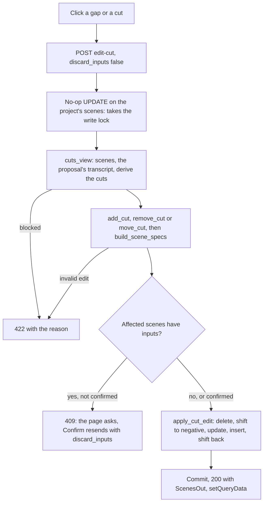

# Phase 7: Cut review and editing

The executor's first step is to save this plan as `plans/phase-07-cut-editing.md`, following the template in Section 4.6 of `ITERATION_1_PHASES.md`.

## 1. Goal and outcome

When this phase is done, you can:

- press **Edit cuts** in the Scenes section and see the script's words in paragraphs. Each scene is tinted and starts with a label (number and length, red outside the limits), and each cut is a coloured bar (AI, Rule or Manual);
- click a gap between two words to **add** a cut. Or click a cut to select it, then either click a highlighted gap in the two scenes beside it to **move** it, or press **Remove this cut**;
- see the scene table and the word view update straight away from the edit's response, with no Refresh;
- be asked first when a scene beside the edit has a description, frames or a clip. Cancel changes nothing. Confirm clears the inputs of those scenes only, and their files stay on disk;
- see **Edit cuts** disabled, with the reason, while the scenes are out of date or a proposal is running.



## 2. Findings (2026-10-06)

- **Code.** Phases 5 and 6 are finished but not committed. The migration head is `0002`. No Phase 7 code exists yet. Phase 6 provides `Cut`, `cut_time`, `end_of_audio`, `build_scene_specs` and `has_inputs` in [backend/app/services/scene_cuts.py](backend/app/services/scene_cuts.py), and `scenes_state` and `stale_reasons` in [backend/app/services/scenes.py](backend/app/services/scenes.py).
- **The `scene` table stores no word numbers.** A scene's `text` is exactly `" ".join` of its words (`build_scene_specs`), so its last word can be recovered by matching the text against the words of the transcript the proposal used (`job.input.transcript_id`). I checked this read-only on both test projects:
  - project 5: transcript 1, 137 words, 15 scenes, cuts after words 12, 23, 35, 43, 49, 57, 65, 72, 80, 92, 99, 106, 116, 127 and 136;
  - project 6: transcript 6, 161 words, 13 scenes.
  
  Every scene matched, and rebuilding the scenes with `build_scene_specs` gave back every stored `start_s` and `end_s` exactly.
- **Script words can contain a space.** `tokenise_script` joins a lone dash to the word before it. So splitting the scene text on spaces would miscount words; the text match does not have this problem.
- **The newest transcript is not always the one the scenes came from**, for example after transcribing again with the same inputs. Edits use the proposal's transcript, so the edges of the scenes an edit does not touch stay exactly where they were.
- **Test data.** Project 6's scenes are out of date (its script was restored after job 21), so the checks use project 5. Project 5 holds AI scenes from job 15, which reused job 12's answer (`input_hash sha256:430e4650...`). Proposing again with unchanged settings reuses that answer without a paid call.
- **The SQLite write lock.** The driver starts a transaction at the first write, not at a SELECT. That is why `plan_scenes._save` finishes its job before checking inputs. An edit takes the lock the same way: its first statement is a no-op UPDATE.
- **Frontend.** `ApiError.status` is available for the 409 flow. Vite (`vite/client` types) and the existing `postcss-preset-mantine` support CSS modules with no new dependency. This is the app's first CSS module; it is needed because the gaps' hover styles cannot be written as inline styles.

## 3. Decisions

Your answers:

- **Scene ids are kept where a scene continues.** Move keeps both ids. Add keeps the left part's id and inserts the right part as a new row. Remove keeps the earlier scene's id and deletes the later one (`ON DELETE CASCADE` deletes that scene's jobs; there are none before Phase 9).
- **Select mode.** An **Edit cuts** toggle opens the word view. Clicking a plain gap adds a cut. Clicking a cut selects it; then clicking a highlighted gap moves it, or **Remove this cut** removes it. **Cancel** deselects.

Planner choices, each **marked for your approval**:

- **APPROVAL: what "discard inputs" clears.** `scene_description`, `scene_description_source`, `first_frame_asset_id`, `last_frame_asset_id` and `selected_clip_asset_id`. These are exactly the columns `has_inputs` reads, so the scene has no inputs afterwards. `use_clip_sound` is left alone, because it is not an input. Files, assets and jobs are not touched, except the jobs of a scene deleted by Remove. The list lives next to `has_inputs` as `NO_INPUTS`, so Phase 8 updates both together.
- **APPROVAL: scenes outside the limits only warn here.** They show red in the table and in the word view's scene label, with no refusal. Phase 9 refuses clips longer than the API allows. A scene of no length is still refused with 422 (`build_scene_specs` raises).
- **APPROVAL: cut sources and notes.** A cut the user adds or moves gets `cut_source = manual` and no note, timed with `cut_time` (the middle of the gap, as Phase 6 times AI cuts). The other cut in the affected range keeps its source. **Every scene an edit rebuilds loses its `cut_note`**, because notes such as "longer than the maximum (12.8 s)" would be wrong after the change, and lengths are now checked live. Untouched scenes keep their notes.
- **Word ranges are derived, not stored. No migration.** `cuts_from_scenes` matches each scene's text to the words of the proposal's transcript, then checks that the rebuilt times equal the stored times (within 0.0005 s). If they do not, editing is refused with "Propose scenes again".
- **Edits are refused (422)** when the project has no scenes, a `plan_scenes` job is queued or running (it would replace the scenes), the scenes are out of date, or they cannot be matched to their transcript.
- **Each edit stays within its neighbours.** A cut moves only between the cuts on either side of it (to jump past one, remove and add instead). The end of the script is not a cut: it cannot be moved or removed, and there is no gap after the last word.
- **One synchronous endpoint, no job row**: `POST /api/projects/{id}/edit-cut` returns 200 with the full `ScenesOut`. DB Section 7 already says "Direct UPDATE / INSERT / DELETE on scene rows".
- **The server decides when to ask.** The page always sends an edit without `discard_inputs` first. A 409 opens the modal with the server's message, and Confirm resends the same edit with the flag. This has one code path, and it works even when the page has not been refreshed since a description was added through SQL (acceptance check 4).
- **Renumbering in two steps** (the pitfall): the scenes after the edit move to `-(index + 1)`, then come back as `-index - 1 + delta`.
- **Not run on manual edits:** the splitter. The user decides; the warnings are enough.

## 4. Changes

### Database

No migration. In [DATABASE_STRUCTURE.md](DATABASE_STRUCTURE.md) Section 7, the "Review and adjust cuts" row becomes:

> One transaction, which takes the write lock first. UPDATE the scenes that continue (same id), INSERT the right part of a split, DELETE the later scene of a merge (its `job` rows cascade), and renumber through temporary negative numbers. An added or moved cut sets `cut_source='manual'`. Rebuilt scenes lose `cut_note`. A confirmed edit clears the inputs of the affected scenes (the five columns above).

### Backend

- [backend/app/services/scene_cuts.py](backend/app/services/scene_cuts.py) (pure), additions:

```python
# The values that clear a scene's inputs. Keep in step with has_inputs.
NO_INPUTS: Final = {"scene_description": None, "scene_description_source": None,
                    "first_frame_asset_id": None, "last_frame_asset_id": None,
                    "selected_clip_asset_id": None}
def cuts_from_scenes(words: Sequence[Word], scenes: Sequence[Scene | Any], audio_end_s: float) -> list[Cut]
    # Text match per scene (a growing join from a word pointer), then build_scene_specs must
    # reproduce each stored start_s/end_s within 0.0005. ValueError otherwise. Cut source and note come from the row.
```

- New [backend/app/services/cut_edits.py](backend/app/services/cut_edits.py) (pure). Messages name the word, for example "There is already a cut after “today”.":

```python
class CutEditError(ValueError): ...  # message shown to the user
@dataclass(frozen=True)
class CutEdit:
    cuts: list[Cut]   # every cut after the edit
    first: int        # position of the first scene the edit changes
    old_count: int    # scenes changed: 1 for add, 2 for remove and move
    new_count: int    # scenes replacing them: 2 for add, 1 for remove, 2 for move
def add_cut(words, cuts, after_word: int) -> CutEdit                        # 0 <= k < n-1, not already a cut
def remove_cut(words, cuts, after_word: int) -> CutEdit                     # an existing cut, not the last word
def move_cut(words, cuts, after_word: int, to_after_word: int) -> CutEdit   # prev cut < k < next cut, k != current
```

- [backend/app/services/scenes.py](backend/app/services/scenes.py), additions:
  - `lock_scenes(session, project_id)`: `UPDATE scene SET "index" = "index" WHERE project_id = :p`. A comment says why: after this write, nothing can change what the edit reads before it commits.
  - `@dataclass CutsView(words, cuts, audio_end_s)` and `cuts_view(session, project, state) -> CutsView | str`. The string is the reason editing is blocked:
    - "There are no scenes yet. Propose scenes first."
    - "A proposal is in progress and will replace these scenes. Edit the cuts after it finishes."
    - "The scenes are out of date. Propose scenes again before editing the cuts."
    - "These scenes no longer match their transcript. Propose scenes again before editing the cuts."

    It uses the proposal job's `input.transcript_id`, `words_from_script_words`, `end_of_audio(voiceover.duration_s, words)` and `cuts_from_scenes`.
  - `apply_cut_edit(session, scenes, edit, specs, *, clear_inputs: bool)`. It flushes and does not commit. The steps run in this order, each one finished before the next starts:
    1. Delete the old rows past the kept ones (Remove: the later scene).
    2. If the count changes, move the scenes after the affected range to `-(index + 1)`.
    3. Update the kept rows in place (same id and index): `start_s`, `end_s`, `text`, `cut_source`, `cut_note`, plus `NO_INPUTS` when `clear_inputs`.
    4. Insert the new specs past the kept ones (Add: the right part).
    5. Bring the moved scenes back: `index = -index - 1 + (new_count - old_count)`.
- [backend/app/api/scenes.py](backend/app/api/scenes.py):
  - `SceneWordOut {index, word, paragraph}`.
  - `SceneOut` gains `first_word: int | None` and `last_word: int | None`.
  - `ScenesOut` gains `words: list[SceneWordOut]` (empty when editing is blocked) and `edit_blocked_reason: str | None`.
  - The GET handler's body moves into `_scenes_out(session, project)`, which both endpoints use.

### API

- `POST /api/projects/{project_id}/edit-cut`, tag `scenes`.
  - Body `CutEditRequest`, with `extra="forbid"`:
    - `action: "add" | "remove" | "move"`;
    - `after_word: StrictInt >= 0`;
    - `to_after_word: StrictInt | None` (move only);
    - `discard_inputs: StrictBool = False`.
  - The flow: `lock_scenes`, `load_project`, `scenes_state`, `cuts_view`, the edit, `build_scene_specs`, the inputs check on `state.scenes[first : first + old_count]`, `apply_cut_edit`, commit, then one log line (project, action, words, the rebuilt positions, whether inputs were cleared).
  - 200: `ScenesOut`, the same as GET.
  - 404: no such project.
  - 409: "Scene 4 has a description, frames or a clip. This edit clears them (their files stay on disk). Confirm to continue." Scene numbers are 1-based, and the message uses the plural when two scenes are affected.
  - 422, each a readable string:
    - a blocked reason;
    - a `CutEditError`;
    - "Scene N would have no length...";
    - "Moving a cut needs to_after_word." / "Only a move takes to_after_word."
- `GET /api/projects/{project_id}/scenes`: the same as before, plus the new fields.

### Frontend

- [frontend/src/api/scenes.ts](frontend/src/api/scenes.ts):
  - the types `SceneWord` and `CutEdit`;
  - `useEditCut(projectId)`. On success it calls `queryClient.setQueryData([...PROJECTS_KEY, projectId, "scenes"], data)`. On a 422 it invalidates that query, because the view may be stale. A 409 is left to the component.
- [frontend/src/components/projects/transcriptView.ts](frontend/src/components/projects/transcriptView.ts): `groupByParagraph` becomes generic (`<T extends { paragraph: number }>`).
- New [frontend/src/components/projects/cutView.ts](frontend/src/components/projects/cutView.ts) (pure):
  - `cutWords(scenes)`: the last word of every scene except the last;
  - `moveTargets(scenes, cutWord)`: the inclusive range of gaps the cut may move to;
  - `sceneAtWord(scenes, index)`;
  - `sceneStarts(scenes)`.
- New [frontend/src/components/projects/CutEditor.tsx](frontend/src/components/projects/CutEditor.tsx) and `CutEditor.module.css`:
  - The props are `project`, `scenes`, `words` and `onEdited`.
  - Paragraphs of words. Each word is tinted by the parity of its scene's index. Each scene starts with a `Badge` "N · 3.64 s", red when `isOutsideLimits`.
  - Between words k and k+1 there is a `<button type="button">` with an `aria-label`:
    - a cut there: a bar coloured by source, highlighted when selected;
    - otherwise: a thin gap that shows a line on hover;
    - while a cut is selected: gaps inside `moveTargets` are outlined, and all others are disabled;
    - while the mutation is pending: every gap is disabled.
  - A hint line: "Click a gap between two words to add a cut. Click a cut to move or remove it." While a cut is selected: "Moving the cut after “word”: click a highlighted gap", with **Remove this cut** and **Cancel**.
  - A Mantine `Modal` for a 409 shows the server's message. **Cancel** closes it; **Discard inputs and edit** resends with `discard_inputs: true`.
  - Other errors show in an `Alert` with `describeError`.
  - On success: clear the selection and call `onEdited` (which stops playback).
- [frontend/src/components/projects/ScenesSection.tsx](frontend/src/components/projects/ScenesSection.tsx):
  - an **Edit cuts** / **Done** toggle, shown when scenes exist. It is disabled while `edit_blocked_reason` is set, and the reason is shown dimmed beside it;
  - while the toggle is on, `<CutEditor>` sits above the table, with `onEdited={stop}`.
- Run `npm run gen:api` and commit `schema.d.ts`.

### Configuration

No new setting, dependency or nginx change.

## 5. Reading list for the executor

- `ANALYSIS.md`: Sections 1 ("The key observation"), 4.2 and 5.2 (especially "Review step in the UI").
- `DATABASE_STRUCTURE.md`: Sections 4.4, 4.5 (`scene_id` ON DELETE CASCADE), 7 and 8 (item 6).
- `ITERATION_1_PHASES.md`: Section 4, the Phase 7 section, and the Phase 5 and 6 log entries.
- Backend code: [scene_cuts.py](backend/app/services/scene_cuts.py), [scene_splitter.py](backend/app/services/scene_splitter.py) (`_EPS`), [scenes.py](backend/app/services/scenes.py), [api/scenes.py](backend/app/api/scenes.py), and `_save` in [plan_scenes.py](backend/app/jobs/plan_scenes.py) (the write lock pattern).
- Frontend code: [ScenesSection.tsx](frontend/src/components/projects/ScenesSection.tsx), [sceneView.ts](frontend/src/components/projects/sceneView.ts), [scenePlayer.ts](frontend/src/components/projects/scenePlayer.ts), [TranscriptSection.tsx](frontend/src/components/projects/TranscriptSection.tsx) and [api/errors.ts](frontend/src/api/errors.ts).

## 6. Steps in order

1. Save this plan. Add `NO_INPUTS`, `cuts_from_scenes` and `cut_edits.py`. Check with ruff and a throwaway, read-only, in-container `python -c` on project 5:
   - `cuts_from_scenes` gives the 15 cuts listed in Section 2;
   - `add_cut(5)` builds scenes of 0.00 to 3.60 s and 3.60 to 5.84 s;
   - `remove_cut(12)` gives a merged scene of 0.00 to 9.48 s;
   - `move_cut(35, 34)` gives 9.48 to 14.32 s and 14.32 to 18.96 s;
   - every invalid edit in acceptance check 6 raises `CutEditError`.
2. Add `lock_scenes`, `cuts_view`, `apply_cut_edit`, the endpoint and the extended GET. Check acceptance checks 1 to 3 with curl and the scene dump. This is the natural break point.
3. Frontend: `gen:api`, `useEditCut`, `cutView.ts`, `CutEditor`, the toggle. Check in the browser.
4. Update DATABASE_STRUCTURE.md Section 7.
5. Run every acceptance check, the linters and the earlier phases' main flow. Write the phase log entry.

## 7. Acceptance checks

All checks are on project 5 unless stated. "The dump" is the read-only `SELECT id, "index", start_s, end_s, cut_source, cut_note, scene_description FROM scene WHERE project_id=5 ORDER BY "index"`, run in the backend container. Take it before and after each check. Display numbers are 1-based.

1. **Add.** Edit cuts, then click the gap between "that" and "some" (after word 5).
   - Scene 1 is 0.00 to 3.60 s (Manual), and scene 2 is 3.60 to 5.84 s, 2.24 s (AI).
   - Dump: id 1 is still index 0; a new id is at index 1; ids 2 to 15 are at indices 2 to 15 with unchanged times.
   - The table updated with no Refresh, and the network panel shows only the POST.
2. **Remove.** Select the cut after "that" and press Remove: back to the baseline (id 1 is 0.00 to 5.84 s, `ai`).
   - Then remove the cut after "today" (word 12). There are now 14 scenes, and scene 1 is 0.00 to 9.48 s, shown red with the tooltip in the table and red in the word view's label.
   - Dump: id 2 is gone, and the indices run 0 to 13.
3. **Move by one word.** Select the cut after "dense." (word 35). Only the gaps after words 24 to 42 are clickable. Click the gap after "and" (34).
   - Only two rows change: "About 13.8..." becomes 9.48 to 14.32 s (`manual`), and "Light existed..." becomes 14.32 to 18.96 s.
   - Every other row (id, index, times, source) equals the earlier dump.
   - Move it back: the times are as before, and the source stays `manual`.
4. **Inputs rule.** Run `UPDATE scene SET scene_description='test' WHERE project_id=5 AND text LIKE 'Light existed%'`.
   - curl, moving the cut after "freely." (43) to after "travel" (42), without the flag: 409 naming that scene. The dump is unchanged.
   - In the UI, with no Refresh, make the same move: the modal shows the message. Cancel leaves the dump unchanged, with the description still set.
   - Again, then Confirm: only the two scenes beside the cut change (ids kept), and the description is NULL.
   - Set the description again, then add a cut inside "Then, about 380,000...", which is not beside it: no question, and the description stays. Set it back to NULL.
5. **Many edits.** Make about 10 mixed edits, including the first and last scenes. Then `SELECT COUNT(*), MIN("index"), MAX("index")` gives (n, 0, n-1). The first `start_s` is 0, the last `end_s` is 60.203, and every `start_s` equals the previous `end_s`.
6. **Refused edits (curl).** Each answers 422 with a readable message and leaves the dump unchanged:
   - add where a cut already exists;
   - add after word 136;
   - remove after word 136;
   - remove where there is no cut;
   - move the cut after word 23 past its neighbours (to after word 40);
   - move without `to_after_word`;
   - `after_word` 500.
7. **Blocked states.**
   - Project 6 (out of date): Edit cuts is disabled with the reason, and curl answers 422 with the same text.
   - Project 5 with a proposal running:
     1. Set the LLM URL to `http://10.255.255.1`. It hangs, so no paid call is made. Click Propose, then Refresh.
     2. Edit cuts is disabled with "A proposal is in progress...", and curl answers 422.
     3. Run `docker compose restart backend`. The job fails with the "interrupted" message, and the dump is unchanged.
     4. Reset the LLM URL.
8. **Simultaneous edits.** Two identical add POSTs sent at once: one answers 200 and the other 422 ("There is already a cut after..."). The indices are still contiguous. This proves the write lock.
9. **Play.** Play an edited scene: it stops within 0.05 s of its new `end_s` (headless check).
10. **No polling.** The project page idle for 60 s makes no requests.
11. **Definition of done.**
    - ruff, tsc and ESLint are clean, and `schema.d.ts` is regenerated.
    - `alembic check` is clean at `0002`.
    - `docker compose up --build` works on the existing volume.
    - Projects, voiceover, settings, the contract, transcription and the proposal page still work.
12. **Restore (ask first).** With the LLM settings at their built-in values and project 5's limits at 2 and 6 s, click Propose on project 5. Expected: `cache_hit_of_job_id: 12`, no `outbound POST https://api-inference.bitdeer.ai` line in the log, and the 15 baseline AI scenes. If any of those conditions differs, stop and ask, because the click could make a paid call.

## 8. Out of scope

- Editing scene text, undo, drag and drop, and keyboard shortcuts.
- Running the splitter after manual edits. Moving a cut past a neighbouring cut.
- Editing out-of-date scenes. Storing word numbers (no migration).
- The scene inputs UI (Phase 8). Guarding edits against active clip jobs (Phase 9).
- Refining cut times with `silencedetect`. Automated tests.

## 9. Risks

- **The write lock does not hold** (acceptance check 8 gives a 500 or an IntegrityError): stop and ask. Do not add a global lock around it.
- **A scene does not match its transcript** (older data, or a future change to how `build_scene_specs` joins the text): editing is refused with "Propose scenes again". This is acceptable; both projects match today.
- **Phase 8 adds an input column:** it must be added to both `has_inputs` and `NO_INPUTS`. Record this in the phase log.
- **Kept ids keep old jobs** (Phase 9): an edited scene keeps the jobs of takes made for its earlier range. Record in the log that Phase 9 must refuse an edit touching a scene with an active `generate_clip` job, and should mark takes whose recorded range differs from the scene's current one.
- **The restore could make a paid call** if the request hash differs from job 12's. The conditions in check 12 prevent this; ask if unsure.
