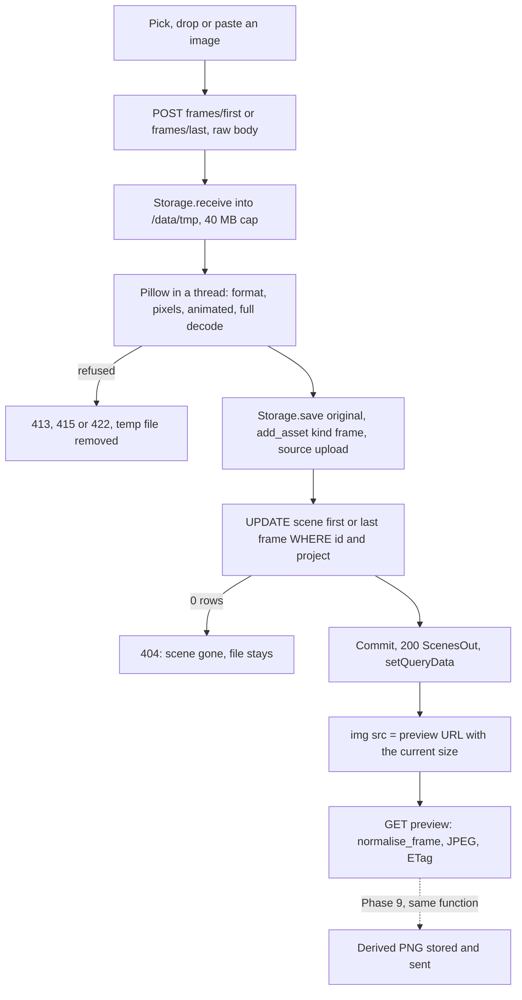

# Phase 8: Scene inputs

The executor's first step is to save this plan as `plans/phase-08-scene-inputs.md`, following the template in Section 4.6 of `ITERATION_1_PHASES.md`.

## 1. Goal and outcome

When this phase is done, you can:

- press **Inputs** on any scene row to open a side drawer for that scene, and move through scenes with **Previous** / **Next**;
- type a description and **Save** it (`scene_description_source = manual`), with live hints for word count, double quotes, "cut to", timestamps and "the video starts with";
- see the **prompt that will be sent**, assembled by the server from the project's style prefix, the saved description and the prompt suffix, plus the project's negative prompt;
- set the first and last frame by clicking the slot (file picker), dropping a file on it, or clicking it and pasting (Cmd+V). Each slot shows the frame **exactly as it will be sent**: RGB, centre-cropped and resized to the project's current generation size. Large crops and enlargements get a warning. **Remove** clears a slot;
- see **Ready** per scene in the table, and "n of m scenes ready" with a list of what each unready scene still needs;
- have non-images, animated images, damaged files and images above the size limits refused with a clear message.



## 2. Findings (2026-10-06)

- **Code.** Phases 1 to 7 are committed (`78033ca`). The migration head is `0002`. No Phase 8 code exists.
- **Schema.** No migration is needed. `scene` already has `scene_description`, `scene_description_source` (CHECK `manual | ai`), `first_frame_asset_id` and `last_frame_asset_id` (FK, `ON DELETE SET NULL`). `asset` has `kind = frame`, `width` and `height`. `scene_cuts.has_inputs` and `NO_INPUTS` already cover all four columns, so Phase 7's inputs rule works for Phase 8's inputs unchanged.
- **Spike 1 has not run.** There is no `spikes/` folder, so there are no Spike 1 defaults. The Project settings form already shows an example negative prompt in its description.
- **Pillow** is not a dependency yet. The current release is **12.3.0**, with a `cp313 manylinux aarch64` wheel.
- **Upload pattern** (Phase 3): the raw request body with `Content-Type: application/octet-stream` (415 otherwise), read with `request.stream()` into `Storage.receive`. No multipart. The Origin middleware already covers every POST.
- **nginx** `location /media/` has a `types` block with audio types only. Phase 3's rule says every new stored file extension must be added there.
- **Proposals and inputs.** `plan_scenes._save` re-checks inputs under the write lock and fails the job if inputs were added while it ran. So editing inputs during a running proposal is safe and needs no blocking.
- **Test data.** Project 5 "The First Light" is **portrait 1088 x 1920**, has 17 scenes, no descriptions or frames, and no guidelines set. There are no frame assets anywhere yet. The app is up and healthy.

## 3. Decisions

Your answers:

- **Normalisation runs on demand.** Only the original upload is stored. The preview is rendered on request at the project's current generation size by `normalise_frame`. Phase 9 calls the same function at submission and stores that exact file as a `derived` frame asset recorded on its job.
- **Drawer layout.** An **Inputs** button on each scene row opens a right-side drawer for that one scene, with Previous / Next. The table gains a Ready column, and the section shows "n of m scenes ready" with a list of what is missing.

Planner choices, each **marked for your approval**:

- **APPROVAL: upload limits.**
  - 40 MB per file and **40 megapixels**. An 8K frame (33 MP) fits.
  - PNG, JPEG and WebP only, decided by Pillow from the content (`Image.open(path, formats=["PNG", "JPEG", "MPO", "WEBP"])`), never from the name.
  - Animated PNG and WebP are refused.
  - **MPO is accepted as JPEG**, using its first image: many camera and iPhone JPEGs open as MPO with more than one frame.
  - Damaged or truncated files are refused (a full `load()` must succeed).
- **APPROVAL: normalisation details** (`NORMALISE_VERSION = 1`):
  1. Apply the EXIF orientation first (`ImageOps.exif_transpose`), so a phone photo comes out the way the browser shows it.
  2. Flatten any transparency onto **white** (`has_transparency_data`).
  3. Scale 16-bit grayscale (`I;16`, `I`) to 8 bits before converting.
  4. Convert everything else with `convert("RGB")`.
  5. Then `ImageOps.fit((gen_width, gen_height), LANCZOS, centering=(0.5, 0.5))`.

  No colour-profile conversion (see Risks). The stored `asset.width` and `height` are the dimensions **as displayed**, after the EXIF orientation.
- **APPROVAL: warnings, not refusals,** computed at read time from the stored size and the current generation size (so they update when the size changes):
  - more than 10% of the width or height is cropped away;
  - the image is enlarged by more than 10%.

  A 1080 x 1920 frame for 1088 x 1920 gets neither warning.
- **APPROVAL: the preview** is a JPEG (quality 92) at the full generation size, rendered by the backend with `normalise_frame`.
  - The framing and size are exactly what Phase 9 sends. Only JPEG compression differs from Phase 9's lossless PNG.
  - Its URL carries the size (`?width=1088&height=1920`). A size that is not the project's current one gets a 404 ("press Refresh"), so a stale page can never show an old framing as current.
  - `ETag` is the asset's hash prefix, the size and `NORMALISE_VERSION`, with `Cache-Control: private, no-cache`. A repeat view answers 304 without Pillow work.
  - At most 2 Pillow tasks run at once (an `asyncio.Semaphore` around `anyio.to_thread.run_sync`), which bounds memory.
- **APPROVAL: the prompt rule** (`assemble_prompt`):
  - `Style: <style_prefix>.` comes first. The full stop is not doubled when the prefix already ends with one, and the part is left out when the prefix is blank.
  - Then the description, with runs of whitespace (line breaks included) turned into single spaces. A full stop is added when it ends without `.`, `!` or `?` and a suffix follows.
  - Then the suffix, with whitespace collapsed.
  - The parts are joined by single spaces. There is no prompt (`None`) while the description is blank.
  - Example: `Style: cinematic-realistic. A lighthouse beam sweeps slowly across a calm night sea. static camera, soft warm light`.
- **APPROVAL: where hints and the preview live.**
  - Hints are UI-only (ANALYSIS.md 5.4: "The UI turns these into small hints"). They are computed live in TypeScript on the draft description.
  - The prompt preview is the server's `prompt` for the **saved** description: one implementation, the one Phase 9 uses. While the draft differs, the preview says "Save to update the prompt."
- **APPROVAL: description storage.** The description is trimmed, and blank becomes NULL in both columns. Otherwise `scene_description_source = 'manual'`. At most 4,000 characters (422 above). Line breaks are kept as typed; the prompt collapses them.
- **APPROVAL: Remove a frame** is included. It sets the column to NULL. The asset row and the file stay.
- **APPROVAL: no Spike 1 defaults.** Phase 8 adds no default and no placeholder (the settings form already shows an example). The drawer shows the project's negative prompt, or "None set" with a link to Project settings. Phase 9 revisits this after Spike 1.
- **Inputs stay editable** while the scenes are out of date or a proposal runs (Phase 6's handler refuses to replace scenes that gained inputs).
- **Every input endpoint answers with the full `ScenesOut`,** which goes straight into the scenes query (`setQueryData`), as Phase 7's edits do. A 404 reloads the scenes.
- **Scenes are addressed by id,** not by index. Ids survive cut edits where a scene continues.

## 4. Changes

### Database

No migration. Update [DATABASE_STRUCTURE.md](DATABASE_STRUCTURE.md):

- Section 4.2: a frame's `width` and `height` are as displayed (after the EXIF orientation), and `provenance` is NULL for uploads.
- Section 7, the "Per scene: description, first/last frame" row:

> Description: `UPDATE scene` sets `scene_description` (trimmed) and `scene_description_source='manual'`; a blank description sets both to NULL. Frame: `INSERT asset` (`kind='frame'`, `source='upload'`, the original file as uploaded), then `UPDATE scene.first_frame_asset_id` or `last_frame_asset_id` in the same transaction. Remove sets the column to NULL; the asset row and file stay. Normalised frames are not stored here: the preview is rendered on request, and Phase 9 stores the exact file it sends as a `derived` frame asset.

### Backend

- **Dependency:** `uv add pillow` (gives `pillow>=12.3.0` in [backend/pyproject.toml](backend/pyproject.toml) and an updated `uv.lock`). In the rebuilt image, check `PIL.features.check("webp")`, `"jpg"` and `"zlib"`.

- New [backend/app/services/frame_images.py](backend/app/services/frame_images.py): Pillow only, no database. The blocking functions run in a thread.

```python
FRAME_MAX_MB: Final = 40
FRAME_MAX_PIXELS: Final = 40_000_000
NORMALISE_VERSION: Final = 1
class FrameRejected(Exception): status_code: int; message: str
@dataclass(frozen=True)
class ImageInfo: ext: str; mime: str; width: int; height: int   # png/jpg/webp, size as displayed
def inspect_image(path: Path) -> ImageInfo                 # blocking; raises FrameRejected (422)
def normalise_frame(image: Image.Image, width: int, height: int) -> Image.Image   # pure; RGB, exact size
def frame_warnings(width: int, height: int, gen_width: int, gen_height: int) -> list[str]  # pure
def render_preview_jpeg(path: Path, width: int, height: int) -> bytes            # blocking
async def run_pillow(fn, *args)                            # Semaphore(2) + anyio.to_thread.run_sync
```

  `inspect_image` gives these messages:
  - "Upload a PNG, JPEG or WebP image." (`UnidentifiedImageError`)
  - "The image is 8000 x 6000 (48 megapixels). The limit is 40 megapixels." (also for `DecompressionBombError`)
  - "Animated images cannot be used as frames."
  - "The image could not be read. It may be damaged." (`OSError` on `load()`)

- New [backend/app/services/scene_prompt.py](backend/app/services/scene_prompt.py) (pure):

```python
def assemble_prompt(style_prefix: str | None, description: str | None, prompt_suffix: str | None) -> str | None
```

- New [backend/app/services/scene_inputs.py](backend/app/services/scene_inputs.py):

```python
MissingInput = Literal["description", "first_frame", "last_frame"]
FrameSlot = Literal["first", "last"]
DESCRIPTION_MAX_CHARS: Final = 4000
def missing_inputs(scene: Scene | Any) -> list[MissingInput]   # pure; the readiness rule
def is_ready(scene: Scene | Any) -> bool                        # pure; not missing_inputs(scene)
class SceneGone(Exception): ...                                  # the UPDATE matched no row
async def set_description(session, project_id, scene_id, text: str | None) -> None   # commits
async def clear_frame(session, project_id, scene_id, slot: FrameSlot) -> None        # commits
async def upload_frame(session, project_id, scene_id, slot, chunks, content_length) -> Asset
    # voiceover pattern: 413 precheck, receive (40 MB), inspect_image via run_pillow, save,
    # add_asset, UPDATE ... WHERE id AND project_id; 0 rows -> rollback, log the
    # unreferenced file, raise SceneGone; commit; one log line
```

- [backend/app/api/scenes.py](backend/app/api/scenes.py):
  - `_scenes_out` becomes public `scenes_out`, and it loads the frame assets of all scenes in one query;
  - `FrameOut {asset_id, width, height, mime, size_bytes, created_at, original_url, preview_url, warnings}`;
  - `SceneOut` gains `scene_description`, `prompt`, `first_frame`, `last_frame`, `missing: list[MissingInput]` and `ready`;
  - `ScenesOut` gains `ready_count`.
- New [backend/app/api/scene_inputs.py](backend/app/api/scene_inputs.py) with its own `router`, included in `api_router` in [backend/app/api/__init__.py](backend/app/api/__init__.py).

### API (tag `scenes`)

All four endpoints answer 404 with a readable message when the project, scene or frame does not exist.

- `PATCH /api/projects/{project_id}/scenes/{scene_id}`
  - Body `SceneUpdate {scene_description: StrictStr | None}`. The field is required, and `extra="forbid"`.
  - 200: `ScenesOut`.
  - 422: "The description must be at most 4,000 characters."
- `POST /api/projects/{project_id}/scenes/{scene_id}/frames/{slot}`, where `slot` is `first` or `last`.
  - The body is the raw file. `openapi_extra` declares an `application/octet-stream` body, as for the voiceover.
  - 200: `ScenesOut`.
  - 413: "The file is larger than 40 MB."
  - 415: wrong content type.
  - 422: "The file is empty." or an `inspect_image` message.
- `DELETE /api/projects/{project_id}/scenes/{scene_id}/frames/{slot}`
  - 200: `ScenesOut`. It succeeds even when the slot is already empty.
- `GET /api/projects/{project_id}/frames/{asset_id}/preview?width=W&height=H`
  - 200: `image/jpeg`, with `ETag` and `Cache-Control: private, no-cache`.
  - 304 on a matching `If-None-Match`.
  - 404 when the asset is not a frame of this project, when its file is missing, or when W x H is not the current generation size ("The generation size has changed. Press Refresh.").
- `GET /api/projects/{project_id}/scenes`: as before, plus the new fields.

### Frontend

- [frontend/nginx.conf](frontend/nginx.conf): add `image/png png; image/jpeg jpg; image/webp webp;` to the `/media/` `types` block.
- [frontend/src/api/scenes.ts](frontend/src/api/scenes.ts): export `scenesKey`. [frontend/src/api/projects.ts](frontend/src/api/projects.ts): export `uploadError`.
- New [frontend/src/api/sceneInputs.ts](frontend/src/api/sceneInputs.ts):
  - the types `Frame`, `FrameSlotName` and `MissingInput`, and the constant `FRAME_MAX_MB = 40`;
  - the hooks `useSaveDescription`, `useUploadFrame` (raw `fetch` with octet-stream, refusing files over 40 MB before sending) and `useRemoveFrame`;
  - on success each hook calls `setQueryData(scenesKey)`, and on a 404 it invalidates the scenes.
- New [frontend/src/components/projects/promptHints.ts](frontend/src/components/projects/promptHints.ts) (pure): `countWords` and `promptHints(description): string[]`. The hints:
  - more than 200 words;
  - `"`, `“`, `”` or `„`;
  - `/\bcut to\b/i`;
  - timestamps: `/\b\d{1,2}:\d{2}\b/` or `/\b\d+(\.\d+)?\s?(sec|secs|second|seconds)\b/i` (not a bare `s`, so "the 1920s" does not trigger it);
  - `/\bthe video (starts|begins) with\b/i`.

  Plus `missingText(missing)`, for example "description and last frame".
- New [frontend/src/components/projects/FrameSlot.tsx](frontend/src/components/projects/FrameSlot.tsx) and `FrameSlot.module.css`:
  - The slot is a focusable `div` (`role="button"`, `tabIndex={0}`, with an `aria-label`):
    - a click opens a hidden file input (accept `image/png,image/jpeg,image/webp`);
    - `onDragOver` and `onDrop` take the first file, and the slot is highlighted while dragging;
    - `onPaste` takes the first `clipboardData` file of type `image/*`.
  - **Filled:** the `` of `preview_url`, with the generation aspect ratio; a line such as "Original 4032 x 3024 JPEG · 3.1 MB · Open the original" (linking the `/media` URL); the warnings in orange; **Replace** and **Remove**.
  - **Empty:** a dashed box: "First frame: click to choose, drop an image, or click here and paste".
  - A loader overlay while uploading, and an `Alert` with `describeError` on failure.
- New [frontend/src/components/projects/SceneInputsDrawer.tsx](frontend/src/components/projects/SceneInputsDrawer.tsx):
  - It takes `project`, `scenes`, `sceneId`, `onSelect` and `onClose`, and reads its scene from the query data, so it updates after every save.
  - It renders nothing when the scene no longer exists.
  - The title is "Scene 3 · 4.20 – 8.36 s". Below it: the scene's text (dimmed) and a Ready badge or "Needs: ...".
  - **Description editor:** an inner component keyed by scene id and saved text (the ScriptSection draft pattern), with a word count, the live hints and **Save**.
  - **Prompt preview:** the server's `prompt`, or "Add a description to see the prompt". While the draft is unsaved it also says "Save to update the prompt". Then the "Negative prompt: ..." line.
  - "Frames are cropped from the centre and resized to W x H for the video model. The previews show exactly that." Then the two `FrameSlot`s in a `SimpleGrid cols={2}`.
  - **Previous** / **Next**, disabled while the draft is unsaved. While it is unsaved, `closeOnClickOutside` and `closeOnEscape` are also off, so typed text is not lost by accident.
- [frontend/src/components/projects/ScenesSection.tsx](frontend/src/components/projects/ScenesSection.tsx):
  - a new "Inputs" column: a green "Ready" badge or the dimmed `missingText`, and an **Inputs** button;
  - a summary line "7 of 17 scenes ready", with a **Show what is missing** toggle that lists "Scene 3: description and last frame";
  - drawer state (`inputsSceneId`).
- Run `npm run gen:api` and commit `schema.d.ts`.

### Configuration

No new setting. One backend dependency (Pillow). One nginx change (image types). The frontend image needs rebuilding.

## 5. Reading list for the executor

- `ANALYSIS.md`:
  - 4.2, and 4.3's design notes (readiness is computed; frames are assets);
  - 4.4, the last paragraph;
  - 5.3, "Other facts" (RGB, crop, multiples of 64);
  - 5.4 (all);
  - 5.7;
  - 5.9, the rows on frame mismatch, badly written prompts and upload abuse.
- `DATABASE_STRUCTURE.md`: 4.2, 4.4, 5 (`asset.provenance` and the illustrative `generate_clip` input), 7 and 8.
- `ITERATION_1_PHASES.md`: Section 4, the Phase 8 section, and the Phase 3, 6 and 7 log entries.
- Backend code:
  - [storage.py](backend/app/services/storage.py), [assets.py](backend/app/services/assets.py) and [voiceover.py](backend/app/services/voiceover.py) (the upload pattern to copy);
  - [api/projects.py](backend/app/api/projects.py) (`load_project`, `_content_length`, the octet-stream checks);
  - [api/scenes.py](backend/app/api/scenes.py), [services/scenes.py](backend/app/services/scenes.py) and [scene_cuts.py](backend/app/services/scene_cuts.py) (`has_inputs`, `NO_INPUTS`).
- Frontend code:
  - [api/projects.ts](frontend/src/api/projects.ts) (`useUploadVoiceover`, `uploadError`) and [api/scenes.ts](frontend/src/api/scenes.ts);
  - [ScenesSection.tsx](frontend/src/components/projects/ScenesSection.tsx) and [ScriptSection.tsx](frontend/src/components/projects/ScriptSection.tsx) (the draft pattern);
  - [CutEditor.tsx](frontend/src/components/projects/CutEditor.tsx) with its CSS module (the CSS module pattern).

## 6. Steps in order

1. Save this plan. Run `uv add pillow` and rebuild the backend. Write `frame_images.py`, `scene_prompt.py`, and the pure part of `scene_inputs.py`. Generate the test images (list in Section 7) on the Mac with `backend/.venv/bin/python` into `/tmp/p8` (not the repo). Check them with a throwaway in-container `python -c`:
   - every mode comes out RGB at 1088 x 1920;
   - the EXIF-6 marker is at the top;
   - transparency is white;
   - the 16-bit gradient is not all white;
   - the MPO opens as JPEG;
   - the warnings and the prompt examples are as in Section 3.
2. Add the endpoints, the extended `ScenesOut` and the nginx types, and rebuild both images. Check acceptance checks 1, 3 (server part), 4 (API), 5, 7, 8 and 9 with curl. This is the natural break point.
3. Frontend: `gen:api`, the hooks, `promptHints.ts`, `FrameSlot`, `SceneInputsDrawer` and the table changes. Check in the browser.
4. Update DATABASE_STRUCTURE.md Sections 4.2 and 7.
5. Run every acceptance check, the linters and the earlier phases' main flow. Write the phase log entry.

## 7. Acceptance checks

All checks are on project 5 (portrait, 1088 x 1920) unless stated. Display numbers are 1-based.

"The dump" is the read-only query below, run in the backend container:

```sql
SELECT id, "index", scene_description, scene_description_source, first_frame_asset_id, last_frame_asset_id
FROM scene WHERE project_id = 5 ORDER BY "index";
```

Along with it, count `asset` rows with `kind='frame'`.

The test images, generated in `/tmp/p8`:

- `rgb_3000x2000.png`: thirds red, green and blue;
- `gray_L.png`;
- `palette_P_transparent.png`;
- `rgba.png`;
- `exif6.jpg`: stored 2000 x 1500, orientation 6, with a marker drawn at the top as displayed;
- `cmyk.jpg`;
- `frame.webp`;
- `gray16.png`;
- `two_frames.mpo`;
- `small_500x900.png`;
- the files that must be refused: `fake.png` (text), `anim.webp`, `anim.png` (APNG), `img.gif`, `big_8000x6000.png` (48 MP, flat colour, small file), `huge.bin` (41 MB), `empty.png` (0 bytes) and `truncated.png`.

1. **Formats and framing.** Upload each accepted image by curl, then fetch its `preview_url` and open it with Pillow.
   - Every preview is `(1088, 1920)`, mode `RGB`.
   - `rgb_3000x2000.png`: the centre pixel is green, a pixel 5 px from the left edge is red, and the frame shows the "about 43% of the width is cropped" warning.
   - `exif6.jpg`: the marker is at the top.
   - The palette and RGBA images: the transparent areas are white.
   - `gray16.png`: a visible gradient.
   - `small_500x900.png`: the "enlarged" warning.
   - In the browser, the drawer shows the same images.
   - The originals open from "Open the original" with `Content-Type` `image/png`, `image/jpeg` or `image/webp`.
2. **Paste and drop.** In Chrome:
   - copy an image (for example "Copy image" in a browser tab), click the empty Last frame slot and press Cmd+V: the frame is set with one POST;
   - drag a file from Finder onto the First frame slot: it is set.

   The headless check dispatches a `paste` `ClipboardEvent` carrying a `DataTransfer` with a PNG `File` on the focused slot.
3. **Prompt.** Set project 5's style prefix to `cinematic-realistic` and its suffix to `static camera, soft warm light`, then save the description `A lighthouse beam sweeps slowly across a calm night sea`.
   - The preview is exactly `Style: cinematic-realistic. A lighthouse beam sweeps slowly across a calm night sea. static camera, soft warm light`.
   - With the style blank, there is no `Style:` part.
   - Typing each of these shows its hint live, before saving: `He says "hi"`, `then cut to the shore`, `at 0:03`, `The video starts with a beach`, and a 201-word text.
   - Restore both guidelines to blank afterwards.
4. **Readiness.** On one scene, step by step, with the dump and the summary after each step:
   - nothing set: "Needs: description, first frame and last frame", count n;
   - description: still not ready;
   - first frame: still not ready;
   - last frame: Ready, count n+1;
   - Remove the first frame: not ready, count n. The asset row and file still exist;
   - blank the description: NULL in both columns.

   The "Show what is missing" list matches the dump.
5. **Refused uploads (curl).** Each file in the "refused" list answers with a readable message, and the dump and the frame asset count are unchanged:
   - 422 for the text, GIF, both animations, the truncated file and the 48 MP image ("40 megapixels");
   - 413 for `huge.bin`;
   - 422 "The file is empty.";
   - 415 with a `Content-Type: image/png` header;
   - 403 for a POST with `Origin: https://evil.example`.

   `/data/tmp` is empty afterwards.
6. **Inputs rule through the UI.** Set a description and both frames on scene 3 in the drawer. Then, in Edit cuts, move the cut between scenes 3 and 4.
   - The modal names scene 3. Cancel leaves the dump unchanged.
   - Confirm clears scene 3's three columns only, and the ready count drops. The frame asset rows and files still exist.
7. **Generation size change.** Set project 5's generation size to 1152 x 1920.
   - After Refresh, the previews are 1152 x 1920, and the warnings are recomputed.
   - The old preview URL answers 404.
   - Restore 1088 x 1920.
8. **Description rules.**
   - `"  text  "` is stored as `text` with source `manual`.
   - `"   "` and `null` store NULL in both columns.
   - 4,001 characters gives 422.
   - `{}` and an extra field give FastAPI's 422.
9. **Wrong ids.** A scene id of another project, a missing scene id, and a preview for the voiceover asset's id each give 404. Changing nothing.
10. **Caching.** A second GET of the same preview with `If-None-Match` answers 304, and the backend log shows no second render.
11. **No polling.** The project page idle for 60 s with the drawer open makes no requests.
12. **Persistence.** After `docker compose restart backend`, descriptions and frames are still there. The files under `/data/media/5/` have generated names.
13. **Definition of done.**
    - ruff, tsc and ESLint are clean, and `schema.d.ts` is regenerated.
    - `alembic check` is clean at `0002`.
    - `docker compose up --build` works on the existing volume.
    - Projects, voiceover (206 range request), settings, the contract, transcription, the proposal and cut editing still work.
    - No API response contains the key.
14. **Your frames.** Set your own frame pairs on a few of the sample's scenes, and confirm by eye that the previews are the framing you expect.

## 8. Out of scope

- AI drafting of descriptions or frames.
- Reusing a frame across scenes, and chaining.
- Generation.
- Storing normalised files (that is Phase 9, at submission).
- Choosing the crop position.
- Colour-profile conversion.
- Thumbnails in the table.
- Hints on the guidelines.
- Playing the scene from the drawer.
- Undo.
- Deleting assets or files.
- Negative prompt defaults (after Spike 1).
- Automated tests.

## 9. Risks

- **A Pillow mode converts badly** (16-bit, CMYK, MPO): adjust the conversion in `normalise_frame` (allowed), and record it in the log. Stop and ask only if a format in acceptance check 1 cannot be made to work.
- **`onPaste` does not fire on a focused `div`** in Chrome: fall back to a `window` paste listener that acts only while a slot has focus. Adjust; no need to ask.
- **Wide-gamut photos** (iPhone Display P3): without profile conversion they look slightly duller after normalisation. The preview shows the truth. Record it in the log as a known limitation.
- **A race with a cut edit** (the scene is merged away during an upload): 404, and the stored file stays unreferenced, logged as for the voiceover. This is acceptable.
- **To record in the phase log for Phase 9:**
  - at submission, call `frame_images.normalise_frame` at the project's then-current generation size;
  - store the result as a PNG `asset` (`kind='frame'`, `source='derived'`, `provenance {derived_from_asset_id, width, height, normalise_version}`), reusing an existing one with identical provenance, and put its id in `job.input`;
  - readiness is `scene_inputs.missing_inputs`, and the prompt is `scene_prompt.assemble_prompt`;
  - no new input column was added, so `has_inputs` and `NO_INPUTS` are unchanged.
