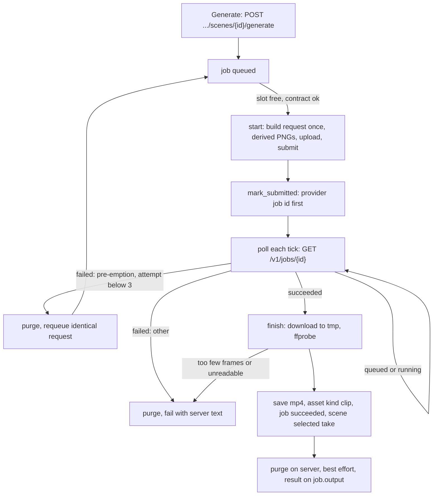

# Phase 9: Clip generation

The executor's first step is to save this plan as `plans/phase-09-clip-generation.md`, following the template in Section 4.6 of `ITERATION_1_PHASES.md`.

## 1. Goal and outcome

When this phase is done, you can:

- press **Generate** on a ready scene (in the table or in its drawer). The clip is made by LTX keyframe interpolation from the scene's two frames and its prompt. Several scenes run at once, up to the "Maximum parallel clip generations" setting, which is read on every tick;
- see each scene's clip status and phase, the elapsed time against the server's typical time, and any error text; **Cancel** a queued or running job (the running one is cancelled on the server too);
- watch every take, with its sound, in the scene's drawer; **Regenerate** (a new job, a new seed, a new take); **Use this take**; switch the scene's clip sound on or off for the final video;
- press **Generate all ready scenes (n)**. It asks first, then starts every ready scene that has no clip and no active job;
- rely on it through backend restarts, a dead GPU URL, pre-emption and a changed GPU API.



## 2. Findings (2026-10-06)

- **Code.** Phases 1 to 7 are committed (`78033ca`). Phase 8 is complete but not committed. The migration head is `0002`. No Phase 9 code exists. The dispatcher, the `JobHandler` interface, `store`, `gpu_server` (`upload_file`, `submit_job`, `job_status`), `contract_guard.check()`, `frame_images.normalise_frame` and `run_pillow`, `scene_inputs.missing_inputs` and `scene_prompt.assemble_prompt` are all in place and are reused as they are.
- **Schema.** No migration is needed. `job` has `scene_id`, `provider_job_id`, `attempt`, `input`, `output` and `result_asset_id`. `asset` allows `kind='clip'`, `source='ai'` and `source='derived'`. `scene` has `use_clip_sound` and `selected_clip_asset_id`, and both `has_inputs` and `NO_INPUTS` already cover `selected_clip_asset_id`.
- **Spike 1 has not run.** As you decided, this plan works from the approved snapshot (`api_snapshot` rows 1 and 9, `api_version` 0.3.0). The live guide still has the approved `content_hash` (`sha256:00197efee9fe...`), and the server is up.
- **Keyframe request (`KeyframeInterpolationRequest`, approved spec):**
  - required: `prompt` (at least 1 character) and `keyframes` (at least 2 entries of `{asset_id, frame_idx >= 0, strength 0..1, crf?}`);
  - optional: `width` and `height` (both or neither, and not together with `orientation`), `num_frames` (minimum 9, snapped to 8k+1, not with `duration_seconds`), `frame_rate` (default 24), `seed` (default 10), `negative_prompt` and `partition`;
  - there is **no `enhance_prompt`** field (only `/generate` has one), so "enhance_prompt off" holds by not sending it.
- **Other operations:**
  - `GET /v1/jobs/{id}` adds `pipeline`, `partition`, `created_at`, `started_at`, `finished_at`, `typical_run_seconds` and `typical_basis`;
  - `DELETE /v1/jobs/{id}` answers `{cancelled, reason}`, and a cancelled job later reports `failed`;
  - `DELETE /v1/jobs/{id}/purge` answers `{job_id, removed_asset_ids, kept_asset_ids}`, and gives 409 while the job is queued or running;
  - `GET .../result` streams `video/mp4`, with 409 (not finished) and 410 (expired).
- **Guide facts that shape decisions:**
  - `negative_prompt` *replaces* the server's built-in default;
  - pre-emption is either a `failed` job whose error says so, or a job that keeps reporting `running` through an automatic restart;
  - there is a 30-minute wall-clock limit per job;
  - expect 5 to 8 minutes per run, plus any queue wait;
  - `ImageConditioning.crf` defaults to 33.
- **Phase log rules to follow:**
  - Phase 2: `download_to_file` goes in `outbound`, and exact paths only.
  - Phase 5: the handler pattern, store helpers, `GpuCallError` kinds, `nudge()`, and Resubmit for "not found".
  - Phase 6: refuse a proposal while a clip job is active (`replace_scenes` cascades to jobs).
  - Phase 7: refuse an edit that touches a scene with an active clip job; a take goes out of date when the scene's range changes.
  - Phase 8: derived PNG frames, `missing_inputs`, `assemble_prompt`, and `video/mp4` in nginx.
- **Test data.** Project 5 "The First Light" is portrait 1088 x 1920 at 24 fps, with a 2 to 6 s range and 17 scenes (1.16 to 5.56 s), none with inputs. It has no negative prompt. Project 6 has a 12.8 s scene, which is good for the over-maximum check.

## 3. Decisions

Your answers:

- Plan without Spike 1. Use keyframe interpolation, with no default negative prompt. The first acceptance run records the real output facts. The spike can run later for quality guidance.
- An automatic resubmission (pre-emption, a 410 result, Resubmit after "not found") sends the **identical stored request**: the same seed and the same derived frames, re-uploaded. A new seed comes only with a new job (Generate or Regenerate).
- **Generate is refused** for a scene longer than the project's maximum scene length: "This scene is 7.20 s long, more than the project's maximum of 6 s. Change its cuts, or raise the maximum in Project settings."
- **Generate all** starts ready scenes that have no selected clip, no active clip job and no block.

Planner choices, each **marked for your approval**:

- **APPROVAL: a resubmission reuses the job row** with `attempt + 1`, using Phase 5's `store.requeue(next_attempt=True)` and `resubmit_job`. "Up to 3 attempts" is `phases.MAX_ATTEMPTS`.
- **APPROVAL: Generate all asks first**, in a modal: "Start 12 clip generations? Each uses one GPU for about 5 to 10 minutes; at most 2 run at once. Scenes that already have a clip are skipped." The count comes from the server (`ScenesOut.generate_ready_count`).
- **APPROVAL: the request.**
  - Send `width` and `height` (the project's generation size) instead of `orientation`; `num_frames` from the frame-count function; `frame_rate` set to the project's fps; and `seed = secrets.randbelow(2**31)`.
  - Keyframes: the first at `frame_idx` 0 and the last at `num_frames - 1`, both with `strength` 1.0. `crf` is not sent, so the pipeline's default applies.
  - `negative_prompt` is sent only when the project has one (otherwise the server's built-in default applies), and `partition` only when the setting is not blank.
- **APPROVAL: the request is built once, at the first start**, from the scene and project as they are then: prompt, frames, size and fps. It is stored in `job.input.request` before any upload, and every later attempt reuses it.
- **APPROVAL: the frames sent** follow Phase 8's rule. `normalise_frame` runs through `run_pillow`, and the result is a PNG `asset` (`kind='frame'`, `source='derived'`, provenance `{derived_from_asset_id, width, height, normalise_version}`), reused when identical. Two jobs that normalise the same frame at the same moment may store two identical rows, which is harmless.
- **APPROVAL: verifying a clip** with ffprobe.
  - There must be a video stream, and its frame count (counted packets) must be at least the target frame count.
  - Size, fps and audio (codec, sample rate, channels, or none) are recorded but never fail the job.
  - Failing verification fails the job: "The clip has 96 frames; the scene needs 101. Regenerate to try again."
- **APPROVAL: a new take becomes the selected take** (DB Section 7). Any earlier take of the scene can be selected again.
- **APPROVAL: purge**, best effort, after a clip is stored, and after the server reports a final `failed` state (including before a pre-emption resubmission, which re-uploads). The response or the error is recorded in `job.output.purge`. Cancelled jobs are not purged: the server still reports them running for a moment, and their uploads stay on the server.
- **APPROVAL: Cancel of a running clip job.**
  - The cancel endpoint first calls `DELETE /v1/jobs/{id}` with the current GPU URL. If the server does not answer, the endpoint returns 503 ("The GPU server did not answer, so the job was not cancelled. Try again.") and changes nothing.
  - If the server answers, whatever it says, the job becomes `cancelled`, and the answer is stored in `output.cancel`.
  - Cancel answers 409 while the job is "downloading the clip" or "checking the clip".
  - A job cancelled while it was still uploading cancels its server job right after the submit returns (when `mark_submitted` returns False).
- **APPROVAL: cut edits are refused per scene, not project-wide.** `edit_cut` answers 422 when a scene it would change has an active clip job: "Scene 3 has a clip being generated. Wait for it to finish, or cancel it, before changing this cut."
  - This deviates from the Phase 7 log's hint "add it to `cuts_view`". That hint would freeze all cut editing for the whole batch, which can be an hour.
- **APPROVAL: proposals are refused while any clip job of the project is active.** The propose endpoint answers 422, and `PlanScenesHandler._save` re-checks under its write lock and fails the proposal, because `replace_scenes` would cascade-delete those jobs.
- **APPROVAL: Generate is refused** while a proposal is active, while the scenes are out of date, when the scene is not ready, when it is over the maximum, or when it has less than one frame. One pure function, `generation_block`, gives the reason. It is used by the endpoint, the button's disabled state and Generate all.
- **APPROVAL: the spec limits.** At submission the handler reads the approved OpenAPI body and checks `num_frames` against the schema's `minimum` and `maximum` (a maximum, if one ever appears), and the sizes against multiples of 64. A missing keyframe endpoint fails the job: "The approved GPU API has no keyframe-interpolation endpoint."
- **APPROVAL: takes** are the scene's succeeded `generate_clip` jobs with their clip asset, newest first.
  - A take is **out of date** when its recorded `scene_start_s` or `scene_end_s` differs from the scene's (by more than 0.0005 s).
  - A take is **too short** when its frame count is below the scene's current target frame count.
- **APPROVAL: the UI layout.**
  - The scenes table gets a **Clip** column: status and phase, elapsed against typical, Generate or Regenerate (disabled with the reason as a tooltip), and `JobActions`.
  - The existing scene drawer gets a **Clip** section with the takes, the players, Use this take, and the clip sound switch.
- **APPROVAL: download limits** of 1 GB and 600 s. The clip goes to `/data/tmp` and moves into `/data/media` only after ffprobe passes.
- **APPROVAL: GPU runs for the checks:** about 8 to 10 runs of 5 to 10 minutes each, never more than 2 at once. Before the checks, set the maximum parallel generations to 2 (rule 4.1.3), and leave it at 2.

## 4. Changes

### Database

No migration. Update [DATABASE_STRUCTURE.md](DATABASE_STRUCTURE.md):

- Section 5: replace the illustrative `generate_clip` input with the real shapes below, and add its `output`, the clip `asset.provenance` and the derived-frame provenance.
- Section 7: update the "Generate one clip per scene" row (derived frames, the request built once, the asset and the selected take in one transaction, purge) and the "Preview, regenerate or mute" row (select take, `use_clip_sound`).
- Section 8, item 5: `generate_clip` is now built against the real server.

The shape of `job.input`:
- at creation: `{requested: "generate" | "generate_all"}`;
- after the first start, it adds `scene {index, start_s, end_s}`, `fps`, `target_frames`, `first_frame` and `last_frame` (each `{original_asset_id, sent_asset_id}`), `endpoint` and `request` (the body without the keyframe asset ids);
- after each submission, it adds `server_url`, `uploads [{asset_id, filename, size_bytes, remote_asset_id}]` and `body`, the exact JSON sent.

The shape of `job.output`:
- while running: `{remote: {status, pipeline, partition, typical_run_seconds, typical_basis}}`;
- on success: `{clip: {frame_count, target_frames, num_frames, width, height, fps, duration_s, audio}, remote: {..., created_at, started_at, finished_at}, purge: {removed_asset_ids, kept_asset_ids} | {error}}`;
- after a cancel, it also holds `cancel: {cancelled, reason}`.

### Backend

- New [backend/app/services/frame_counts.py](backend/app/services/frame_counts.py). It is pure, and **Phase 10 must reuse it**:

```python
MIN_NUM_FRAMES: Final = 9
def boundary_frame(time_s: float, fps: int) -> int          # floor(time_s * fps + 0.5)
def target_frames(start_s: float, end_s: float, fps: int) -> int   # boundary(end) - boundary(start)
def request_num_frames(target: int) -> int                  # max(9, 8 * ceil((target - 1) / 8) + 1)
```

- New [backend/app/providers/video_generator.py](backend/app/providers/video_generator.py), the `VideoGenerator` of Section 6.4:

```python
KEYFRAME_PATH: Final = "/v1/ltx/videos/keyframe-interpolation"
@dataclass(frozen=True) class FrameLimits: min_frames: int; max_frames: int | None
def frame_limits(spec: dict) -> FrameLimits        # ValueError when the endpoint or schema is missing
def build_request(*, prompt, negative_prompt, width, height, num_frames, fps, seed, partition) -> dict
def with_keyframes(request: dict, first_remote_id: str, last_remote_id: str) -> dict
async def upload_frame(base_url, path: Path, filename: str) -> str   # gpu_server.upload_file, image/png
async def submit(base_url, body: dict) -> str
async def status(base_url, provider_job_id) -> gpu_server.RemoteStatus
async def download(base_url, provider_job_id, dest: Path) -> outbound.DownloadResult
async def cancel(base_url, provider_job_id) -> CancelAnswer      # {cancelled, reason}
async def cleanup(base_url, provider_job_id) -> PurgeAnswer      # {removed, kept}
```

- [backend/app/providers/gpu_server.py](backend/app/providers/gpu_server.py):
  - `RemoteStatus` gains `pipeline`, `partition`, `typical_run_seconds`, `typical_basis`, `created_at`, `started_at` and `finished_at`. The additions are optional, so transcription is unaffected.
  - New shared calls: `cancel_job` (DELETE), `purge_job` (DELETE `.../purge`) and `download_result` (on `outbound.download_to_file`). Errors map to `GpuCallError` as before.
- [backend/app/core/outbound.py](backend/app/core/outbound.py):
  - `MEDIA_MAX_BYTES = 1 GiB`, `DownloadResult {url, status_code, headers, size_bytes, sha256, error_body}`, and `download_to_file(url, dest, *, timeout_s, max_bytes)`.
  - It keeps every check of `request()`.
  - On 200 it streams into `dest`, opened with `"xb"`, counting and hashing as it goes.
  - Otherwise it reads up to `JSON_MAX_BYTES` into `error_body` and writes no file.
  - `dest` is removed on any failure.
- [backend/app/services/storage.py](backend/app/services/storage.py): `new_temp_path(suffix) -> Path` inside `tmp_dir`. Callers build a `TempFile` for `save`.
- [backend/app/services/ffmpeg.py](backend/app/services/ffmpeg.py): `VideoProbe {width, height, fps, frame_count, duration_s, audio: AudioStream | None}` and `probe_video(path)`. It uses `-count_packets`, and `frame_count` is the first video stream's `nb_read_packets`. It returns None when the file cannot be read or has no video stream.
- [backend/app/services/frame_images.py](backend/app/services/frame_images.py): `render_frame_png(path, width, height) -> bytes`. It is blocking and uses `normalise_frame`.
- New [backend/app/services/derived_frames.py](backend/app/services/derived_frames.py): `async def frame_to_send(session, original: Asset, width, height) -> Asset`.
  - It looks for an identical derived row with `json_extract` on the provenance.
  - Otherwise it renders through `run_pillow`, saves a `.png` through `Storage`, calls `add_asset` and commits.
  - No transaction stays open during the Pillow work.
- New [backend/app/services/clips.py](backend/app/services/clips.py):
  - `GENERATE_JOB`, and `active_clip_jobs(session, project_id) -> dict[int, Job]`;
  - `takes_by_scene(session, project_id) -> dict[int, list[Take]]`: one query joining the succeeded jobs to their assets;
  - `generation_block(scene, project, *, scenes_blocked, active) -> str | None` (pure);
  - `select_take(...)` and `set_clip_sound(...)`. Both commit and raise `SceneGone`, or `TakeNotFound` for an asset that is not a take of this scene.
- [backend/app/jobs/phases.py](backend/app/jobs/phases.py): `PREPARING_FRAMES`, `UPLOADING_FRAMES`, `DOWNLOADING_CLIP` and `CHECKING_CLIP`.
- [backend/app/jobs/store.py](backend/app/jobs/store.py):
  - `record_poll(..., output=None)` also stores the `remote` progress;
  - `merge_output(session, job_id, values)` for a succeeded or cancelled job;
  - `REMOTE_CANCEL_TYPES = {"generate_clip"}`;
  - `can_cancel` also allows a running job of those types outside the two finishing phases, and `cancel_job` accepts it;
  - `needs_remote_cancel(job)`: running, with a provider job id, and not "not found".
- New [backend/app/jobs/generate_clip.py](backend/app/jobs/generate_clip.py): `GenerateClipHandler`, with `provider="gpu"`, `restart_rule="resume"`, and `concurrency_limit` set to `get_int("max_parallel_generations")`. It follows `transcribe.py`'s structure, and every row of Section 5.8 is mapped:
  - **start:**
    - On the first attempt (no `request` stored yet): re-check `generation_block`; compute the target and `num_frames`; check the approved spec's limits and the multiples of 64; draw the seed; make the derived frames; then `store.update_input`.
    - Upload both PNGs, then submit. A 502 is retried once after 5 s. A 400 "invalid asset reference" re-uploads once. A 429 requeues as busy. "Unreachable" requeues. A 422 or any other 4xx fails with the server's message ("not retried automatically").
    - Then `mark_submitted` with the full input, and nothing in between. If it returns False, cancel on the server, best effort.
  - **poll:** `queued` and `running` record the phase and `remote`. `succeeded` hands over to `finish`. On `failed`, purge first. Then a pre-emption with `attempt < 3` is requeued as `preempted(n)`; anything else fails with "The GPU server reported an error: ...". A `GpuCallError` maps as in `_phase_for_poll_error`, with 404 giving "not found on this server".
  - **finish:**
    - Download into a temp `.mp4`. A 409 waits for the next tick. A 410 is requeued as `EXPIRED` with the next attempt. A 404 shows "not found".
    - Check with `probe_video`.
    - Then `Storage.save`, and in one transaction: `add_asset(kind='clip', source='ai', mime='video/mp4', ...)`, `finish_job(output, result_asset_id)` and `UPDATE scene SET selected_clip_asset_id` (WHERE id AND project_id). If `finish_job` returns False, roll back and log the unreferenced file.
    - Then `cleanup` and `merge_output({"purge": ...})`.
  - The clip asset's `provenance`: `{provider: "gpu", pipeline, endpoint, server_url, provider_job_id, job_id, scene_id, scene_start_s, scene_end_s, prompt, negative_prompt, seed, fps, num_frames, target_frames, frame_count, first_frame_asset_id, last_frame_asset_id, audio}`, where the frame ids are the derived ones.
- [backend/app/jobs/__init__.py](backend/app/jobs/__init__.py): register `GenerateClipHandler`.
- [backend/app/providers/contract_guard.py](backend/app/providers/contract_guard.py): a public `approved_bodies(session) -> list[dict]`, holding the current sources' approved bodies, which the handler searches for the keyframe schema.
- [backend/app/jobs/plan_scenes.py](backend/app/jobs/plan_scenes.py): `_save` fails the proposal when `active_clip_jobs` is not empty after `finish_job` takes the lock.

### API

- New [backend/app/api/clips.py](backend/app/api/clips.py), included in `api_router`. Every endpoint starts with `scenes_service.lock_scenes`, like `edit_cut`, then refreshes.
  - `POST /api/projects/{pid}/scenes/{sid}/generate` answers 202 with `JobDetail`. It gives 404 for a missing project or scene, and 422 with the `generation_block` reason. A second click returns the active job.
  - `POST /api/projects/{pid}/generate-ready-scenes` answers 202 with `GenerateReadyOut {jobs: list[JobSummary], created: int}`. It gives 422 when the scenes are blocked (a proposal is active or they are out of date), and an empty list is fine.
  - `POST /api/projects/{pid}/scenes/{sid}/select-take` takes `{asset_id: StrictInt}` and answers 200 with `ScenesOut`, or 404.
  - `PUT /api/projects/{pid}/scenes/{sid}/clip-sound` takes `{use_clip_sound: StrictBool}` and answers 200 with `ScenesOut`, or 404.
  - Every request model uses `extra="forbid"`.
- [backend/app/api/scenes.py](backend/app/api/scenes.py):
  - `TakeOut {asset_id, job_id, url, created_at, seed, frame_count, target_frames, duration_s, audio_codec, selected, out_of_date, too_short}`.
  - `SceneOut` gains `use_clip_sound`, `selected_clip_asset_id`, `target_frames`, `clip_job: JobSummary | None` (from `store.latest_jobs_by_scene`), `clip_typical_run_seconds`, `generate_blocked_reason` and `takes`.
  - `ScenesOut` gains `generate_ready_count` and `max_parallel_generations`.
  - `propose_scenes` answers 422 while clip jobs are active ("Clips are being generated for 3 scenes. Wait for them, or cancel them, before proposing scenes.").
  - `edit_cut` answers 422 when an affected scene has an active clip job.
- [backend/app/api/jobs.py](backend/app/api/jobs.py): `cancel` calls `video_generator.cancel` first when `store.needs_remote_cancel(job)` holds, after ending its read transaction. It answers 503 when the server is unreachable, 409 while downloading or checking, and calls `nudge()` afterwards.

### Background job

- States: `queued` → `running` → `succeeded`, `failed` or `cancelled`.
- Phases while queued: "waiting to start", "waiting for a free slot", "paused: GPU API changed", "waiting: GPU server unreachable", "waiting: server busy (HTTP 429)", "pre-empted: submitting again (attempt n of 3)", and "expired on the server: submitting again".
- Phases while running: "starting", "preparing the frames", "uploading the frames", "submitting", "queued on cluster", "running on cluster", "downloading the clip", "checking the clip", "GPU server unreachable, checking again", and "not found on this server".
- **On restart:** `resume`. A job with a provider job id keeps being polled, and an interrupted download simply runs again, because `/data/tmp` is emptied at start. A job without a provider job id is queued again and reuses its stored `request`.

### Frontend

- [frontend/nginx.conf](frontend/nginx.conf): add `video/mp4 mp4;` to the `/media/` `types` block.
- New [frontend/src/api/clips.ts](frontend/src/api/clips.ts):
  - `Take` type;
  - `useGenerateClip` and `useGenerateReadyScenes`: on success they call `invalidateAfterJobAction`, which already covers the scenes key under `PROJECTS_KEY`;
  - `useSelectTake` and `useSetClipSound`: on success they call `setQueryData(scenesKey)`, and a 404 reloads the scenes.
- [frontend/src/components/jobs/jobFormat.ts](frontend/src/components/jobs/jobFormat.ts): `typicalText(seconds)` gives "typically about 6 min".
- New [frontend/src/components/projects/clipView.ts](frontend/src/components/projects/clipView.ts) (pure): `takeLine(take)` gives "seed 123456 · 105 frames · 4.38 s · sound: aac", and `clipCell(scene)` gives "Take 2 of 3" or "No clip".
- New [frontend/src/components/projects/SceneClipSection.tsx](frontend/src/components/projects/SceneClipSection.tsx), rendered at the bottom of `SceneInputsDrawer`:
  - Generate or Regenerate, with the block reason shown;
  - the job's badge, phase, elapsed and typical time, and `JobActions`;
  - the error text in a red `Alert`;
  - the "Use this scene's clip sound in the final video" `Switch`;
  - takes, newest first: `<video controls preload="metadata">` keyed by asset id, in the generation aspect ratio; a Selected badge or **Use this take**; and orange notes for out of date or too short;
  - empty state: "No clip yet."
- [frontend/src/components/projects/SceneInputsDrawer.tsx](frontend/src/components/projects/SceneInputsDrawer.tsx): render `SceneClipSection` for its scene.
- [frontend/src/components/projects/ScenesSection.tsx](frontend/src/components/projects/ScenesSection.tsx):
  - a new **Clip** column (badge and phase, or `clipCell`; elapsed and typical; a compact Generate or Regenerate with a `Tooltip` for the block reason; `JobActions`);
  - a **Generate all ready scenes (n)** button, disabled at 0, with its confirmation modal;
  - "Clips take 5 to 10 minutes each. Press Refresh to see progress."
- Run `npm run gen:api` and commit `schema.d.ts`.

### Configuration

No new setting and no new dependency. One nginx type. Both images need a rebuild.

## 5. Reading list for the executor

- `ANALYSIS.md`: 3.3 (all), 3.4, 5.3, 5.4, 5.5, 5.6 (clip sound), 5.8, 6.1, 6.4 and 6.5 ("What happens when something changed").
- `DATABASE_STRUCTURE.md`: 4.2, 4.4, 4.5, 5 (the `transcribe` shapes, as the pattern) and 7.
- `ITERATION_1_PHASES.md`: Section 4, the Phase 9 section, and the Phase 2, 4, 5, 6, 7 and 8 log entries.
- The approved spec in `api_snapshot`: the `KeyframeInterpolationRequest`, `ImageConditioning`, `JobStatusResponse`, `CancelResponse` and `PurgeResponse` schemas. The guide's sections 5 and 10 (job lifecycle, errors).
- Backend code:
  - [jobs/transcribe.py](backend/app/jobs/transcribe.py) (the remote handler to mirror), [jobs/store.py](backend/app/jobs/store.py), [jobs/dispatcher.py](backend/app/jobs/dispatcher.py) and [jobs/handlers.py](backend/app/jobs/handlers.py);
  - [providers/gpu_server.py](backend/app/providers/gpu_server.py) and [core/outbound.py](backend/app/core/outbound.py);
  - [services/frame_images.py](backend/app/services/frame_images.py), [services/scene_inputs.py](backend/app/services/scene_inputs.py), [services/storage.py](backend/app/services/storage.py) and [services/ffmpeg.py](backend/app/services/ffmpeg.py);
  - [api/scenes.py](backend/app/api/scenes.py) and [services/scenes.py](backend/app/services/scenes.py).
- Frontend code: [ScenesSection.tsx](frontend/src/components/projects/ScenesSection.tsx), [SceneInputsDrawer.tsx](frontend/src/components/projects/SceneInputsDrawer.tsx), [api/sceneInputs.ts](frontend/src/api/sceneInputs.ts), [api/jobs.ts](frontend/src/api/jobs.ts) and [JobActions.tsx](frontend/src/components/jobs/JobActions.tsx).

## 6. Steps in order

1. Save this plan. Write `frame_counts.py` and the pure part of `video_generator.py` (`frame_limits`, `build_request`, `with_keyframes`). Check them with a throwaway in-container `python -c`:
   - the Section 5.3 table: 3.0 s gives 72 and 73, 4.5 s gives 108 and 113, 5.2 s gives 125 and 129, and 6.0 s gives 144 and 145;
   - a 0.3 s scene gives 9;
   - project 5's contiguous scenes sum to `boundary_frame(last end)`;
   - `frame_limits` on the approved spec gives (9, None).
2. Plumbing: `outbound.download_to_file`, the `gpu_server` additions, `Storage.new_temp_path`, `probe_video`, `render_frame_png`, `derived_frames.py`, the phases and the `store` changes. Run `ruff`.
3. `generate_clip.py`, its registration, `clips.py` (service and API), the `ScenesOut` additions, the cancel extension, the three guards and nginx. Rebuild both images. Set the maximum parallel generations to 2. Run acceptance checks 1, 2, 10 and 11 with curl. **This is the break point (9a)**: everything works through the API.
4. Frontend: `gen:api`, `clips.ts`, `clipView.ts`, `SceneClipSection`, the Clip column, Generate all and its modal. Check in the browser.
5. Run the remaining GPU checks (3 to 9 and 12), update DATABASE_STRUCTURE.md, run the linters and the earlier phases' main flow, and write the phase log entry.

## 7. Acceptance checks

All checks are on project 5 unless stated. Before the checks, give 5 scenes a description and a frame pair: your own frames if you have them, otherwise one pair reused. Scene numbers are 1-based. "The dump" is a read-only query of `job` (id, scene_id, status, phase, attempt, provider_job_id, started_at, finished_at, result_asset_id) and of `scene.selected_clip_asset_id` and `use_clip_sound`.

1. **Frame counts (no GPU).** As in step 1.
2. **One scene (GPU run 1).** Generate scene 1. The job moves through the phases to `succeeded`, and then:
   - `job.input.body` holds the prompt, `width` 1088, `height` 1920, `frame_rate` 24, the seed, `num_frames`, and keyframes at 0 and `num_frames - 1`, with `server_url`;
   - the two derived assets are 1088 x 1920 RGB PNGs;
   - in the container, ffprobe of the clip shows at least `target_frames` frames and an audio stream;
   - `output.purge.removed_asset_ids` lists both uploads, and `GET /v1/jobs/{provider_job_id}` now answers 404;
   - the drawer's player plays with sound and seeks, and the `/media/...mp4` Range request answers 206 with `video/mp4`.

   Record the real frame count, fps and audio format in the log, for Phase 10.
3. **Parallel limit (GPU runs 2 to 5).** With the limit at 2, Generate all on 4 ready scenes without clips. The modal says 4.
   - The dump never shows more than 2 `running`.
   - Each next job's `started_at` is within one poll interval of a `finished_at`, with no page refresh.
4. **Changing the limit (during check 3).** Set the limit to 1 while 2 run: both continue, and the next one starts only once both have finished. Set it back to 2.
5. **Restart (during check 3).** Run `docker compose restart backend` with 2 running. The same `provider_job_id`s keep being polled, both finish, and the server's job list gains no duplicate.
6. **Dead URL (during check 3).** Set the GPU URL to `http://localhost:9` with one job running and one queued.
   - The running job shows "GPU server unreachable, checking again", and the queued one shows "waiting: GPU server unreachable". Neither fails.
   - Restoring the URL lets both finish.
7. **API change.** Insert a simulated approved snapshot (Phase 4 recipe, fingerprint `sha256:simulated-phase9`) with one job running and one queued.
   - The queued one shows "paused: GPU API changed", and the banner says 1 waiting.
   - The running one finishes and downloads.
   - Approve releases the queued one.
8. **Regenerate, take, sound (GPU run 6).** Regenerate scene 1.
   - It creates a new take with a different seed, now selected, and the drawer lists 2 takes.
   - Use this take on the older one, then turn the clip sound off. Both persist after a reload and in the dump.
9. **Cancel (GPU run 7).** With the limit at 1, Generate two scenes.
   - Cancel the queued one: `cancelled`, never submitted.
   - Cancel the running one once it shows "queued on cluster": `cancelled`, `output.cancel.cancelled` is true, and the server's `GET /v1/jobs/{id}` later reports `failed`.
10. **Double click.** Two simultaneous POSTs to `.../generate` return the same job id.
11. **Refusals (no GPU).** Each answers 422 with its message, and creates no job:
    - a scene that is not ready;
    - project 6's 12.8 s scene;
    - Generate while the scenes are out of date;
    - `propose-scenes` while a clip job is active;
    - a cut edit beside a scene with an active clip job (an edit elsewhere still works);
    - Select take with another scene's clip asset gives 404.
12. **Not found and Resubmit (GPU run 8).** Use the Phase 5 recipe: an active clip job set to `running` with a random 32-hex `provider_job_id` shows "not found on this server". Resubmit gives `attempt = 2`, and the same `request` and seed are sent again (compare `input.body.seed`).
13. **No polling.** The project page idle for 60 s with the drawer open makes 0 requests.
14. **Definition of done.**
    - ruff, tsc and ESLint are clean, and `schema.d.ts` is regenerated.
    - `alembic check` is clean at `0002`.
    - `docker compose up --build` works on the existing volume.
    - Projects, voiceover (206), settings, the contract, transcription, the proposal, cut editing and scene inputs still work.
    - No API response contains the key.
15. **Yours to judge.** Watch and listen to the clips: how well they hit both frames, the motion, and any speech-like sound.

## 8. Out of scope

- The render (Phase 10).
- `retake`, `audio-to-video` and `/generate` with images.
- Automatic speech detection in clip sound.
- A default negative prompt and `crf` tuning (after the spike).
- Purging cancelled jobs, and purging transcription uploads.
- Remote cancel for transcription.
- Deleting takes or files.
- Choosing the partition per job.
- Live updates.
- Automated tests.

## 9. Risks

- **The clip's frame count differs from `num_frames`** (for example by one frame). The check only needs at least the target, which leaves up to 7 frames of slack. If clips regularly come out short, stop and ask.
- **ffprobe's `nb_read_packets` is missing or wrong** for LTX's MP4: fall back to `-count_frames` (`nb_read_frames`), and record it in the log. Adjust; there is no need to ask.
- **A field the plan sends is refused with 422** (for example `width` and `height` together with the default `frame_rate`): stop and ask. It means the spec and the server disagree.
- **Pre-emption and a 410 result** are not triggerable on demand. They are checked by code review, as in Phase 5. Pre-emption that appears as a long `running` (an automatic restart on the server) only makes the run longer.
- **Long scenes against the 30-minute wall-clock limit**: the server fails the job, and its text is shown. Your maximum-length rule keeps scenes short.
- **The tunnel drops during a download**: the download is retried at the next tick (the job stays `running`). An unreferenced file can only be left behind if the database write fails after `Storage.save`, and that is logged.
- **Cancel when the server has already finished**: the job is cancelled locally and the result is not downloaded (it expires on the server after 7 days).
- **To record in the phase log for Phase 10:**
  - use `frame_counts.target_frames` with the project's fps for each scene;
  - a take is usable when its `provenance.frame_count` is at least the scene's current target;
  - the clip sound is `scene.use_clip_sound`;
  - the real audio format of the clips (from check 2).
