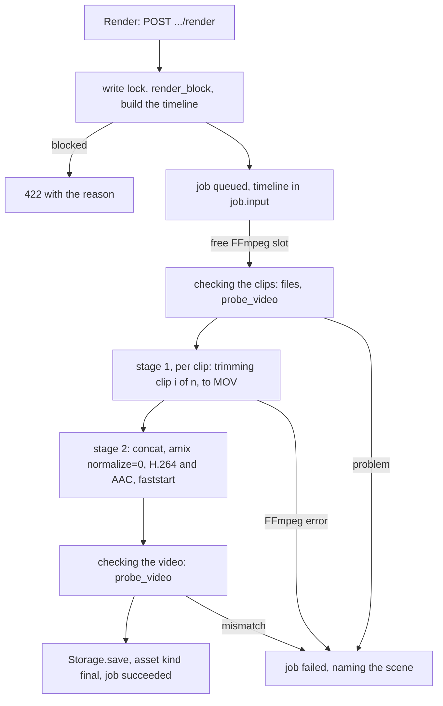

# Phase 10: Final render

The executor's first step is to save this plan as `plans/phase-10-final-render.md`, following the template in Section 4.6 of `ITERATION_1_PHASES.md`.

## 1. Goal and outcome

When this phase is done, you can:

- press **Render** on the project page. The button is disabled, with the reason shown, while a scene has no clip, a selected clip is shorter than its scene now needs, the scenes are out of date, or a proposal is running.
- see the render's status, phase ("trimming clip 3 of 12"), elapsed time and any error. You can cancel it while it is queued.
- play the finished video with sound and seek in it, download it, and play or download every earlier render.
- rely on the result. The video lasts exactly as long as the voiceover (within one frame), every cut falls on its scene boundary, and the voiceover keeps its original level, with the clip sound mixed quietly under it.



## 2. Findings (2026-10-07)

- **Code.**
  - Phases 1 to 8 are committed. Phase 9 is complete but not committed. The migration head is `0002`, and no Phase 10 code exists.
  - Already in place:
    - the database allows `job.type='render_final'` and `asset.kind='final'`;
    - the `max_parallel_ffmpeg` setting exists (default 1, range 1 to 4);
    - `JobType` in `api/jobs.py` and the label "Final render" in `jobFormat.ts` already exist;
    - nginx already serves `video/mp4`;
    - `jobs/__init__.py` has a placeholder line saying where the new handler is registered.
  - Reused as they are: `frame_counts.target_frames`, `clips.takes_by_scene` and `take_is_too_short`, `scenes_service.scenes_state` and `lock_scenes`, `store.create_job` (at most one active project-level job per type), `ffmpeg.run_tool`, `file_input`, `probe` and `probe_video`, `Storage.new_temp_path`, `save` and `discard`, `add_asset`.
- **Restart behaviour (existing dispatcher).** On shutdown the dispatcher cancels its tasks, and `run_tool` kills its FFmpeg process when cancelled. At start, a `start_again` job that was running is queued again with `phases.RESTARTED`, which today reads "restarted: submitting again". `/data/tmp` is emptied at start.
- **Phase 9 log rules to follow:**
  - use `target_frames` for every scene;
  - a take is usable when `provenance.frame_count >= target`;
  - read the selected takes in one transaction;
  - a render needs its own cancel rule.
  - Phase 8 log: the final file needs an nginx type only if it is not `.mp4`.
- **[VERIFY] mixing: resolved by measurement** in the backend container (FFmpeg `7.1.5-0+deb13u1`; `libx264`, `aac` and `pcm_s16le` present; 14 CPUs). The test file was project 5's voiceover, a **mono** AAC file at 48 kHz, 60.2027 s long, with mean level -35.9 dB and peak -15.5 dB:
  - automatic conversion to stereo (`aformat`) gives -38.9 / -18.5 dB, so it is **3 dB quieter**;
  - `pan=stereo|c0=c0|c1=c0` leaves the level unchanged;
  - `amix` with its defaults (`normalize` on) against a silent second input gives -41.9 / -21.5 dB, so it is **6 dB quieter**;
  - `amix ... normalize=0` leaves the level unchanged.
- **[VERIFY] LTX sound: resolved** from the Phase 9 log and an ffprobe of the 4 selected clips of project 5.
  - Sound: AAC, 48 kHz, stereo, starting at 0, and 17 to 45 ms shorter than the video (for example 3.690 s against 3.708 s, and 3.330 s against 3.375 s).
  - Video: H.264, 1088 x 1920, 24/1 fps, with 89, 137, 97 and 81 frames for targets of 88, 133, 94 and 80.
  - Level: mean -32.7 to -38.8 dB as generated. At 20% it is a mean of -46.7 to -52.8 dB, about 11 to 17 dB under this voiceover.
- **Test data.** Project 5 has clips on only 4 of its 15 scenes (scenes 2 to 5). As you chose, the checks use a new short project.

## 3. Decisions

Your answers:

- **Checks run on a new short project**, built from a 10 to 15 s voiceover and its script that you provide. It needs 1 transcription, 1 scene proposal (a paid call of about $0.002) and 3 to 5 GPU runs, never more than 2 at once.
- **Cancel only while queued.** A running render shows no Cancel button, and the cancel endpoint answers with the existing 409 message ("This job is already running and cannot be cancelled."). The dispatcher is not changed.

Planner choices, each **marked for your approval**:

- **APPROVAL: the timeline is built at the click.** The endpoint builds it under the write lock, in the same transaction that creates the job, and stores it in `job.input.timeline`.
  - The handler reads only the timeline, never the scenes. A cut edit, a take change or a volume change after the click does not affect that render.
  - A restart renders the same timeline again from the start. Section 8 expects a future timeline editor to write this same description.
- **APPROVAL: Render is refused** (422, from one pure function, `render_block`, that also sets the button's disabled reason) with these messages, checked in this order:
  - "Upload a voiceover first."
  - "There are no scenes yet. Propose scenes first."
  - "A scene proposal is in progress. Wait for it to finish."
  - "The scenes are out of date. Propose scenes again before rendering."
  - "Scenes 1, 6 and 7 have no clip yet."
  - "The clip of scene 4 has 96 frames; the scene now needs 101. Regenerate it, or use another take." When several clips are too short, all of them are named.
  - Not blocked: a selected take that is out of date but long enough (it still covers the scene), and a clip job that is running (the render uses the takes that were selected at the click).
  - A second click while a render is active returns that job.
- **APPROVAL: the intermediate files are MOV**, with H.264 video (`libx264 -preset veryfast -crf 12 -pix_fmt yuv420p`, visually lossless, about 15 to 30 MB per 6 s clip) and uncompressed `pcm_s16le` sound at 48 kHz stereo.
  - MOV keeps exact frame and sample timestamps. MKV defaults to 1 ms timestamps, which could add up to drift when many files are joined. ProRes was rejected as about 6 times larger.
- **APPROVAL: the final encode** is `libx264 -preset medium -crf 18 -pix_fmt yuv420p -profile:v high`, with constant fps (`-r <fps> -fps_mode cfr`), AAC at 192 kb/s, 48 kHz stereo, and `-movflags +faststart`.
- **APPROVAL: the mixing method.**
  - A mono source is made stereo with `pan=stereo|c0=c0|c1=c0`; stereo is left alone; anything else gets `aformat=channel_layouts=stereo`.
  - The clip sound goes through `volume=<project volume>`.
  - The two are mixed with `amix=inputs=2:duration=first:dropout_transition=0:normalize=0`, with the voiceover first.
  - No limiter and no loudness change: "full level" means the voiceover's own level, unchanged.
- **APPROVAL: the clip sound in stage 1.**
  - The clip's own sound is used when the scene's switch is on and the clip has sound. Otherwise the scene gets `anullsrc` silence of the same length.
  - Volume 0 needs no special case: `volume=0` gives digital silence, which leaves the voiceover unchanged.
  - **Fades** are 20 ms at both ends. The fade-out ends where the clip's real sound ends, at min(sound length, scene length); silence then fills it to exactly `round(frames * 48000 / fps)` samples. Because LTX sound is shorter than its video, a fade at the padded end would leave a click.
- **APPROVAL: the picture in stage 1** goes through `fps=<fps>`, `trim=end_frame=<frames>`, a scale that covers the output size, then a centre crop to it, and `setsar=1`. For 1088 x 1920 to 1080 x 1920 this only crops 4 px from each side, with no rescaling. The same chain also handles a clip whose size or fps differs from the project's current values.
- **APPROVAL: joining** uses the concat demuxer, with a list file of `file:` paths (`-safe 0 -protocol_whitelist file`). Every intermediate shares identical parameters (Section 5.6). The audio track lasts as long as the voiceover (`duration=first`), and the video is the timeline's frames, so the file ends with the audio to within one frame.
- **APPROVAL: checks during the render.**
  - Before trimming, every clip is checked with `probe_video`. A missing file, or fewer frames than the scene needs, fails the job and names the scene.
  - After joining, the final file must be 1080 x 1920 (the project's output size), with exactly `total_frames` frames, and with AAC sound within one frame of the voiceover's length. Otherwise the job fails, for example: "The rendered video has 1440 frames; the timeline has 1445."
  - An FFmpeg error fails the job with the scene number and the last 500 characters of FFmpeg's error output.
  - Time limits: 300 s for each trim and 1800 s for the join.
- **APPROVAL: the final asset** has `kind='final'`, `source='derived'` and `mime='video/mp4'`. The file is saved, and in one transaction `add_asset` and `finish_job` run. If `finish_job` returns False, the transaction is rolled back and the unreferenced file is logged.
- **APPROVAL: the restart label** `phases.RESTARTED` becomes "restarted: starting again", which reads correctly for all four job types.
- **APPROVAL: the UI** is a new **Final video** section below Scenes, with:
  - Render or Render again, and the reason when disabled;
  - a one-line summary of what will be used;
  - the job's status, phase, elapsed time, Cancel while queued, and the error;
  - one player (the newest render by default) with Download;
  - a list of earlier renders, each with Play and Download.

## 4. Changes

### Database

No migration. Update [DATABASE_STRUCTURE.md](DATABASE_STRUCTURE.md):

- **Section 5**: the `render_final` input and output, and the `final` asset's provenance (shapes below).
- **Section 7**: fill in the "Trim, join, mix, render final video" row (the timeline is built at the click, the stages, one transaction for the asset and the job).
- **Section 8, item 5**: `render_final` is now built.

The shape of `job.input`, set at creation and never changed:

```json
{
  "requested": "render",
  "timeline": {
    "version": 1, "fps": 24, "width": 1080, "height": 1920, "clip_sound_volume": 0.2,
    "voiceover": { "asset_id": 14, "duration_s": 60.202667 },
    "total_frames": 1445,
    "clips": [
      { "scene_id": 30, "scene_index": 1, "start_s": 5.84, "end_s": 9.48,
        "start_frame": 140, "frames": 88, "asset_id": 67, "clip_sound": true }
    ]
  }
}
```

The shape of `job.output` on success:

```json
{
  "final": { "frame_count": 1445, "fps": 24.0, "width": 1080, "height": 1920, "duration_s": 60.208,
             "size_bytes": 0, "audio": { "codec": "aac", "sample_rate": 48000, "channels": 2, "duration_s": 60.203 } },
  "clips": [ { "scene_index": 1, "sound": "clip" } ],
  "seconds": { "trim": 0.0, "join": 0.0 }
}
```

`clips[].sound` is `"clip"`, `"muted"` or `"none in the clip"`.

The final asset's provenance:

```json
{ "job_id": 0, "timeline_version": 1, "voiceover_asset_id": 14, "clip_asset_ids": [67, 70],
  "clip_sound_volume": 0.2, "muted_scene_indexes": [], "fps": 24, "frame_count": 1445,
  "ffmpeg_version": "7.1.5-0+deb13u1",
  "video": "libx264 crf 18 preset medium yuv420p", "audio": "aac 192k 48000 Hz stereo" }
```

### Backend

- New [backend/app/services/render_commands.py](backend/app/services/render_commands.py). It is pure: it only builds argument lists and text.

```python
SAMPLE_RATE: Final = 48000
FADE_S: Final = 0.02
@dataclass(frozen=True) class ClipAudio: channels: int | None; duration_s: float | None
def stereo_filters(channels: int | None) -> list[str]      # ["pan=stereo|c0=c0|c1=c0"], [], or ["aformat=channel_layouts=stereo"]
def sample_count(frames: int, fps: int) -> int             # round(frames * 48000 / fps)
def trim_args(src: Path, dest: Path, *, frames: int, fps: int, width: int, height: int,
              audio: ClipAudio | None) -> list[str]        # None: silence
def concat_list(paths: Sequence[Path]) -> str              # "file 'file:/data/tmp/<hex>.mov'\n" per clip
def join_args(list_path: Path, voiceover: Path, dest: Path, *, fps: int, volume: float,
              voiceover_channels: int | None) -> list[str]
```

  - Every input and output goes through `ffmpeg.file_input()`. Outputs use `-n` (never overwrite), with `-hide_banner -loglevel error`.
- New [backend/app/services/renders.py](backend/app/services/renders.py):
  - `RENDER_JOB = "render_final"` and `TIMELINE_VERSION = 1`;
  - `selected_takes(scenes, takes_by_scene) -> dict[int, Take]` (pure): the take whose asset is each scene's `selected_clip_asset_id`;
  - `render_block(project, scenes, selected, *, plan_job, stale_reasons) -> str | None` (pure), with the messages in Section 3;
  - `build_timeline(project, scenes, selected, voiceover: Asset) -> dict` (pure), with frames from `frame_counts.target_frames` and `start_frame` from `boundary_frame`;
  - `list_renders(session, project_id) -> list[Render]`: one query of the succeeded `render_final` jobs joined to their `final` assets, newest first.
- [backend/app/services/storage.py](backend/app/services/storage.py): `async def describe_temp(self, path: Path) -> TempFile`. It works out the size and the SHA-256 in a thread, and refuses a path outside the temp folder. It is used for a file that a caller wrote itself.
- [backend/app/jobs/phases.py](backend/app/jobs/phases.py):
  - `CHECKING_CLIPS = "checking the clips"`;
  - `trimming(n, total)`, which gives "trimming clip 3 of 12";
  - `JOINING = "joining the clips and mixing the sound"`;
  - `CHECKING_VIDEO = "checking the video"`;
  - `SAVING_VIDEO = "saving the video"`;
  - `RESTARTED` reworded as in Section 3.
- New [backend/app/jobs/render_final.py](backend/app/jobs/render_final.py): `RenderFinalHandler`, with `provider="local"`, `restart_rule="start_again"`, and `concurrency_limit` set to `get_int("max_parallel_ffmpeg")`. Everything happens in `start`:
  1. Read the timeline (fail when its version is not 1). In one short read, load the voiceover and clip assets, then check that every file exists.
  2. **Checking the clips**: run `probe_video` on each clip (frame count, sound and its length) and `probe` on the voiceover (its channels).
  3. **Stage 1**: for each clip, `trim_args` into `new_temp_path("mov")`, then `run_tool`.
  4. **Stage 2**: write the list file into `new_temp_path("txt")` (in a thread, opened with `"xb"`), then `join_args` into `new_temp_path("mp4")`.
  5. **Checking the video**: `probe_video` on the result, with the checks in Section 3.
  6. **Saving the video**: `describe_temp`, `Storage.save(..., "mp4")`, then one transaction with `add_asset` and `finish_job`.
  - Every temp path is recorded and discarded in `finally`, which covers a failure and a cancel at shutdown. `clear_tmp` at start covers a crash.
  - `ffmpeg.tool_version("ffmpeg")` is read once per render, for the provenance.
- [backend/app/jobs/__init__.py](backend/app/jobs/__init__.py): register `RenderFinalHandler`.

### API

- New [backend/app/api/renders.py](backend/app/api/renders.py), included in `api_router` with the tag `renders`:
  - `POST /api/projects/{pid}/render` answers 202 with `JobDetail`.
    - It runs `lock_scenes`, refreshes the project, reads `scenes_state`, and returns the active render if there is one.
    - Otherwise it reads `takes_by_scene`, then `render_block` (422 with the reason), then `build_timeline`, then `store.create_job(provider="local", input={"requested": "render", "timeline": ...})`, then `nudge()`.
    - It answers 404 for a missing project.
  - `GET /api/projects/{pid}/renders` answers `RendersOut {job: JobSummary | None, renders: list[RenderOut]}`. `job` is the newest render job, whatever its status. It reads the database only.
  - `RenderOut {asset_id, job_id, url, created_at, duration_s, width, height, size_bytes, clip_sound_volume, scene_count, muted_scene_count}`.
- [backend/app/api/scenes.py](backend/app/api/scenes.py): `ScenesOut` gains `render_blocked_reason: str | None`, computed in `scenes_out` from what it already loads. Select take, clip sound and cut edits answer with `ScenesOut`, so the Render button updates without another request.

### Background job

- States: `queued`, then `running`, then `succeeded`, `failed` or `cancelled` (cancelled only while queued).
- Phases:
  - while queued: "waiting to start", "waiting for a free slot", "restarted: starting again";
  - while running: "starting", "checking the clips", "trimming clip i of n", "joining the clips and mixing the sound", "checking the video", "saving the video".
- **On restart:** `start_again`. FFmpeg is killed and the temp files are removed. The job is queued again and renders the same stored timeline from the start, with the same attempt number.

### Frontend

- New [frontend/src/api/renders.ts](frontend/src/api/renders.ts):
  - the `RendersState` and `Render` types, and `rendersKey(id) = [...PROJECTS_KEY, id, "renders"]`;
  - `useRenders` and `useStartRender`. On success `useStartRender` calls `invalidateAfterJobAction`, which already covers this key; a 404 or 422 reloads the scenes and the renders.
- New [frontend/src/components/projects/renderView.ts](frontend/src/components/projects/renderView.ts) (pure):
  - `renderLine(render)` gives "7 Oct, 08:40 · 14.2 s · 1080 x 1920 · clip sound 20% · 1 scene muted · 4.1 MB";
  - `renderSummary(scenes, volume)` gives "Uses the selected take of each of the 4 scenes, the voiceover at full level, and clip sound at 20% (1 scene muted).";
  - `downloadName(projectName, jobId)` gives "the-first-light-render-41.mp4".
- New [frontend/src/components/projects/RenderSection.tsx](frontend/src/components/projects/RenderSection.tsx), titled "Final video":
  - Render (or Render again), disabled with `scenes.render_blocked_reason` or while a render is active, with the reason as dimmed text;
  - the summary line;
  - `JobStatusBadge`, elapsed time (from the query's `dataUpdatedAt`), `JobActions`, and the error in a red `Alert`;
  - "Press Refresh to see progress." while a render is active;
  - one `<video controls preload="metadata" playsInline>`, keyed by asset id, showing the chosen render (the newest by default, local state only), with a Download button (`component="a"`, `href`, `download`);
  - the earlier renders, newest first, each with `renderLine`, Play (switches the player) and Download;
  - empty state "No render yet.", a `Loader` while loading, and an error `Alert` ending with "Press Refresh to try again."
- [frontend/src/pages/ProjectPage.tsx](frontend/src/pages/ProjectPage.tsx): render `<RenderSection>` after `ScenesSection`.
- Run `npm run gen:api` and commit `schema.d.ts`.

### Configuration

No new setting, no new dependency, no nginx change (the final file is `.mp4`). The backend and frontend images both need a rebuild.

## 5. Reading list for the executor

- `ANALYSIS.md`: 3.2, 3.3 ("On backend start"), 3.4, 3.5, 5.5, 5.6 (all) and 8 ("Render from a timeline description").
- `DATABASE_STRUCTURE.md`: 4.2, 4.4, 4.5, 5 (the `generate_clip` shapes, as the pattern) and 7.
- `ITERATION_1_PHASES.md`: Section 4, the Phase 10 section, and the Phase 3, 5, 7, 8 and 9 log entries.
- Backend code:
  - [jobs/dispatcher.py](backend/app/jobs/dispatcher.py), [jobs/handlers.py](backend/app/jobs/handlers.py), [jobs/store.py](backend/app/jobs/store.py) and [jobs/generate_clip.py](backend/app/jobs/generate_clip.py) (`_check_and_store` is the pattern for saving);
  - [services/ffmpeg.py](backend/app/services/ffmpeg.py), [services/storage.py](backend/app/services/storage.py), [services/clips.py](backend/app/services/clips.py) and [services/frame_counts.py](backend/app/services/frame_counts.py);
  - [api/clips.py](backend/app/api/clips.py) (the lock-then-create pattern) and [api/scenes.py](backend/app/api/scenes.py).
- Frontend code: [TranscriptSection.tsx](frontend/src/components/projects/TranscriptSection.tsx) (a project-level job section), [SceneClipSection.tsx](frontend/src/components/projects/SceneClipSection.tsx) (the video player), [api/clips.ts](frontend/src/api/clips.ts) and [api/jobs.ts](frontend/src/api/jobs.ts).

## 6. Steps in order

1. Save this plan. Write `render_commands.py`, and the pure parts of `renders.py`. Check them with a throwaway script inside the container that writes only to `/data/tmp` and removes its files afterwards:
   - project 5's timeline: the block reason names scenes 1 and 6 to 15; `total_frames` is 1445, which equals `boundary_frame(60.203, 24)`;
   - stage 1 on project 5's four clips (targets 88, 133, 94 and 80; one of them muted): each MOV has exactly that many frames and `sample_count` samples; the first and last 5 ms of each clip's sound peak below -60 dB; the muted one is digital silence;
   - stage 2 on those four: 395 frames, and a scene-change scan finds changes at exactly frames 88, 221 and 315;
   - `volumedetect` on the stage 2 sound at volume 0 equals the voiceover's -35.9 / -15.5 dB.
2. Plumbing and job: `describe_temp`, the phases, `list_renders`, `render_final.py`, its registration, `api/renders.py` and `render_blocked_reason`. Run `ruff`. Rebuild the backend, then run acceptance check 1 with curl.
3. **Needs from you**: the short voiceover and its script, and where they are. Build the check project "Phase 10 checks" (portrait, defaults):
   - upload the voiceover, paste the script, Transcribe;
   - Propose (one paid call);
   - give each scene a description and the frame pair of project 5's scene 2 (asset ids read from that scene, downloaded from `/media` and uploaded through the frame endpoint), or your own frames;
   - press **Generate all ready scenes**, with the maximum parallel generations at 2. Do step 4 while the clips generate.
4. Frontend: `gen:api`, `renders.ts`, `renderView.ts`, `RenderSection` and `ProjectPage`. Check it in the browser.
5. Run acceptance checks 2 to 13, update DATABASE_STRUCTURE.md, run the linters and the earlier phases' main flow, and write the phase log entry.

## 7. Acceptance checks

"P" is the check project, with n scenes. Scene numbers are 1-based. "The dump" is a read-only query of `job` (id, status, phase, attempt, started_at, finished_at, result_asset_id, input.timeline) and of `asset` where `kind='final'`.

1. **Refusals (no rendering).** Each answers 422 with its message and creates no job:
   - project 5 names scenes 1 and 6 to 15;
   - project 6 is out of date;
   - project 1 has no scenes;
   - on P, setting the fps to 30 makes every clip too short (the message lists them), and setting it back to 24 clears it;
   - a missing project answers 404.
2. **Render (AC 1).** Render P at 20%.
   - The phases go through every label in order, and the job succeeds.
   - `timeline.clips[].frames` equals each scene's `target_frames`, and they add up to `total_frames`.
   - `/data/tmp` is empty afterwards.
   - `ffprobe -count_packets` on the final file shows:
     - 1080 x 1920, H.264 High `yuv420p`, `r_frame_rate` and `avg_frame_rate` both 24/1;
     - a packet count equal to `total_frames`;
     - video and audio lengths both within 1/24 s of the voiceover's;
     - AAC sound at 48 kHz, stereo.
   - A short in-container Python read shows `ftyp`, then `moov`, before `mdat` (faststart).
3. **Cuts (AC 2).** `select='gt(scene,0.3)',showinfo` lists a change at every timeline `start_frame` of scenes 2 to n, exactly (`pts_time * 24`). Scrubbing to each boundary in the player shows the cut there.
4. **Levels (AC 3).**
   - Render B: 20% with scene 2 muted. The difference between the final's sound and the voiceover (`amix=weights='1 -1':normalize=0`, then `atrim` to each scene's range and `volumedetect`) is at least 20 dB quieter in scene 2's range than in any other scene's range, and it changes at scene 2's boundaries.
   - Render C: volume 0. `volumedetect` equals the voiceover's own level within 0.3 dB, which shows the voiceover path is at full level. The difference signal is at least 20 dB quieter than render A's.
   - You listen at the cuts for clicks (check 13).
5. **Browser (AC 4).** The player plays with sound and seeks. The Range request for the final URL answers 206 with `video/mp4`. Download saves `phase-10-checks-render-<id>.mp4`, whose SHA-256 equals the asset's.
6. **Earlier renders (AC 5).** After B and C there are 3 `final` assets, each file is on disk, and the list shows all 3, newest first. Each one plays from the list.
7. **The timeline is fixed at the click.** Start a render at 20% and set the volume to 0 while it is trimming. The finished asset's provenance says 0.2.
8. **Restart.** Run `docker compose restart backend` while a render is trimming (or joining).
   - The job reads "restarted: starting again", runs from the start and succeeds.
   - `/data/tmp` has no leftover files, and only one new asset was added.
9. **Cancel rule.** A running render shows no Cancel button, and `POST /api/jobs/{id}/cancel` answers 409 with the message. Cancelling a queued job is the existing rule, checked in Phases 5 and 9.
10. **Double click.** Two simultaneous POSTs to `/render` return the same job id.
11. **No polling.** The project page left idle for 60 s with the Final video section showing makes 0 requests.
12. **Definition of done.**
    - ruff, tsc and ESLint are clean, and `schema.d.ts` is regenerated.
    - `alembic check` is clean at `0002`.
    - `docker compose up --build` works on the existing volume.
    - Projects, voiceover (206), settings, the contract, transcription, the proposal gate, cut editing, scene inputs and the clip section still work.
    - No API response contains the key.
13. **Yours to judge.** Watch and listen: the cuts land with the words, there are no clicks, the clip sound is quiet at 20% and absent at 0, and the muted scene is silent only for its own length.

The parallel FFmpeg limit is enforced by the dispatcher's existing per-type limit. It is not exercised here, because only one project can be rendered (one render per project at a time).

## 8. Out of scope

- Ducking, music, subtitles, cached trims, a timeline editor (Section 8).
- Cancelling a running render, deleting renders or files.
- Loudness normalisation or a limiter; quality settings in the UI.
- Marking a render as out of date; rendering anything other than the selected takes.
- The transcription 410 fix (Phase 11), live updates, automated tests.

## 9. Risks

- **The concat demuxer shifts frames or timestamps**: a frame count or a cut that is off by one. First add `duration <frames/fps>` lines to the list file. If that does not fix it, switch stage 2 to the concat filter. Adjust and record it in the log; there is no need to ask.
- **The final frame count is consistently one off** while the cuts are right: stop and ask before loosening the check.
- **FFmpeg refuses `-protocol_whitelist file`** for the list's entries: drop the whitelist, keep the `file:` paths, and record it.
- **Clipping**: the voiceover plus the clip sound can go over 0 dBFS where both peak. Project 5's voiceover peaks at -15.5 dB, so this is unlikely. There is no limiter, because it would change the voiceover's level. Record any clipping you hear.
- **Render time is unknown** (libx264 `medium` at `nice 10` on 14 CPUs). The executor records it from `output.seconds`. If a 15 s video takes more than 2 minutes, mention it in the log.
- **Disk**: the intermediates take about 15 to 30 MB per clip in `/data/tmp`, and are removed after every render.
- **Changing a project's fps after its clips were made** compares frame counts across frame rates in `take_is_too_short`. This can only block a render (never let a short one through), and Regenerate fixes it.
